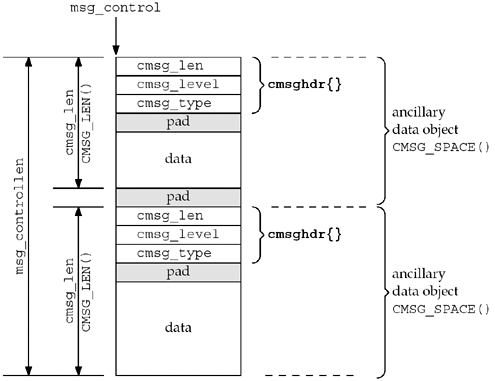

解读点：进程和进程间通信。

[TOC]

# 一.故事


# 二.分析和对照


## 1.原理分析（入门解读）
## 2.关联

# 三. nodejs源码解读
## 1. 解读入口


## 2. 源码解读

### 2.1 进程

### 2.2 进程间通信

socketpair 和 socket 的区别：
* socket 本身就有双向通信的能力，为啥要阴日socketpair?
    * 因为 socketpair(AF_UNIX, SOCK_DGRAM, 0, fdArr) 就完成了；
    * 如果用socket，就需要 new socket/bind/listen等一系列复杂的工作
* socketpair 和 one pair of pipes 有啥区别?
    * socket 是可以stream，也可以datagram; 代码实现在net
    * pipe 只能是stream; 代码实现在fs

#### 通过 unix domain socket 发送 fd

msg_control 概念

```c++
ssize_t sendmsg(int sockfd, const struct msghdr *msg, int flags);
ssize_t recvmsg(int sockfd, struct msghdr *msg, int flags);

struct iovec {                    /* Scatter/gather array items */
    void  *iov_base;              /* Starting address */
    size_t iov_len;               /* Number of bytes to transfer */
};

struct msghdr {
    void         *msg_name;       /* optional address */
    socklen_t     msg_namelen;    /* size of address */
    struct iovec *msg_iov;        /* scatter/gather array */
    size_t        msg_iovlen;     /* # elements in msg_iov */
    void         *msg_control;    /* ancillary data, see below */
    size_t        msg_controllen; /* ancillary data buffer len */
    int           msg_flags;      /* flags on received message */
};
```

msg_control 指向一个区域，见下图。

https://www.sobyte.net/post/2022-01/pass-fd-over-domain-socket/



```c++
// 样例来自 https://stackoverflow.com/questions/28003921/sending-file-descriptor-by-linux-socket
#include "stderr.h"
#include <fcntl.h>
#include <stdio.h>
#include <stdlib.h>
#include <string.h>
#include <sys/socket.h>
#include <sys/wait.h>
#include <time.h>
#include <unistd.h>

static
void wyslij(int socket, int fd)  // send fd by socket
{
    struct msghdr msg = { 0 };
    char buf[CMSG_SPACE(sizeof(fd))];
    memset(buf, '\0', sizeof(buf));
    struct iovec io = { .iov_base = "ABC", .iov_len = 3 };

    msg.msg_iov = &io;
    msg.msg_iovlen = 1;
    msg.msg_control = buf;
    msg.msg_controllen = sizeof(buf);

    struct cmsghdr * cmsg = CMSG_FIRSTHDR(&msg);
    cmsg->cmsg_level = SOL_SOCKET;
    cmsg->cmsg_type = SCM_RIGHTS;
    cmsg->cmsg_len = CMSG_LEN(sizeof(fd));

    *((int *) CMSG_DATA(cmsg)) = fd;

    msg.msg_controllen = CMSG_SPACE(sizeof(fd));

    if (sendmsg(socket, &msg, 0) < 0)
        err_syserr("Failed to send message\n");
}

static
int odbierz(int socket)  // receive fd from socket
{
    struct msghdr msg = {0};

    char m_buffer[256];
    struct iovec io = { .iov_base = m_buffer, .iov_len = sizeof(m_buffer) };
    msg.msg_iov = &io;
    msg.msg_iovlen = 1;

    char c_buffer[256];
    msg.msg_control = c_buffer;
    msg.msg_controllen = sizeof(c_buffer);

    if (recvmsg(socket, &msg, 0) < 0)
        err_syserr("Failed to receive message\n");

    struct cmsghdr * cmsg = CMSG_FIRSTHDR(&msg);

    unsigned char * data = CMSG_DATA(cmsg);

    err_remark("About to extract fd\n");
    int fd = *((int*) data);
    err_remark("Extracted fd %d\n", fd);

    return fd;
}

int main(int argc, char **argv)
{
    const char *filename = "./z7.c";

    err_setarg0(argv[0]);
    err_setlogopts(ERR_PID);
    if (argc > 1)
        filename = argv[1];
    int sv[2];
    if (socketpair(AF_UNIX, SOCK_DGRAM, 0, sv) != 0)
        err_syserr("Failed to create Unix-domain socket pair\n");

    int pid = fork();
    if (pid > 0)  // in parent
    {
        err_remark("Parent at work\n");
        close(sv[1]);
        int sock = sv[0];

        int fd = open(filename, O_RDONLY);
        if (fd < 0)
            err_syserr("Failed to open file %s for reading\n", filename);

        wyslij(sock, fd);

        close(fd);
        nanosleep(&(struct timespec){ .tv_sec = 1, .tv_nsec = 500000000}, 0);
        err_remark("Parent exits\n");
    }
    else  // in child
    {
        err_remark("Child at play\n");
        close(sv[0]);
        int sock = sv[1];

        nanosleep(&(struct timespec){ .tv_sec = 0, .tv_nsec = 500000000}, 0);

        int fd = odbierz(sock);
        printf("Read %d!\n", fd);
        char buffer[256];
        ssize_t nbytes;
        while ((nbytes = read(fd, buffer, sizeof(buffer))) > 0)
            write(1, buffer, nbytes);
        printf("Done!\n");
        close(fd);
    }
    return 0;
}
```

# 四.总结
