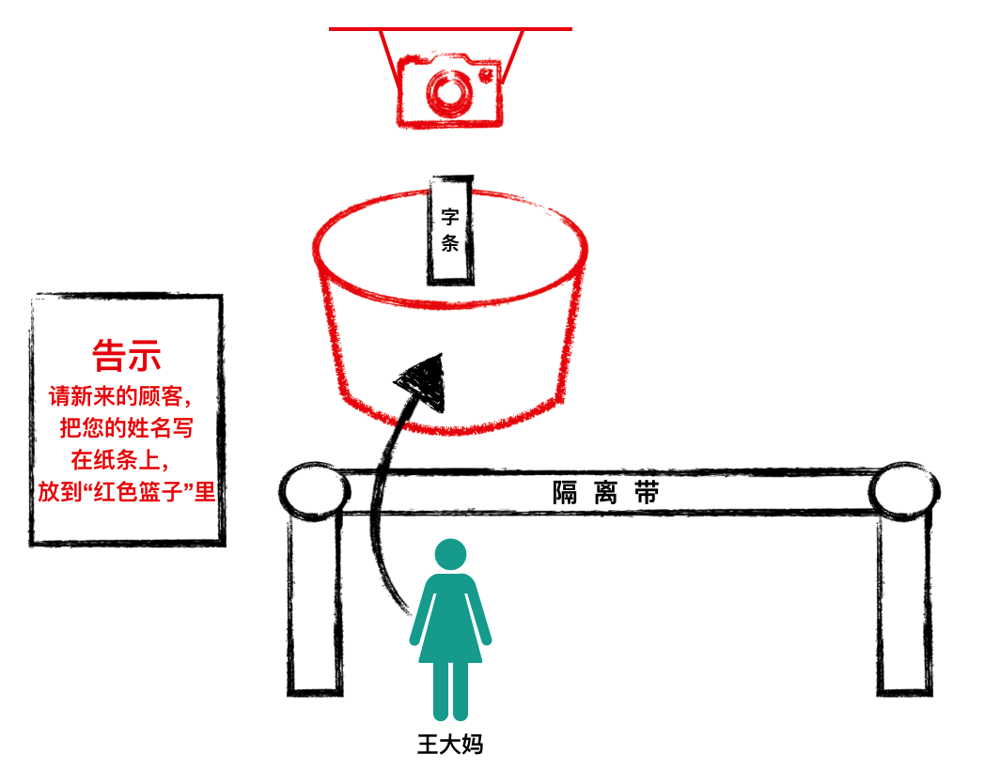

# 本书目的
通过讲故事的方式，带领大家一步一步解读nodejs源码，深入了解nodejs的设计思想和运行原理。

# 本书的讲解方式

通过将大家较为熟悉的日常生活流程，来模拟nodejs服务的运作流程。

经过几番思索，本书觉得通过百货店来模拟nodejs服务器。

>百货店，是售卖日常消费品的商店；人们"进店-->买到东西-->走出商店"的过程，非常类似于一个网络请求的全部过程。

举例如下：
1.顾客到店铺，模仿用户请求到达

2.店铺机器人准备好货物，模仿服务器处理请求并返回数据：

# 章节设置

全书按照以下章节来讲解。用户可以根据自己的需要选择某个章节查看。建议从头开始。

### [1.百货店和nodejs](./storeAndNodejs.md)

### [2.nodejs服务启动流程](./nodejsServerStartup.md)

### [3.nodejs如何处理用户的请求](./handleRequest.md)

### [4.nodejs如何处理高并发请求](./handleConcurrentReqs.md)

### [5.setTimeout的运行原理](./timer.md)

### [6.文件操作](./fs.md)

### [7.流操作和event](./stream.md)

### 8.nodejs进程启动分析

### 9.调试

### 10.实战应用

> 另外一个开源仓库：[coderweek](https://github.com/coderweek/coderweek.github.io),里面是纯技术探索