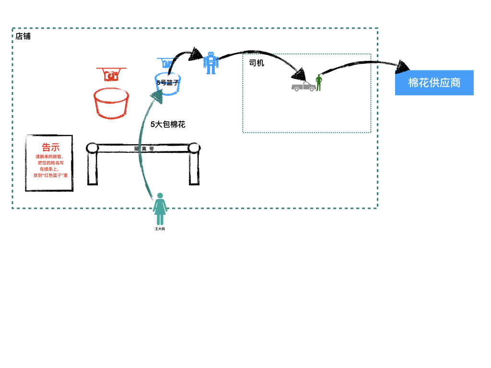
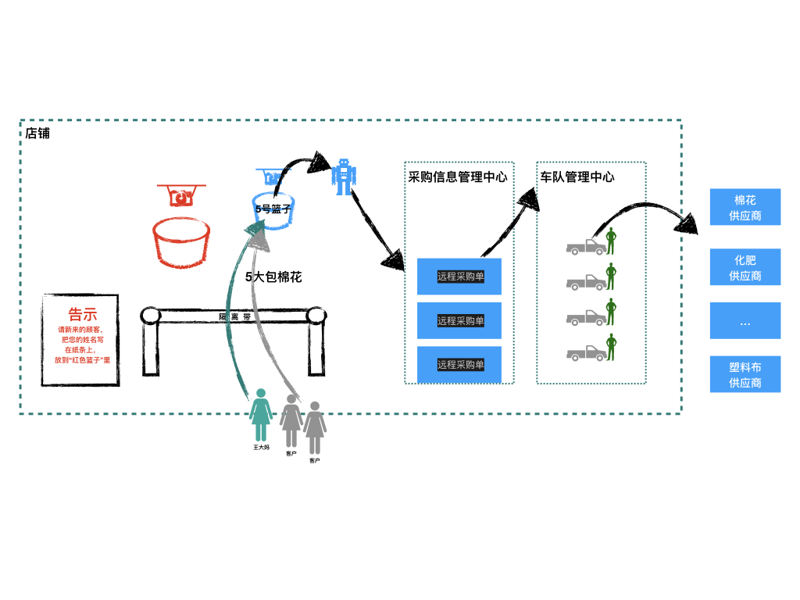
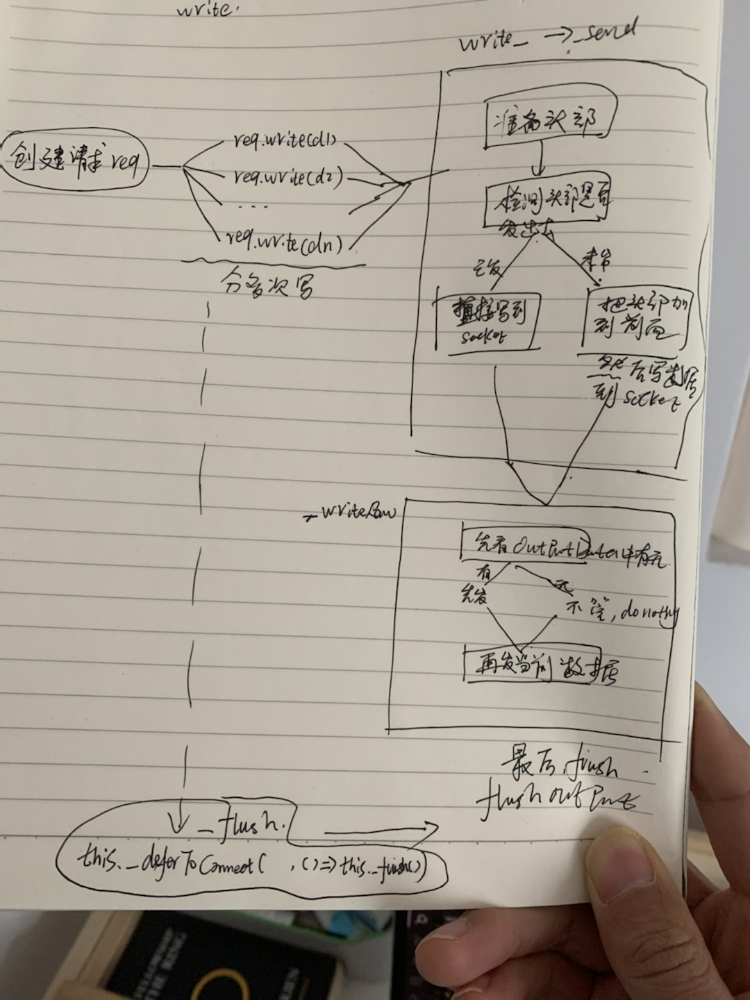
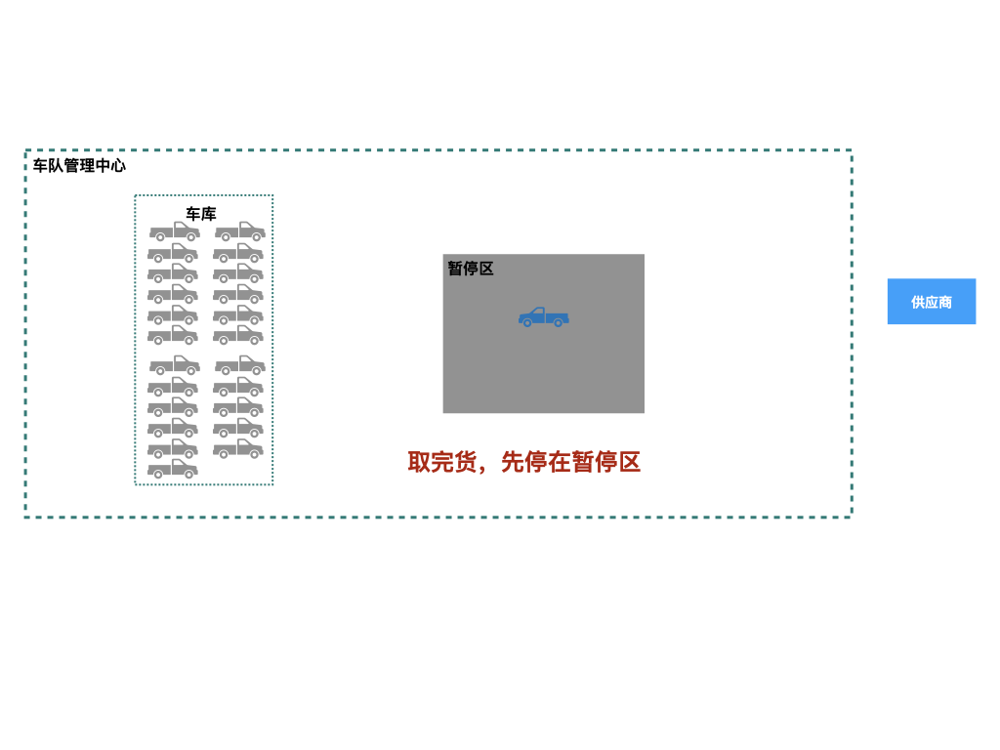
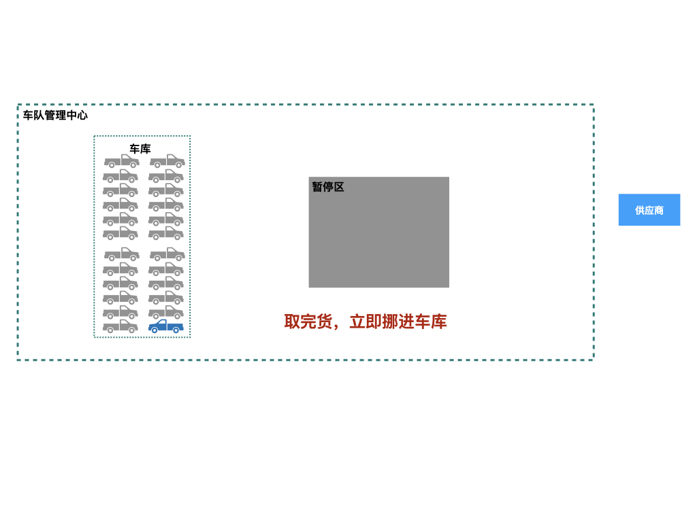
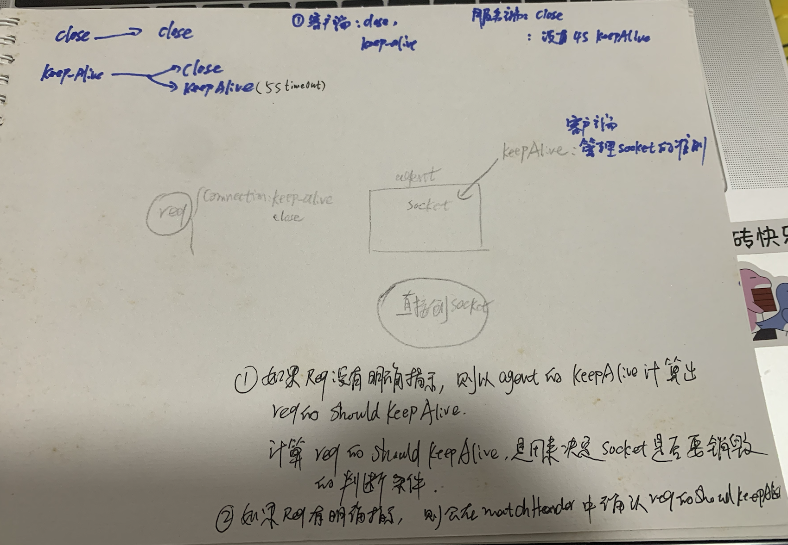
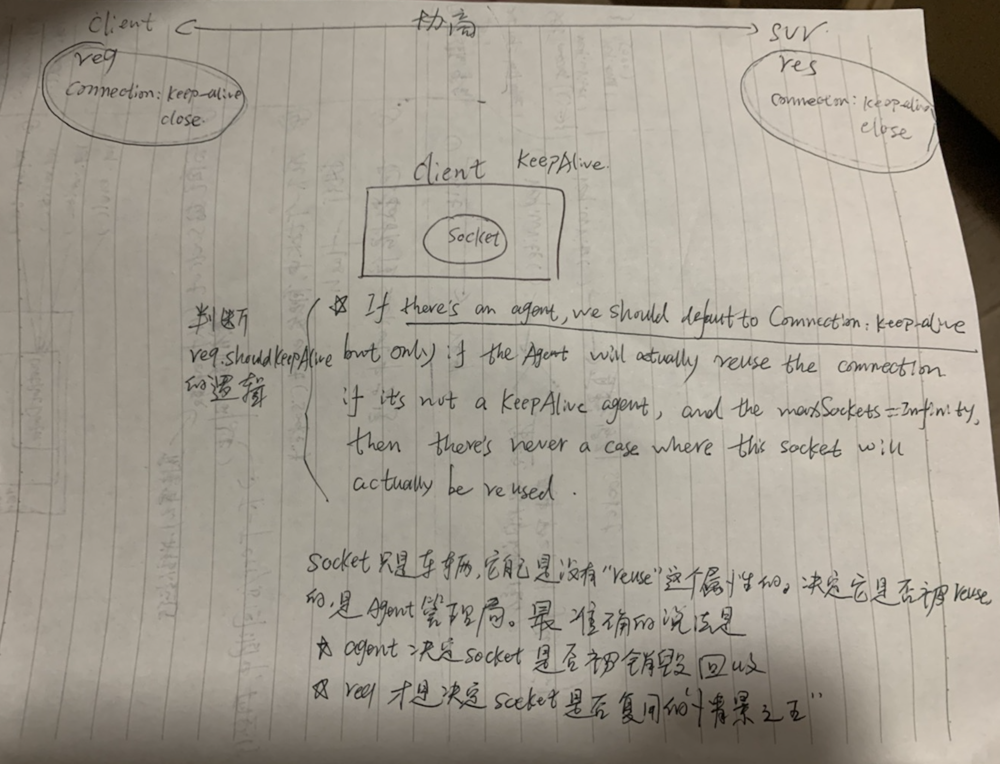

解读点：发出请求--http.request。

[TOC]

# 一.故事
王大妈来到10010店铺，要购买5大包棉花。因为棉花这种东西不经常售卖，所以店铺不会提前购置。平时碰到有顾客需要的时候，才临时向供应商调货。

10010店铺跟供应商的合作模式是这样的：店铺需要主动派车去拉货。

碰到这类采购场景，店铺有以下几种应对方式：
* “客户管理机器人”（即店铺管理员）自己开车，去供应商处取货
* 店铺平时养几个司机；“客户管理机器人”把【采购信息和供应商地址】交给司机，让司机去取货

很明显，第一种模式需要关闭店铺，不适合。那么只有第二种方式，交给专业司机去取货。

于是，10010店铺引入了几个司机。

“客户管理机器人”派了一名司机，告诉他去“xx区xx工厂”去取“5大包”棉花。

不久棉花取回来了，交给了“客户管理机器人”，然后转交给王大妈。

我们来看下王大妈此次购物的整体流程：


看上去很完美：“客户管理机器人”不用离开，店铺可以继续服务其他客人；司机负责取货，专业准时；

考虑到采购棉花这类需求不多，所以10010店铺按照这种模式，有条不紊地运行着。

突然有一天，店铺来了20个顾客，有的要买棉花，有的要买化肥，有的要买塑料布。总之都是类似棉花这样的商品，都需要开车去供应商那里去取。

按照现在的运行模式，“客户管理机器人”需要做的事情有：

* 记录每个人要买的东西
* 找出对应的供应商的地址
* 把【采购信息+供应商地址】告诉司机，让司机去取货

由于今天这样的采购顾客太多，“客户管理机器人”一下子忙坏了。如果顾客再多一点，恐怕就应付不过来了。

10010店铺决定优化模式，将远程采购流程职责进一步细分，标准化流程化。

于是店铺另外成立两个中心：“采购信息管理中心”和“车队管理中心”，并设立管理员来统筹负责。

* 采购信息管理中心：负责把顾客的采购信息标准化，输出“远程采购单”，交给车队；
* 车队管理中心：只用根据“远程采购单”的信息，就知道去哪里取货，其他事情一概不管。

升级后的模式如下：

* 顾客把要采购的东西告诉“客户管理机器人”
* “客户管理机器人”把采购信息，交给“采购信息管理中心”来进行简单处理，输出标准的“远程采购单”
* “采购信息管理中心”把“远程采购单”移交给“车队管理中心”；“车队管理中心”派出一辆车，根据标准的“远程采购单”，就知道去哪取货了。

整个流程如下：



有一天，又来了一位顾客李大妈，她也要采购2桶麻油（同样需要远程采购）。但是李大妈觉着店铺的车队不靠谱，自己带了司机和车辆去取货。

但是为了不影响整体流程（“采购信息管理中心”这个职能中心的职责不变），所以李大妈自己带来的司机，只有拿到“采购信息管理中心”输出的“远程采购单”，才能去采购。

因此这种特殊场景下的流程调整为：
* 顾客把要采购的东西告诉“客户管理机器人”
* “客户管理机器人”把采购信息，交给“采购信息管理中心”来进行简单处理，输出标准的“远程采购单”
* “采购信息管理中心”直接用用户指定的司机去取货；“车队管理中心”没有介入。

特殊场景下的流程为：


# 二.分析和对照

实际上，升级后的远程采购流程，就是目前nodejs发起远程请求（http.request）的模式。

## 1.原理分析（入门解读）
调用http.request发起远程请求，实际上是创建一个http.ClientRequest实例req，然后把这个req交给http.Agent，把请求发出去。

## 2.关联
* 王大妈  --> 用户
* 客户管理机器人 --> nodejs主线程
* 采购信息管理中心 --> 业务代码（由业务决定发起请求的参数）
* 远程采购单 --> req（即http.ClientRequest的实例）
* 车队管理中心 --> http.Agent(即/lib/_http_agent.js中的Agent)
* 车(司机) --> 即socket（也就是connection，对应/lib/net.js中的Socket实例）

# 三. nodejs源码解读
## 1. 解读入口
我们先看官方的使用样例
```js
// usage example
// 参见 https://nodejs.org/dist/latest-v17.x/docs/api/http.html#httprequesturl-options-callback
const http = require('http');

const postData = JSON.stringify({
  'msg': 'Hello World!'
});

const options = {
  hostname: 'www.google.com',
  port: 80,
  path: '/upload',
  method: 'POST',
  headers: {
    'Content-Type': 'application/json',
    'Content-Length': Buffer.byteLength(postData)
  }
};

const req = http.request(options, (res) => {
  res.on('data', (chunk) => {
    console.log(`BODY: ${chunk}`);
  });
});

// Write data to request body
req.write(postData);
req.end();
```

可以看到，上面的样例主要是调用http.request发送请求；这就是本章需要解读的入口：

```js
// 文件地址：/lib/http.js
function request(url, options, cb) {
  return new ClientRequest(url, options, cb);
}
```

## 2. 源码解读

从上面代码看出，http.request本质就是创建一个ClientRequest实例，我们看下它的代码。

> 由于ClientRequest太长，有136行，所以我们逐块分析
### 2.1 初始化请求实例req
第一步：准备“远程采购单”。

即通过创建一个实例req：new ClientRequest(url, options, cb)，来保存用户请求的各类信息。

这个req，就是故事场景中的“远程采购单”；
### 2.2 准备agent（如果需要）
第二步：准备一个车队备用。

即准备一个agent。这个动作是在初始化req的过程完成的。

```js
// 文件地址：/lib/_http_client.js
function ClientRequest(input, options, cb) {
  // 基于OutgoingMessage(_http_outgoing.js，负责往发出的请求中写数据)
  OutgoingMessage.call(this);
  ... // 格式化+标准化options

  let agent = options.agent;
  const defaultAgent = options._defaultAgent || Agent.globalAgent;
  if (agent === false) {
    agent = new defaultAgent.constructor();
  } else if (agent === null || agent === undefined) {
    if (typeof options.createConnection !== 'function') {
      agent = defaultAgent;
    }
    // Explicitly pass through this statement as agent will not be used
    // when createConnection is provided.
  }
  this.agent = agent; // 到此，agent准备完毕
  ...
}
```
上面代码片段，有两个作用：
* 将发起请求的参数进行简单处理（即options）
* 准备agent（即故事章节中的“车队管理中心”）
    * 如果用户有指定agent则使用，否则使用nodejs默认的defaultAgent: Agent.globalAgent;

我们看Agent.globalAgent是啥：
```js
// 文件地址：/lib/_http_agent.js
...
module.exports = {
  Agent,
  globalAgent: new Agent()
};
```
可以看出，这里的globalAgent，就是进程启动时，初始化好的一个Agent实例。

### 2.3 准备socket
第三步：即派车。

```js
// 文件地址：/lib/_http_client.js
function ClientRequest(input, options, cb) {
  ...// 准备agent（参见2.1）
  
  // 接下来是一些准备工作
  ...// 准备参数：method，host, port, maxHeaderSize
  ...// 初始化实例的属性：shouldKeepAlive, parser, res, timeoutCb等
  ...// 设置头部信息

  // 按照使用场景，发起请求
  // initiate connection
  if (this.agent) {
    this.agent.addRequest(this, options);
  } else {
    // No agent, default to Connection:close.
    this._last = true;
    this.shouldKeepAlive = false;
    if (typeof options.createConnection === 'function') {
      const newSocket = options.createConnection(options, oncreate);
      if (newSocket && !called) {
        called = true;
        this.onSocket(newSocket);
      } else {
        return;
      }
    } else {
      debug('CLIENT use net.createConnection', options);
      this.onSocket(net.createConnection(options));
    }
  }
}
```

上面的代码可以看出，如何派车，有两个选择：
* 如果有agent（车队），则把请求交给agent来处理（由车队派车去处理，其他啥也不用管）
* 如果没有agent（车队）：
  * 如果有指定的个性化的车（options.createConnection），则使用之；
  * 如果没有指定的个性化的车（没有options.createConnection），则使用nodejs自带的net.createConnection（不归属任何车队的独立车辆）

> 无论是options.createConnection，还是net.createConnection，他们的底层实现，都是创建一个Socket实例（/lib/net.js中的Socket），来调用底层的tcp handle（以tcp使用场景为例），发起connect。

我们先看第一个选择：使用agent准备socket(通过车队来派车)

#### 2.3.1 通过agent来准备socket

就是上节代码中的
```js
// 文件地址：/lib/_http_client.js
if (this.agent) {
  this.agent.addRequest(this, options);
}
```
>this.agent.addRequest的本意，是将req交给agent来处理。但是它还做了其他事情。
>只看方法名，无法得知它的全部作用。
>其实socket的准备工作，也是在它这里完成的。

不过，在这之前，我们先来看下agent的庐山真面目。

##### 先认识agent
```js
// 文件地址：/lib/_http_agent.js
function Agent(options) {
  if (!(this instanceof Agent))
    return new Agent(options);

  EventEmitter.call(this);

  this.defaultPort = 80;
  this.protocol = 'http:';

  this.options = { ...options };

  // Don't confuse net and make it think that we're connecting to a pipe
  this.options.path = null;
  this.requests = {};
  this.sockets = {};
  this.freeSockets = {};
  this.keepAliveMsecs = this.options.keepAliveMsecs || 1000;
  this.keepAlive = this.options.keepAlive || false;
  this.maxSockets = this.options.maxSockets || Agent.defaultMaxSockets;
  this.maxFreeSockets = this.options.maxFreeSockets || 256;

  this.on('free', (socket, options) => {
    ...// 稍后展开介绍
  });

  // Don't emit keylog events unless there is a listener for them.
  this.on('newListener', maybeEnableKeylog);
}
```

可以看出，agent自身属性比较简单，其中有三个核心的队列（说数组更合适）：
* requests：当前还未发出去的req。（其实叫pendingRequests更合适）
  * 即【处于积压状态，还未分配车辆】的“远程采购单”
* sockets：当前正在处理请求的socket。（其实叫inUsingSockets更合适）
  * 即已经分配了“远程采购单”，正在执行任务的车辆
* freeSockets：空闲的socket。
  * 即车队中空闲的车辆

> 细心的读者会发现，this.requests， this.sockets， this.freeSockets都不是数组，而是一个对象。
> 为什么是对象呢？因为agent要管理很多不同目标站点的请求，所以采用{domain:[]}的方式来管理
> 比如requests:
> this.requests = {"qq.com": [req1, req2], "baidu.com": [req3, reqN]}
>
> 注意：key代表了目标站点，包含的信息很多，比如“qq.com:80::4”（参见/lib/_http_agent.js中的Agent.prototype.getName方法），这里只是简单写成“qq.com”


Agent除了初始化上面提到的属性，还做了两个事件监听：
* this.on('free', cb)
* this.on('newListener', cb)

我们重点看下this.on('free', cb)，它的作用是：
监听一个free事件；当agent管理的socket有空闲时，触发这里的回调cb。

>备注： 
>通过agent创建socket时（有不通过agent创建的socket，后续再展开），socket创建完成后，一般会执行 installListeners。
installListeners里面，有一段代码：
>```js
>function onFree() {
>    debug('CLIENT socket onFree');
>    agent.emit('free', s, options);
>  }
>  s.on('free', onFree);
>```
>会对创建好的socket(即下面代码中的s)监听free事件。
后续的流程是：
> * 等socket空闲时（参见_http_client.js中的responseKeepAlive），会触发onFree;
> * onFree会接着触发agent.emit('free', s, options);
> * 由于agent监听过free，this.on('free', cb)，所以cb被执行

我们先剧透下cb的逻辑：
* 检测是否有pending状态的请求，如果有，则直接使用这个空闲出来的socket发送出去
* 如果没有pending状态的请求，则放到freeSockets中待用（前提是可复用）

详细代码逻辑先不展开；现在有了agent，接下来要做什么呢？


##### 由agent分配socket
通过agent处理请求，其实就是通过把req添加到agent中来管理。
即this.agent.addRequest(this, options);

```js
// 文件地址：/lib/_http_agent.js
Agent.prototype.addRequest = function addRequest(req, options, port, localAddress) {
  ...// 处理options
  const name = this.getName(options);
  if (!this.sockets[name]) {
    this.sockets[name] = [];
  }

  // 1.先看有没有空闲的socket
  const freeSockets = this.freeSockets[name];
  let socket;
  if (freeSockets) {
    while (freeSockets.length && freeSockets[0].destroyed) {
      freeSockets.shift();
    }
    socket = freeSockets.shift();
    if (!freeSockets.length)
      delete this.freeSockets[name];
  }

  const freeLen = freeSockets ? freeSockets.length : 0;
  const sockLen = freeLen + this.sockets[name].length;
  // 2.如果有空闲的socket，则把socket分配给req（setRequestSocket）去执行任务
  if (socket) {
    // Guard against an uninitialized or user supplied Socket.
    const handle = socket._handle;
    if (handle && typeof handle.asyncReset === 'function') {
      // Assign the handle a new asyncId and run any destroy()/init() hooks.
      handle.asyncReset(new ReusedHandle(handle.getProviderType(), handle));
      socket[async_id_symbol] = handle.getAsyncId();
    }

    this.reuseSocket(socket, req);
    setRequestSocket(this, req, socket);
    this.sockets[name].push(socket);
  } else if (sockLen < this.maxSockets) {
    // 3. 如果没有空闲的，且可以创建，则临时创建一个
    debug('call onSocket', sockLen, freeLen);
    // If we are under maxSockets create a new one.
    this.createSocket(req, options, handleSocketCreation(this, req, true));
  } else {
    debug('wait for socket');
    // 4. 如果没有空闲的，且不能再创建，则先积压起来
    // We are over limit so we'll add it to the queue.
    if (!this.requests[name]) {
      this.requests[name] = [];
    }
    this.requests[name].push(req);
  }
};
```
从上面代码可以看出，addRequest的作用为：
* 如果有空闲的socket，则取出一个分配给req（setRequestSocket），去执行任务
* 如果没有空闲的socket，并且可以创建（sockLen < this.maxSockets），则临时创建一个socket，分配给req，去执行任务
* 如果没有空闲的socket，并且不可以创建，则把找个req积压起来（this.requests[name].push(req)）;
> 注：此处的name就是目标站点，比如”qq.com“。

我们先看第一种情况，当有空闲的socket时，执行setRequestSocket。
再看第二种情况，临时创建socket后，执行回调。回调函数为handleSocketCreation。我们看这个函数的逻辑：
```js
// 文件地址：/lib/_http_agent.js
function handleSocketCreation(agent, request, informRequest) {
  return function handleSocketCreation_Inner(err, socket) {
    if (err) {
      process.nextTick(emitErrorNT, request, err);
      return;
    }
    // 如果有req需要处理，则调用setRequestSocket。否则触发free，表明有空闲的socket。
    if (informRequest)
      setRequestSocket(agent, request, socket);
    else
      socket.emit('free');
  };
}
```

可以看出，这里也是调用了 setRequestSocket。

总结：
* this.agent.addRequest(request)，其实就是找到一个socket（有空闲的直接使用，没有空闲的临时创建）；最后调用 setRequestSocket(agent, request, socket);

* 通过agent来处理请求，本质就是通过agent来分配一个socket。

接下来我们看setRequestSocket的逻辑。

```js
// 文件地址：/lib/_http_agent.js
function setRequestSocket(agent, req, socket) {
  req.onSocket(socket);
  const agentTimeout = agent.options.timeout || 0;
  if (req.timeout === undefined || req.timeout === agentTimeout) {
    return;
  }
  socket.setTimeout(req.timeout);
}
```

可以看出，这里调用了req.onSocket(socket); 
>req就是request，即ClientRequest实例。

接下来自然而然要分析req.onSocket(socket)，但是我们先挂起。

为什么呢？

先剧透一下：
* 我们之前知道，发送请求的socket，可以通过agent来准备，也可以个性化指定。
* 无论哪种方式，最终都是调用req.onSocket(socket)。

所以我们最后再统一解读req.onSocket(socket)。

接下来我们看另外一种准备socket的方式：使用个性化socket。

#### 2.3.2 使用个性化socket
即故事场景中通过指定个性化的车辆，直接去取货。

我们继续来看ClientRequest的逻辑：

```js
// 文件地址：/lib/_http_client.js
function ClientRequest(input, options, cb) {
  ...
  // 如果没有agent，则使用个性化的socket。
  if (this.agent) {
    this.agent.addRequest(this, options);
  } else {
    ...
    // 如果用户给出了createConnection，则通过它来准备socket
    if (typeof options.createConnection === 'function') {
      const newSocket = options.createConnection(options, oncreate);
      if (newSocket && !called) {
        called = true;
        this.onSocket(newSocket);
      } else {
        return;
      }
    } else {
      // 否则，使用nodejs自带的net.createConnection来准备socket.
      debug('CLIENT use net.createConnection', options);
      this.onSocket(net.createConnection(options));
    }
  }
}
```

可以看出,当不通过agent，直接创建socket时，有两种选择：
* 如果用户有制定的createConnection，则使用它
  * 创建完成后，调用this.onSocket(newSocket);
* 否则，使用nodejs自带的net.createConnection。
  * 创建完成后，调用this.onSocket(net.createConnection(options));

无论哪种方式，创建完socket后，最终都调用了 this.onSocket(newSocket);

这就是我们之前剧透的：无论哪种方式，最终都是调用req.onSocket(socket)。

### 2.4 将请求通过socket发出去
2.3节，我们分析了两种socket的准备方式。无论哪种方式，最终都是调用req.onSocket(socket)。

接下来，我们就来详细解读req.onSocket()。

```js
// 文件地址：/lib/_http_client.js
ClientRequest.prototype.onSocket = function onSocket(socket) {
  // TODO(ronag): Between here and onSocketNT the socket
  // has no 'error' handler.
  process.nextTick(onSocketNT, this, socket);
};

function onSocketNT(req, socket) {
  if (req.destroyed) {
    _destroy(req, socket, req[kError]);
  } else {
    tickOnSocket(req, socket);
  }
}
```

可以看出，req.onSocket本质就是tickOnSocket(req, socket);


```js
// 文件地址：/lib/_http_client.js
function tickOnSocket(req, socket) {
  // 分配一个解析器parser给到req，用于数据解析。
  // 详细原理参见 ”nodejs如何处理高并发请求“一章中的【2.4.2 触发回调，设置解析器】
  const parser = parsers.alloc();
  req.socket = socket;
  parser.initialize(HTTPParser.RESPONSE,
                    new HTTPClientAsyncResource('HTTPINCOMINGMESSAGE', req),
                    req.maxHeaderSize || 0,
                    req.insecureHTTPParser === undefined ?
                      isLenient() : req.insecureHTTPParser,
                    0);
  parser.socket = socket;
  parser.outgoing = req;
  req.parser = parser;

  socket.parser = parser;
  socket._httpMessage = req;

  // Propagate headers limit from request object to parser
  if (typeof req.maxHeadersCount === 'number') {
    parser.maxHeaderPairs = req.maxHeadersCount << 1;
  }

  parser.onIncoming = parserOnIncomingClient;
  socket.on('error', socketErrorListener);
  socket.on('data', socketOnData);
  socket.on('end', socketOnEnd);
  socket.on('close', socketCloseListener);
  socket.on('drain', ondrain);

  if (
    req.timeout !== undefined ||
    (req.agent && req.agent.options && req.agent.options.timeout)
  ) {
    listenSocketTimeout(req);
  }
  req.emit('socket', socket);
}
```

上面的逻辑比较简单：
* 就是给req分配一个解析器。
* 触发一个socket事件

> 解析器的原理和作用，这里不再展开。有兴趣的读者可以去”nodejs如何处理高并发请求“一章中的【2.4.2 触发回调，设置解析器】查看。

到这里，逻辑就非常清晰了：
当准备好了socket,分配给req后，自然要emit一个socket事件；水到渠成。

那么我们来看，接下来要做什么。

接下来有两个动作：
* 动作1：nodejs内部隐含的动作--req.emit('socket', socket)；
  * 即分配完socket后，触发了该事件;
* 动作2：业务开发人员自己发起的动作--req.write(dataChunk)；
  * 业务人员会往req写数据

我们先看“nodejs内部隐含的动作”--req.emit('socket', socket)会触发什么。

##### 动作1：req.emit('socket', socket)
在初始化请求的时候，最后有一段代码
```js
// 文件地址：/lib/_http_client.js
function ClientRequest(input, options, cb) {
  ...
  this._deferToConnect(null, null, () => this._flush());
}
```

这段代码的含义为：等req分配好socket后，触发() => this._flush()。
> _deferToConnect如果换个名字，读者会更加清晰它的含义：doAfterReqGotASocket 或者 doOnceSocketAssignedToReq

我们看下 _deferToConnect的代码：
```js
function _deferToConnect(method, arguments_, cb) {
  // This function is for calls that need to happen once the socket is
  // assigned to this request and writable. It's an important promisy
  // thing for all the socket calls that happen either now
  // (when a socket is assigned) or in the future (when a socket gets
  // assigned out of the pool and is eventually writable).

  const callSocketMethod = () => {
    if (method)
      this.socket[method].apply(this.socket, arguments_);

    if (typeof cb === 'function')
      cb();
  };

  const onSocket = () => {
    if (this.socket.writable) {
      callSocketMethod();
    } else {
      this.socket.once('connect', callSocketMethod);
    }
  };

  if (!this.socket) {
    this.once('socket', onSocket);
  } else {
    onSocket();
  }
}
```

从上面的代码可以看出，这里的逻辑很简单：
* 如果req分配了socket，则直接调用回调
* 如果没有，则先监听socket事件，等有socket事件触发时，再调用回调

通过之前分析得知，把socket分配给req是通过req.onSocket来完成的。这个动作是在process.nextTick来完成。
所以，在调用_deferToConnect时，req.socket还没有；因此_deferToConnect代码里面，走的是if (!this.socket) 路径，即监听了socket事件。

所以，在req.onSocket触发了socket事件后（req.emit('socket', socket)），将会执行 _deferToConnect中的onSocket。

onSocket判断，当socket可写时，执行传入的cb。这个cb就是: () => this._flush();

我们看下this._flush:

```js
// 文件地址：/lib/_http_outgoing.js
OutgoingMessage.prototype._flush = function _flush() {
  const socket = this.socket;
  if (socket && socket.writable) {
    // There might be remaining data in this.output; write it out
    const ret = this._flushOutput(socket);
    ...
  }
};

OutgoingMessage.prototype._flushOutput = function _flushOutput(socket) {
  ...
  const outputData = this.outputData;
  ...
  let ret;
  for (let i = 0; i < outputLength; i++) {
    const { data, encoding, callback } = outputData[i];
    ret = socket.write(data, encoding, callback);
  }
  ...
  return ret;
};
```

可以看出，这里_flush最终通过_flushOutput，把req积压的消息（outputData）通过socket发送出去


接下来我们再看动作2--req.write(dataChunk)
##### 动作2：req.write(dataChunk)

先看样例代码：
```js
// 样例代码
let dataChunk = ...
let req = http.request(...);
req.write(dataChunk);
req.end();
```

可以看出，当用户创建完req后，就立刻往req写数据。

> 注意：动作1中的_flush是在process.nextTick中完成的，因此在这个样例中，动作1的_flush要晚于动作2的req.write。

我们看下req.write:

```js
// 文件地址：/lib/_http_outgoing.js
OutgoingMessage.prototype.write = function write(chunk, encoding, callback) {
  const ret = write_(this, chunk, encoding, callback, false);
  if (!ret)
    this[kNeedDrain] = true;
  return ret;
};

function write_(msg, chunk, encoding, callback, fromEnd) {
  ...
  // 1.如果没有头部，设置默认的头部：即设置msg._header
  // 注意：msg._header会包含http协议的首行：GET /index.html HTTP/1.1\r\n（请求） 或者 HTTP/1.1 200 OK\r\n （返回）
  if (!msg._header) {
    msg._implicitHeader();
  }

  // 2.如果这个req类型是没有body（比如head）,则直接返回 
  // 注意：目前的标准下，get类型的请求是可以有body的。只不过很多实现里面并不会往get里面写body数据。
  if (!msg._hasBody) {
    debug('This type of response MUST NOT have a body. ' +
          'Ignoring write() calls.');
    if (callback) process.nextTick(callback);
    return true;
  }

  ...
  // 3.调用_send发送数据
  let ret;
  if (msg.chunkedEncoding && chunk.length !== 0) {
    let len;
    if (typeof chunk === 'string')
      len = Buffer.byteLength(chunk, encoding);
    else
      len = chunk.length;

    msg._send(len.toString(16), 'latin1', null);
    msg._send(crlf_buf, null, null);
    msg._send(chunk, encoding, null);
    ret = msg._send(crlf_buf, null, callback);
  } else {
    ret = msg._send(chunk, encoding, callback);
  }

  debug('write ret = ' + ret);
  return ret;
}
```

write逻辑归纳为：
* 如果没有header，则填上默认的
* 然后通过_send发送数据。

那么我们来看下_send的代码。

```js
// 文件地址：/lib/_http_outgoing.js
OutgoingMessage.prototype._send = function _send(data, encoding, callback) {
  // This is a shameful hack to get the headers and first body chunk onto
  // the same packet. Future versions of Node are going to take care of
  // this at a lower level and in a more general way.
  if (!this._headerSent) {
    if (typeof data === 'string' &&
        (encoding === 'utf8' || encoding === 'latin1' || !encoding)) {
      data = this._header + data;
    } else {
      const header = this._header;
      if (this.outputData.length === 0) {
        this.outputData = [{
          data: header,
          encoding: 'latin1',
          callback: null
        }];
      } else {
        this.outputData.unshift({
          data: header,
          encoding: 'latin1',
          callback: null
        });
      }
      this.outputSize += header.length;
      this._onPendingData(header.length);
    }
    this._headerSent = true;
  }
  return this._writeRaw(data, encoding, callback);
};
```

>一个请求，可能会发送多个数据片段（即调用多次req.write）,所以代码要做抽象
_send的代码逻辑总结为：
* 如果头部已经发送，则直接调用_writeRaw把本次要写入的数据写入socket
* 如果头部没有发送：
  * 如果data是字符串，则把头部拼接到data前面，然后调用_writeRaw
  * 如果data不是字符串，则先把header缓存到outputData中，然后调用_writeRaw

我们来看_writeRaw的逻辑。

```js
// 文件地址：/lib/_http_outgoing.js
function _writeRaw(data, encoding, callback) {
  const conn = this.socket;
  ...

  if (conn && conn._httpMessage === this && conn.writable) {
    // There might be pending data in the this.output buffer.
    if (this.outputData.length) {
      this._flushOutput(conn);
    }
    // Directly write to socket.
    return conn.write(data, encoding, callback);
  }
  // Buffer, as long as we're not destroyed.
  this.outputData.push({ data, encoding, callback });
  this.outputSize += data.length;
  this._onPendingData(data.length);
  return this.outputSize < HIGH_WATER_MARK;
}
```

代码逻辑也很简单：
* 如果有分配好socket，且可写：
  * 如果outputData中有数据，先flush发送出去，然后在发送本次数据
  * 否则，直接发送本次数据
* 否则，缓存到outputData

> 我们知道，动作2完成后，还有个动作1。即“动作1：req.emit('socket', socket)”小节中，还有个最终的_flush。
> 这个_flush将会再次尝试，把outputData中的数据写到socket发出去，来进行收尾。


完整的流程为：



这里总结一下：
* 初始化req后，如果是直接往里面写数据，此时因为socket还没有准备好，所以数据一定是缓存到req.outputData中（req的父类outgoing中的一个属性）
  * 这里头部的发送判断比较清晰，就是加到data之前，然后缓存到outputdata。
* 初始化req后，如果等一段事件，socket分配好了，此时再往req里面写数据，则分情况
  * 第一次写，肯定没有发送header，则：
    * 如果是字符串，则将头部拼接到body数据前，直接发送
    * 否则，先把header放到outputData数组的前面；接着发送body，再发送body之前，都会有一个_flushOutput（此时把头部发出去）
  * 后续的写，则直接往socket写

>注意：只要socket能写，就往里写，否则（比如socket的buffer满了），则依然缓存到req的outputData中
>因为往socket写的时候，是把outputData前面的先写，后面加入到req的，一定是在outputData的末尾。所以顺序一定不会错。
### 2.5 socket回收

上面我们讲完了发送请求。当请求完成后，socket将面临两个选择：重复使用（来发送其他请求）或者销毁。

socket的回收，其实是nodejs里面非常重要的逻辑；同时它的处理方式又很晦涩难懂。我们结合故事，来尝试解读一下。

#### 2.5.1 故事演绎

****自己携带车辆****
在我们的故事中，先看李大妈采购这个场景：顾客自己携带车辆。

当采购完成后，由于这个车辆是李大妈专门指定的，因此不可能复用。所以只能销毁。

这种情况很简单，我们不再分析这部分代码。

****使用“车队管理中心”提供的车辆****

这种情况下，用户采购的东西，通过“采购信息管理中心”生成了“远程采购单”；然后转交给“车队管理中心”派车去采购。

我们先来假设一下“车队管理中心”的管理步骤：
1. 所有车辆都存放在车库；
2. 单子到达后，从车库拖出一辆车，去采购；
3. 采购回来，车子先停在“暂停区”，把货物卸下交给“采购信息管理中心”完事。
4. 此时车队有两种选择：
    * A:车子继续停留在“暂停区”，等待后续采购单；
    * B:车子立即挪进车库。

用图来说明，就是以下两种情况
A:车子继续停留在“暂停区”：

B:车子立即挪进车库：


两种情况各有优缺点：
* A:车子继续停留在“暂停区”:
  * 优点：下次再有相同的取货单，可以立即出发
  * 缺点：车子要一直停在“暂存区”，要付出管理成本
* B:车子立即挪进车库：
  * 优点：不用额外管理，干干净净；
  * 缺点：下次再有相同的取货单，要重新把车从车库拖出来，费时费力。

到底选择哪种方案呢？其实两种方案都要保留。

故事中，“车队管理中心”的上游是“采购信息管理中心”。只有上游才知道短时间内有多少采购单。“车队管理中心”只知道干好活，它并不知道今天会有多少采购需求。

因此，车辆完成任务后，是挪进车库还是停留在“暂存区”，决策权应该交给“采购信息管理中心”。

> 注意：“采购信息管理中心”拥有决策权，这个结论非常重要。
> 车辆自己是死的，它没有任何主观能力。

“采购信息管理中心”和“车队管理中心”之间，唯一的沟通媒介就是“远程采购单”。因此决定车辆是否入库的决策信息，就保存在“远程采购单”中。

也就是说，“远程采购单”是“采购信息管理中心”的全权代表，来指示“车队管理中心”的车辆怎么干活（是停留在“暂停区”还是入库）。

> “采购信息管理中心”的地位，比“车队管理中心”高。因此要优先照顾前者的需求。

#### 2.5.2 代码映射解读

根据2.5.1的故事演绎，我们来看下，在**使用agent**(即“车队管理中心”)时，nodejs代码中各个模块是如何各司其职，决定socket是否重复利用的。
> 不使用agent（即故事中自己指定车辆）发起请求比较简单，我们不展开分析

##### 1.决策点：
业务代码（即故事中的“采购信息管理中心”），事先知道有多少请求，因此它在创建请求（即故事中的“远程采购单”）时，会主动设置一个头部：connection：keep-alive/false。

另外，我们知道，请求是通过agent分配socket发出去的。socket由agent来管理。因此agent的管理方式，也会影响决策信息。
agent是通过keepAlive属性（私以为这个属性名起的不好，会跟connection: keep-alive混淆；如果改成doNotDestorySocketAfterUse会更合适）来管理的。
agent.keepAlive的值：
* 如果为true，那么它管辖下的socket使用后，不会被销毁。下次有同域的请求会直接拿来复用。
* 如果为false，则它管辖下的socket使用后，会被销毁

> 注意：上面agent.keepAlive=false的描述不精确，因为还有个maxSockets是否为infinity配合决策。具体情况要更复杂一些。这里不展开。

总结一下，决策点有两个：
* 业务指定的头部：connection:keep-alive/close
* agent的keepAlive：true/false

这两个决策点分别有什么指导意义呢？

先看第一个决策点。
###### connection:keep-alive/close。

对于http的持久链接，有一个官方标标准[RFC 2616](https://www.w3.org/Protocols/rfc2616/rfc2616-sec8.html)，它里面有关于客户端和服务端的协商机制。我们这里贴出来：
>An HTTP/1.1 server MAY assume that a HTTP/1.1 client intends to maintain a persistent connection unless a Connection header including the connection-token "close" was sent in the request. If the server chooses to close the connection immediately after sending the response, it SHOULD send a Connection header including the connection-token close.
>
>An HTTP/1.1 client MAY expect a connection to remain open, but would decide to keep it open based on whether the response from a server contains a Connection header with the connection-token close. In case the client does not want to maintain a connection for more than that request, it SHOULD send a Connection header including the connection-token close.
>
>If either the client or the server sends the close token in the Connection header, that request becomes the last one for the connection.
>
>Clients and servers SHOULD NOT assume that a persistent connection is maintained for HTTP versions less than 1.1 unless it is explicitly signaled. See section 19.6.2 for more information on backward compatibility with HTTP/1.0 clients.
>
>In order to remain persistent, all messages on the connection MUST have a self-defined message length (i.e., one not defined by closure of the connection), as described in section 4.4.

总结一下就是，双方通过头部connection来协商是否创建持久化链接：

* 当client/server任意一方设置为connection:close时，链接用完后立即销毁。
* 当client设置connection:keep-alive时：
  * 如果server返回了connection:close头部，链接用完后，也会销毁。
  * 如果server返回了connection:keep-alive头部，则表明双方都想要持久化，此时的链接就可以长期保持。

接着看第二个决策点。
###### agent.keepAlive：true/false

链接（socket）最终是由agent来管理的。所以光有客户端和服务器协商好还不行，还要链接的管理者（agent）同意才行。

如果agent不同意，那链接（socket）也会被销毁。

agent是否同意，就是通过agent.keepAlive这个属性来设置的.

#####  2.将决策点汇总成为决策信息--req.shouldKeepAlive：
有了决策点，还要汇总，形成最终的决策信息。然后把汇总的决策信息保存在请求的一个熟悉上，即req.shouldKeepAlive。
>req.shouldKeepAlive又是一个容易让人混淆的名次；
>如果改成：saveSocketFinalDecisionMaker--socket存活的最终决策者，可能会好点.

由于场景复杂，nodejs处理socket的逻辑太过晦涩难懂，所以我们分情况来逐一分析，最终一探究竟。

先从统计视角，看下所有可能的情况：
* 客户端不同意，agent不同意，服务器不同意
* 客户端不同意，agent同意，服务器不同意
* 客户端不同意，agent不同意，服务器同意（这种情况不存在）
* 客户端不同意，agent同意，服务器同意（这种情况不存在）
* 客户端同意，agent不同意，服务器不同意
* 客户端同意，agent同意，服务器不同意
* 客户端同意，agent不同意，服务器同意
* 客户端同意，agent同意，服务器同意
* 客户端未表示，agent不同意，服务器不同意
* 客户端未表示，agent同意，服务器不同意
* 客户端未表示，agent不同意，服务器同意（这种情况不存在）
* 客户端未表示，agent同意，服务器同意

>【客户端不同意，agent不同意，服务器同意】和【客户端不同意，agent同意，服务器同意】这两种情况不存在。因为客户端表示不复用，意味着后续不会再发送请求，所以服务器保留就没有意义。因此服务器肯定会返回一个connection:close的头部。
>
>另外【客户端未明确表示，agent不同意，服务器同意】也不会存在。客户端虽然没有设置，但是检测到agent不同意，所以客户端会重设为不同意。这样就演变成【客户端不同意，agent不同意，服务器同意】。


去除不可能存在的情形，一共有9种。

#####  3.源码解读
从上面9种情形中，我们挑选一个有代表的【客户端同意，agent同意，服务器同意】，进行源码解读。

首先设置样例：
```js
// 样例代码
const http = require('http');
// 1.agent同意
const newAgent = new http.Agent({keepAlive: true});
const req = http.request('someSvrApi', {
  agent: newAgent,
  headers: {
    // 2.客户端同意
    "connection": "keep-alive"
  }
}
req.write('xxx');
req.end();

// 3. 假设someSvrApi所在的服务，同意复用
```

样例代码中，创建req时，传入了一个keepAlive的newAgent，我们来看下这里的逻辑。

****初始化时，shouldKeepAlive为true****
```js
// 文件地址：/lib/_http_client.js
if (this.agent) {
    // If there is an agent we should default to Connection:keep-alive,
    // but only if the Agent will actually reuse the connection!
    // If it's not a keepAlive agent, and the maxSockets==Infinity, then
    // there's never a case where this socket will actually be reused
    if (!this.agent.keepAlive && !NumberIsFinite(this.agent.maxSockets)) {
      this._last = true;
      this.shouldKeepAlive = false;
    } else {
      this._last = false;
      this.shouldKeepAlive = true;
    }
  }
```

可以看出，初始化的req（即this）的shouldKeepAlive被设置为了true。
> 如果agent不同意，可以看到this.shouldKeepAlive 会被设置为 false;

****发送请求时，shouldKeepAlive为true****
紧接着，样例代码发送请求数据，调用了req.write('xxx');
req继承了OutgoingMessage，因此req.write就是OutgoingMessage.prototype.write。
我们看下这个逻辑。

```js
// 文件地址：/lib/_http_outgoing.js
OutgoingMessage.prototype.write = function write(chunk, encoding, callback) {
  const ret = write_(this, chunk, encoding, callback, false);
  ...
};

function write_(msg, chunk, encoding, callback, fromEnd) {
  ...
  if (!msg._header) {
    msg._implicitHeader();
  }
  ...
}

```

从上面代码看到，write调用了write_。

write_代码里面判断是否有头部（!msg._header）。由于此时是第一次写，因此还没有msg._header，所以这里调用msg._implicitHeader进行设置。

> 注意：ClientRequest继承了OutgoingMessage。

```js
// 文件地址：/lib/_http_client.js
ClientRequest.prototype._implicitHeader = function _implicitHeader() {
  ...
  this._storeHeader(this.method + ' ' + this.path + ' HTTP/1.1\r\n',
                    this[kOutHeaders]);
};

// 文件地址：/lib/_http_outgoing.js
OutgoingMessage.prototype._storeHeader = _storeHeader;
function _storeHeader(firstLine, headers) {
  // firstLine in the case of request is: 'GET /index.html HTTP/1.1\r\n'
  // in the case of response it is: 'HTTP/1.1 200 OK\r\n'
  const state = {
    connection: false,
    contLen: false,
    te: false,
    date: false,
    expect: false,
    trailer: false,
    header: firstLine
  };

  if (headers) {
    if (headers === this[kOutHeaders]) {
      for (const key in headers) {
        const entry = headers[key];
        processHeader(this, state, entry[0], entry[1], false);
      }
    } ...
  }

  let { header } = state;
  ...

  this._header = header + CRLF;
}

function processHeader(self, state, key, value, validate) {
  ...
  storeHeader(self, state, key, value, validate);
}

function storeHeader(self, state, key, value, validate) {
  ...
  state.header += key + ': ' + value + CRLF;
  matchHeader(self, state, key, value);
}

function matchHeader(self, state, field, value) {
  if (field.length < 4 || field.length > 17)
    return;
  field = field.toLowerCase();
  switch (field) {
    case 'connection':
      state.connection = true;
      self._removedConnection = false;
      if (RE_CONN_CLOSE.test(value))
        self._last = true;
      else
        self.shouldKeepAlive = true;
      break;
    ...
  }
}
```
> this[kOutHeaders]是在req初始化时创建的对象，表示发出请求的头部属性，比如{host: 'xxx'}

从上面代码中看到这样的调用链路：
_implicitHeader --> _storeHeader --> processHeader --> storeHeader --> matchHeader。

我们来看下：
* _storeHeader的参数headers（即this[kOutHeaders]），表示请求的头部信息。
  * 在当前样例中，它长这样：{"connection": "keep-alive","host": "xxx"}。
  * 针对头部的每一个属性，调用processHeader进行处理
* processHeader 调用storeHeader，再调用matchHeader。
* 针对connection，matchHeader里面做以下处理：
  * 设置state.connection = true;self._removedConnection = false;
  * 由于我们的样例中connection的value是keep-alive，因此这里RE_CONN_CLOSE.test(value)为false，所以设置self.shouldKeepAlive = true;

总结一下，经过_implicitHeader处理后，发生了以下变化：
* req的shouldKeepAlive 被设置为了 true;

****收到返回时，shouldKeepAlive为true****
当收到服务端返回时，首先执行代码parserOnIncomingClient:

```js
// 文件位置：/lib/_http_client.js
function parserOnIncomingClient(res, shouldKeepAlive) {
  const socket = this.socket;
  const req = socket._httpMessage;
  ...
  if (req.shouldKeepAlive && !shouldKeepAlive && !req.upgradeOrConnect) {
    // Server MUST respond with Connection:keep-alive for us to enable it.
    // If we've been upgraded (via WebSockets) we also shouldn't try to
    // keep the connection open.
    req.shouldKeepAlive = false;
  }
  ...
  return 0;  // No special treatment.
}
```
>parserOnIncomingClient(res, shouldKeepAlive)的第二个参数，是服务端返回的，表示是否保持链接的。
在本样例中，由于服务端表示复用，因此这个参数的值是true。

这段代码的逻辑核心在于，综合req.shouldKeepAlive && !shouldKeepAlive && !req.upgradeOrConnect三个属性，觉得是否重置req.shouldKeepAlive：
在当前样例中，我们看下三个属性的值：
* req.shouldKeepAlive：客户端请求req的自身属性--根据上文分析，这里是true
* shouldKeepAlive：服务端返回的信息--此时为true
* req.upgradeOrConnect: 此时为false。

由此来看，最终if条件判断为false，因此req.shouldKeepAlive维持为true.

> 这里我们可以看下，如果shouldKeepAlive为false（即服务端不同意），这里的if条件为true，会把req.shouldKeepAlive重置为false，即不复用。

****最终shouldKeepAlive设置为true****
经过以上分析，请求req.shouldKeepAlive为true。

****结果****
然后我们看请求结束时的处理：
```js
// 文件位置：/lib/_http_client.js
function responseOnEnd() {
  const req = this.req;
  ...
  req._ended = true; // 标示为结束
  // 此时req.shouldKeepAlive为true，则不销毁，调用responseKeepAlive。
  if (!req.shouldKeepAlive) {
    const socket = req.socket;
    if (socket.writable) {
      debug('AGENT socket.destroySoon()');
      if (typeof socket.destroySoon === 'function')
        socket.destroySoon();
      else
        socket.end();
    }
    assert(!socket.writable);
  } else if (req.finished && !this.aborted) {
    responseKeepAlive(req);
  }
}
```

从上面代码中看到，req.shouldKeepAlive的值不同，会执行不同的收尾：
* 为false: 进行销毁（即调用socket.destroySoon或者socket.end）
* 为true: 维持复用（即调用responseKeepAlive）

由于此时req.shouldKeepAlive=true，因此这里将调用responseKeepAlive(req)来维持socket复用。

我们看下responseKeepAlive(req)是怎么维持socket的。

```js
// 文件位置：/lib/_http_client.js
function responseKeepAlive(req) {
  const socket = req.socket;
  ...
  defaultTriggerAsyncIdScope(asyncId, process.nextTick, emitFreeNT, req);
  ...
}

function emitFreeNT(req) {
  ...

  if (req.socket) {
    req.socket.emit('free');
  }
}
```

可以看到，这里调用了emitFreeNT，触发了一个free事件：req.socket.emit('free');

通过分析发现，通过agent创建的socket，创建之初，有监听一个free：
```js
// 文件位置：/lib/_http_agent.js
Agent.prototype.createSocket = function createSocket(req, options, cb) {
  ...

  const oncreate = once((err, s) => {
    ...
    installListeners(this, s, options);
  });

  const newSocket = this.createConnection(options, oncreate);
  if (newSocket)
    oncreate(null, newSocket);
};

function installListeners(agent, s, options) {
  function onFree() {
    debug('CLIENT socket onFree');
    agent.emit('free', s, options);
  }
  s.on('free', onFree);
}
```

从上面代码中看到，socket收到free事件时，调用了onFree，触发了一个agent的free事件。

最后来看看agent的free事件：
```js
// 文件地址：/lib/_http_agent.js
this.on('free', (socket, options) => {
    const name = this.getName(options);
    ...
    // 检测有没有积压的需求，如果有，则直接复用
    const requests = this.requests[name];
    if (requests && requests.length) {
      const req = requests.shift();
      setRequestSocket(this, req, socket);
      if (requests.length === 0) {
        delete this.requests[name];
      }
      return;
    }

    // 如果没有积压的需求，再看是否保留：此时req.shouldKeepAlive为true,this.keepAlive为true。
    // 因此这里不会销毁
    const req = socket._httpMessage;
    if (!req || !req.shouldKeepAlive || !this.keepAlive) {
      socket.destroy();
      return;
    }

    // 这里，把socket发到freeSockets中，以供后续使用。
    let freeSockets = this.freeSockets[name];
    const freeLen = freeSockets ? freeSockets.length : 0;
    let count = freeLen;
    if (this.sockets[name])
      count += this.sockets[name].length;

    if (count > this.maxSockets ||
        freeLen >= this.maxFreeSockets ||
        !this.keepSocketAlive(socket)) {
      socket.destroy();
      return;
    }

    freeSockets = freeSockets || [];
    this.freeSockets[name] = freeSockets;
    socket[async_id_symbol] = -1;
    socket._httpMessage = null;
    this.removeSocket(socket, options);

    socket.once('error', freeSocketErrorListener);
    freeSockets.push(socket);
  });
```

****1.客户端不同意，agent也不同意，服务器不同意****

决策点：connection:close，agent.keepAlive=false.

决策信息req.shouldKeepAlive的值：
初始化设置：false;
发送请求时：false;
收到返回时：false;
最终设置为：false

结果：
socket被销毁

****2.客户端不同意，agent同意，服务器不同意****

决策点：connection:close，agent.keepAlive=true.

决策信息req.shouldKeepAlive的值：
初始化设置：true;
发送请求时：true;
收到返回时：false;
最终设置为：false

结果：
socket被销毁

> 服务端返回不同意。所以虽然一开始req.shouldKeepAlive为true，收到请求后，被扭转为了false。

****3.客户端同意，agent不同意, 服务端不同意****

决策点：connection:keep-alive，agent.keepAlive=false.

决策信息req.shouldKeepAlive的值：
初始化设置：false;
发送请求时：true;
收到返回时：false;
最终设置为：false

结果：
socket被销毁

****4.客户端同意，agent同意，服务器不同意****

决策点：connection:keep-alive，agent.keepAlive=true.

决策信息req.shouldKeepAlive的值：
初始化设置：true;
发送请求时：true;
收到返回时：false;
最终设置为：false

结果：
socket被销毁

****5.客户端同意，agent不同意, 服务端同意****

决策点：connection:keep-alive，agent.keepAlive=false.

决策信息req.shouldKeepAlive的值：
初始化设置：false;
发送请求时：true;
收到返回时：true;
最终设置为：true

结果：
如果有pending状态的请求，socket被复用；
如果没有，socket被销毁。

****6.客户端同意，agent同意，服务器同意****

决策点：connection:keep-alive，agent.keepAlive=true.

决策信息req.shouldKeepAlive的值：
初始化设置：true;
发送请求时：true;
收到返回时：true;
最终设置为：true

结果：
socket被保留在agent中，供下次复用。

****7.客户端未设置connection，agent不同意，服务不同意****

决策点：agent.keepAlive=false.

决策信息req.shouldKeepAlive的值：
初始化设置：false;
发送请求时：false;
收到返回时：false;
最终设置为：false

结果：
socket被销毁。

> 客户端没有设置connection头部，nodejs会检测agent的keepAlive属性，设置req.shouldKeepAlive为false；同时根据这个信息，在msg._implicitHeader中设置为connection:close

****8.客户端未设置connection，agent同意，服务器不同意****

决策点：agent.keepAlive=true.

决策信息req.shouldKeepAlive的值：
初始化设置：true;
发送请求时：true;
收到返回时：false;
最终设置为：false

结果：
socket被销毁。

> 客户端没有设置connection头部，nodejs会检测agent的keepAlive属性，设置req.shouldKeepAlive为true；同时根据这个信息，在msg._implicitHeader中设置为connection:keep-alive.
> 尽管如此，但是服务器不同意。所以收到的返回头connection:close，nodejs最终会把req.shouldKeepAlive设置为false

****9.客户端未设置connection，agent同意，服务器同意****

决策点：agent.keepAlive=true.

决策信息req.shouldKeepAlive的值：
初始化设置：true;
发送请求时：true;
收到返回时：true;
最终设置为：true

结果：
socket被保留在agent中，供下次复用。

> 客户端没有设置connection头部，nodejs会检测agent的keepAlive属性，设置req.shouldKeepAlive为true；同时根据这个信息，在msg._implicitHeader中设置为connection:keep-alive

总结一下，只有5、6、9出现了socket复用，即满足以下三个条件：
* 客户端和服务端同意，无论agent是否同意，都可能被复用
  * agent同意，那么直接保留，供后续复用。
  * agent不同意，如果有积压的需求，则直接复用；如果没有积压的需求，则销毁
* agent和服务器同意，客户端没有明确要求时，会被复用。

>引申一下就是:
>agent和服务器都是给client服务的。如果两个干活的都同意了，client只要没有明确要求，那就一律复用。
>虽然都是干活的，agent的地位最低。只要client和服务器协商同意复用，即使agent的不愿意也不行：只要有积压的请求，agent管辖的socket必须复用，不能休息（即回收销毁）。

>我们来看下nodejs源码中，对于初始化req时，对于req.shouldKeepAlive的决策注释。希望这部分信息能够给读者提供一些帮助，一探其设计理念。
>If there is an agent we should default to Connection:keep-alive,
    but only if the Agent will actually reuse the connection!
    If it's not a keepAlive agent, and the maxSockets==Infinity, then
    there's never a case where this socket will actually be reused




req._removedConnection: 此字段表示发出去的header中是否去除了connection字段。
removeHeader里，如果检测到connection去除，会将此字段设置为true
matchHeader（即_storeHeader调用），如果检测到connection设置，会将此字段设置为false.

后面_storeHeader会再次检测_removedConnection，如果为true，则标识即将发出去的头部没有connection头，则默认为后续不会有新的请求，对应的socket不会被复用。


# 四.总结
