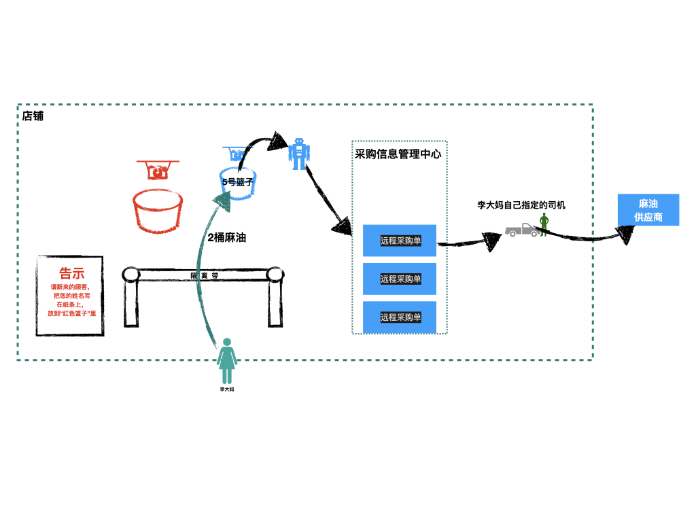

解读点：发出请求--http.request。

[TOC]

# 一.故事
王大妈来到10010店铺，要购买5大包棉花。因为棉花这种东西不经常售卖，所以店铺不会提前购置。平时碰到有顾客需要的时候，才临时向供应商调货。

10010店铺跟供应商的合作模式是这样的：店铺需要主动派车去拉货。

碰到这类采购场景，店铺有以下几种应对方式：
* “客户管理机器人”（即店铺管理员）自己开车，去供应商处取货
* 店铺平时养几个司机；“客户管理机器人”把【采购信息和供应商地址】交给司机，让司机去取货

很明显，第一种模式需要关闭店铺，不适合。那么只有第二种方式，交给专业司机去取货。

于是，10010店铺引入了几个司机。

“客户管理机器人”派了一名司机，告诉他去“xx区xx工厂”去取“5大包”棉花。

不久棉花取回来了，交给了“客户管理机器人”，然后转交给王大妈。

我们来看下王大妈此次购物的整体流程：


看上去很完美：“客户管理机器人”不用离开，店铺可以继续服务其他客人；司机负责取货，专业准时；

考虑到采购棉花这类需求不多，所以10010店铺按照这种模式，有条不紊地运行着。

突然有一天，店铺来了20个顾客，有的要买棉花，有的要买化肥，有的要买塑料布。总之都是类似棉花这样的商品，都需要开车去供应商那里去取。

按照现在的运行模式，“客户管理机器人”需要做的事情有：

* 记录每个人要买的东西
* 找出对应的供应商的地址
* 把【采购信息+供应商地址】告诉司机，让司机去取货

由于今天这样的采购顾客太多，“客户管理机器人”一下子忙坏了。如果顾客再多一点，恐怕就应付不过来了。

10010店铺决定优化模式，将远程采购流程职责进一步细分，标准化流程化。

于是店铺另外成立两个中心：“采购信息管理中心”和“车队管理中心”，并设立管理员来统筹负责。

* 采购信息管理中心：负责把顾客的采购信息标准化，输出“远程采购单”，交给车队；
* 车队管理中心：只用根据“远程采购单”的信息，就知道去哪里取货，其他事情一概不管。

升级后的模式如下：

* 顾客把要采购的东西告诉“客户管理机器人”
* “客户管理机器人”把采购信息，交给“采购信息管理中心”来进行简单处理，输出标准的“远程采购单”
* “采购信息管理中心”把“远程采购单”移交给“车队管理中心”，车队拿到标准的“远程采购单”，就知道去哪取货了。

整个流程如下：


有一天，又来了一位顾客李大妈，她也要采购2桶麻油（同样需要远程采购）。但是李大妈觉着店铺的车队不靠谱，自己带了司机和车辆去取货。

但是为了不影响整体流程（“采购信息管理中心”这个职能中心的职责不变），所以李大妈自己带来的司机，还是要承接“采购信息管理中心”输出的“远程采购单”。

因此这种特殊场景下的流程调整为：
* 顾客把要采购的东西告诉“客户管理机器人”
* “客户管理机器人”把采购信息，交给“采购信息管理中心”来进行简单处理，输出标准的“远程采购单”
* “采购信息管理中心”直接用用户指定的司机去取货；“车队管理中心”没有介入。

特殊场景下的流程为：


# 二.分析和对照

实际上，升级后的远程采购流程，就是目前nodejs发起远程请求（http.request）的模式。

## 1.原理分析（入门解读）
调用http.request发起远程请求，实际上是创建一个http.ClientRequest实例req，然后把这个req交给http.Agent，把请求发出去。

## 2.关联
* 王大妈  --> 用户
* 客户管理机器人 --> 主线程
* 采购信息管理中心 --> http.ClientRequest(即/lib/_http_client.js中的ClientRequest)
* 远程采购单 --> req（即http.ClientRequest实例）
* 车队管理中心 --> http.Agent(即/lib/_http_agent.js中的Agent)

# 三. nodejs源码解读
## 1. 解读入口
我们先看官方的使用样例
```js
// usage example
const http = require('http');

const postData = JSON.stringify({
  'msg': 'Hello World!'
});

const options = {
  hostname: 'www.google.com',
  port: 80,
  path: '/upload',
  method: 'POST',
  headers: {
    'Content-Type': 'application/json',
    'Content-Length': Buffer.byteLength(postData)
  }
};

const req = http.request(options, (res) => {
  res.on('data', (chunk) => {
    console.log(`BODY: ${chunk}`);
  });
});

// Write data to request body
req.write(postData);
req.end();
```

可以看到，上面的样例主要是调用http.request发送请求；这就是本章需要解读的入口：

```js
// 文件地址：/lib/http.js
function request(url, options, cb) {
  return new ClientRequest(url, options, cb);
}
```

## 2. 源码解读

从上面代码看出，http.request本质就是创建一个ClientRequest实例，我们看下它的代码。

> 由于ClientRequest太长，有136行，所以我们逐块分析

### 2.1 准备agent
```js
// 文件地址：/lib/_http_client.js
function ClientRequest(input, options, cb) {
  // 基于OutgoingMessage(_http_outgoing.js，负责往发出的请求中写数据)
  OutgoingMessage.call(this);
  ... // 格式化+标准化options

  let agent = options.agent;
  const defaultAgent = options._defaultAgent || Agent.globalAgent;
  if (agent === false) {
    agent = new defaultAgent.constructor();
  } else if (agent === null || agent === undefined) {
    if (typeof options.createConnection !== 'function') {
      agent = defaultAgent;
    }
    // Explicitly pass through this statement as agent will not be used
    // when createConnection is provided.
  }
  this.agent = agent;
  ...
}
```
上面代码片段，有两个作用：
* 将发起请求的参数进行简单处理（即options）
* 准备agent（即故事章节中的“车队管理中心”）
    * 如果用户有指定agent则使用，否则使用nodejs默认的defaultAgent: Agent.globalAgent;

我们看Agent.globalAgent是啥：
```js
// 文件地址：/lib/_http_agent.js
...
module.exports = {
  Agent,
  globalAgent: new Agent()
};
```
可以看出，这里的globalAgent，就是进程启动时，初始化好的一个Agent实例。

### 2.2 
```js
// 文件地址：/lib/_http_client.js
function ClientRequest(input, options, cb) {
  ...// 准备agent（参见2.1）
  
  // 接下来是一些准备工作
  ...// 准备参数：method，host, port, maxHeaderSize
  ...// 初始化实例的属性：shouldKeepAlive, parser, res, timeoutCb等
  ...// 设置头部信息

  // 按照使用场景，发起请求
  // initiate connection
  if (this.agent) {
    this.agent.addRequest(this, options);
  } else {
    // No agent, default to Connection:close.
    this._last = true;
    this.shouldKeepAlive = false;
    if (typeof options.createConnection === 'function') {
      const newSocket = options.createConnection(options, oncreate);
      if (newSocket && !called) {
        called = true;
        this.onSocket(newSocket);
      } else {
        return;
      }
    } else {
      debug('CLIENT use net.createConnection', options);
      this.onSocket(net.createConnection(options));
    }
  }
}
# 四.总结
