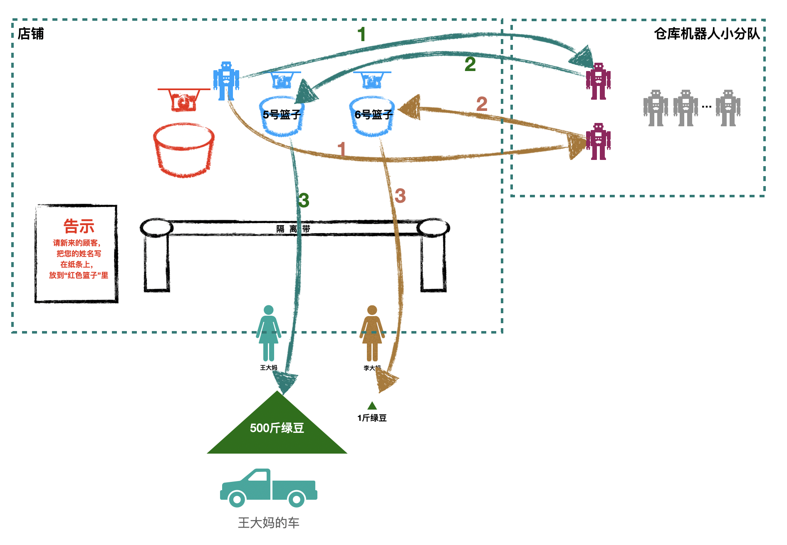

解读点：nodejs文件读取模块

[TOC]

# 一.故事
王大妈和李大妈又一起来10010店铺采购东西。这次两人都准备采购玉米，不同的是，两人采购的量不同：
* 李大妈只是做玉米糊，采购1斤就够了。
* 王大妈要做玉米面的馒头售卖，准备采购500斤。

因为采购的量太大，所以王大妈开了辆车过来。

来到店铺前，王大妈和李大妈将采购需求放到篮子里，机器人过来取。


> 机器人如何处理请求，以及红色篮子、蓝色篮子的概念理解，请移步第三章“3.nodejs如何处理用户的请求”

机器人怎么处理这两个顾客的需求呢？
## 方式1：机器人独自完成任务
机器人最简单粗暴的处理方式是：一次把东西取出来，交给王大妈和李大妈。


对于李大妈的需求，机器人可以很快搞定。而王大妈的需求则比较棘手，需要消耗的时间略长。

### 方式1面临的问题
此时一个非常关键的问题出现了：
由于玉米这种货物不经常售卖，为了节省空间，10010店铺没有把玉米放在店铺中，而是放在了后面的仓库中。等有人需要，才去仓库中取出来。

仓库平时是锁着的，而且仓库的货架都很高，找到玉米并取下来也费时费力。

我们假设机器人完成这些动作需要消耗5分钟（甚至更长）；如果此时又来了新的顾客，那么新的顾客至少要等到5分钟。

也就是说，采用这种方式，店铺在处理顾客的数量能力上，将大大受到影响。

## 方式2：增添几个仓库机器人

如果我们增添几个仓库机器人，专门用来管理仓库、进货、取货，是不是效率更高呢？

> 为了区分，我们把店铺接待顾客的机器人称为“客户管理机器人”，管理仓库的机器人称为“仓库管理机器人”

我们设想一下店铺新的运行模式：

* “客户管理机器人”主要在门口接待顾客；如果客户的需求很简单容易，则它可以直接完成；
* 如果顾客的需求很麻烦，耗时很长，“客户管理机器人”便将需求转交给“仓库管理机器人”去协助完成

简要流程图：


真实场景图：
先看只有王大妈的情况：


再看王大妈和李大妈同时存在的情况:


>注意：在现实情况下，无论李大妈的货物有多简单，只要是去仓库取，都应该交给机器人，不应该自己完成，即最正确的做法是：
>
>
>
> 对应于nodejs中，无论读取文件有多简单，除非万不得已，一般都要使用异步方法: 即使用fs.readFile，不要使用fs.readFileSync

使用方式2，可以看到，在繁忙的时间段，“客户管理机器人”依然能够接待每一个客人。繁重的工作交给“仓库管理机器人”去协同完成。

似乎是完美了。

### 方式2面临的问题
然而问题又来了：
一次性取500斤玉米可不是个完美的方案。我们看看为什么。

500斤玉米，按照每袋100斤计算，共计5袋。“仓库管理机器人”需要把5袋一次性取完，才能交给“客户管理机器人”，然后再交给王大妈。

在取完5袋之前，王大妈一直空闲着，相当于是人力（资源）浪费；然后是突然一下子来了5袋，王大妈要花费很长时间一袋一袋往车子上装。

能不能换一种方式：
* 取一袋，交给王大妈，王大妈先装上车；
* 然后循环往复取下一袋
* 最后一袋取出来，王大妈直接装上车，就可以离开店铺。

答案时候可以的，我们看方式3。

## 方式3：流式取货物
在这种模式下，“仓库管理机器人”只要取到一部分玉米，就转交给“客户管理机器人”，再转交给客户。


在这种模式下，即使客户王大妈要采购1吨，甚至100吨的玉米，整个10010店铺也不会停摆：“客户管理机器人”依然可以见缝插针地服务别的客户。


# 二.分析和对照
## 1. 原理分析（入门解读）
不同于网络io采用“异步”的处理方式，nodejs采用了“同步+线程池”方式来处理文件io，以达到异步效果。

> 感兴趣的同学可以参考这篇文章 https://blog.libtorrent.org/2012/10/asynchronous-disk-io/ 看看nodejs的libuv为什么采用“同步+线程池”的方式处理文件io。
> 
> 直接采用异步方式处理文件io的劣势，可以简单总结为：内核对应的“文件异步api”很糟糕，最终导致实现复杂，测试和性能最终都收影响。

那么“同步+线程池”是指什么呢？
我们通过以下四点来解读：
1. 读取文件io采用同步方式；但是这个工作不是由nodejs主线程（即“客户管理机器人”）来完成，而是交给另外的辅助线程来完成。
2. 辅助线程是在nodejs启动的时候，自动分配的。默认是开启4个辅助线程（可以调整，最多支持1024个）
3. 当主线程需要的时候，才会从这些辅助线程中随机取出一个执行辅助任务；就像从池子中取出一个一样，因此被形象地称之为线程池。
4. 当辅助线程完成任务后，会通知主线程继续处理。对于主线程来说，就实现了异步处理文件io的能力。


我们通过一张图看下同步+线程池的工作流程：


主线程会根据方法名（比如fs.readFile, fs.readFileSync）来判断是否把工作转交给线程池来完成。

## 2. 关联
* 王大妈/李大妈  --> 用户
* 客户管理机器人 --> 主线程
* 仓库管理机器人 --> 线程池中的线程
* 仓库         --> 机器硬盘
* 绿豆         --> 硬盘上的文件内容

# 三. nodejs源码解读

fs模块提供的方法较多，但是有代表性的是readFile和readFileSync。搞懂了这两个的运行原理和流程，其他的自然就知道了。

这两个方法是在/lib/fs.js中导出的。
```js
// 文件位置：/lib/fs.js 
// line: 1927
// nodejs原生fs模块暴露的方法
module.exports = fs = {
  ...
  readFile,
  readFileSync,
  ...
}
```

我们先看同步方式fs.readFileSync，对应故事章节中的“方式1”。

## 1.同步调用：
```js
// 文件位置：/lib/fs.js
// line 361
function readFileSync(path, options) {
  // 准备相关的参数
  ...
  let pos = 0;
  let buffer;
  ...
  // 这里只看其中一种情形，其他的代码忽略；todo:需要解读更多的类型
  let bytesRead;
    ...
    tryReadSync(fd, isUserFd, buffer, pos, size - pos);
    ...
  return buffer;
}
```

从上面代码看出，这里分配了一个buffer，然后调用tryReadSync，把内容放入buffer中，最后返回。
我们来看下tryReadSync:
```js
// 文件位置：/lib/fs.js
function tryReadSync(fd, isUserFd, buffer, pos, len) {
  let threw = true;
  let bytesRead;
  try {
    bytesRead = fs.readSync(fd, buffer, pos, len);
    threw = false;
  } finally {
    if (threw && !isUserFd) fs.closeSync(fd);
  }
  return bytesRead;
}
```

很简单，就是调用了fs.readSync，我们看下它的实现
```js
// 文件位置：/lib/fs.js
// 这里的源码列出了readSync的两种调用方式：
// usage:
// fs.readSync(fd, buffer, offset, length, position);
// OR
// fs.readSync(fd, buffer, {}) or fs.readSync(fd, buffer)
function readSync(fd, buffer, offset, length, position) {
  ...
  // 参数校验和准备工作
  ...
  
  const ctx = {};
  const result = binding.read(fd, buffer, offset, length, position,undefined, ctx);
  return result;
}
```

可以看出，这里最终调用了build-in模块的read方法。我们看下它的实现。

```c++
// 文件位置：/src/node_file.cc
static void Read(const FunctionCallbackInfo<Value>& args) {
  Environment* env = Environment::GetCurrent(args);

  // 各种check
  ...

  char* buf = buffer_data + off;
  uv_buf_t uvbuf = uv_buf_init(buf, len);
  // 判断index为5的参数是否存在，如果存在，表示是异步回调；否则是同步调用
  FSReqBase* req_wrap_async = GetReqWrap(args, 5);
  if (req_wrap_async != nullptr) {  // read(fd, buffer, offset, len, pos, req)
    AsyncCall(env, req_wrap_async, args, "read", UTF8, AfterInteger, uv_fs_read, fd, &uvbuf, 1, pos);
  } else {  // read(fd, buffer, offset, len, pos, undefined, ctx)
    ...
    const int bytesRead = SyncCall(env, args[6], &req_wrap_sync, "read", uv_fs_read, fd, &uvbuf, 1, pos);
    ...
  }
}
```

Read方法也是比较简单，通过判断是否有第六个参数（index=5）来判断是同步调用还是异步调用。如果是前者，则调用SyncCall；否则调用AsyncCall。
> fs.readFileSync('xx')最终调用c++的方式为const result = binding.read(fd, buffer, offset, length, position,undefined, ctx);
> 
> 这里第六个参数（index=5）为undefined

我们这里分析同步调用，所以看SyncCall。重点关注第5个参数（index=4）: uv_fs_read。

下面是SyncCall的实现（参数uv_fs_read对应下面代码中的fn）。
```c++
// 文件位置：/src/node_file.inl.h
int SyncCall(Environment* env, v8::Local<v8::Value> ctx,
             FSReqWrapSync* req_wrap, const char* syscall,
             Func fn, Args... args) {
  env->PrintSyncTrace();
  int err = fn(env->event_loop(), &(req_wrap->req), args..., nullptr);
  ...
  return err;
}
```

可以看出，SyncCall就是调用了uv_fs_read方法。这个是libuv封装的一个文件读方法。

我们看下uv_fs_read方法：
```c++
// 文件位置： /deps/uv/src/unix/fs.c
int uv_fs_read(uv_loop_t* loop, uv_fs_t* req,
               uv_file file,
               const uv_buf_t bufs[],
               unsigned int nbufs,
               int64_t off,
               uv_fs_cb cb) {
  INIT(READ);

  if (bufs == NULL || nbufs == 0)
    return UV_EINVAL;

  req->file = file;

  req->nbufs = nbufs;
  req->bufs = req->bufsml;
  if (nbufs > ARRAY_SIZE(req->bufsml))
    req->bufs = uv__malloc(nbufs * sizeof(*bufs));

  if (req->bufs == NULL)
    return UV_ENOMEM;

  memcpy(req->bufs, bufs, nbufs * sizeof(*bufs));

  req->off = off;
  POST;
}
```

这里有一个宏：POST，它的代码如下：
```c++
// 文件位置：/deps/uv/src/unix/fs.c
#define POST                                                                  \
  do {                                                                        \
    if (cb != NULL) {                                                         \
      uv__req_register(loop, req);                                            \
      uv__work_submit(loop,                                                   \
                      &req->work_req,                                         \
                      UV__WORK_FAST_IO,                                       \
                      uv__fs_work,                                            \
                      uv__fs_done);                                           \
      return 0;                                                               \
    }                                                                         \
    else {                                                                    \
      uv__fs_work(&req->work_req);                                            \
      return req->result;                                                     \
    }                                                                         \
  }                                                                           \
  while (0)
```
我们知道：
* 异步调用：AsyncCall(env, req_wrap_async, args, "read", UTF8, AfterInteger,
              uv_fs_read, fd, &uvbuf, 1, pos);
AsyncCall调用了return AsyncDestCall(env, req_wrap, args, syscall, nullptr, 0, enc, after, fn, fn_args...);

AsyncDestCall调用了
int err = req_wrap->Dispatch(fn, fn_args..., after);

* 同步调用：SyncCall(env, args[6], &req_wrap_sync, "read",uv_fs_read, fd, &uvbuf, 1, pos);
SyncCall中调用了：int err = fn(env->event_loop(), &(req_wrap->req), args..., nullptr);
在同步方法中，传递给uv_fs_read的最后一个参数是nullptr；
所以这里POST命中else分支

总结一下：
* 异步调用uv_fs_read传递的是：fn_args..., after
* 同步调用uv_fs_read传递的是：args..., nullptr


所以，在POST宏中：
* 如果是异步调用，则走if分支，即uv__work_submit(...);return 0;
* 如果是同步调用，则走else分支，即uv__fs_work(&req->work_req);return req->result;  


```c++
// 文件位置：/deps/uv/src/unix/fs.c
static void uv__fs_work(struct uv__work* w) {
  ...
  switch (req->fs_type) {
    ...
    X(READ, uv__fs_read(req));
    ...
  }
}

static ssize_t uv__fs_read(uv_fs_t* req) {
  ...
  if (req->off < 0) {
    if (req->nbufs == 1)
      result = read(req->file, req->bufs[0].base, req->bufs[0].len);
    else
      result = readv(req->file, (struct iovec*) req->bufs, req->nbufs);
  } else {
    if (req->nbufs == 1) {
      result = pread(req->file, req->bufs[0].base, req->bufs[0].len, req->off);
      goto done;
    }
  ...
}
```


1.readFile会调用read,read:
```js
const req = new FSReqCallback();
  req.oncomplete = wrapper;

  binding.read(fd, buffer, offset, length, position, req);
```
这里封装了一个FSReqCallback对象req，传到binding.read

2.如果是readFileSync会调用readSync，readSync:
```js
const result = binding.read(fd, buffer, offset, length, position,
                              undefined, ctx);
```
这里传递了一个undefined。

3.如果是promise形式
```js
lib/internal/fs/promises.js
const bytesRead = (await binding.read(handle.fd, buffer, offset, length,
                                        position, kUsePromises)) || 0;
```
这里传递了一个kUsePromises

针对1和3，c++中统一封装为：req_wrap_async

```c++
FSReqBase* req_wrap_async = GetReqWrap(args, 5);
  if (req_wrap_async != nullptr) {  // read(fd, buffer, offset, len, pos, req)
    AsyncCall(env, req_wrap_async, args, "read", UTF8, AfterInteger,
              uv_fs_read, fd, &uvbuf, 1, pos);
  }


FSReqBase* GetReqWrap(const v8::FunctionCallbackInfo<v8::Value>& args,
                      int index,
                      bool use_bigint) {
  v8::Local<v8::Value> value = args[index];
  // 如果是普通对象，则直接返回FSReqBase
  if (value->IsObject()) {
    return Unwrap<FSReqBase>(value.As<v8::Object>());
  }

  BindingData* binding_data = Unwrap<BindingData>(args.Data());
  Environment* env = binding_data->env();
  // 如果是promise,则返回一个FSReqPromise
  if (value->StrictEquals(env->fs_use_promises_symbol())) {
    if (use_bigint) {
      return FSReqPromise<AliasedBigUint64Array>::New(binding_data, use_bigint);
    } else {
      return FSReqPromise<AliasedFloat64Array>::New(binding_data, use_bigint);
    }
  }
  return nullptr;
}
```

AyncCall调用了AsyncDestCall
```c++
FSReqBase* AsyncCall(Environment* env,
                     FSReqBase* req_wrap,
                     const v8::FunctionCallbackInfo<v8::Value>& args,
                     const char* syscall, enum encoding enc,
                     uv_fs_cb after, Func fn, Args... fn_args) {
  return AsyncDestCall(env, req_wrap, args,
                       syscall, nullptr, 0, enc,
                       after, fn, fn_args...);
}


FSReqBase* AsyncDestCall(Environment* env, FSReqBase* req_wrap,
                         const v8::FunctionCallbackInfo<v8::Value>& args,
                         const char* syscall, const char* dest,
                         size_t len, enum encoding enc, uv_fs_cb after,
                         Func fn, Args... fn_args) {
  CHECK_NOT_NULL(req_wrap);
  req_wrap->Init(syscall, dest, len, enc);
  int err = req_wrap->Dispatch(fn, fn_args..., after);
  if (err < 0) {
    uv_fs_t* uv_req = req_wrap->req();
    uv_req->result = err;
    uv_req->path = nullptr;
    after(uv_req);  // after may delete req_wrap if there is an error
    req_wrap = nullptr;
  } else {
    req_wrap->SetReturnValue(args);
  }

  return req_wrap;
}
```

这里的req_wrap触发了一个Dispatch,即向线程池派发一个任务，完成后，调用fn，即uv_fs_read。

uv_fs_read会通过POST通知主线程。


* 第一步：先初始化一个context，后续很多回调都会挂在这里。
* 第二步：初始化一个req:const req = new FSReqCallback();把回调callback挂在这里。
* 然后把context挂在到req上。req.context = context;req.oncomplete = readFileAfterOpen;
* 调用binding.open方法（binding就是c++的fs模块）
* open后，触发readFileAfterOpen， readFileAfterStat，最后来到binding.read方法。
* binding.read就是c++模块的Read方法，它通过判断是否是异步，最后调用AsyncCall AsyncCall(env, req_wrap_async, args, "read", UTF8, AfterInteger,uv_fs_read, fd, &uvbuf, 1, pos);

* AsyncCall的第七个参数uv_fs_read将会被调用，这个函数为：
```c++
int uv_fs_stat(uv_loop_t* loop, uv_fs_t* req, const char* path, uv_fs_cb cb) {
  INIT(STAT);
  PATH;
  POST;
}
```

POST为宏，它很简单，调用了 uv__work_submit

```c++
#define POST                                                                  \
  do {                                                                        \
    if (cb != NULL) {                                                         \
      uv__req_register(loop, req);                                            \
      uv__work_submit(loop,                                                   \
                      &req->work_req,                                         \
                      UV__WORK_FAST_IO,                                       \
                      uv__fs_work,                                            \
                      uv__fs_done);                                           \
      return 0;                                                               \
    }                                                                         \
    else {                                                                    \
      uv__fs_work(&req->work_req);                                            \
      return req->result;                                                     \
    }                                                                         \
  }                                                                           \
  while (0)
```
```js
// 文件位置：/lib/fs.js
function lazyLoadStreams() {
  if (!ReadStream) {
    ({ ReadStream, WriteStream } = require('internal/fs/streams'));
    [ FileReadStream, FileWriteStream ] = [ ReadStream, WriteStream ];
  }
}

function createReadStream(path, options) {
  lazyLoadStreams();
  return new ReadStream(path, options);
}
```

```js
ReadStream.prototype._read = function(n) {
  ...

  // Grab another reference to the pool in the case that while we're
  // in the thread pool another read() finishes up the pool, and
  // allocates a new one.
  const thisPool = pool;
  
  this[kFs].read(
    this.fd, pool, pool.used, toRead, this.pos, (er, bytesRead) => {
      

      if (er) {
        ...
      } else {
        let b = null;
        ...
        

        if (bytesRead > 0) {
          this.bytesRead += bytesRead;
          b = thisPool.slice(start, start + bytesRead);
        }
        // this.push就是调用stream.push方法，调用addChunk
        this.push(b);
      }
    });
    ...
};
```


```js
function addChunk(stream, state, chunk, addToFront) {
  if (state.flowing && state.length === 0 && !state.sync) {
    ...
    stream.emit('data', chunk);
  } else {
    ...
  }
  maybeReadMore(stream, state);
}

function maybeReadMore(stream, state) {
  if (!state.readingMore) {
    state.readingMore = true;
    process.nextTick(maybeReadMore_, stream, state);
  }
}

function maybeReadMore_(stream, state) {
  ...
  while (!state.reading && !state.ended &&
         (state.length < state.highWaterMark ||
          (state.flowing && state.length === 0))) {
    const len = state.length;
    debug('maybeReadMore read 0');
    stream.read(0);
    if (len === state.length)
      // Didn't get any data, stop spinning.
      break;
  }
  state.readingMore = false;
}
```
> 小结：
> fs通过 createReadStream 创建流，然后注册一个on('data')，调用resume，触发flow模式
> flow会无限循环调用read()（其实这里不会无限调用，只调用了一次）。read会调用fs提供的_read方法。
> lib/internal/fs/stream的_read方法通过调用this[kFs].read(),并在cb中，将读取到的数据，调用stream.push()
> stream.push就比较经典了，调用addChunk将数据emit data出去。
> addChunk最后会调用一个 maybeReadMore 再次读取。（这里解决flow中无限循环read只执行一次，以实现源源不断地读取数据，进行流）
> maybeReadMore 通过read(0)来再次调用_read方法，来继续读取数据。
# 四.总结：


