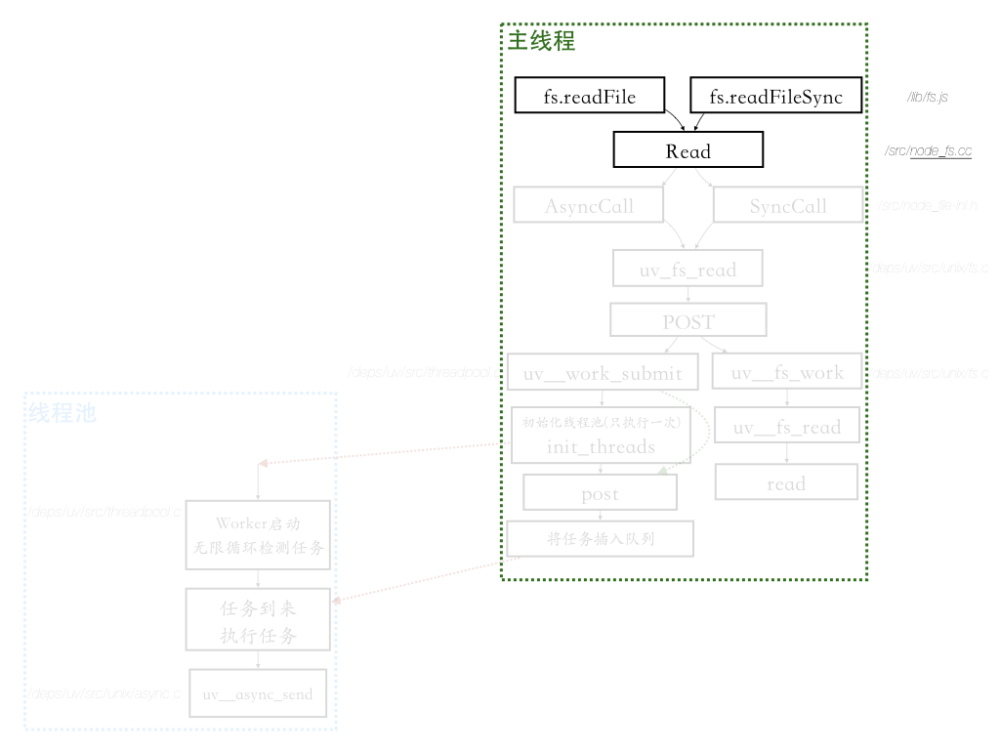
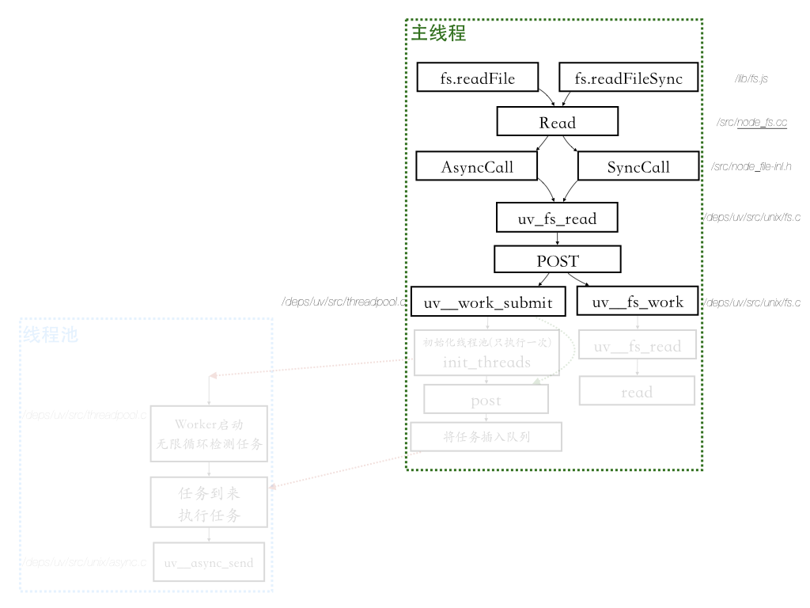
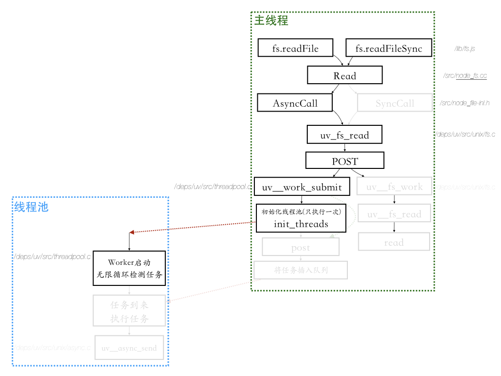

解读点：nodejs文件读取模块

[TOC]

# 一.故事
王大妈和李大妈又一起来10010店铺采购东西。这次两人都准备采购玉米，不同的是，两人采购的量不同：
* 李大妈只是做玉米糊，采购1斤就够了。
* 王大妈要做玉米面的馒头售卖，准备采购500斤。

因为采购的量太大，所以王大妈开了辆车过来。

来到店铺前，王大妈和李大妈将采购需求放到篮子里，机器人过来取。


> 机器人如何处理请求，以及红色篮子、蓝色篮子的概念理解，请移步第三章“3.nodejs如何处理用户的请求”

机器人怎么处理这两个顾客的需求呢？
## 方式1：机器人独自完成任务
机器人最简单粗暴的处理方式是：一次把东西取出来，交给王大妈和李大妈。


对于李大妈的需求，机器人可以很快搞定。而王大妈的需求则比较棘手，需要消耗的时间略长。

### 方式1面临的问题
此时一个非常关键的问题出现了：
由于玉米这种货物不经常售卖，为了节省空间，10010店铺没有把玉米放在店铺中，而是放在了后面的仓库中。等有人需要，才去仓库中取出来。

仓库平时是锁着的，而且仓库的货架都很高，找到玉米并取下来也费时费力。

我们假设机器人完成这些动作需要消耗5分钟（甚至更长）；如果此时又来了新的顾客，那么新的顾客至少要等到5分钟。

也就是说，采用这种方式，店铺在处理顾客的数量能力上，将大大受到影响。

## 方式2：增添几个仓库机器人

如果我们增添几个仓库机器人，专门用来管理仓库、进货、取货，是不是效率更高呢？

> 为了区分，我们把店铺接待顾客的机器人称为“客户管理机器人”，管理仓库的机器人称为“仓库管理机器人”

我们设想一下店铺新的运行模式：

* “客户管理机器人”主要在门口接待顾客；如果客户的需求很简单容易，则它可以直接完成；
* 如果顾客的需求很麻烦，耗时很长，“客户管理机器人”便将需求转交给“仓库管理机器人”去协助完成

简要流程图：


真实场景图：
先看只有王大妈的情况：


再看王大妈和李大妈同时存在的情况:


>注意：在现实情况下，无论李大妈的货物有多简单，只要是去仓库取，都应该交给机器人，不应该自己完成，即最正确的做法是：
>
>
>
> 对应于nodejs中，无论读取文件有多简单，除非万不得已，一般都要使用异步方法: 即使用fs.readFile，不要使用fs.readFileSync

使用方式2，可以看到，在繁忙的时间段，“客户管理机器人”依然能够接待每一个客人。繁重的工作交给“仓库管理机器人”去协同完成。

似乎是完美了。

### 方式2面临的问题
然而问题又来了：
一次性取500斤玉米可不是个完美的方案。我们看看为什么。

500斤玉米，按照每袋100斤计算，共计5袋。“仓库管理机器人”需要把5袋一次性取完，才能交给“客户管理机器人”，然后再交给王大妈。

在取完5袋之前，王大妈一直空闲着，相当于是人力（资源）浪费；然后是突然一下子来了5袋，王大妈要花费很长时间一袋一袋往车子上装。

能不能换一种方式：
* 取一袋，交给王大妈，王大妈先装上车；
* 然后循环往复取下一袋
* 最后一袋取出来，王大妈直接装上车，就可以离开店铺。

答案时候可以的，我们看方式3。

## 方式3：流式取货物
在这种模式下，“仓库管理机器人”只要取到一部分玉米，就转交给“客户管理机器人”，再转交给客户。


在这种模式下，即使客户王大妈要采购1吨，甚至100吨的玉米，整个10010店铺也不会停摆：“客户管理机器人”依然可以见缝插针地服务别的客户。


# 二.分析和对照
## 1. 原理分析（入门解读）
不同于网络io采用“异步”的处理方式，nodejs采用了“同步+线程池”方式来处理文件io，以达到异步效果。

> 感兴趣的同学可以参考这篇文章 https://blog.libtorrent.org/2012/10/asynchronous-disk-io/ 看看nodejs的libuv为什么采用“同步+线程池”的方式处理文件io。
> 
> 直接采用异步方式处理文件io的劣势，可以简单总结为：内核对应的“文件异步api”很糟糕，最终导致实现复杂，测试和性能最终都收影响。

那么“同步+线程池”是指什么呢？
我们通过以下四点来解读：
1. 读取文件io采用同步方式；但是这个工作不是由nodejs主线程（即“客户管理机器人”）来完成，而是交给另外的辅助线程来完成。
2. 辅助线程是在nodejs启动的时候，自动分配的。默认是开启4个辅助线程（可以调整，最多支持1024个）
3. 当主线程需要的时候，才会从这些辅助线程中随机取出一个执行辅助任务；就像从池子中取出一个一样，因此被形象地称之为线程池。
4. 当辅助线程完成任务后，会通知主线程继续处理。对于主线程来说，就实现了异步处理文件io的能力。


我们通过一张图看下同步+线程池的工作流程：


主线程会根据方法名（比如fs.readFile, fs.readFileSync）来判断是否把工作转交给线程池来完成。

## 2. 关联
* 王大妈/李大妈  --> 用户
* 客户管理机器人 --> 主线程
* 仓库管理机器人 --> 线程池中的线程
* 仓库         --> 机器硬盘
* 绿豆         --> 硬盘上的文件内容

# 三. nodejs源码解读

fs模块提供的方法较多，但是有代表性的是readFile和readFileSync。搞懂了这两个的运行原理和流程，其他的自然就知道了。

这两个方法是在/lib/fs.js中导出的。
```js
// 文件位置：/lib/fs.js 
// line: 1927
// nodejs原生fs模块暴露的方法
module.exports = fs = {
  ...
  readFile,
  readFileSync,
  ...
}
```
fs.readFileSync 对应故事章节中的“方式1”；fs.readFile 对应故事章节中的“方式2”。

我们先给出一个流程图，从全局视角看下两种方式的区别和联系：
>现在读不懂没关系，我们接下来会一一解读。


> 由于两个方法关联性很强，所以我们采取并行解读的方式

## 同步和异步方式
### 1.入口


#### 1.1 同步调用
```js
// 文件位置：/lib/fs.js
// 同步
function readFileSync(path, options) {
  // 准备相关的参数
  ...
  let buffer;
  ...
  // 这里只看其中一种情形，其他的代码忽略；todo:需要解读更多的类型\
    ...
    tryReadSync(fd, isUserFd, buffer, pos, size - pos);
    ...
  return buffer;
}
```

从上面代码看出，这里分配了一个buffer，然后调用tryReadSync，把内容放入buffer中，最后返回。
我们来看下tryReadSync:
```js
// 文件位置：/lib/fs.js
function tryReadSync(fd, isUserFd, buffer, pos, len) {
  let threw = true;
  let bytesRead;
  try {
    bytesRead = fs.readSync(fd, buffer, pos, len);
    threw = false;
  } finally {
    if (threw && !isUserFd) fs.closeSync(fd);
  }
  return bytesRead;
}
```

很简单，就是调用了fs.readSync，我们看下它的实现
```js
// 文件位置：/lib/fs.js
function readSync(fd, buffer, offset, length, position) {
  ...
  // 参数校验和准备工作
  ...
  
  const ctx = {};
  const result = binding.read(fd, buffer, offset, length, position,undefined, ctx);
  return result;
}
```

可以看出，这里最终调用了build-in模块的read方法。
> 注意第六个参数为undefined。

#### 1.2 异步调用
先看入口方法：
```js
// 文件位置：/lib/fs.js
// 异步
function readFile(path, options, callback) {
  ...
  const context = new ReadFileContext(callback, options.encoding);
  const req = new FSReqCallback();
  req.context = context;
  req.oncomplete = readFileAfterOpen;
  binding.open(pathModule.toNamespacedPath(path), flagsNumber, 0o666, req);
}
```
可以看出，这里初始化了一个FSReqCallback实例req；然后调用了build-in模块的open方法来打开文件；打开后，它就会调用回调req.oncomplete；
> 文件读取无外乎open, stat, read三个步骤；
>这三个步骤依次调用，都是通过初始化一个FSReqCallback实例req；当前阶段完成后，然后调用它的req.oncomplete。

我们看第一阶段，open后，执行req.oncomplete，即readFileAfterOpen。

```js
// 文件位置: /lib/fs.js
function readFileAfterOpen(err, fd) {
  const context = this.context;
  ...

  const req = new FSReqCallback();
  req.oncomplete = readFileAfterStat;
  req.context = context;
  binding.fstat(fd, false, req);
}
```

这里也初始化了一个FSReqCallback实例req。接着调用fstat,读取文件元信息后，执行了回调req.oncomplete，即readFileAfterStat；

```js
// 文件位置：/lib/fs.js
function readFileAfterStat(err, stats) {
  const context = this.context;
  ...
  context.read();
}
```

这里的context的read方法是什么呢？

我们回顾一下readFile中是怎么初始化context的。

```js
// 文件位置：/lib/fs.js
function readFile(path, options, callback) {
  ...
    ReadFileContext = require('internal/fs/read_file_context');
  const context = new ReadFileContext(callback, options.encoding);
  ...
}
```

所以context.read方法就在internal/fs/read_file_context.js中。
```js
// 文件位置：/lib/internal/fs/read_file_context.js
read() {
    ...

    const req = new FSReqCallback();
    req.oncomplete = readFileAfterRead;
    req.context = this;
    // 这里的read方法，和同步方法中的binding.read是统一个方法，即/src/node_file.cc中的Read
    read(this.fd, buffer, offset, length, -1, req);
  }
```

综上，无论是同步，还是异步，最终都汇总到了/src/node_file.c中的Read方法。

于是我们的全局流程图来到了这里：



### 2.C++中的Read

从上面一节，我们知道，两个方法，最终都调用/src/node_file.c中的Read方法；
我们看下它的实现。

```c++
// 文件位置：/src/node_file.cc
static void Read(const FunctionCallbackInfo<Value>& args) {
  Environment* env = Environment::GetCurrent(args);

  // 各种check
  ...

  char* buf = buffer_data + off;
  uv_buf_t uvbuf = uv_buf_init(buf, len);
  // 判断index为5的参数是否存在，如果存在，表示是异步回调；否则是同步调用
  FSReqBase* req_wrap_async = GetReqWrap(args, 5);
  if (req_wrap_async != nullptr) {  // read(fd, buffer, offset, len, pos, req)
    AsyncCall(env, req_wrap_async, args, "read", UTF8, AfterInteger, uv_fs_read, fd, &uvbuf, 1, pos);
  } else {  // read(fd, buffer, offset, len, pos, undefined, ctx)
    ...
    const int bytesRead = SyncCall(env, args[6], &req_wrap_sync, "read", uv_fs_read, fd, &uvbuf, 1, pos);
    ...
  }
}
```

Read方法也是比较简单，通过判断是否有第六个参数（index=5），来判断是同步调用还是异步调用。如果有，则调用AsyncCall；否则SyncCall。
> fs.readFileSync('xx')最终调用c++的方式为const result = binding.read(fd, buffer, offset, length, position,undefined, ctx);
> 
> 这里第六个参数（index=5）为undefined

于是我们的全局流程图来到了这里：


### 3.SyncCall 和AsyncCall
先看SyncCall，重点关注第5个参数（index=4），uv_fs_read：

>下面是SyncCall的实现（参数uv_fs_read对应下面代码中的fn）。
```c++
// 文件位置：/src/node_file.inl.h
int SyncCall(Environment* env, v8::Local<v8::Value> ctx,
             FSReqWrapSync* req_wrap, const char* syscall,
             Func fn, Args... args) {
  env->PrintSyncTrace();
  int err = fn(env->event_loop(), &(req_wrap->req), args..., nullptr);
  ...
  return err;
}
```

可以看出，SyncCall就是调用了uv_fs_read方法。

再看AsyncCall：
```c++
// 文件位置：/src/node_file.inl.h
FSReqBase* AsyncCall(Environment* env,
                     FSReqBase* req_wrap,
                     const v8::FunctionCallbackInfo<v8::Value>& args,
                     const char* syscall, enum encoding enc,
                     uv_fs_cb after, Func fn, Args... fn_args) {
  return AsyncDestCall(env, req_wrap, args,
                       syscall, nullptr, 0, enc,
                       after, fn, fn_args...);
}

// 调用了AsyncDestCall:
FSReqBase* AsyncDestCall(Environment* env, FSReqBase* req_wrap,
                         const v8::FunctionCallbackInfo<v8::Value>& args,
                         const char* syscall, const char* dest,
                         size_t len, enum encoding enc, uv_fs_cb after,
                         Func fn, Args... fn_args) {
  CHECK_NOT_NULL(req_wrap);
  req_wrap->Init(syscall, dest, len, enc);
  int err = req_wrap->Dispatch(fn, fn_args..., after);
  ...
  return req_wrap;
}
```

可以看出，这里的调用流程为：AsyncDestCall -> AsyncDestCall -> req_wrap->Dispatch(fn, fn_args..., after)。

这里触发了一个Dispatch(fn,...);其中fn也就是uv_fs_read。

所以，无论是SyncCall还是AsyncCall, 最终又收归一处，调用uv_fs_read。

于是我们的全局流程图来到了这里：


### 4. uv_fs_read
这个是libuv封装的一个文件读方法。

我们看下uv_fs_read方法：
```c++
// 文件位置： /deps/uv/src/unix/fs.c
int uv_fs_read(uv_loop_t* loop, uv_fs_t* req,
               uv_file file,
               const uv_buf_t bufs[],
               unsigned int nbufs,
               int64_t off,
               uv_fs_cb cb) {
  INIT(READ);

  if (bufs == NULL || nbufs == 0)
    return UV_EINVAL;

  req->file = file;

  req->nbufs = nbufs;
  req->bufs = req->bufsml;
  if (nbufs > ARRAY_SIZE(req->bufsml))
    req->bufs = uv__malloc(nbufs * sizeof(*bufs));

  if (req->bufs == NULL)
    return UV_ENOMEM;

  memcpy(req->bufs, bufs, nbufs * sizeof(*bufs));

  req->off = off;
  POST;
}
```
于是我们的全局流程图来到了这里：


### 5.POST

这里有一个宏：POST，它的代码如下：
```c++
// 文件位置：/deps/uv/src/unix/fs.c
#define POST                                                                  \
  do {                                                                        \
    if (cb != NULL) {                                                         \
      uv__req_register(loop, req);                                            \
      uv__work_submit(loop,                                                   \
                      &req->work_req,                                         \
                      UV__WORK_FAST_IO,                                       \
                      uv__fs_work,                                            \
                      uv__fs_done);                                           \
      return 0;                                                               \
    }                                                                         \
    else {                                                                    \
      uv__fs_work(&req->work_req);                                            \
      return req->result;                                                     \
    }                                                                         \
  }                                                                           \
  while (0)
```

根据前面的章节，我们知道：

* 同步调用：fn(env->event_loop(), &(req_wrap->req), args..., nullptr);
* 异步调用：req_wrap->Dispatch(fn, fn_args..., after);


总结一下：

* 同步调用uv_fs_read传递的是：args..., nullptr
* 异步调用uv_fs_read传递的是：fn_args..., after


所以，在POST宏中：

* 如果是同步调用，则走else分支，即uv__fs_work(&req->work_req);return req->result;  
* 如果是异步调用，则走if分支，即uv__work_submit(...);return 0;

于是我们的全局流程图来到了这里：



>也就是从这里开始，两种方式彻底分开来，不会再有公用交叉的地方。
### 6. 同步方式最后调用uv__fs_work

```c++
// 文件位置：/deps/uv/src/unix/fs.c
static void uv__fs_work(struct uv__work* w) {
  ...
  switch (req->fs_type) {
    ...
    X(READ, uv__fs_read(req));
    ...
  }
}

static ssize_t uv__fs_read(uv_fs_t* req) {
  ...
  if (req->off < 0) {
    if (req->nbufs == 1)
      result = read(req->file, req->bufs[0].base, req->bufs[0].len);
    else
      result = readv(req->file, (struct iovec*) req->bufs, req->nbufs);
  } else {
    if (req->nbufs == 1) {
      result = pread(req->file, req->bufs[0].base, req->bufs[0].len, req->off);
      goto done;
    }
  ...
}
```

可见，同步方式比较简单直接，最终调用系统read读取数据，并返回。

此时，同步方式的调用流程完结，如下图：


### 7. 异步方式调用uv__work_submit

上面讲解了同步，我们看异步。POST调用了uv__work_submit：

```c++
// 文件位置：/deps/uv/src/threadpool.c
void uv__work_submit(uv_loop_t* loop,
                     struct uv__work* w,
                     enum uv__work_kind kind,
                     void (*work)(struct uv__work* w),
                     void (*done)(struct uv__work* w, int status)) {
  // 这里uv_once进行懒惰初始化，只初始化一次（创建线程池）
  uv_once(&once, init_once);
  w->loop = loop;
  w->work = work;
  w->done = done;
  post(&w->wq, kind);
}
```
这个方法需要注意的三个点：

* 初始化线程池
* 准备工作
* 调用post，往相关的队列中插入任务

其中看第一个点，初始化线程池(这个动作只执行一次，后续不再执行)
第三个点是把当前任务插入任务，供线程池消费。

我们假设第一个点已经执行过，直接看第三个点。


于是我们的全局流程图来到了这里：


### 8.将当前读取任务插入到队列

第三个点，往队列中插入任务。然后线程池中的线程就会不断循环读取，只要有，便执行
```c++
// 文件位置：/deps/uv/src/threadpool.c
// QUEUE_INSERT_TAIL
static void post(QUEUE* q, enum uv__work_kind kind) {
  uv_mutex_lock(&mutex);
  if (kind == UV__WORK_SLOW_IO) {
    /* Insert into a separate queue. */
    QUEUE_INSERT_TAIL(&slow_io_pending_wq, q);
    if (!QUEUE_EMPTY(&run_slow_work_message)) {
      /* Running slow I/O tasks is already scheduled => Nothing to do here.
         The worker that runs said other task will schedule this one as well. */
      uv_mutex_unlock(&mutex);
      return;
    }
    q = &run_slow_work_message;
  }

  QUEUE_INSERT_TAIL(&wq, q);
  if (idle_threads > 0)
    uv_cond_signal(&cond);
  uv_mutex_unlock(&mutex);
}
```


于是我们的全局流程图来到了这里：


### 9. 线程池

>注意，初始化线程池是一个惰性行为，即进程启动时，并没有完成初始化。而是当有相关操作发生（比如读取文件），才会初始化；
>不过这个初始化只有一次，后续不会再发生。

我们看下初始化工作：

```c++
// 文件位置：/deps/uv/src/unix/thread.c
void uv_once(uv_once_t* guard, void (*callback)(void)) {
  if (pthread_once(guard, callback))
    abort();
}
```

这里的callback就是init_once

```c++
// 文件位置：/deps/uv/src/threadpool.c
static void init_once(void) {
  ...
  init_threads();
}


static void init_threads(void) {
  unsigned int i;
  const char* val;
  uv_sem_t sem;

  nthreads = ARRAY_SIZE(default_threads);
  ...
  for (i = 0; i < nthreads; i++)
    if (uv_thread_create(threads + i, worker, &sem))
      abort();
  ...
}
```

可以看到，这里调用uv_thread_create创建了nthreads（默认为4）个线程。其中第二个参数worker就是要执行的任务。我们看下它的代码：

```c++
// 文件位置：/deps/uv/src/threadpool.c
static void worker(void* arg) {
  ...
  // 可以看到，这里就是在执行一个无限循环
  for (;;) {
    // 等待任务
    while (QUEUE_EMPTY(&wq) ||
           (QUEUE_HEAD(&wq) == &run_slow_work_message &&
            QUEUE_NEXT(&run_slow_work_message) == &wq &&
            slow_io_work_running >= slow_work_thread_threshold())) {
      idle_threads += 1;
      uv_cond_wait(&cond, &mutex);
      idle_threads -= 1;
    }

    // 任务来到后，取出
    q = QUEUE_HEAD(&wq);
    if (q == &exit_message) {
      uv_cond_signal(&cond);
      uv_mutex_unlock(&mutex);
      break;
    }

    QUEUE_REMOVE(q);
    QUEUE_INIT(q);  /* Signal uv_cancel() that the work req is executing. */
    ...
    // 执行任务
    w = QUEUE_DATA(q, struct uv__work, wq);
    w->work(w);

    uv_mutex_lock(&w->loop->wq_mutex);
    w->work = NULL;  /* Signal uv_cancel() that the work req is done
                        executing. */
    QUEUE_INSERT_TAIL(&w->loop->wq, &w->wq);
    // 通知主线程
    uv_async_send(&w->loop->wq_async);
    ...
  }
}
```

这里的工作比较简单，就是循环等待，当有任务时，执行，然后通过uv_async_send通知主线程

于是我们的全局流程图来到了这里：



### 10. 任务完成，通知主进程（uv__async_send）

上面无限循环中，当完成任务后，调用了uv_async_send，它就是用来通知主线程的。

```c++
// 文件位置： /deps/uv/src/unix/async.c
int uv_async_send(uv_async_t* handle) {
  ...
  /* Wake up the other thread's event loop. */
  uv__async_send(handle->loop);
  ...
  return 0;
}

// 下面这个方法也很简单，通过往对应的fd上写一个长度为1的空内容，触发epoll捕获
static void uv__async_send(uv_loop_t* loop) {
  ...
  buf = "";
  len = 1;
  fd = loop->async_wfd;
  ...
  do
    r = write(fd, buf, len);
  while (r == -1 && errno == EINTR);
  ...
  abort();
}
```


此时，异步方式读取完成，流程图如下：


## 流式方式
在故事章节中，我们知道，要想解决大文件的读取，就得采取流式读取方式。接下来我们解读源码。

### 1.入口
平时我们使用的文件读取流是封装好的，即fs.createReadStream：
```js
// 样例
let data = ``;
var readerStream = fs.createReadStream('some.txt');
readerStream.on('data', function(chunk) {
   data += chunk;
});
```

从样例中，我们看到，这里创建一个可读流，然后对其监听data事件就可以消费了。
我们看下createReadStream的实现。

```js
// 文件位置：/lib/fs.js
function createReadStream(path, options) {
  lazyLoadStreams();
  return new ReadStream(path, options);
}

function lazyLoadStreams() {
  if (!ReadStream) {
    ({ ReadStream, WriteStream } = require('internal/fs/streams'));
    [ FileReadStream, FileWriteStream ] = [ ReadStream, WriteStream ];
  }
}
```
很简单:
* 加载可读流的实现类（调用lazyLoadStreams，加载ReadStream）
* 创建一个ReadStream实例，并返回。

所以，fs.createReadStream本质就是创建一个ReadStream（/lib/internal/fs/streams.js）的实例。

### 2.ReadStream
ReadStream是对基类Stream的Readable进行了封装，我们看下它的实现

> 关于流Stream的详细运作原理和使用解读，将在下一章节“nodejs流”展开。本章主要介绍fs模块封装的流。

```js
// 文件位置：/lib/internal/fs/stream.js

function ReadStream(path, options) {
  ...// 检测
  this[kFs] = options.fs || fs;
  ...

  Readable.call(this, options);

  // 初始化设置属性
  ...
}

ObjectSetPrototypeOf(ReadStream.prototype, Readable.prototype);
ObjectSetPrototypeOf(ReadStream, Readable);
```

可见，ReadStream 类，其实就是继承了Readable。

Readable是什么呢？它是基础Stream的一个可读流类（构造函数）

```js
const { Readable, Writable, finished } = require('stream');
```

小结一下：
* fs.createReadStream()，其实就是返回了一个Readable实例

我们看下Readable的实现。

```js
// 文件位置：/lib/stream.js
...
const Stream = module.exports = require('internal/streams/legacy');

Stream.Readable = require('_stream_readable');
Stream.Writable = require('_stream_writable');
...
```

>Stream是一个基类，它很简单，就是继承events而已(外加一个pipe方法，这里不做延展，在下一章节解读)
>```js
>// 文件位置：/lib/internal/streams/legacy.js
>const EE = require('events');
>
>function Stream(opts) {
>  EE.call(this, opts);
>}
>ObjectSetPrototypeOf(Stream.prototype, EE.prototype);
>ObjectSetPrototypeOf(Stream, EE);
>```
这里Stream.Readable,是一个普通的构造函数，位于/lib/_stream_readable.js。我们来看下。

```js
// 文件位置：/lib/_stream_readable
function Readable(options) {
  ...
  // 1.设置状态属性，后续的数据会存放在这里
  this._readableState = new ReadableState(options, this, isDuplex);

  // 2.设置_read方法（_destroy同理）
  if (options) {
    if (typeof options.read === 'function')
      this._read = options.read;

    if (typeof options.destroy === 'function')
      this._destroy = options.destroy;
  }
  // 3. 执行Stream主体，本质就是拥有events的各种能力（监听，触发事件）
  Stream.call(this, options);
}
```
其实Readable构造函数很简单，大家先记住两点：

1. 初始化内部状态属性this._readableState
2. 调用events（Stream.call()），拥有.on .emit的事件能力。

> 由于本章节聚焦文件读取，所以这里只解读【文件流】的实现。想要了解流的所有底层原理，请移步下一章节。

到此为止，我们发现fs.createReadStream做完了两件事：

* 初始化一个Readable实例，并返回
* 继承events，让Readable实例具备.on .emit等方法

接下里就是对Readable实例做处理

### 3.消费可读流

有了.on方法，我们便可以监听消费Readable实例：

```js
// 样例
let data = ``;
var readerStream = fs.createReadStream('some.txt');
readerStream.on('data', function(chunk) {
   data += chunk;
});
```
当操作系统底层完成文件读取后，变化触发一个"data"事件，被这里捕获，执行回调。

于是文件内容源源不断地累加到变量data中。

这里有些用户会有疑问：
* 操作系统是怎么触发data事件的？
* 底层是怎么源源不断地读取文件？频率是怎么样的呢？

要回答这个问题，我们就要进一步，看下.on到底感受啥。

```js
Readable.prototype.on = function(ev, fn) {
  const res = Stream.prototype.on.call(this, ev, fn);
  const state = this._readableState;

  if (ev === 'data') {
    ...
    if (state.flowing !== false)
      this.resume();
  } else if (ev === 'readable') {
    ...
  }

  return res;
};
```

这里.on做了两个事情：除了调用events的.on外，还调用了this.resume()方法，这个方法就是启动流的读取工作。

resume是一连串的调用，核心就是最后触发一个循环，不断调用操作系统的读取接口，进行读取。

```js
Readable.prototype.resume = function() {
  ...
    resume(this, state);
  ...
};

function resume(stream, state) {
  ...
    process.nextTick(resume_, stream, state);
  ...
}

function resume_(stream, state) {
  ...
  flow(stream);
  ...
}

function flow(stream) {
  ...
  while (state.flowing && stream.read() !== null);
}
```
> 注：我们忽略了很多判断代码，主要讲解核心流程。详细代码解读，请移步下一章节“nodejs流”。

可以看到，这里flow执行了一个while循环，调用stream.read方法。

具体到文件流，这个read方法是什么呢？

由于fs.createReadStream是返回/lib/internal/fs/stream.js中ReadStream实例,因此这里this.read就是ReadStream的原型链上的方法read。

查看/lib/internal/fs/stream.js的代码，ReadStream上并没有直接定义read，因此我们沿着原型链，继续往上查找，找到ReadStream的父类Readable(/lib/_stream_readable.js),它有定义一个read方法。


```js
// 文件位置：/lib/_stream_readable.js
Readable.prototype.read = function(n) {
  ...
  this._read(state.highWaterMark);
  ...
};


Readable.prototype._read = function(n) {
  throw new ERR_METHOD_NOT_IMPLEMENTED('_read()');
};
```

从上面代码看出，Readable的read方法，调用了_read。然而Readable自身并没有提供_read方法。

> _stream_readable.js是最基础的可读流类，它存在的意义是指定流的运作模式；
> 至于读取的实际操作，因为不同的使用场景（读取文件，读取网络内容）而不同，所以它没有任何实现

这个_read方法，其实是有使用场景（读取文件，读取网络内容）来指定的；也即是说/lib/internal/fs/stream.js这个使用场景，必须提供_read方法。

查看/lib/internal/fs/stream.js，确实存在一个_read方法，我们看下它的实现：

```js
//文件位置： /lib/internal/fs/stream.js
ReadStream.prototype._read = function(n) {
  // the actual read.
  this[kFs].read(
    this.fd, pool, pool.used, toRead, this.pos, (er, bytesRead) => {
      ...
      if (er) {
        ...
      } else {
        let b = null;
        ...
          b = thisPool.slice(start, start + bytesRead);
        ...
        this.push(b);
      }
    });

  ...
};
```

代码比较简单：
* 调用this[kFs].read,读取文件；（这里的this[kFs]，就是/lib/fs.js模块；即调用fs的read方法）
* 读取到内容后，读取到内容后，执行push操作

>提示：
>```js
>// 文件位置：/li/internal/fs/stream.js
>...
>const fs = require('fs');
>...
>function ReadStream(path, options) {
>  ...
>  this[kFs] = options.fs || fs;
>  ...
>```

所以，ReadStream.prototype._read，最终调用的就是fs模块的read方法，即异步读取文件的方式。
> 异步读取文件的方式，本章节前面已经分析过。

小结：
文件读取流的工作方式，可总结为下面的流程
* 初始化一个ReadStream实例
* 调用.on, 监听data事件
  * 调用this.resume()，启动一个flow（无限循环）
  * 无限循环中不断调用read方法
    * read调用业务指定的_read
    * _read方法调用fs模块的read，异步读取文件
    * 然后把内容push出去

那么push方法是什么呢？我们看下它的实现


1.readFile会调用read,read:
```js
const req = new FSReqCallback();
  req.oncomplete = wrapper;

  binding.read(fd, buffer, offset, length, position, req);
```
这里封装了一个FSReqCallback对象req，传到binding.read

2.如果是readFileSync会调用readSync，readSync:
```js
const result = binding.read(fd, buffer, offset, length, position,
                              undefined, ctx);
```
这里传递了一个undefined。

3.如果是promise形式
```js
lib/internal/fs/promises.js
const bytesRead = (await binding.read(handle.fd, buffer, offset, length,
                                        position, kUsePromises)) || 0;
```
这里传递了一个kUsePromises

针对1和3，c++中统一封装为：req_wrap_async

```c++
FSReqBase* req_wrap_async = GetReqWrap(args, 5);
  if (req_wrap_async != nullptr) {  // read(fd, buffer, offset, len, pos, req)
    AsyncCall(env, req_wrap_async, args, "read", UTF8, AfterInteger,
              uv_fs_read, fd, &uvbuf, 1, pos);
  }


FSReqBase* GetReqWrap(const v8::FunctionCallbackInfo<v8::Value>& args,
                      int index,
                      bool use_bigint) {
  v8::Local<v8::Value> value = args[index];
  // 如果是普通对象，则直接返回FSReqBase
  if (value->IsObject()) {
    return Unwrap<FSReqBase>(value.As<v8::Object>());
  }

  BindingData* binding_data = Unwrap<BindingData>(args.Data());
  Environment* env = binding_data->env();
  // 如果是promise,则返回一个FSReqPromise
  if (value->StrictEquals(env->fs_use_promises_symbol())) {
    if (use_bigint) {
      return FSReqPromise<AliasedBigUint64Array>::New(binding_data, use_bigint);
    } else {
      return FSReqPromise<AliasedFloat64Array>::New(binding_data, use_bigint);
    }
  }
  return nullptr;
}
```


```js
function addChunk(stream, state, chunk, addToFront) {
  if (state.flowing && state.length === 0 && !state.sync) {
    ...
    stream.emit('data', chunk);
  } else {
    ...
  }
  maybeReadMore(stream, state);
}

function maybeReadMore(stream, state) {
  if (!state.readingMore) {
    state.readingMore = true;
    process.nextTick(maybeReadMore_, stream, state);
  }
}

function maybeReadMore_(stream, state) {
  ...
  while (!state.reading && !state.ended &&
         (state.length < state.highWaterMark ||
          (state.flowing && state.length === 0))) {
    const len = state.length;
    debug('maybeReadMore read 0');
    stream.read(0);
    if (len === state.length)
      // Didn't get any data, stop spinning.
      break;
  }
  state.readingMore = false;
}
```
> 小结：
> fs通过 createReadStream 创建流，然后注册一个on('data')，调用resume，触发flow模式
> flow会无限循环调用read()（其实这里不会无限调用，只调用了一次）。read会调用fs提供的_read方法。
> lib/internal/fs/stream的_read方法通过调用this[kFs].read(),并在cb中，将读取到的数据，调用stream.push()
> stream.push就比较经典了，调用addChunk将数据emit data出去。
> addChunk最后会调用一个 maybeReadMore 再次读取。（这里解决flow中无限循环read只执行一次，以实现源源不断地读取数据，进行流）
> maybeReadMore 通过read(0)来再次调用_read方法，来继续读取数据。
# 四.总结：


