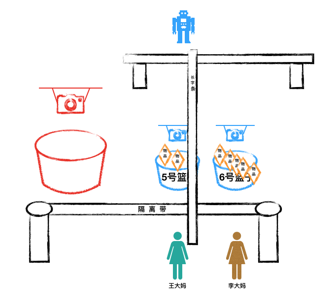
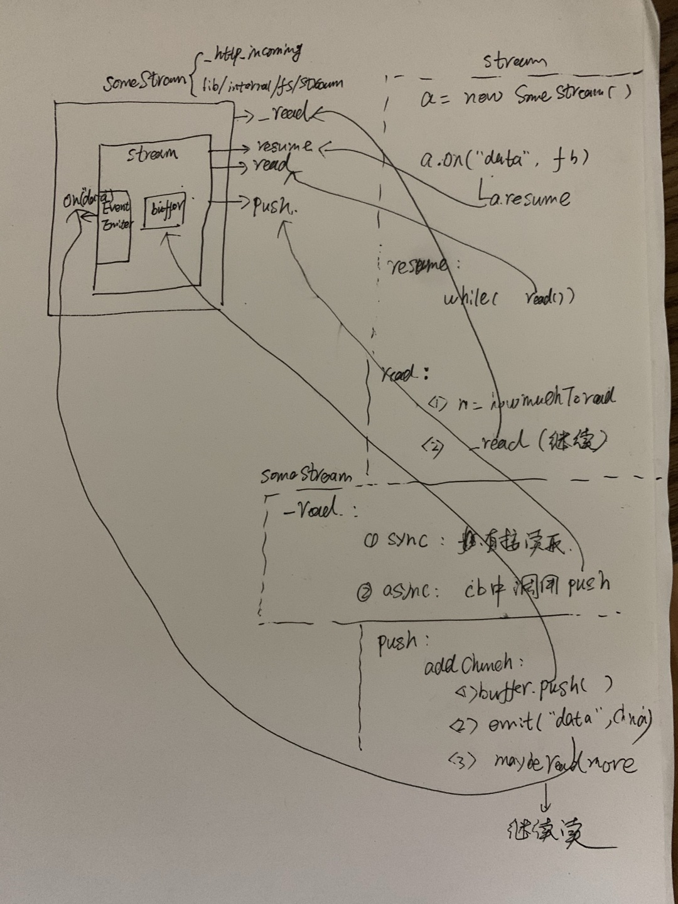

解读点：nodejs服务如何处理并发请求。

[TOC]

# 一.故事
这一天，10010店铺同时来了两位客人，王大妈和李大妈。

俩人前后脚进了店铺，都往门口的“红色篮子”里面写了字条（王大妈的字条在前，李大妈的字条在后）。


机器人马上过来，从篮子里取出两个字条。

机器人先给王大妈分配了一个“蓝色篮子”，在上面写了一个数字“5”；然后在篮子上方放了一个探测器。

接着机器人又给李大妈分配了一个“蓝色篮子”，在上面写了一个数字“6”；然后也在篮子上方放了一个探测器。

做完这些，机器人就走了。


王大妈今天要采购的东西包括：
* 1斤芝麻
* 2斤土豆
* 3斤西红柿

于是王大妈写了3个字条：

* “芝麻，1斤”
* “土豆，2斤”， 
* “西红柿，3个；附带要求：颜色透红，不能酸，...”。

前两个字条比较简单，王大妈写好就放到5号篮子里面了。

但是第三个字条，王大妈附带了很多要求，大概要写几千字（夸张一点）。所以这第三个字条非常长，虽然已经放到了篮子里，但是王大妈还在写。

李大妈今天要采购的东西包括：
* 1瓶矿泉水
* 2斤马铃薯

李大妈写了2个字条“矿泉水，1瓶”，“马铃薯，2斤”，放到6号篮子里。


> 请注意，由于王大妈在同一时间只能写一张字条，因此，她的三个购物需求字条，是有顺序的；同样李大妈的字条也是。

此时机器人过来了。

它先从5号篮子里面取出王大妈的字条，放到面前的长条桌子上；如下图所示。


由于王大妈的第三个字条数据量太大，机器人一次处理不完（避免饿死机制），采取了适当中断处理机制；此时状态如下图所示：


接着，机器人往下走，处理李大妈的字条


王大妈的字条都很小，机器人可以一次处理完。

机器人开始新一轮处理流程，此时状态如下：


> 上图中，那张长长的字条就代表王大妈一直在写的“西红柿”采购要求。

但是此时由于王大妈还没有写完，因此这一轮处理并不能完成。于是机器人循环下去，一直不断循环，处理王大妈的“长字条”。

李大妈突然接到老伴电话，还要再采购
* 3包盐
* 4根火腿肠
* 5两茶叶

于是李大妈又往6号篮子里写了三个字条“盐，3包”，“火腿肠，4根”，“茶叶，5两”。


此时机器人还在一轮又一轮的循环中。在第m轮时，来到了6号篮子，发现6号篮子里面有新需求了，于是把6号篮子里的新字条取出，放到了长桌上。


李大妈的三个新需求，都是简单的需求，机器人在这一轮中可以处理完毕。李大妈拿到了所有的东西，离开商店。

机器人继续新的一轮，又来到王大妈的第三个纸条处，此时状态如下：



王大妈还在写“西红柿”的采购要求。

终于，王大妈写完了，机器人在第n轮处理中，获取到了全部纸条内容，从后面货架上取到了符合要求的西红柿，放到5号篮子里。


王大妈拿到了所有的东西，离开商店。


# 二.分析和对照

按照故事中的场景，我们来设计一下真实nodejs服务器下，两个用户并发请求的情况：
* 有个用户A,并行发送3个请求到服务器；
* 另外一个用户B,并行发送5个请求到服务器。
* 该服务器处理每个请求的时间需要20ms（假设）。
* 其中用户A的第三个请求，body数据较大（对照故事中王大妈对于西红柿的采购要求）。

此时服务器会收到8个请求（8 requests）;但是由于目前都是长连接，所以服务端其实只收到了两个连接（2 tcp connections）。总结一下：
* 建立 2个 tcp connections，用来通信。
* 共计需要处理 8个 requests（第一connection 3个，第二个connection 5个）

## 1.原理分析
上面的故事场景中，10010店铺可以同时服务多个客户。这跟nodejs服务可以处理并发请求是一样的:

店铺中只有一个机器人，但是机器人可以快速移动，快速处理多个客户的交易，在严格顺序执行下，完成了“同时”服务多个客户的目的；nodejs也是一样，服务启动后，只有一个主线程在运行一个无限循环，在cpu高速运转下，按照次序快速处理客户请求（处理时间稍长的就暂时跳过，在下一个循环中再尝试），从而完成了处理“并发”请求的目的。

在这个循环中，libuv一直在观察各个“观察者”。这些观察者是事前注册到libuv的观察者队列里的：

首先通过观察“'服务实例'观察者”，接受新的客户端tcp握手请求。tcp握手请求建立完成后，对每一个tcp链接创建一个新的客户端实例，并注册到libuv中；
然后观察“'客户端实例'观察者”，一旦有数据到来，便执行对应的回调。

## 2.关联
* 红色篮子 --> 服务实例
* 王大妈 --> 用户A访问服务，所建立的tcp链接
* 李大妈 --> 用户B访问服务，所建立的tcp链接
* 5号篮子  --> libuv封装的客户端实例1,用来和用户A通信
* 6号篮子  --> libuv封装的客户端实例2,用来和用户B通信
* 1斤芝麻  --> 用户A发送的第1个请求
* 3个西红柿 --> 用户A发送的超大包请求。
* 4根火腿肠 --> 用户B发送的第4个请求
* 机器人   --> nodejs主线程
# 三. nodejs源码解读
## 1. 解读入口
先来看普通用户启动的服务实例。

```js
// 1.引入net
const net = require('net');
// 2.创建一个服务
const server = net.createServer((c) => {
  ...
  c.on('data', () => {
      console.log('data event');
      c.write('HTTP/1.1 200 OK\r\n');
      c.write('Connection: keep-alive\r\n');
      c.write('Content-Length: 12\r\n');
      c.write('\r\n');
      c.write('hello world!');
  })
});

// 3.监听端口
server.listen(9090, () => {
  console.log('server bound');
});
```

在上一章我们分析过，有请求到来时，最终会经过一系列链路，触发“启动服务时业务写的回调函数”，即上面net.createServer的参数函数。

此时，你的脑海里肯定冒出这样一个疑问，两个用户，8个请求，而且还包含一个超大包的请求，nodejs怎么区分两个用户，并对8个请求分别处理，并返回结果呢？

## 2.源码解读

### 2.1 如何区分两个用户？
在服务启动时，会创建一个对应的libuv服务实例（对应故事中的红色篮子），由libuv监听起来（即在一个无限循环中不断调用uv__io_poll）。

在故事场景中，机器人分别分配了“5号篮子”和“6号篮子”，用来区分王大妈和李大妈。同样，nodejs也会分配两个客户端实例，用来区分用户A和用户B的请求数据。

这个任务就是由uv__io_poll这个函数来做的。我们省略无关代码，从另一个角度解读，nodejs是如何创建两个客户端实例的。（请注意看注释）
```c++
// 文件地址：/deps/uv/src/unix/linux-core.c
void uv__io_poll(uv_loop_t* loop, int timeout) {
  // 取出服务实例
  while (!QUEUE_EMPTY(&loop->watcher_queue)) {
    q = QUEUE_HEAD(&loop->watcher_queue);
    ...
  }
  ...
  // 4.开启一个无限循环，监听是否有新用户到来
  for (;;) {
    ...
      nfds = epoll_wait(loop->backend_fd, events, ARRAY_SIZE(events), timeout);
    ...
        // 新用户来了，便执行回调w->cb。
        // 上一章已经分析，这里的w->cb就是uv__server_io,为每个新用户创建一个libuv客户端实例
          w->cb(loop, w, pe->events);
    ...
  }
}
```
上一章已经分析，这里的w->cb就是uv__server_io,为每个新用户创建一个libuv客户端实例。

> 内核操作系统，会为这两个客户端实例创建两个socket。

这里新创建的libuv客户端实例，就是上面代码片段中（用户启动服务的代码）的"c"。
```js
const server = net.createServer((c) => {
  ...
  c.on('data', () => {
      console.log('data event');
      c.write('HTTP/1.1 200 OK\r\n');
      c.write('Connection: keep-alive\r\n');
      c.write('Content-Length: 12\r\n');
      c.write('\r\n');
      c.write('hello world!');
  })
});
```
> 其实准确来说，这里的“c”是net.js中的Socket实例，是对libuv客户端实例的再一次封装。
> 
> 为了简化，我们可以粗略认定这里的c就是libuv客户端实例。
> 
>libuv客户端实例是如何作为参数c传进来的，请参考上一章的解读

不同的用户，对应不同的“c”;不同的“c”设置各自的监听事件，各自处理自己的数据，互不影响。

也就是说，服务器给每个用户分配了libuv客户端实例，以达到区分的目的。

### 2.2 如何区分8个请求？

上面一节，nodejs通过创建两个客户端实例，来区分不同的用户；然而每个用户都会发出多个请求。怎么区分每一个请求呢？ 

答案是： 我们必须在各自的回调函数中来处理这一切【即c.on('data', callback)】。

伪代码如下：

```js
    const reqData = [];
    // c代表一个用户。
    c.on('data', (chunk) => {
        if(请求结束标识){
            reqData.push(chunk);
            reqData已经完整，开始处理...
            清空reqData
            返回
        }else{
            reqData.push(chunk)
        }
    })
```

由于用户A的所有请求公用一个c，都是在c.on('data', callback)这里触发，只要能区分3个请求的边界，便可以分别处理了。

那么业务开发，怎么判断“请求结束标识”呢？ 接下来，我们从小白的角度来分析一下如何判断。

我们知道，现在的http请求一般有get,post, put,delete等方法，不同的方法类型，有不同的“请求结束标识”。

#### 2.2.1 get请求

我们先来看看一个普通的http请求的结构
```js
1. start line（GET / HTTP/1.1）
2. header1
   header2
   ...
   headerN
3. 
4. body数据（可选）
```

可以看到，一个http包含四部分
1. 起始行，用于表示请求的类型，协议类型和版本
2. 头部信息，比如content-type之类的
3. 空白行，表示请求的元信息已经结束
4. body数据，附带的数据。get，head等类型的请求没有这一部分。


一个http get请求，请求参数一般会放在url后面，body数据为null。

分析到这里，就可以很简单地得出答案了：
对于GET类型的请求，读取到“空白行”就表示结束了，因此，“空白行”就是我们要寻找的“请求结束标识”。

#### 2.2.2 post等带有body的请求

由于post类型的请求，会携带body数据。因此，post类型的“请求结束标识”肯定不是“空白行”；并且post请求，有的body数据只有1kb，有的则高达10Mb甚至更多。

那么我们怎么寻找post类型的“请求结束标识”呢？

按照http标准，对于携带body的请求，要么提供content-length，要么通过“transfer-coding： chunked”的方式。
对于前者，接收方可以通过长度判断数据是否接受完毕；对于后者，则通过接受一个0大小的chunk来判断接受完毕。

因此，对于post这类携带body大小的请求，“content-length”或者“size为0的chunk”，就是我们要寻找的“请求结束标识”。

> 总结：针对不同的请求类型，判断请求结束标识符，便可以区分各个请求。

### 2.3 http解析器的基本概念和作用

从2.2.1和2.2.2小节中，我们大概知道了怎么区分多个请求的边界。但是如果要真的实现起来，将会非常复杂。
如果这种事情nodejs不提供原生的模块来处理，而是交给业务开发人员自己去判断，那么nodejs将会无人问津，无法流行起来。


基于此，nodejs封装了一个native模块http.js。这个模块通过http-parser(node12以后改为llhttp),来解析用户的请求。
http-parser(或者llhttp)实际上是一个有限状态机，不断读取字符，以实现解析请求数据。
很多的nodejs框架以及连带的库（比如koajs + koa-bodyparser），也是基于此做了进一步封装，业务开发其实并不用真正关心。

接下来，我们来看下，http解析器是如何运作的。

> 注：由于我们是解读的nodejs14版本，因此，这里的解析器特指llhttp.

### 2.4 如何触发http解析器？
知道了http解析器的概念和用途，用户头脑中自然会冒出一个疑问：

“一个请求，是如何转给http解析器来处理呢？它是如何运作的呢？”

我们从头开始捋，一层一层剥，看看解析器的运作流程。

目前启动服务的方式无非两种：
* 一种是通过更加底层的net.js启动；
* 另外一个是较为高级的封装方式，即http.js。

其中http.js才使用了http解析器。因此要想捋清http解析器，我们就得看看http.js创建服务以及处理请求的流程。

#### 2.4.1 创建服务，设置回调


首先来看一个使用http.js模块启动的样例：

```js
const http = require('http');

const server = http.createServer((req, res) => {
  console.log('new request');// 某个新请求到来
  req.on('data', (data) => {
    console.log('data received');// 请求的数据到来。
    res.statusCode = 200;
    res.setHeader('Content-Type', 'text/plain');
    res.end('Hello World');
  })
});

server.listen(3000);
```

首先看入口代码http.createServer：
```js
// 文件位置：/lib/http.js
const {...
  Server,
  ...
} = require('_http_server');

function createServer(opts, requestListener) {
  return new Server(opts, requestListener);
}
```
此处的Server，是_http_server.js中的一个构造函数，我们来看下它的代码：

```js
// 文件位置：/lib/_http_server.js
const net = require('net');
...
function Server(options, requestListener) {
  ...
  net.Server.call(this, { allowHalfOpen: true });
  ...
  if (requestListener) {
    this.on('request', requestListener);
  }
  ...
  this.on('connection', connectionListener);
  ...
}
ObjectSetPrototypeOf(Server.prototype, net.Server.prototype);
ObjectSetPrototypeOf(Server, net.Server);
...
module.exports = {
  ...
  Server,
  ...
};
```

可以看到，_http_server.js的Server，做了三件事：
* 调用net.Server（即底层还是依赖net.js模块的Server）；
* 注册请求回调：this.on('request', requestListener);
* 注册新用户回调：this.on('connection', connectionListener);

#### 2.4.2 触发回调，设置解析器
无论是通过net.js启动，还是通过http.js启动，新的链接建立（即“新用户”），都会先触发以下代码：

> 详见上一章“2.4 OnConnection”小节：一个新tcp连接建立后（即一个“新用户”到来后），服务调用了net.js中的onconnection函数。
```js
// 文件位置：/lib/net.js
function onconnection(err, clientHandle) {
  ...
  self.emit('connection', socket);
}
```
这里触发了connection事件。

那么必定有个地方已经注册了connection事件。

我们回忆一下，通过net.createServer创建的服务实例，我们注意到，在net.js中的Server构造函数中，有注册一个connection事件，代码如下：
```js
function Server(options, connectionListener) {
    ...
  if (typeof options === 'function') {
    connectionListener = options;
    options = {};
    this.on('connection', connectionListener);
  } else if (options == null || typeof options === 'object') {
    options = { ...options };

    if (typeof connectionListener === 'function') {
      this.on('connection', connectionListener);
    }
  }
  ...
}
```

然而，很遗憾，通过http.js(http.createServer)创建的服务实例，虽然继承了net.Server, 并没有注册connection事件(调用net.Server时，并没有传回调函数,即上面的代码片段中if ... else if都不满足）。

那到底是哪里注册了connection事件呢？

别着急。在本章2.4.1节最后，我们总结了_http_server.js的Server，做了三件事，其中两个为：
* 注册请求回调：this.on('request', requestListener);
* 注册新用户回调：this.on('connection', connectionListener);

真相就在这里了。http.js 创建的服务实例，自己注册了一个connection事件。回调则是_http_server.js中的connectionListener函数。

我们来看下_http_server.js中的connectionListener是什么。

```js
// 文件位置：/lib/_http_server.js
function connectionListener(socket) {
  defaultTriggerAsyncIdScope(
    getOrSetAsyncId(socket), connectionListenerInternal, this, socket
  );
}

function connectionListenerInternal(server, socket) {
  ...
  socket.server = server;
  const parser = parsers.alloc();// 分配一个解析器
  parser.socket = socket;
  socket.parser = parser;
  ...
  parser.onIncoming = parserOnIncoming.bind(undefined, server, socket, state); // 设置请求到来时的回调
  ...
  if (socket._handle && socket._handle.isStreamBase &&
      !socket._handle._consumed) {
    parser._consumed = true;
    socket._handle._consumed = true;
    parser.consume(socket._handle);// 设置请求流的消费方式
  }
  
}
```

从上面代码看到，当一个新用户了以后，回调函数做了三件事情：

* 分配一个parser（即llhttp解析器）
* 设置请求到来时的回调，并挂在到parser上（供后续方便用）
* 设置请求流的消费方式：parser.consume(socket._handle);

首先是分配解析器。nodejs服务启动时，会先设置1000个大小的解析器池子，当用到的时候就从中取一个。（这部分内容本章节暂不展开，用户只需要知道就行）。

其次，将请求的回调，挂在到parser上。这样当解析头部完成后，就回调用该函数；

最后是设置消费方式。我们看下parser.consume做了啥。

```c++
// 文件位置： /src/node_http_parser.cc
static void Consume(const FunctionCallbackInfo<Value>& args) {
    ...
    stream->PushStreamListener(parser);
  }

// 文件位置： /src/stream_base-inl.h
void StreamResource::PushStreamListener(StreamListener* listener) {
  ...
  listener_ = listener;
}
```
可以看到，主要是将parser赋给了一个变量listener_。

> 可能读者还是没能搞清楚，这最后一步，把parser赋给/src/stream_base-inl.h中的listener_，有啥意义呢？
>
>别着急，我们接着看。

#### 2.4.3 调用解析器
回顾：在上一章中，我们知道，当客户端实例分配后，如果该客户端实例上有用户发起请求，那么将会按照如下链路调用：
uv__stream_io -> uv__read -> stream->read_cb (也就是OnUvRead）

```c++
// 文件位置：/deps/uv/src/unix/stream.c
static void uv__read(uv_stream_t* stream) {
  uv_buf_t buf;
  ...
  while (stream->read_cb
      && (stream->flags & UV_HANDLE_READING)
      && (count-- > 0)) {
    assert(stream->alloc_cb != NULL);

    buf = uv_buf_init(NULL, 0);
    // 分配内存，并没有真正从stream中读数据
    stream->alloc_cb((uv_handle_t*)stream, 64 * 1024, &buf);
    ...
    if (!is_ipc) {
      do {
        // 开始真正从stream中读数据
        nread = read(uv__stream_fd(stream), buf.base, buf.len);
      }
      while (nread < 0 && errno == EINTR);
    } else {
      ...
    }

    if (nread < 0) {
      
    } else if (nread == 0) {
      
    } else {
      ...
      // 已经从stream中读取一个64 * 1024大小的数据，并放到了buf中
      // 此时便可以调用read_cb，通知上层，并把数据传过去
      stream->read_cb(stream, nread, &buf);
      ...
    }
  }
}
```
可以看到，uv__read首先分配一个内存buf，然后从stream流中读取64*1024 = 64k大小的数据。然后把这块数据传给stream->read_cb。

stream->read_cb就是OnUvRead，
```c++
// 文件地址：/src/stream_wrap.cc 
void LibuvStreamWrap::OnUvRead(ssize_t nread, const uv_buf_t* buf) {
  ...
  EmitRead(nread, *buf);
}
```
可以看到，这里就是把读取到的buf数据，继续往上传（即扩散出去，EmitRead）。

```c++
// 文件地址：/src/stream_base-inl.h
void StreamResource::EmitRead(ssize_t nread, const uv_buf_t& buf) {
  DebugSealHandleScope handle_scope(v8::Isolate::GetCurrent());
  if (nread > 0)
    bytes_read_ += static_cast<uint64_t>(nread);
  listener_->OnStreamRead(nread, buf);
}
```

在本章上一节（2.4.2）中，我们留了一个问题还没解答，即：tcp连接建立时，把解析器parser赋给/src/stream_base-inl.h中的listener_，为什么要这么做？

到这里，答案便很清楚了：
是为了请求数据到来时，可以拿到这个parser(即listener_)，进行原始数据解析。

这里的listener_->OnStreamRead(nread, buf),将会触发node_http_parser.cc中的OnStreamRead。（注意，不是/src/stream_base.cc中的OnStreamRead）

```c++
// 文件位置： /src/node_http_parser.cc
void OnStreamRead(ssize_t nread, const uv_buf_t& buf) override {
    ...
    Local<Value> ret = Execute(buf.base, nread);
    ...
  }
Local<Value> Execute(const char* data, size_t len) {
    ...
    if (data == nullptr) {
      err = llhttp_finish(&parser_);
    } else {
      err = llhttp_execute(&parser_, data, len);
      Save();
    }
    ...
  }

```

可以看到，程序开始调用Execute，这个Execute调用llhttp_execute，开始正式解析request请求。

> 小结：服务端收到用户请求后，调用uv__read从stream流上读取数据，传给解析器进行解析。

至此，http解析器（llhttp）是如何被触发的流程，便清晰了。

接下来，我们就更深入一步，了解下它的具体工作原理。

### 2.5 解析器运行原理

而从上面的分析可以看到，传递给解析器的，是从stream中读到的1024 * 64大小的数据。解析器开始对这一块数据进行解析。

那么我们可以得出一个结论：解析器不会调用底层指令，它只是一个普通函数，接受一段数据，然后对它进行结构化分析（解析）。

这一点可以从llhttp的官方样例中得到验证：
```c++
// llhttp官方样例
#include "llhttp.h"

llhttp_t parser;
llhttp_settings_t settings;

/* Initialize user callbacks and settings */
llhttp_settings_init(&settings);

/* Set user callback */
settings.on_message_complete = handle_on_message_complete;

/* Initialize the parser in HTTP_BOTH mode, meaning that it will select between
 * HTTP_REQUEST and HTTP_RESPONSE parsing automatically while reading the first
 * input.
 */
llhttp_init(&parser, HTTP_BOTH, &settings);

/* Parse request! */
const char* request = "GET / HTTP/1.1\r\n\r\n";
int request_len = strlen(request);

enum llhttp_errno err = llhttp_execute(&parser, request, request_len);
if (err == HPE_OK) {
  /* Successfully parsed! */
} else {
  fprintf(stderr, "Parse error: %s %s\n", llhttp_errno_name(err),
          parser.reason);
}
```

在上面样例代码中，传递给llhttp_execute，是“const char* request = "GET / HTTP/1.1\r\n\r\n";”这样一段数据。

这里的解析器本质是一个有限状态，不断解析字符；当解析到特地位置时，便会触发相应的回调。

#### 2.5.1 解析头部
你可能想到的是，当解析完头部时（碰到空白行），应该会触发一个回调吧。

你猜对了，llhttp会触发一个 parserOnHeadersComplete 调用。
> 详细流程为：
>* llhttp解析完头部后，会回调node_http_parser.cc中的on_headers_complete；
>* 接着on_headers_complete会调用_http_common.js中的 parserOnHeadersComplete。
```js
// 文件位置： /lib/_http_common.js
function parserOnHeadersComplete(versionMajor, versionMinor, headers, method,
                                 url, statusCode, statusMessage, upgrade,
                                 shouldKeepAlive) {
  ...
  const ParserIncomingMessage = (socket && socket.server &&
                                 socket.server[kIncomingMessage]) ||
                                 IncomingMessage;

  const incoming = parser.incoming = new ParserIncomingMessage(socket);
  ...
  return parser.onIncoming(incoming, shouldKeepAlive);
}
```
在这里，创建一个IncomingMessage实例，并调用parser.onIncoming。

#### 2.5.2 解析body
我们知道，uv__read一次读取了64k大小的数据；那么这第一次读取，不仅读取了头部，还会读取部分或者全部的body数据。因此，llhttp解析完头部后，会继续解析，然后触发一个parserOnBody。通过断点，我们可以看到：


即，llhttp调用了node_http_parser.cc中的on_body函数。

on_body函数的代码如下：

```c++
// 文件位置：/src/node_http_parser.cc
int on_body(const char* at, size_t length) {
    ...
    Local<Value> cb = obj->Get(env()->context(), kOnBody).ToLocalChecked();
    ...

    Local<Value> argv[3] = ...

    MaybeLocal<Value> r = MakeCallback(cb.As<Function>(),
                                       arraysize(argv),
                                       argv);

    ...
  }

```
可以看到，on_body 调用了一个kOnBody的回调函数。这个函数是什么呢？

> 注意，这里先留一个悬念：为什么要通过MakeCallback来回调cb(即 kOnBody)呢？

这个kOnBody函数，是在初始化解析器池子的时候设置的，代码如下：
```js
// 文件位置：/lib/_http_common.js
// 解析器池子初始化时，设置parser[kOnBody] = parserOnBody;
const parsers = new FreeList('parsers', 1000, function parsersCb() {
  const parser = new HTTPParser();
  ...
  parser[kOnBody] = parserOnBody;
  ...
  return parser;
});
function parserOnBody(b, start, len) {
    ...
    const ret = stream.push(slice);
    ...
  }
}
```
可以看到，这里最终调用了我们熟悉的stream.push(slice);  

> 如果body比较大，uv__read一次读取64k后，没读完，将会继续读取下去，（参见“2.4.3 调用解析器”中uv__read函数中的while循环），触发parserOnBody，往stream中不断添加数据（stream.push(slice)）。

### 2.6 一个完整的请求处理流程
到此，我们知道了一个nodejs服务是如何“识别用户”，“识别请求”的原理了。

尤其是“识别请求”，nodejs引入了解析器（llhttp）,将一个请求分为头部和body分别解析。

那么用户头脑中又会冒出以下疑问：
* 头部和body是如何衔接的呢？
* body数据如果很大，需要多次传输才能完毕，nodejs是如何处理的呢？

#### 2.6.1 解析完头部，触发业务回调
在“2.5.1 解析头部”节中，解析完头部后，便触发了parser.onIncoming。以下是parser.onIncoming的代码：
```js
// 文件位置：/lib/_http_server.js
...
parser.onIncoming = parserOnIncoming.bind(undefined, server, socket, state);
...
function parserOnIncoming(server, socket, state, req, keepAlive) {
  ...
  state.incoming.push(req);

  const res = new server[kServerResponse](req);
  ...
    server.emit('request', req, res);
}
```

可以看到，这里触发了一个request事件。此处的req，就是刚刚创建的IncomingMessage实例

回忆一下，在本章"2.4.1 创建服务，设置回调"小节中，我们设置了一个事件：
```js
// 文件位置：/lib/_http_server.js
...
function Server(options, requestListener) {
  ...
  if (requestListener) {
    this.on('request', requestListener);
  }
  ...
}
```
因此，llhttp解析完头部，调用 parserOnHeadersComplete，parserOnIncoming 后，便触发了request事件。

this.on('request', requestListener)中的requestListener，就是业务代码中的回到函数

```js
// 业务代码
const http = require('http');

const server = http.createServer((req, res) => {
  console.log('new request');// 某个新请求到来
  req.on('data', (data) => {
    console.log('data received');// 请求的数据到来。
    res.statusCode = 200;
    res.setHeader('Content-Type', 'text/plain');
    res.end('Hello World');
  })
});

server.listen(3000);
```

> 小结：
> 1.当接收到一个新的req请求时，首先先读取64k大小的数据，传给llhttp解析。
> 2.llhttp解析完头部后，触发parserOnHeadersComplete，然后调用parserOnIncoming。
> 3.parserOnIncoming则触发一个“request”事件，接着调用业务代码中回调函数（即http.createServer入参函数）。

> 到这里，完成了以下流程：
> 请求到来--> 解析头部--> 调用业务回调
#### 2.6.2 处理业务回调（requestListener）
业务回调requestListener是业务自己写的。也就是说，这里便开始执行业务的代码了。
```js
// 处理get类型请求的requestListener写法
const http = require('http');
const server = http.createServer((req, res) => {
  console.log('new request');
  // 客户端的参数是在头部中的，可以直接在req上取到。
  // 此时可以直接设置内容，并返回给客户端
  res.end('Hello World');
});
server.listen(3000);
```


> 如果仅仅处理get请求，直接这样写，就算完成了整个请求的处理流程了。
>
> 然而，nodejs复杂程度远超过于此。下面我们来看看带有body体的post请求是如何处理的。

如果是post请求，那么怎么获取到客户端请求的body数据呢？（body数据在req上是拿不到的）

为什么req上拿不到数据呢？因为客户端body数据有大有小，因此必须用stream（流）的方式来获取。

下面我们直接展示方法：
```js
// 处理带有body的 requestListener 写法
const http = require('http');
const server = http.createServer((req, res) => {
  console.log('new request');
  // req是个流，通过注册data事件获取数据
  req.on('data', (data) => {
    console.log('data received');
    res.end('Hello World');
  })
});
server.listen(3000);
```

很清晰易懂吧，通过监听req这个流，来获取数据。

在上面的代码片段中，参数req，是/lib/_http_incoming.js中的IncomingMessage实例（并不是客户端实例[socket实例]）。

所以说req是一个readable stream实例，因此它的on方法是有特殊含义的。在req下注册了一个data事件(req.on('data',xx))，会发生什么呢？

我们来看下
```js
//文件位置：/lib/_stream_readable.js
Readable.prototype.on = function(ev, fn) {
  const res = Stream.prototype.on.call(this, ev, fn);
  ...

  if (ev === 'data') {
    ...
      this.resume();
  } else if (ev === 'readable') {
    ...
  }

  return res;
};
```

可以看到，除了调用Stream基类的on注册事件外，还额外调用了this.resume()。

这个this.resume()会在下一个tick中，调用flow方法。
```js
// 文件位置：/lib/_stream_readable.js
function resume(stream, state) {
  if (!state.resumeScheduled) {
    state.resumeScheduled = true;
    process.nextTick(resume_, stream, state);
  }
}
function resume_(stream, state) {
  ...
  flow(stream);
  ...
}
```
> 到这里，完成了以下流程：
> 请求到来--> 解析头部--> 调用业务回调--> 执行业务代码--> 监听data事件--> 往tick队列中注册一个回调（resume_）

#### 2.6.3 关于队列（tick队列和microtask队列）
解析头部，是在“c++世界”完成的；接着会调用业务回调，也就是执行“js世界”中的代码。

也就是说，在这里发生了一次c++/js边界穿越；一般情况下，完成一次边界穿越，js调用栈就清理了一次；

js调用栈清理后，紧接着就回进行任务队列的清理（即清理tick队列和microtask队列）。

按道理，nodejs解析完头部，并且执行完业务回调代码（js）后，便会清理tick队列，也就是会执行resume_，调用flow。

那么真实情况是这样吗？

我们来看下解析完头部后，nodejs是如何完成c++/js边界穿越的。

```c++
// 文件位置：/src/node_http_parser.cc
...
Local<Value> cb = obj->Get(env()->context(),
                               kOnHeadersComplete).ToLocalChecked();
...
{
      InternalCallbackScope callback_scope(
          this, InternalCallbackScope::kSkipTaskQueues);
      head_response = cb.As<Function>()->Call(
          env()->context(), object(), arraysize(argv), argv);
      if (head_response.IsEmpty()) callback_scope.MarkAsFailed();
    }
```

> 这里的cb就是js中的回调parserOnHeadersComplete。

可见，这里创建一个callback_scope（InternalCallbackScope），然后调用业务回调。

业务回调完成后，会触发InternalCallbackScope的close方法。我们来看看这个close方法：

```c++
// 文件位置：/src/api/callback.cc
InternalCallbackScope::~InternalCallbackScope() {
  Close();
  env_->PopAsyncCallbackScope();
}

void InternalCallbackScope::Close() {
  ...
  // 判断本次是否要跳过清理任务队列 skip_task_queues_
  if (env_->async_callback_scope_depth() > 1 || skip_task_queues_) {
    return;
  }
  ...
}

```

此时的skip_task_queues_为true，因此解析完头部后，调用js业务代码后，暂时跳过清理任务队列。

那么什么时候调用呢？
#### 2.6.4 解析body，清理任务队列

在“2.5.2”小节中，我们知道，解析器解析一段body后，触发了parserOnBody，最终调用了stream.push(slice);

push方法会最终调用
addChunk。
```js
function addChunk(stream, state, chunk, addToFront) {
  if (state.flowing && state.length === 0 && !state.sync) {
    ...
  } else {
    // Update the buffer info.
    ...
    // addToFront为false
    if (addToFront)
      state.buffer.unshift(chunk);
    else
      state.buffer.push(chunk);

    ...
  }
  ...
}
```

在req第一段body数据到来时，此处会走到else分支，即仅仅是调用state.buffer.push(chunk)，往stream._readableState.buffer中存放数据，等会下次处理。

到这里为止，又完成了一次c++/js边界穿越，只不过这次穿越是通过MakeCallback完成的。我们断定，这里将会有一次任务队列的清理的机会。我们看代码：

```c++
// 文件位置：/src/api/callback.cc
MaybeLocal<Value> InternalMakeCallback(Environment* env,
                                       Local<Object> resource,
                                       Local<Object> recv,
                                       const Local<Function> callback,
                                       int argc,
                                       Local<Value> argv[],
                                       async_context asyncContext) {
  ...
  // 参数callback就是业务回调函数，在这里调用它
  if (asyncContext.async_id != 0 || domain_cb.IsEmpty()) {
    ret = callback->Call(env->context(), recv, argc, argv);
  } else {
    std::vector<Local<Value>> args(1 + argc);
    args[0] = callback;
    std::copy(&argv[0], &argv[argc], args.begin() + 1);
    ret = domain_cb->Call(env->context(), recv, args.size(), &args[0]);
  }
  ...
  // 调用完成后，明确进行一次Close调用。
  scope.Close();
  ...
}
```
任务队列的执行的时机，就是在scope.Close()中。

在2.6.2小节中，我们碰到过一次Close调用，当时由于不满足条件，因此跳过了任务队列清理。

但是本次，条件满足了（skip_task_queues_为false），将会执行任务队列:
```c++
// 文件位置：/src/api/callback.cc
void InternalCallbackScope::Close() {
  ...
  // 判断是否跳过（skip_task_queues_为false，不跳过）
  if (env_->async_callback_scope_depth() > 1 || skip_task_queues_) {
    return;
  }
  // 获取tick_info
  TickInfo* tick_info = env_->tick_info();
  ...
  // 获取tick队列的处理回调（这是是在进程启动时设置的）
  // env_->tick_callback_function就是/lib/internal/process/task_queue.js中的processTicksAndRejections
  Local<Function> tick_callback = env_->tick_callback_function();
  ...
  // 执行回调
  if (tick_callback->Call(env_->context(), process, 0, nullptr).IsEmpty()) {
    failed_ = true;
  }
}

```
env_->tick_callback_function为什么是processTicksAndRejections呢？我们来看下:
在task_queue.js中，执行以下代码
```js
// 文件位置：/lib/internal/process/task_queue.js
const {
  ...
  setTickCallback,
  ...
} = internalBinding('task_queue');
...
    // Sets the callback to be run in every tick.
    setTickCallback(processTicksAndRejections);
...
};
```
```c++
//文件位置：/src/node_task_queue.cc
static void SetTickCallback(const FunctionCallbackInfo<Value>& args) {
  ...
  env->set_tick_callback_function(args[0].As<Function>());
}
```
因此，这里开始清理2.6.2小节中往往tick队列中设置的回调（process.nextTick(resume_, stream, state);）

#### 2.6.5 执行任务队列的回调函数

通过上一节介绍，我们知道在解析一段body后，任务队列中的回调函数得到了一次执行机会，我们看队列中的一个回调函数resume_（通过process.nextTick(resume_, stream, state);设置）。

resume_会调用flow方法。此时stream的buffer中已经有了数据。

flow方法的关键在于一个无限循环，不断调用read方法来读取数据。

```js
// 文件地址：lib/_stream_readable.js
function flow(stream) {
  const state = stream._readableState;
  debug('flow', state.flowing);
  while (state.flowing && stream.read() !== null);
}
```

stream.read方法，很重要，它的代码如下：

```js
// 文件地址：lib/_stream_readable.js
Readable.prototype.read = function(n) {
  ...
  // 从stream的state的buffer中读取有多少字节数
  n = howMuchToRead(n, state);
  ...
  if (state.ended || state.reading || state.destroyed || state.errored) {
    ...
  } else if (doRead) {
    // 设置状态：state.reading = true 表示从底层资源获取数据；
    // 获取完以后，会自动state.reading = false;(addChunk中可以看到)
    state.reading = true;
    ...
    // 开始从底部资源读取数据，注意这个_read方法是不同业务场景提供的（比如req是_http_incoming.js提供的，fs读取流是/lib/internal/fs/stream.js提供的）
    // 注意：这个方法可能是同步的，也可能是异步的。
    // req中提供的_read什么也没做。
    this._read(state.highWaterMark);
    // If _read pushed data synchronously, then `reading` will be false,
    // and we need to re-evaluate how much data we can return to the user.
    if (!state.reading)
      n = howMuchToRead(nOrig, state);
  }

  let ret;
  if (n > 0)
    // fromList就是从stream的state中的buffer读取数据
    ret = fromList(n, state);
  else
    ret = null;
  ...
  if (ret !== null)
    this.emit('data', ret);

  return ret;
};
```

总结一下stream.read：
1. 调用背后的_read方法，将数据放到stream._readableState.buffer中
2. 从buffer中读取数据，然后通过this.emit('data', ret);将数据传输出去

还记得业务代码中曾经在请求上注册过on('data')事件吗？这里就会触发它的执行。

```js
//业务代码
const http = require('http');
const server = http.createServer((req, res) => {
  console.log('new request');
  // req是个流，通过注册data事件获取数据
  req.on('data', (data) => {
    console.log('data received');
    res.end('Hello World');
  })
});
server.listen(3000);
```

到这里，便完成了body数据一遍解析，一遍触发业务回调的整体流程。


> 注：这个方法是公用的，因此逻辑需要兼容很多地方。
比如可能buffer中已经有数据啦，即使_read没有读数据，本次读取也是可以有数据可处理的；同时，这个方法除了emit data，还会在函数末尾把数据return出去。


> 不过此处的flow中的无限循环read只会运行一次，后续就没有了。因为stream._readableState.buffer中已经没有数据，并且_http_incoming的提供的_read方法也没有读取数据，源码中有解释：
```js
IncomingMessage.prototype._read = function _read(n) {
  if (!this._consuming) {
    this._readableState.readingMore = false;
    this._consuming = true;
  }

  // We actually do almost nothing here, because the parserOnBody
  // function fills up our internal buffer directly.  However, we
  // do need to unpause the underlying socket so that it flows.
  if (this.socket.readable)
    readStart(this.socket);
};
```

>注意这段注释：【We actually do almost nothing here, because the parserOnBody function fills up our internal buffer directly】
>
>意思是，_http_incoming提供的_read不会真的从底部读取数据，因为uv__io_poll会自动触发。


可是仔细想想，这背后的过程是怎么样的呢？如果是一个超大的body，可能需要分多次传输。这些数据是怎么流转的呢？

下面我们来详细解析一下。

###### req的body数据的流转过程。


##fasdfasd


我们来看下证据：

我们知道，有数据到来时，会走一下流程：uv_read--> read_cb-->llhttp -->parserOnBody-->stream.push-->addChunk。

又到了addChunk。此次会走if分支，直接将数据emit出去。
```js
function addChunk(stream, state, chunk, addToFront) {
  if (state.flowing && state.length === 0 && !state.sync) {
    // Use the guard to avoid creating `Set()` repeatedly
    // when we have multiple pipes.
    if (state.multiAwaitDrain) {
      state.awaitDrainWriters.clear();
    } else {
      state.awaitDrainWriters = null;
    }
    stream.emit('data', chunk);
  } else {
    // Update the buffer info.
    state.length += state.objectMode ? 1 : chunk.length;
    if (addToFront)
      state.buffer.unshift(chunk);
    else
      state.buffer.push(chunk);

    if (state.needReadable)
      emitReadable(stream);
  }
  maybeReadMore(stream, state);
}
```


> 小结：
> 1.对于大body类型的请求，第一次读取64k数据，其中的body部分，会通过this.resume()，调用flow方法，最终触发“data”事件。(emit('data'))；
> 
> 2.后续第二次，第三次，会通过node_http_parser.cc中的on_body来调用stream.push(slice)，最终触发“data”事件。

到此，我们就知道了，对于一个用户内的不同请求，是通过llhttp解析器来区分不同的请求的。


> 对应于故事中，王大妈的第一个纸条，信息量比较小，机器人一次就能读取完毕，知道王大妈需要采购“芝麻，1斤”。


# 四.总结：

nodejs服务只有一个主线程在处理逻辑;但是通过libuv loop循环，精确区分每一个用户；同时通过http解析器区分同一个用户下的不同请求。最终实现处理并发请求的能力。

最后，我们把故事中的场景，放到nodejs的源码程序中，得到一张处理序列图，希望能够把nodejs抽象复杂的处理逻辑，变得直观一些。


另外一张是stream flow的过程图
