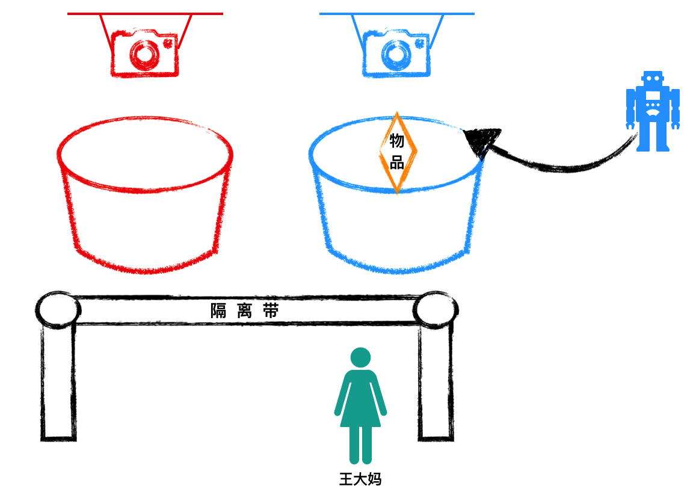
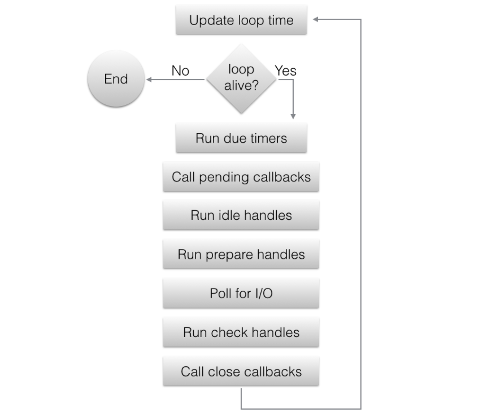

解读点：nodejs服务如何处理客户端请求。

[TOC]


# 一.故事
现在10010店铺正式开业了。

这天早上，有一位顾客王大妈来到店铺，想要买二斤黄豆。

王大妈一进门，就看到有一道隔离带拦住了她。隔离带后面有一个“红色篮子”，还有一张告示。

告示牌上面写着：
> 请新来的顾客，把您的姓名写在纸条上，放到“红色篮子”里。
> 
> 机器人会自动过来处理的。


王大妈把自己的名字写在了一张字条上，放到了“红色篮子”里。


“红色篮子”正上方，有一个探测器，王大妈刚放到“红色篮子”里，立马就从里面走过来一个机器人，把“红色篮子”里的字条拿起来。


同时机器人从旁边取了一个“蓝色篮子”，在上面写了一个数字“1”（王大妈是第一位顾客)，然后把“蓝色篮子”放一边，然后在“蓝色篮子”上方也放置了一个新的探测器。放完探测器，机器人转身离开了。


这时候，王大妈看到旁边还有个告示牌，说：
> 请分配到“蓝色篮子”的顾客，把你们的需求写在纸条上，放进属于自己的“蓝色篮子”里。
> 机器人会自动处理的。

于是王大妈又写了一张纸条，上面写着：“黄豆，2斤”，放到了分配给自己的篮子里。

由于有探测器，刚放进去，机器人立马过来了，拿起字条，转身走到后面。

过了一会，机器人回来了，它把2斤黄豆放到了贴有“1”的“蓝色塑料篮子”里。


王大妈拿到了黄豆，从店铺里走出来。门店恢复无客人的场景,等待下一位客人的到来。


# 二.分析和对照
在日常生活中，一个店铺在同一时间，会有很多客人光顾。

并且有一小部分客人只是逛逛就走了，并没有买东西。

因此店铺要精细化运营，要解决以下两个问题：
* 部分客人只是逛逛，并不采购。
* 同一时间很多客人采购。

如果每来一个客人都分配一个导购，将会给店铺经营带来极大的人力成本。

因此，一个理想的模式是，只有在确定某个客人真正要买东西的时候，才分配一名导购给他。

如果确定了“客人要买东西，而且知道了要买什么”，那么剩下的工作就非常“迅速”，夸张一点说，基本不用浪费时间（这个概念希望读者记一下）。

因此，基于这个分析，“10010百货铺”的运营模式就成了上线故事情节中的那样：

* 只有一个机器人
* 客人到店后，如果确定要买东西，就写上自己的名字，放到“红色篮子”里，如果不买，就不用写。
* 机器人检测到有人要买东西，就给他/她分配一个“蓝色篮子”
* 客人再把自己的采购需求放到“蓝色篮子”里
* 机器人完成采购，放到“蓝色篮子里”，客户离开。

## 1.原理分析
我们在第一章中分析了nodejs服务启动后，通过net.createServer()创建了一个libuv服务实例（背后绑定了一个socket）。这个服务实例，就对应故事中的“红色篮子”。
然后把这个服务实例下的观察者（watcher）注册到libuv loop下的watcher_queue队列中；这个动作类似于故事中“红色篮子”上方安装一个探测器，实时探测“红色篮子”的变化。

等有客户端通过三次握手，建立一个tcp链接后，nodejs服务会建立一个libuv客户端实例（背后也绑定了一个socket）。这个客户端实例，就类似于故事中的“蓝色篮子”。
同样的，这个客户端实例下的观察者（watcher），也会被注册到libuv loop下的watcher_queue队列中。类似于故事中“蓝色色篮子”上方安装一个探测器，实时探测“蓝色篮子”的变化。

## 2.关联
我们来看下这个故事情节中的事物，和nodejs服务器之间的关联：

* 王大妈    --> 用户访问服务，所建立的tcp链接
* 黄豆，2斤 --> body：{material: "黄豆", number: "2斤"}
* 机器人   --> nodejs主线程（libuv）
* 红色篮子 --> libuv服务实例（对应一个socket）,负责监听是否有新的tcp握手请求。
* 蓝色篮子 --> 在服务器端为每一个用户创建一个libuv客户端实例（对应一个socket），用于和客户端进行数据通信。

# 三. nodejs源码解读
## 1. 解读入口
服务启动以后，服务实例对应的观察者被放进了libuv的watcher_queue队列中。接下来我们来解读程序是怎么遍历循环这个观察者队列的。


我们先来看进程启动的简要步骤：

* node_main.cc（入口）：调用node.cc中的Start
* node.cc：Start函数初始化一个main_instance，然后调用main_instance.Run()
* node_main_instance.cc：Run函数开启一个无限循环，不断调用uv_run();
> nodejs使用C++开发的。因此nodejs服务，就是一个C++的进程。
> 
> 这个进程中，只有一个主线程在跑。
> (线程池的概念我们后续再展开)
>
> 当然实际代码逻辑远远超过这些，进程启动的详细过程在后面章节中详细介绍。

可以看到，进程启动起来以后，在不断地调用uv_run，那么uv_run是干啥呢？

```C++
// 位于/src/deps/uv/src/unix/core.c
int uv_run(uv_loop_t* loop, uv_run_mode mode) {
  ...

  while (r != 0 && loop->stop_flag == 0) {
    uv__update_time(loop);
    uv__run_timers(loop);
    ran_pending = uv__run_pending(loop);
    uv__run_idle(loop);
    uv__run_prepare(loop);

    timeout = 0;
    if ((mode == UV_RUN_ONCE && !ran_pending) || mode == UV_RUN_DEFAULT)
      timeout = uv_backend_timeout(loop);

    uv__io_poll(loop, timeout);
    uv__run_check(loop);
    uv__run_closing_handles(loop);
    ...
  }
  ...
}
```

是不是很熟悉，其实就是libuv官网中的这张图


我们重点关注uv__io_poll，这个节段就是处理一个tcp请求的核心所在。

## 2. 源码解读
### 2.1 uv__io_poll
uv__io_poll封装了平台的差异性（linux下使用epoll， mac下使用kqueue, windows下是iocp）。我们以linux的epoll为例来解读。

```c++
// 文件地址：/deps/uv/src/unix/linux-core.c
void uv__io_poll(uv_loop_t* loop, int timeout) {
  // 1.设置一堆必要的变量
  ...
  // 2.从loop下的watcher_queue依次取出一个观察者对象（在上一章节nodejs服务启动时，曾经创建了一个服务实例，并把该服务实例的观察者挂载到了loop->watcher_queue下）
  while (!QUEUE_EMPTY(&loop->watcher_queue)) {
    q = QUEUE_HEAD(&loop->watcher_queue);
    ...

    w = QUEUE_DATA(q, uv__io_t, watcher_queue);
    ...
      // 3.注册到epoll中
      epoll_ctl(loop->backend_fd, op, w->fd, &e)
    ...
  }
  ...
  // 4.开启一个无限循环，监听epoll
  for (;;) {
    ...
      // 4.1.调用epoll_wait，获取有请求到来的服务实例
      nfds = epoll_wait(loop->backend_fd, events, ARRAY_SIZE(events), timeout);
    ...
    // 4.2.依次调用服务实例的回调函数：w->cb
    for (i = 0; i < nfds; i++) {
      pe = events + i;
      fd = pe->data.fd;
      ...
      w = loop->watchers[fd];

      ...
          w->cb(loop, w, pe->events);
      ...
    }
    ...
  }
}

```

我们把以上代码中的注释集中起来,看一下uv__io_poll的工作流程：
* 1.设置一堆必要的变量
* 2.从loop下的watcher_queue依次取出一个观察者对象（在上一章节nodejs服务启动时，曾经创建了一个服务实例，并把该服务实例的观察者挂载到了loop->watcher_queue下）
* 3.注册到epoll中
* 4.开启一个无限循环，监听epoll
  * 4.1 调用epoll_wait，获取有请求到来的服务实例
  * 4.2.依次调用回调函数：w->cb

> 注：为了简单易懂，以上分析仅仅以tcp请求为例。

此时的观察者队列中，只有一个服务实例的观察者。

部分读者可能会有疑问，明明只有一个，为什么不直接把这服务实例注册到epoll中，还非得搞一个while循环，再加一个for循环，不是搞复杂了吗？

难道除了我的这个nodejs服务实例，还有别的需要监听关注吗？

答案是yes。

但是背后的设计理念远不止这一点, 我们看下主要的几个原因:

* 首先一个nodejs进程，可以启动多个不同的服务实例(不过最佳实践是只启动一个)
  >const svr1 = net.createServer(cb1);
  >const svr2 = net.createServer(cb2);
  >svr1.listen(8080);
  >svr2.listen(9090)
  >
  >svr1和svr2是两个完全不相关的服务，但是却跑在一个nodejs进程中，共用一个libuv。
* 每个服务实例，可能会访问其他服务，会产生很多请求型的socket需要监听。
* libuv虽然是为nodejs而诞生的，但是它现在已经成为通用的i/o库，被更多的产品使用（ Node.js, Luvit, Julia, pyuv, and others），这就要求它必须兼容所有的应用形式。

所以，我们的服务实例虽然只有一个，但还是会统一放进libuv的观察者队列中去，由libuv统一去处理。

> 对照关联：
> 回忆一下故事情节中的“红色篮子”的作用。我们的服务实例的观察者对象（tcp->io_watcher）就相当于故事中的“红色篮子”。
### 2.2 w->cb

在上一节中，在有tcp连接建立时，程序调用了w->cb。这个回调函数cb是什么呢？

在第一章中，服务启动时，我们分析了listen最终调用了uv_tcp_listen。我们这里再把那段代码贴出来看看
```C++
// 文件地址： /deps/uv/src/unix/tcp.c
int uv_tcp_listen(uv_tcp_t* tcp, int backlog, uv_connection_cb cb) {
  ...
  if (listen(tcp->io_watcher.fd, backlog))
    return UV__ERR(errno);

  tcp->connection_cb = cb;
  tcp->flags |= UV_HANDLE_BOUND;
  ...
  // 设置cb = uv__server_io
  tcp->io_watcher.cb = uv__server_io;
  uv__io_start(tcp->loop, &tcp->io_watcher, POLLIN);

  return 0;
}
```
> 注：stream->connection_cb的stream和tcp->connection_cb的tcp是一个东西。

看看上面代码中的有注释的那一行代码（tcp->io_watcher就是本章节分析中的w），可以看出：

这个回调函数cb就是uv__server_io。

> 小结：
> 有tcp连接建立时，程序会调用uv__server_io。

在故事中，当机器人检测到有人往“红色篮子”里放字条时，机器人分配了一个“蓝色篮子”，并安装了一个探测器。那么接下来nodejs程序也会执行类似的两个操作。

uv__server_io是stream.c中的一个方法，我们来看下它的代码：
```js
// 文件地址：/src/deps/uv/src/unix/stream.c
void uv__server_io(uv_loop_t* loop, uv__io_t* w, unsigned int events) {
  ...
    err = uv__accept(uv__stream_fd(stream));
    ...
    stream->accepted_fd = err;
    stream->connection_cb(stream, 0);

    ...
}
```

这段代码有两个重要的函数调用： 
* uv__accept(uv__stream_fd(stream))
* stream->connection_cb(stream, 0)。

这两个函数加起来，作用如下：
* 创建一个客户端实例，类似于分配一个“蓝色篮子”
* 将客户端实例的观察者（watcher）注册到libuv loop的watcher_queue中，类似于给“蓝色篮子”安装探测器

首先看uv__accept(uv__stream_fd(stream))：

这行代码表示，接受客户端请求，在底层创建一个socket（并把新创建的socket的fd，临时保存在服务实例下）

然后再看stream->connection_cb(stream, 0)：

这行代码，会把新创建的客户端socket，进行封装，并交给libuv观测。

我们来看下stream->connection_cb这个函数，是怎么把新创建的客户端socket封装，并注册到libuv下的。

### 2.3 stream->connection_cb

首先看下stream->connection_cb到底是什么。
回顾第一章中，监听端口的代码：
```c++
// 文件： /src/tcp_wrap.cc
...
void TCPWrap::Listen(const FunctionCallbackInfo<Value>& args) {
  ...
  int err = uv_listen(reinterpret_cast<uv_stream_t*>(&wrap->handle_),
                      backlog,
                      OnConnection);
  ...
}
...
// 文件：/deps/uv/src/unix/stream.c
int uv_listen(uv_stream_t* stream, int backlog, uv_connection_cb cb) {
  ...
    err = uv_tcp_listen((uv_tcp_t*)stream, backlog, cb);
  ...
}

```

可以看到，它调用了uv_listen，并传入了一个参数OnConnection,然后参数传递给uv_tcp_listen。

```C++
// 文件： /deps/uv/src/unix/tcp.c
int uv_tcp_listen(uv_tcp_t* tcp, int backlog, uv_connection_cb cb) {
  ...
  if (listen(tcp->io_watcher.fd, backlog))
    return UV__ERR(errno);

  tcp->connection_cb = cb;
  tcp->flags |= UV_HANDLE_BOUND;
  ...
  tcp->io_watcher.cb = uv__server_io;
  uv__io_start(tcp->loop, &tcp->io_watcher, POLLIN);

  return 0;
}
```

在这里，我们看到，tcp->connection_cb = cb;  这里的cb就是uv_listen(reinterpret_cast<uv_stream_t*>(&wrap->handle_),backlog,OnConnection)中的OnConnection。

> 小结：
> 收到客户端请求后，创建一个客户端socket，然后调用stream.connection_cb。
> stream.connection_cb就是OnConnection

> 注：stream->connection_cb的stream和tcp->connection_cb的tcp是一个东西。

### 2.4 OnConnection
OnConnection是/src/connection_wrap.cc下的一个函数，代码如下：

```c++
// 代码位置：/src/connection_wrap.cc
void ConnectionWrap<WrapType, UVType>::OnConnection(uv_stream_t* handle,int status) {
  ...
    ...
    uv_stream_t* client = reinterpret_cast<uv_stream_t*>(&wrap->handle_);
    // 注意这里是uv_accept，和之前的uv__accept不同。
    if (uv_accept(handle, client))
      return;

    client_handle = client_obj;
  ...

  Local<Value> argv[] = { Integer::New(env->isolate(), status), client_handle };
  wrap_data->MakeCallback(env->onconnection_string(), arraysize(argv), argv);
}
```
这里的代码比较晦涩难懂，不过我们来简要概括一下：
* 新建一个libuv 客户端实例对象。
* uv_accept(handle, client)： 给新建的客户端实例对象设置fd（即关联背后的socket）。只有关联了fd，才能交给libuv管理。
  > 在2.2节中，我们有分析到，新创建的socket的fd临时保存在了服务实例下（stream->accepted_fd = err，err就是新的socket的fd, stream就是这里的handle。）（变量命名的跳跃性，是读者面临的困扰之一）
* wrap_data->MakeCallback(env->onconnection_string(), arraysize(argv), argv)：
  把客户端实例对象，作为参数，传给net.js中的onconnection

那么用户可能会问：
为什么说MakeCallback(env->onconnection_string()），就是调用net.js中的onconnection函数呢？

带着这个问题，我们来继续分析。

在第一章2.2.1小节中，分析启动服务时，有解读过以下代码：
```js
// 文件： /lib/net.js
function setupListenHandle(address, port, addressType, backlog, fd, flags) {
  ...
      rval = createServerHandle(address, port, addressType, fd, flags);
    ...
    this._handle = rval;
  ...

  this._handle.onconnection = onconnection;
  ...
  const err = this._handle.listen(backlog || 511);

  ...
}
```
这里有一行代码“this._handle.onconnection = onconnection;”

即把net.js中的onconnection函数，赋给了this._handle；这里的this._handle就是我们的服务器实例。
> 小结：
> 服务实例有客户端请求时，创建一个客户端socket，然后调用net.js中的onconnection

### 2.5 net.js中的onconnection

```js
// 文件地址：/lib/net.js
function onconnection(err, clientHandle) {
  ...
  // 封装一个Socket实例对象（该socket是更高级别封装，供js使用）
  const socket = new Socket({
    handle: clientHandle,
    allowHalfOpen: self.allowHalfOpen,
    pauseOnCreate: self.pauseOnConnect,
    readable: true,
    writable: true
  });
  ...
  self.emit('connection', socket);
}
```
> 注：从上面代码中，我们看到，新封装的Socket实例对象，其handle指向了clientHandle，实现了对C++世界中client socket的关联。

onconnection比较简单，做了两件事：
* 创建一个Socket实例
* 触发connection事件，传入刚刚创建的socket对象。

创建Socket实例的过程非常重要，也就是在这里，把新建的libuv客户端实例交给了libuv管理。

我们来看下Socket这个构建函数：
在Socket初始化的时候，有调用一个read,不过指明读取0个长度
```js
// 文件地址：/lib/net.js
// options.handle就是clientHandle
// 赋值给socket下的_handle，以备后用
function Socket(options) {
  this._handle = options.handle;
  ...
  // 接着调用read, 0表示不读取内容。
  this.read(0);
}
```

由于socket继承了Stream，因此这里的read是Stream下的一个方法；由于是读取，因此我们去/lib/_stream_readable.js中找到read方法。

```js
// 文件地址：/lib/_stream_readable.js
Readable.prototype.read = function(n) {
  ...
  this._read(state.highWaterMark);
}
```
而这个this._read就是net.js中构建函数Socket的一个原型链方法

```js
// 文件地址：/lib/net.js
Socket.prototype._read = function(n) {
  debug('_read');
  ...
    tryReadStart(this);
  ...
};
...
function tryReadStart(socket) {
  ...
  const err = socket._handle.readStart();
  ...
}
```

可以看到，这里最终调用了socket._handle.readStart。Socket构建函数中“this._handle = options.handle;”，表明了_handle是options.handle；而options.handle就是clientHandle。

> 小结：
> libuv服务实例收到客户端请求后，创建一个libuv客户端实例。
> 然后把libuv客户端实例传递给net.js中的Socket构建函数。
> Socket构建函数在初始化时，调用了libuv客户端实例的readStart方法。


### 2.6 libuv客户端实例的ReadStart方法
```C++
// 文件地址：/src/stream_wrap.cc
int LibuvStreamWrap::ReadStart() {
  return uv_read_start(stream(), [](uv_handle_t* handle,
                                    size_t suggested_size,
                                    uv_buf_t* buf) {
    static_cast<LibuvStreamWrap*>(handle->data)->OnUvAlloc(suggested_size, buf);
  }, [](uv_stream_t* stream, ssize_t nread, const uv_buf_t* buf) {
    static_cast<LibuvStreamWrap*>(stream->data)->OnUvRead(nread, buf);
  });
}
```
> 注意这里，uv_read_start的第2，3个参数，都是函数。在uv_read_start代码中，将会被分别赋给stream->read_cb， stream->alloc_cb

我们来看看uv_read_start的逻辑。

uv_read_start源码分析：
```C++
// 文件地址：/src/deps/uv/src/unix/stream.c
// 这里的stream，其实就是libuv客户端实例。
int uv_read_start(uv_stream_t* stream, uv_alloc_cb alloc_cb, uv_read_cb read_cb) {
  ...
  stream->read_cb = read_cb;
  stream->alloc_cb = alloc_cb;
  uv__io_start(stream->loop, &stream->io_watcher, POLLIN);
  ...
}
```
uv__io_start我们就比较清晰了，它就是把libuv客户端实例的观察者（io_watcher）挂载到libuv的loop下的watcher_queue中，以便在uv__io_poll阶段，被epoll关注。

到此为止，libuv客户端实例算是成功注册到libuv中啦。

> 对比故事中的情节，机器人给王大妈的“蓝色篮子”放置好了探测器。

### 2.7 tcp连接建立后，开始接收客户端传输的数据

故事中的情节中，机器人给王大妈分配好篮子，并装好探测器后，王大妈可能有两种选择：
* 1.临时决定不采购东西，离开店铺
* 2.把要购买的东西写下来，放进分配给自己的“蓝色篮子”里面。

如果是第一种情况，那么机器人过一定时间后，会把1号“蓝色篮子”回收，对应于服务器会把tcp链接销毁。

本书主要分析第二种情况。

王大妈把要买的东西“黄豆,2斤”放到“蓝色篮子”里。
> 这个动作，在nodejs服务中，相当于：
> 客户端和nodejs服务器建立tcp连接后，开始发送数据给nodejs服务器。

只不过，此时客户端和服务器之间用来通信的socket，是刚刚创建的libuv客户端实例背后绑定的socket。

> 一个nodejs服务实例（背后对应一个socket），也就是故事中的“红色篮子”；它主要负责接收不同的客户端请求。
> 每来一个客户端tcp连接请求，服务器会分配一个客户端socket，并封装为libuv客户端实例，也就是故事中的“蓝色篮子”。
> 后续和每个客户端的通信，都是基于这个客户端socket，即故事中，王大妈和机器人后续都是通过“蓝色篮子”来完成交易。

nodejs服务主线程的无限循环依然在进行，此时的watcher_queue中，不止有服务实例的观察者，还有新创建的libuv客户端实例对应的观察者。

我们再把“2.1 uv__io_poll”节中的代码片段贴出来：
```c++
// 文件地址：/deps/uv/src/unix/linux-core.c
void uv__io_poll(uv_loop_t* loop, int timeout) {
  // 1.设置一堆必要的变量
  ...
  // 2.从loop下的watcher_queue依次取出一个观察者对象（在上一章节nodejs服务启动时，曾经创建了一个服务实例，并把该服务实例的观察者挂载到了loop->watcher_queue下）
  while (!QUEUE_EMPTY(&loop->watcher_queue)) {
    q = QUEUE_HEAD(&loop->watcher_queue);
    ...

    w = QUEUE_DATA(q, uv__io_t, watcher_queue);
    ...
      // 3.注册到epoll中
      epoll_ctl(loop->backend_fd, op, w->fd, &e)
    ...
  }
  ...
  // 4.开启一个无限循环，监听epoll
  for (;;) {
    ...
    // todo 断点确定一下epoll_wait是否是走这个分支
      // 4.1.调用epoll_wait，获取有请求到来的服务实例
      nfds = epoll_wait(loop->backend_fd,
                        events,
                        ARRAY_SIZE(events),
                        timeout);
    ...
    // 4.2.依次调用服务实例的回调函数：w->cb
    for (i = 0; i < nfds; i++) {
      pe = events + i;
      fd = pe->data.fd;
      ...
      w = loop->watchers[fd];

      ...
          w->cb(loop, w, pe->events);
      ...
    }
    ...
  }
}

```

* 无限循环从watcher_queue中取出libuv客户端实例的观察者，注册到epoll中。并进入epoll_wait阶段。

* 一旦客户端发送了真实的数据，epoll_wait就会返回。
* 然后调用libuv客户端实例对应的回调w->cb()

那么libuv客户端实例对应的回调函数是什么呢？

在本章2.2节中，我们知道，服务实例对应的回调（w->cb）是uv__server_io，那么libuv客户端实例对应的回调，是不是也是uv__server_io呢？

答案为否。

我们来分析一下原因。

* 无论是libuv服务实例，还是libuv客户端实例，nodejs都会基于stream类进行封装，二者本质上没什么差别。

* 一个普通的stream，w->cb就是指uv__stream_io；
  
* 如果是服务实例，会额外调用listen。listen过程中（uv_tcp_listen）会用uv__server_io覆盖w->cb。

客户端通信时，由于w->cb没有被覆盖，所以此时的w->cb就是 uv__stream_io。
### 2.8 uv__stream_io

```c++
// 文件地址：/deps/uv/src/unix/stream.c
static void uv__stream_io(uv_loop_t* loop, uv__io_t* w, unsigned int events) {
  ...
  if (events & (POLLIN | POLLERR | POLLHUP))
    uv__read(stream);
  ...
}
...
static void uv__read(uv_stream_t* stream) {
  ...
  count = 32; // 最多读32次，防止【一个客户传输数据过快过多，将libuv loop困在这一个客户上，而其他用户得不到执行的机会】现象。
  ...
  while (stream->read_cb
      && (stream->flags & UV_HANDLE_READING)
      && (count-- > 0)) {
        ...
        stream->read_cb(stream, UV_ENOBUFS, &buf);
        ...
      }
  ...
```
可见，uv__stream_io会调用stream->read_cb；

在2.6小节中，我们知道stream.read_cb其实是
```c++
// 文件地址：/src/stream_wrap.cc 
[](uv_handle_t* handle, size_t suggested_size, uv_buf_t* buf) {
    static_cast<LibuvStreamWrap*>(handle->data)->OnUvAlloc(suggested_size, buf);
  }, [](uv_stream_t* stream, ssize_t nread, const uv_buf_t* buf) {
    static_cast<LibuvStreamWrap*>(stream->data)->OnUvRead(nread, buf);
  }

void LibuvStreamWrap::OnUvRead(ssize_t nread, const uv_buf_t* buf) {
  ...
  EmitRead(nread, *buf);
}
```
可以看出，我们调用stream->read_cb，其实是在调用OnUvRead，并触发EmitRead(nread, *buf);

```C++
// 文件地址：/src/stream_base-inl.h
void StreamResource::EmitRead(ssize_t nread, const uv_buf_t& buf) {
  DebugSealHandleScope handle_scope(v8::Isolate::GetCurrent());
  if (nread > 0)
    bytes_read_ += static_cast<uint64_t>(nread);
  listener_->OnStreamRead(nread, buf);
}
// 文件地址：/src/stream_base.c
void EmitToJSStreamListener::OnStreamRead(ssize_t nread, const uv_buf_t& buf_) {
  ...
  stream->CallJSOnreadMethod(nread, buf.ToArrayBuffer());
}


MaybeLocal<Value> StreamBase::CallJSOnreadMethod(ssize_t nread, Local<ArrayBuffer> ab, size_t offset, StreamBaseJSChecks checks) {
  ...

  Local<Value> onread = wrap->object()->GetInternalField(StreamBase::kOnReadFunctionField);
  ...
  return wrap->MakeCallback(onread.As<Function>(), arraysize(argv), argv);
}

void StreamBase::AddMethods(Environment* env, Local<FunctionTemplate> t) {
  ...
  t->PrototypeTemplate()->SetAccessor(
      FIXED_ONE_BYTE_STRING(env->isolate(), "onread"),
      BaseObject::InternalFieldGet<
          StreamBase::kOnReadFunctionField>,
      BaseObject::InternalFieldSet<
          StreamBase::kOnReadFunctionField,
          &Value::IsFunction>);
}
```

```js
// 文件地址：/lib/net.js
function initSocketHandle(self) {
  ...
    self._handle.onread = onStreamRead;
    ...
  }
}

// 文件地址：/lib/internal/stream_base_commons.js
function onStreamRead(arrayBuffer) {
  ...
  result = stream.push(buf);
  ...
}
```
> 小结：read_cb最终会调用self.push(buffer);

self.push就是/lib/_stream_readable.js中的方法：

```js
// 文件地址：/lib/_stream_readable.js
Readable.prototype.push = function(chunk, encoding) {
  return readableAddChunk(this, chunk, encoding, false);
};
...
function readableAddChunk(stream, chunk, encoding, addToFront) {
  ...
        addChunk(stream, state, chunk, true);
  ...
}
...
function addChunk(stream, state, chunk, addToFront) {
    ...
    stream.emit('data', chunk);
    ...
```

到此，触发了一个'data'事件。这个事件是在哪里注册呢？

答案就是用户自己写的业务代码：
```js
// 1.引入net
const net = require('net');
// 2.创建一个服务
const server = net.createServer((c) => {
  ...
  c.on('data', () => {
      console.log('data event');
      c.write('HTTP/1.1 200 OK\r\n');
        c.write('Connection: keep-alive\r\n');
        c.write('Content-Length: 12\r\n');
        c.write('\r\n');
        c.write('hello world!');
  })
});

// 3.监听端口
server.listen(9090, () => {
  console.log('server bound');
});
```
> 注：这里的c，就是net.js中创建的Socket实例，该实例下面的_handle指向libuv客户端实例。

业务js逻辑开始接手。

# 四.总结：
服务启动后，libuv便开始执行一个无限循环，监听watcher_queue队列里的观察者。

没有客户访问时，这个watcher_queue队列中只有一个服务实例的观察者。libuv通过监听这个观察者，判断是否有新tcp三次握手建立。

一旦有新用户到来，程序就会建立一个新的socket,代表客户端，并封装成为libuv客户端实例，用于和它进行后续的数据通信。同时把他注册到libuv下监听起来。

这样watcher_queue队列中，就有两个观察者：一个是服务实例自身的观察者，一个是libuv客户端实例的观察者；libuv在循环阶段会把它俩都注册到epoll中。

客户端发送数据后，内核激活epoll_wait，便会调用libuv客户端实例对应的回调。回调（uv__stream_io）最终触发一个'data'事件，激活业务js中的代码逻辑。