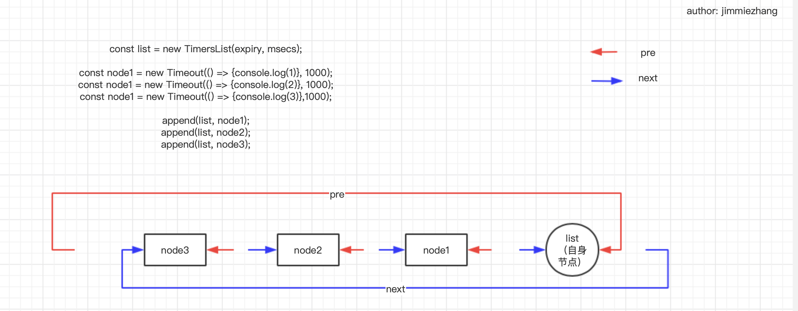

解读点：timer的运行原理。

[TOC]

# 一.故事
接待顾客，是10010店铺最主要的功能；从外人看来，这就是店铺的全部。

然而一个店铺要正常运转，它内部还会有很复杂的流程，比如进货，货物加工处理，摆放货物，客户交易后的后续处理等等。

举个简单的例子：
有个特殊顾客来买便当，要求加热；10010店铺的机器人会把便当放进微波炉加热3分钟。等3分钟一到，机器人才能把便当交给顾客。

# 二.分析和对照

常见的timer有：
* setTimeout
* setImmediate
* setInterval
## 1.原理分析
## 2.关联

# 三. nodejs源码解读
## 1. 解读入口
先看一段常见的业务代码：
```js
// 业务代码：
setTimeout(() => {
    console.log('do something after 3 mins');
}, 60 * 1000 * 3)
```

很简单，就是在3分钟后，执行一段逻辑。类似于故事场景中，微波炉设置3分钟。
## 2. 源码解读

setTimeout是全局函数，我们来看看它的定义：

```js
// 文件位置：/lib/timers.js
function setTimeout(callback, after, arg1, arg2, arg3) {
  ... // 参数准备相关工作，这里不展开
  const timeout = new Timeout(callback, after, args, false, true);
  insert(timeout, timeout._idleTimeout);
  return timeout;
}
```

可以看到，setTimeout做了两件事：
* 就是创建一个timer实例timeout
* 然后将timeout插入到链表中。

先看第一部分。
### 2.1 创建一个timer实例
新创建的timer实例，其实是一个Timeout对象。我们来看下这个构建函数的代码：
```js
// 文件位置： /lib/internal/timers.js
function Timeout(callback, after, args, isRepeat, isRefed) {
  ...

  this._idleTimeout = after;
  this._idlePrev = this;
  this._idleNext = this;
  this._idleStart = null;
  // This must be set to null first to avoid function tracking
  // on the hidden class, revisit in V8 versions after 6.2
  this._onTimeout = null;
  this._onTimeout = callback;
  this._timerArgs = args;
  this._repeat = isRepeat ? after : null;
  this._destroyed = false;

  ...
}
```
很简单，就是设置几个属性。

从属性上看（_idleNext，_idleNext），很明显，这个对象肯定是要插入链表的。

> 这里先剧透一下整体工作原理：
> nodejs会维持一个链表，每次调用setTimeout都会创建的实例，并插入到这个链表中。
> 然后libuv会轮询这个链表，并在合适的时候触发链表中每个实例对应的回调。


那么这个链表是在哪创建的呢？又是怎么插入的？下面一节我们来展开。

### 2.2 创建链表，将timer实例放进去
上一节中，创建完timer实例后，调用了以下代码：“insert(timeout, timeout._idleTimeout)”。

也就是在insert这里，同时完成了“创建链表”，“把timer对象放进链表”这两个任务。

下面我们来看代码。

```js
// 文件位置：/lib/internal/timers.js
function insert(item, msecs, start = getLibuvNow()) {
  ...
  let list = timerListMap[msecs];
  if (list === undefined) {
    ...
    const expiry = start + msecs;
    // 1. 创建一个链表 list，并放到map中备用
    timerListMap[msecs] = list = new TimersList(expiry, msecs);
    // 2. 同时把链表插入到专用队列timerListQueue中
    timerListQueue.insert(list);

    if (nextExpiry > expiry) {
      // 3. 给libuv传递一个信号，表示用户设置了一个“msecs”的timer（注意这里只有时间信息，其他libuv不需要关注）
      scheduleTimer(msecs);
      nextExpiry = expiry;
    }
  }
  // 4. 将timer实例，插入到新建的链表list中
  L.append(list, item);
}
```
insert主要做了4件事：
* 创建一个链表：list = new TimersList(expiry, msecs)
* 将链表list存放到专用队列：timerListQueue.insert(list);
* 给libuv传递一个信号，表示有一个“msecs”的timer实例：scheduleTimer(msecs);
* 将timer实例插入到新建的链表list中。

接下来我们来一一分解这四件事。
#### 2.2.1 创建链表

nodejs会用链表来存储创建的timer实例。但是有一点需要注意，nodejs不是只维护一个链表，而是根据timer的时间，维护多个链表。

举例来讲，setTimeout(fn1, 1000) 和setTimeout(fn2, 2000)两个timer实例，是在两个链表中维护的。

业务开发中，可能会创建很多不通时间的timer实例，nodejs对应的就会维护多个链表。所有的链表通过一个map对象维护起来，就是timerListMap。

timerListMap的key就是延迟时间，值就是链表。

```js
// timerListMap结构：
{
  "1000": list1,
  "2000": list2,
  ...
  "3001": listn
}
```

所以insert函数第一步要做的事情，就是去timerListMap中查询是否已经有对应的链表存在；如果存在，那么取出这个存在的链表；如果不存在，则新建一个链表。

新建链表是通过“list = new TimersList(expiry, msecs);”这个语句实现的。可以看出，新链表就是TimerList实例。

TimerList是个典型的双向链表，有以下特征：

* 链表中的节点首尾相连
* 链表中有个“特殊节点”，代表这个链表自身（其实它和其他节点没什么区别，就是多存储了一些链表的信息，如链表id,过期时间等）
* 节点都有两个属性，一个是_idlePrev，指向它的上一个节点；一个是_idleNext，指向它的下一个节点。



链表创建完成后，额外地将链表存放到映射对象timerListMap中，方便后续读取整个链表。

双向链表一般都会具备以下功能：
* 追加一个新节点（在链表末尾）：append
* 删除一个节点: remove
* 获取链表的头部节点（一般是最先插入的）: peek

读到这里，js开发者会理所当然地认为，这些功能，应该是实例list下的方法，需要用的时候，直接调用即可。

比如追加一个节点，就是：list.append(node1)。

然而现实并不是这样。nodejs另外有一个专属工具来辅助完成。

这个专属工具就是L：
```js
// 文件位置：/lib/internal/timers.js
const L = require('internal/linkedlist');
```

翻看L的源码，发现它没有任何业务含义，只是纯粹的工具函数，拥有四个方法，没有任何状态。
* init,
* peek,
* remove,
* append,
* isEmpty

通过这个工具函数，我们便可以操作新建的链表，比如：
* 追加一个节点：L.append(list, node1)
* 删除一个节点：L.remove(node2)
* 获取链表头部节点：L.peek(list);


#### 2.2.2 将链表list存放到专用队列

链表是管理timer节点的。然而链表也会有多个，怎么管理链表呢？

>因为可能会创建很多timer，并且每个的过期时间不同，所有nodejs会有很多的链表。
>每个链表存放相同过期时间的timer。


答案是：nodejs额外维护了一个专用队列（其实就是一个二叉堆），新创建完链表都会插入到这个队列中进行管理。

libuv每次会检测这个专用队列，找到最先过期的链表。

我们来回顾一下插入专用队列的代码：
```js
// 文件位置：/lib/internal/timers.js
// list是刚刚创建的链表；timerListQueue就是专用队列
timerListQueue.insert(list);
```

timerListQueue是就是我们要的专用队列，它其实是一个PriorityQueue实例。

```js
// 文件位置：/lib/internal/timers.js
const timerListQueue = new PriorityQueue(compareTimersLists, setPosition);
```

PriorityQueue的实例，是一个典型的二叉堆（binary heap），也叫二元堆积，二叉堆积。只不过它接受一个个性化的排序函数（类似Array#sort），用来对堆里的节点进行排序。

>二叉堆典型又常用的功能为：
>* 插入一个新节点
>* 然后进行排序

timerListQueue这个二叉堆也是这样，只不过它是在一个函数中完成的。我们来看下：

```js
// 文件位置：/lib/internal/priority_queue.js
insert(value) {
    // 1. 插入新节点
    const heap = this[kHeap];
    const pos = ++this[kSize];
    heap[pos] = value;

    if (heap.length === pos)
      heap.length *= 2;
    // 2. 排序
    this.percolateUp(pos);
  }
```
> 排序percolateUp这里不再展开，比较简单，读者可自行查看源码

#### 2.2.3 给libuv传递一个信号，表示有一个“msecs”的timer实例：scheduleTimer(msecs);

创建完了链表，并且将链表管理起来（插入专用队列）后，就可以发送一个信号给libuv，告诉它，业务这里有新建了timer，以便libuv能适当处理。


### 2.3 触发timer实例的回调

# 四.总结：
