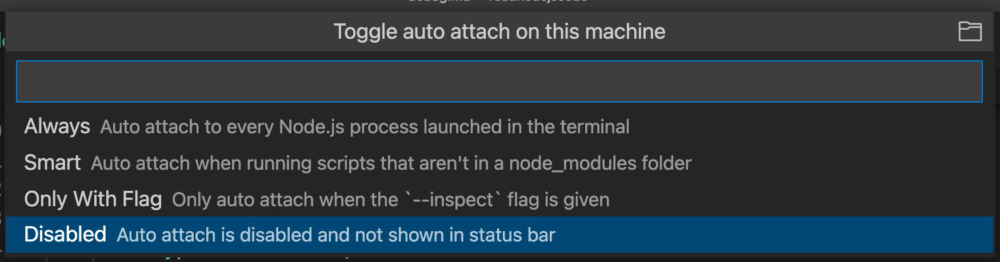
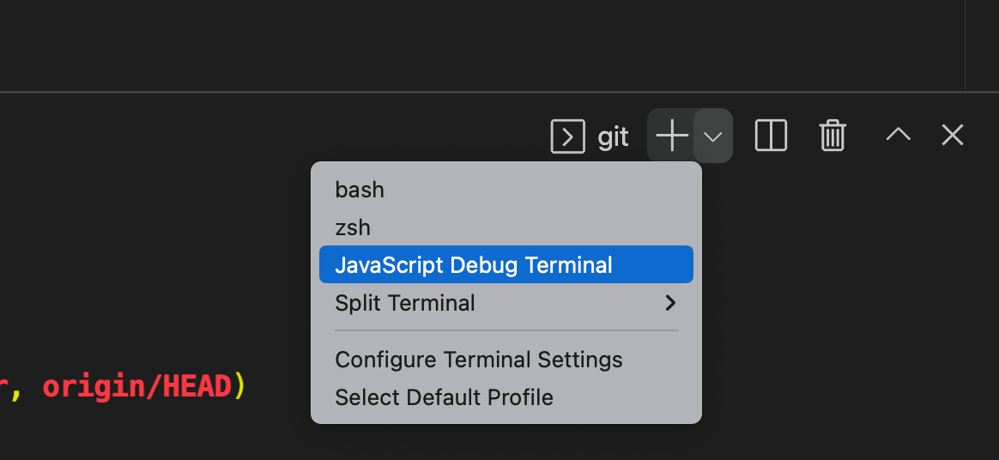
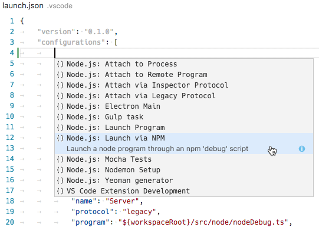
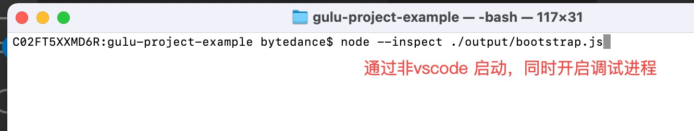
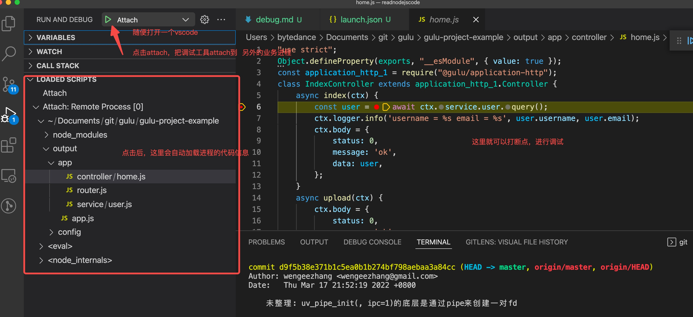

工欲善其事，必先利其器。
无论是业务开发，还是nodejs底层逻辑开发，都需要一个强大的调试工具，来深入窥探（inspect）运行过程。

# debug原理

参见：https://zhuanlan.zhihu.com/p/372135871

大致原理是：
* 编译型debug：
    * cpu 支持 INT 指令来触发中断；
    * 运行时替换执行的内容，debugger 程序会在需要设置断点的位置把指令内容换成 INT 3，也就是 0xCC，这就断住了。就可以获取这时候的环境数据来做调试
        * 把当时替换的机器码记录下来，需要释放断点的时候再换回去就行了
* 解释型debug:
    * 就是插入一段代码来断住(比如 javascript 中支持 debugger 语句，当解释器执行到这一条语句的时候就会断住。)

# debug客户端
v8 引擎会把设置断点、获取环境信息、执行脚本的能力通过 socket 暴露出去，socket 传递的信息格式就是 v8 debug protocol 
```json
{
    "seq":117,
    "type":"request",
    "command":"setbreakpoint",
    "arguments":{
        "type":"function",
        "target":"f"
    }

```

基于这些协议就可以控制 v8 的 debugger 了，所有的能够实现 debugger 的都是对接了这个协议，比如 chrome devtools、vscode debugger 还有其他各种 ide 的 debugger。

# vscode debug
调试的本质，是：
* 进程开启调试能力（即node --inspect）,能够接收客户端的调试协议
    * 没有开启的进程，是没办法接收到客户端的请求协议的，所以没办法调试（除非代码里写了调试指令）
* 调试工具（客户端）发送请求（根据约定好的协议）到被调试的进程上，被调试进程响应请求，设置断点。

首先看如何让进程开启调试能力。
本质上就是进程启动后，再启动一个进程，监听另外一个端口（比如常见的9229），接收客户端（debugger client）的请求。

vscode除了能编辑代码外，自身做了一些便利工具：在开启进程后，【附带检查一些配置，来决定是否开启调试进程】。

附带检查哪些配置呢？ 这些配置是用户在vscode设置好的。有三类配置，我们看vscode官方指引：

There are a few ways you can debug your Node.js programs in VS Code:

* Use 【auto attach】 to debug processes you run in VS Code's integrated terminal.


* Use the 【JavaScript debug terminal】, similar to using the integrated terminal.
即：通过来预先设置启动大环境
* Use a 【launch config】 to start your program, or attach to a process launched outside of VS Code.
通过设置个性化的launch.json，来完成。这个是最传统，也最完善的启动方式。

launch.json自身无非分为launch 和attach两个实用方式。不过针对各个使用场景，归纳了以下几类常用的场景：



>很多人对launch和attach有误解，其实只要弄懂了前面的原理，就非常清楚了，这两个方式是vscode自己对启动debug的两个归类，是vscode特有的，和debug本身没有关系。


# vscode debug: launch.json详解
launch.json有几类模式，我们先把官方文档的介绍贴出来：
* Launch Program: Launch a Node.js program in debug mode.
```json
    {
        "name": "Launch Program",
        "program": "${workspaceFolder}/output/bootstrap.js",
        "request": "launch",
        "skipFiles": [
          "<node_internals>/**"
        ],
        "type": "pwa-node" // 以前是node，现在vscode新版本为pwa-node
    },
```
通过node启动${workspaceFolder}/output/bootstrap.js后，再启动调试进程（比如通过给业务进程发送SIGUSR1信号）

* Launch via npm: Launch a Node.js program through an npm 'debug' script. If you have defined an npm debug script in your package.json, you can use it directly from your launch configuration. Make sure that the debug port used in the npm script, corresponds to the port specified in the snippet.

```json
{
        "name": "Launch via NPM",
        "request": "launch",
        "runtimeArgs": [
          "run-script",
          "debug"
        ],
        "runtimeExecutable": "npm",
        "skipFiles": [
          "<node_internals>/**"
        ],
        "type": "pwa-node"
      },
```
通过 package.json中的debug script作为入库，来开启。参数都在debug script中指定，所以这里不需要再设置program属性。

* Attach: Attach to the debug port of a locally running Node.js program. Make sure that the Node.js program to debug has been started in debug mode, and the debug port used is the same as the one specified in the snippet.
```json
{
        "name": "Attach",
        "port": 9229,
        "stopOnEntry":true,
        "request": "attach",
        "skipFiles": [
          "<node_internals>/**"
        ],
        "type": "pwa-node"
      }
```
这类使用方式，乍一看好像没有必要。这个场景要求：业务进程已经开启调试进程。如果已经开启了，还多次一举干什么呢？

它的场景可以是：通过别的方式启动的一个可调试进程（比如通过系统自带的terminal），通过vscode调试客户端进行便捷调试





* Attach to Remote Program: Attach to the debug port of a Node.js program running on the host specified by the address attribute. Make sure that the Node.js program to debug has been started in debug mode, and the debug port used is the same as the one specified in the snippet. To help VS Code map source files between your workspace and the filesystem of the remote host, make sure to specify correct paths for the localRootand remoteRoot attributes.
```json
{
        "address": "TCP/IP address of process to be debugged",// 远程host
        "localRoot": "${workspaceFolder}",
        "name": "Attach to Remote",
        "port": 9229,// 远程的调试进程port
        "remoteRoot": "Absolute path to the remote directory containing the program",
        "request": "attach",
        "skipFiles": [
          "<node_internals>/**"
        ],
        "type": "pwa-node"
      }
```
这个使用场景在于：对于远程服务的调试。要求就是远程服务必须已经开启调试进程。
这个场景最好适用于测试环境，最好不要放到idc。参见nodejs官方介绍：

>Since the debugger has full access to the Node.js execution environment, a malicious actor able to connect to this port may be able to execute arbitrary code on behalf of the Node.js process. It is important to understand the security implications of exposing the debugger port on public and private networks.
>
>If the debugger is bound to a public IP address, or to 0.0.0.0, any clients that can reach your IP address will be able to connect to the debugger without any restriction and will be able to run arbitrary code.

这里有个非常重要的使用设想：无损idc调试能力：

    * 服务通过自己的进程管理能力（参考egg的cluster能力）,能够讲集群下的各个进程上报
    * 当确定要调试时，通过管理面板，选择一个进程进行屏蔽流量
    * 发送一个请求给这个进程所在的机器的agent，让这个agent发送一个信号SIGUSR1给目标进程, 临时开启调试进程：
        * 当进程接收到SIGUSR1时，不同版本开启调试进程的方式有所区别，如下：
            * In Node.js 8 and later, it will activate the Inspector API：
                *inspector.open([port[, host[, wait]]])
            * In Node.js 7 and earlier, this activates the legacy Debugger API

    * 客户端（选择vscode或者chrome）链接调试进程，进行调试
    * 调试完毕后，发送指令给进程所在机器的agent，进行关闭调试进程（比如在nodejs8以后，通过inspector.close()）
    * 然后通过管理面板，把之前屏蔽流量的进程回复正常，接收用户请求

* Attach by Process ID: Open the process picker to select a node or gulp process for debugging. With this launch configuration, you can even attach to a node or gulp process that was not started in debug mode.

```json
{
        "name": "Attach by Process ID",
        "processId": "${command:PickProcess}", // 这个写死，启动后，vscode会自动让你选择进程
        "request": "attach",
        "skipFiles": [
          "<node_internals>/**"
        ],
        "type": "pwa-node"
      }
```
这个使用场景适用于本地：进程已经启动了，突然发现有个问题，不想破坏现有进程。就通过这类方式来调试。
这个方式的好处在于，已有进程可以处于调试状态，也可以不处于调试状态。

如果进程没有处于调试状态，vscode就会给业务进程发送一个SIGUSR1信号，临时让它开启调试进程。

* Nodemon Setup: Use nodemon to relaunch a debug session automatically whenever the JavaScript source has changed. Make sure that you have nodemon installed globally. Note that terminating the debug session only terminates the program to debug, not nodemon itself. To terminate nodemon, press Ctrl+C in the Integrated Terminal.
* Mocha Tests: Debug mocha tests in a test folder of your project. Make sure that your project has 'mocha' installed in its node_modules folder.
* Yeoman generator: Debug a yeoman generator. The snippet asks you to specify the name of the generator. Make sure that your project has 'yo' installed in its node_modules folder and that your generated project has been installed for debugging by running npm link in the project folder.
* Gulp task: Debug a gulp task. Make sure that your project has 'gulp' installed in its node_modules folder.
* Electron Main: Debug the main Node.js process of an Electron application. The snippet assumes that the Electron executable has been installed inside the node_modules/.bin directory of the workspace.

# go debug
go 的二进制指令程序运行后，可以通过 goland 的attach process 来进行调试，本质上使用的是 delve 启动一个服务，这个服务连接两个端：
* 客户端
  * 即 goland 编辑器，此时的编辑页面相当于一个浏览器页面，用来接受用户设置断点信息，发送给 delve;
* 被调试程序端
  * delve 写好终端向量后，此进程便可以查询并断点了。

* 流程如下：
  * 用户在 goland 编辑器中，在某个代码行最左侧点击设置断点后，便想 delve 进程发送数据，告诉它我想在这里断点。
  * delve 进程收到信息后，向操作系统写入终端向量表。
    * 因为delve 进程启动时候，已经指明了绑定的进程pid，因此它写入时会携带对于的进程信息。
  * 进程运行指令时，实施查询中断向量表中，有没有关于自己的中断信息。如果有，则断住，同时把此时进程的栈上的信息发送给 delve
  * delve 接收到中断环境信息后，发送给客户端 goland
  * goland 以一定的形式展示给用户