# cli opts

nodejs 目前的命令行主要分为以下几种：

* 通用启动方式：
  * node [options] [V8 options] [<program-entry-point> | -e "script" | -] [--] [arguments]

* inspect 专属：
  * node inspect [<program-entry-point> | -e "script" | <host>:<port>] …

* v8 选项专属：
  * node --v8-options

* repl 启动方式：
  * Execute without arguments to start the REPL.

我们主要分析通用启动方式。

* options: 
  * 这里是node启动的一些参数，比如在v18下，使用 node --no-experimental-fetch 后，便不能直接使用fetch。
* V8 options:
  * v8 专属的一些options, 具体有哪些，可以通过 node --v8-options 查看
* [<program-entry-point> | -e "script" | -]:
  * 入口文件，主要有三种方式
    * 指明文件地址, 比如 node index.js
    * 通过-e 直接运行一段代码，比如 node -e "console.log(11)"
    * -, 类似于 repl启动方式
* -- 
  * 用来表示 node 的options 结束，后续都是参数
  * 这个可有可无。因为[<program-entry-point> | -e "script" | -] 后面的目前一律都是参数
  * 除非后续nodejs 又在 [<program-entry-point> | -e "script" | -] 和 参数之间加了新的设置
* arguments
  * 这部分是传递给进程脚本的参数，用process.args来获取
# js container
https://tinyclouds.org/javascript_containers

* linux container, 即lxc，是os-level-virtualization, 即操作系统层面的虚拟。
  * https://en.wikipedia.org/wiki/LXC
  * 虚拟出几个实例，跑在一个宿主linux kernal上
  * 实现原理：
    * linux kernal提供了cgroups， limitation and prioritization of resources (CPU, memory, block I/O, network, etc.) without the need for starting any virtual machines
    * linux kernal提供了namespace isolation，allows complete isolation of an application's view of the operating environment
* 早起的docker是基于lxc的
  * Early versions of Docker used LXC as the container execution driver, though LXC was made optional in v0.9 and support was dropped in Docker v1.10
* container 是基于同一个kernal，所以比起virtual machine(多个kernal实例)要节省的多
  * 即 "a single Linux instance" vs "multiple Linux instances"

# stream
nodejs中定义的stream.js，都会提供了一个state用来存放buffer。
* readable会提供一个buffer用来从底层读取数据到buffer
* writeable会提供一个buffer，用来存放写的东西

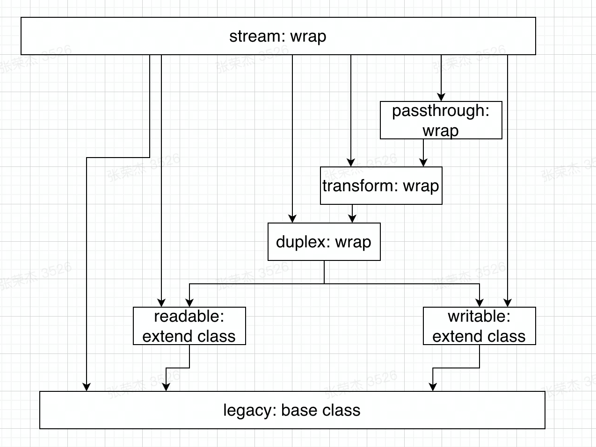

这样用户侧使用socket.write时，会根据实际情况，决定是否直接调用handle写，还是先存放在writeable.state.buffer中
# socket
* server创建后，会创建一个listen sockfd
* 新的连接到来后，epoll接收到事件，调用accept
  * 从进程中获取一个未用的fd，然后新建一个file结构体
  * 新建一个socket实例，作为一个inode。并和file发生关系
    * 这个socket实例，是位于file后面的，是一个模拟文件
* 调用connection回调（tcp_wrap的父类connection_wrap的函数OnConnection）
  * 新建一个libuv的client handle，即stream
  * 把上一步的fd,通过uv__stream_open给到stream的io_watcher.fd
* 后续对于stream的写操作，都是通过uv___stream_fd，读取stream.io_watcher.fd来对fd进行写操作

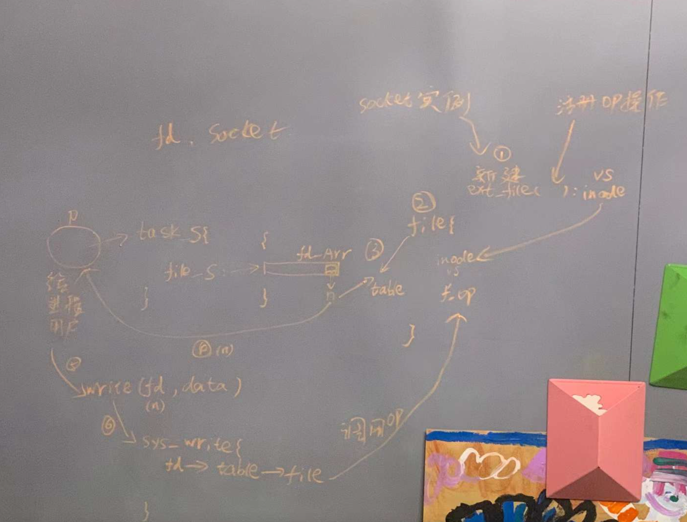

# koa-router
koa自身的app实例，通过app.use将middle注册到this.middleware数组中。

koa-router其实是把多个route handle放到一个数组中，做成了一个middleware。
这个middleware是一个特殊的middleware,它是一个Router实例。这个实例的constructor有个属性叫stack,是一个数组。

该数组的每一个元素就是一个layer，就是用注册的路由handle，即router.get('/xx', func1);

然后这个实例通过一个方法routes或者middleware，对外暴露一个方法，这个方法对于koa app来说，就是一个标准的middleware。

当然了，layer内部也有一个stack，主要是用来保持用户注册一个方法是，防止了多个func，比如：router.get('/xx', func1, func2)

# Reflect-metadata
参见 https://mp.weixin.qq.com/s/NXeGh2cP5LbW-6YXN4HeGQ#at
代码来自github源码
定义元数据有两种方式，一种是通过@Relect.metadata的方式，作为装饰器使用，如下代码，返回一个装饰器
```js
function metadata(metadataKey, metadataValue) {
            function decorator(target, propertyKey) {
                if (!IsObject(target))
                    throw new TypeError();
                if (!IsUndefined(propertyKey) && !IsPropertyKey(propertyKey))
                    throw new TypeError();
                OrdinaryDefineOwnMetadata(metadataKey, metadataValue, target, propertyKey);
            }
            return decorator;
        }
```

另外一种是动态调用，即调用Reflect.defineMetadata:
```js
function defineMetadata(metadataKey: any, metadataValue: any, target: any, propertyKey?: string | symbol): void {
    if (!IsObject(target)) throw new TypeError();
    if (!IsUndefined(propertyKey)) propertyKey = ToPropertyKey(propertyKey);
    return OrdinaryDefineOwnMetadata(metadataKey, metadataValue, target, propertyKey);
}
```

本质都是调用OrdinaryDefineOwnMetadata：
```js
function OrdinaryDefineOwnMetadata(MetadataKey: any, MetadataValue: any, O: any, P: string | symbol | undefined):void {
            const metadataMap = GetOrCreateMetadataMap(O, P, /*Create*/ true);
            metadataMap.set(MetadataKey, MetadataValue);
        }
```

非常简单，就是王map中设置对于的值。

其中map的结构设计为：
WeakMap<any, Map<any, Map<any, any>>>
这里再展开说明一下具体存储的位置：

当在类 C 本身上使用 metadata 的时候，元数据会存储在 C.[[Metadata]] 属性中，其对应的 property 值是 undefined

定义在类 C 静态成员上的元数据，那么元数据会存储在C.[[Metadata]] 属性中，以该属性（property）名作为 key 

定义在类 C 实例成员上的元数据，那么元数据会存储在C.prototype.[[Metadata]] 属性中，以该属性（property）名作为 key

>应用该库之后，每个对象都有 [[Metadata]]属性，该属性是一个 Map 对象，该对象内 key 值内容对应目标元素上的 property 名（或为 undefined），那对应的值也是一个 Map 对象（该对象的 key/value 内容就是元数据的 key/value）
# libuv
handle/request is called event watcher.

很多网络教程都比较分散，建议查看官方的这个教程
http://docs.libuv.org/en/v1.x/guide/threads.html。

其中对于thread一节中，对于async的讲解比较清晰：
* 目的：Inter-thread communication
* 实现：
主线程初始化一个uv_async_t async; 然后调用uv_async_init(loop, &async, print_progress);
最后调用uv_queue_work(loop, &req, fake_download, after);派发任务。
然后在fake_download中调用uv_async_send来完成通知

```
uv_loop_t *loop;
uv_async_t async;

int main() {
    loop = uv_default_loop();

    uv_work_t req;
    int size = 10240;
    req.data = (void*) &size;

    uv_async_init(loop, &async, print_progress);
    uv_queue_work(loop, &req, fake_download, after);

    return uv_run(loop, UV_RUN_DEFAULT);
}

double percentage;

void fake_download(uv_work_t *req) {
    int size = *((int*) req->data);
    int downloaded = 0;
    while (downloaded < size) {
        percentage = downloaded*100.0/size;
        async.data = (void*) &percentage;
        uv_async_send(&async);

        sleep(1);
        downloaded += (200+random())%1000; // can only download max 1000bytes/sec,
                                           // but at least a 200;
    }
}
```

https://luohaha.github.io/Chinese-uvbook/source/processes.html
1. 进程和子进程通信
一个正常的新产生的进程都有自己的一套文件描述符映射表，例如0，1，2分别对应stdin，stdout和stderr。有时候父进程想要将自己的文件描述符映射表分享给子进程。例如，你的程序启动了一个子命令，并且把所有的错误信息输出到log文件中，但是不能使用stdout。因此，你想要使得你的子进程和父进程一样，拥有stderr。在这种情形下，libuv提供了继承文件描述符的功能。在下面的例子中，我们会调用这么一个测试程序
实际的执行程序proc-streams在运行的时候，只向子进程分享stderr。使用uv_process_options_t的stdio域设置子进程的文件描述符。首先设置stdio_count，定义文件描述符的个数。uv_process_options_t.stdio是一个uv_stdio_container_t数组。定义如下：

typedef struct uv_stdio_container_s {
  uv_stdio_flags flags;

  union {
    uv_stream_t* stream;
    int fd;
  } data;
} uv_stdio_container_t;
上边的flag值可取多种。比如，如果你不打算使用，可以设置为UV_IGNORE。如果与stdio中对应的前三个文件描述符被标记为UV_IGNORE，那么它们会被重定向到/dev/null。

因为我们想要传递一个已经存在的文件描述符，所以使用UV_INHERIT_FD。因此，fd被设为stderr。

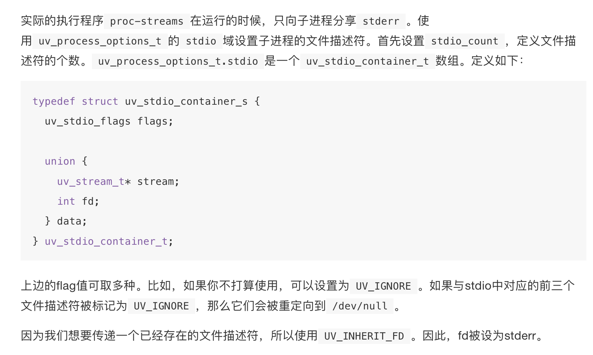
同样可以把上述方法用于流的重定向。比如，把flag设为UV_INHERIT_STREAM，然后再设置父进程中的data.stream，这时子进程只会把这个stream当成是标准的I/O。这可以用来实现，例如CGI。
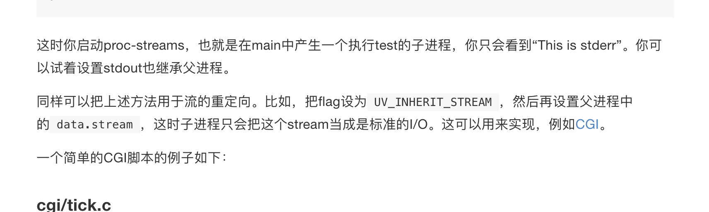

2. 线程 async
progress/main.c:

uv_loop_t *loop;
uv_async_t async;

int main() {
    loop = uv_default_loop();

    uv_work_t req;
    int size = 10240;
    req.data = (void*) &size;

    uv_async_init(loop, &async, print_progress);
    uv_queue_work(loop, &req, fake_download, after);

    return uv_run(loop, UV_RUN_DEFAULT);
}

void fake_download(uv_work_t *req) {
    int size = *((int*) req->data);
    int downloaded = 0;
    double percentage;
    while (downloaded < size) {
        percentage = downloaded*100.0/size;
        async.data = (void*) &percentage;
        uv_async_send(&async);

        sleep(1);
        downloaded += (200+random())%1000; // can only download max 1000bytes/sec,
                                           // but at least a 200;
    }
}

首先设置uv_async_t async。然后通过async.data = (void*) &percentage;uv_async_send(&async);发送，通过uv_async_init(loop, &async, print_progress);来捕获。

3. 信号
* 发送信号：kill -{signalId} {processid}
* 接受信号：进程内监听：signal({signalId}, callbackFun)
  * 信号接受时机：当前进程由于系统调用、中断或异常而进入系统空间以后，从系统空间返回到用户空间的前夕，或者 当前进程在内核中进入睡眠以后刚被唤醒的时候（必定是在系统调用中），或者由于不可忽略信号的存在而提前返回到用户空间。
信号是异步的，一个进程不可能等待信号的到来，也不知道信号是否会到来，何时到来。因此，信号的接收不可能是进程本身完成，而是由内核代理。当进程收到一个信号，内核就在进程的未决信号集上添加该信号。这就是信号的接收时机。相对简单。但是信号的处理时机并不是在信号被接收的时候。

4. 空转
https://luohaha.github.io/Chinese-uvbook/source/utilities.html

空转的回调函数会在每一次的event-loop循环激发一次。空转的回调函数可以用来执行一些优先级较低的活动。比如，你可以向开发者发送应用程序的每日性能表现情况，以便于分析，或者是使用用户应用cpu时间来做SETI运算:)。

5. libuv的理念
libuv是为了解决异步而诞生的。所以你看到的所有操作（函数调用），都是不能立即拿到结果的。必须采用以下形式：
uv_{method}(loop, req, cb)

6. flags:
c++中，经常碰到flag的设置，目前一般采用bitwise or。各个值可以采用enum和”1 << n“来确保唯一
```c++
enum uv_process_flags {
  /*
   * Set the child process' user id. The user id is supplied in the `uid` field
   * of the options struct. This does not work on windows; setting this flag
   * will cause uv_spawn() to fail.
   */
  UV_PROCESS_SETUID = (1 << 0),
  /*
   * Set the child process' group id. The user id is supplied in the `gid`
   * field of the options struct. This does not work on windows; setting this
   * flag will cause uv_spawn() to fail.
   */
  UV_PROCESS_SETGID = (1 << 1),
  /*
   * Do not wrap any arguments in quotes, or perform any other escaping, when
   * converting the argument list into a command line string. This option is
   * only meaningful on Windows systems. On Unix it is silently ignored.
   */
  UV_PROCESS_WINDOWS_VERBATIM_ARGUMENTS = (1 << 2),
  /*
   * Spawn the child process in a detached state - this will make it a process
   * group leader, and will effectively enable the child to keep running after
   * the parent exits.  Note that the child process will still keep the
   * parent's event loop alive unless the parent process calls uv_unref() on
   * the child's process handle.
   */
  UV_PROCESS_DETACHED = (1 << 3),
  /*
   * Hide the subprocess window that would normally be created. This option is
   * only meaningful on Windows systems. On Unix it is silently ignored.
   */
  UV_PROCESS_WINDOWS_HIDE = (1 << 4),
  /*
   * Hide the subprocess console window that would normally be created. This
   * option is only meaningful on Windows systems. On Unix it is silently
   * ignored.
   */
  UV_PROCESS_WINDOWS_HIDE_CONSOLE = (1 << 5),
  /*
   * Hide the subprocess GUI window that would normally be created. This
   * option is only meaningful on Windows systems. On Unix it is silently
   * ignored.
   */
  UV_PROCESS_WINDOWS_HIDE_GUI = (1 << 6)
};

// 使用：

options.flags = UV_PROCESS_DETACHED;
```


6. process进程通信
http://docs.libuv.org/en/v1.x/guide/processes.html

clone libuv git仓库后，/docs/下的代码，即为官方文档中的代码样例。

下面看下进程间通信的一个例子：/docs/pipe-echo-server/main.c

```c
#define PIPENAME "/tmp/echo.sock"

int main() {
    loop = uv_default_loop();

    uv_pipe_t server;
    uv_pipe_init(loop, &server, 0);

    signal(SIGINT, remove_sock);

    int r;
    if ((r = uv_pipe_bind(&server, PIPENAME))) {
        fprintf(stderr, "Bind error %s\n", uv_err_name(r));
        return 1;
    }
    if ((r = uv_listen((uv_stream_t*) &server, 128, on_new_connection))) {
        fprintf(stderr, "Listen error %s\n", uv_err_name(r));
        return 2;
    }
    return uv_run(loop, UV_RUN_DEFAULT);
}
```
上面代码中，通过uv_pipe_bind，把uv_pipe_t这个特殊server绑定到PIPENAME（临时创建一个/tmp/echo.sock文件）
> 想一下，tcp server是绑定到ip:port， uv_pipe_t是绑定到 一个文件

绑定后，就可以通过socat这个cmd来访问：socat - /path/to/socket

> After the initial setup, messaging is no different from TCP

7. pipe and process communication

https://www.gnu.org/software/libc/manual/html_node/Creating-a-Pipe.html

创建一个pipe实例 myPipe，系统会创建一对 fd,保存在myPipe这个数组中。

> The pipe function creates a pipe and puts the file descriptors for the reading and writing ends of the pipe (respectively) into filedes[0] and filedes[1].
>
>An easy way to remember that the input end comes first is that file descriptor 0 is standard input, and file descriptor 1 is standard output.
>If successful, pipe returns a value of 0. On failure, -1 is returned.  

```c
#include <sys/types.h>
#include <unistd.h>
#include <stdio.h>
#include <stdlib.h>

/* Read characters from the pipe and echo them to stdout. */

void
read_from_pipe (int file)
{
  FILE *stream;
  int c;
  stream = fdopen (file, "r");
  while ((c = fgetc (stream)) != EOF)
    putchar (c);
  fclose (stream);
}

/* Write some random text to the pipe. */

void
write_to_pipe (int file)
{
  FILE *stream;
  stream = fdopen (file, "w");
  fprintf (stream, "hello, world!\n");
  fprintf (stream, "goodbye, world!\n");
  fclose (stream);
}

int
main (void)
{
  pid_t pid;
  int mypipe[2];

  /* Create the pipe. */
  if (pipe (mypipe))
    {
      fprintf (stderr, "Pipe failed.\n");
      return EXIT_FAILURE;
    }

  /* Create the child process. */
  pid = fork ();
  if (pid == (pid_t) 0)
    {
      /* This is the child process.
         Close other end first. */
      close (mypipe[1]);
      read_from_pipe (mypipe[0]);
      return EXIT_SUCCESS;
    }
  else if (pid < (pid_t) 0)
    {
      /* The fork failed. */
      fprintf (stderr, "Fork failed.\n");
      return EXIT_FAILURE;
    }
  else
    {
      /* This is the parent process.
         Close other end first. */
      close (mypipe[0]);
      write_to_pipe (mypipe[1]);
      return EXIT_SUCCESS;
    }
}
```

7. socket pair

socket pair和pipe的区别：
A socket pair consists of a pair of connected (but unnamed) sockets. It is very similar to a pipe and is used in much the same way. Socket pairs are created with the socketpair function, declared in sys/socket.h. A socket pair is much like a pipe; the main difference is that the socket pair is bidirectional, whereas the pipe has one input-only end and one output-only end (see Pipes and FIFOs).

This function creates a socket pair, returning the file descriptors in filedes[0] and filedes[1]. The socket pair is a full-duplex communications channel, so that both reading and writing may be performed at either end.

In the kernel, pipes are implemented in the filesystem code and socketpairs in the networking code.

8. socket stream pipe等

其实本质还是在fd，unix系统把一切都抽象为文件。通过file descriptor, 系统便可以监控变化，从而达到异步编程的效果。

在libuv中，无论是socket，还是pipe，本质都是基于stream，通过uv__io_start,将handle添加到loop中监听起来。

libuv的uv_pipe_t是高度抽象，可以是socket，stream，pipe。 
uv_pipe_t的实例，可以用于ipc通信，也可以用于远程通信，区别就是int uv_pipe_init(uv_loop_t* loop, uv_pipe_t* handle, int ipc) 中的最后一个参数ipc是0还是1： 如果是0，表示是类tcp的远程通信。如果是1，表示是本地进程间通信。

* 如果是0，即表示绑定到一个指定本地文件（比如/tmp/test.sock），然后其他的根tcp的listen和后续处理一样，没有区别。
* 如果是1，则表示进程间通信。通过uv_spawn将描述符传递给子进程。

2. 如果是1，表示进程间通信。参见libuv docs/multi-echo-server中，通过指定child_stdio来spawn子进程。

uv_spawn(loop, &worker->req, &worker->options); 本质会调用uv__spawn_and_init_child，然后调用uv__make_pipe，调用uv_pipe。

我们看下uv_pipe的代码：
```c
int uv_pipe(uv_os_fd_t fds[2], int read_flags, int write_flags) {
  uv_os_fd_t temp[2];
  int err;
#if defined(__FreeBSD__) || defined(__linux__)
  int flags = O_CLOEXEC;

  if ((read_flags & UV_NONBLOCK_PIPE) && (write_flags & UV_NONBLOCK_PIPE))
    flags |= UV_FS_O_NONBLOCK;

  if (pipe2(temp, flags))
    return UV__ERR(errno);

  if (flags & UV_FS_O_NONBLOCK) {
    fds[0] = temp[0];
    fds[1] = temp[1];
    return 0;
  }
#else
  if (pipe(temp))
    return UV__ERR(errno);

  if ((err = uv__cloexec(temp[0], 1)))
    goto fail;

  if ((err = uv__cloexec(temp[1], 1)))
    goto fail;
#endif

  if (read_flags & UV_NONBLOCK_PIPE)
    if ((err = uv__nonblock(temp[0], 1)))
      goto fail;

  if (write_flags & UV_NONBLOCK_PIPE)
    if ((err = uv__nonblock(temp[1], 1)))
      goto fail;

  fds[0] = temp[0];
  fds[1] = temp[1];
  return 0;

fail:
  uv__close(temp[0]);
  uv__close(temp[1]);
  return err;
}


```

可以看到，背后就是调用了uninx底层的pipe，创建一个pipe数组，用来存放一对fd来进行通信。

# client socket vs listening socket vs connected socket
https://blog.stephencleary.com/2009/05/using-socket-as-server-listening-socket.html

Normally, server sockets may accept multiple client connections. Conceptually, a server socket listens on a known port. When an incoming connection arrives, the listening socket creates a new socket (the “child” socket), and establishes the connection on the child socket. The listening socket is then free to resume listening on the same port, while the child socket has an established connection with the client that is independent from its parent.

One result of this architecture is that the listening socket never actually performs a read or write operation. It is only used to create connected sockets.

* ****(repeat) Accept****. When a socket connection is accepted by the listening socket, a new socket connection is created. The listening socket should continue listening on the same port by re-starting the Accept operation as soon as it completes. The result of a completed Accept operation is a new, connected socket. This new socket may be used for reading and writing. For more information on using connected sockets, see Using Socket as a Connected Socket. The new socket is completely independent from the listening socket; closing either socket does not affect the other socket.
* ****Close****. Since the listening socket is never actually connected (it only accepts connected sockets), there is no Disconnect operation. Rather, closing a listening socket simply informs the OS that the socket is no longer listening and frees those resources immediately.

首先socket是为了方便编程人员，os在tcp/ip的上层封装的一个对象。os会自动做好tcp层的处理动作，并通过socket暴露给应用层。
通过socket，我们可以完成“绑定，监听，连接，读，写”等复杂的操作。

我们从服务端来看，socket位于tcp/ip之上。当服务端初始化socket，bind并且listen后，即处于监听状态，假设服务端是9.135.2.110:80。
此时如果有一个客户端请求到来（加入10.11.11.12:53987）, 数据经过“链路层-->ip层-->tcp层”。
然后根据 【9.135.2.110:80 + 10.11.11.12:53987】，再加上请求是否不包含syn ack，来判断。
* 首先根据【9.135.2.110:80 + 10.11.11.12:53987】找到可能的socket（要么是listen,要么是established）
* 如果是syn或者ack
  * 如果是syn，则创建一个新的socket，放到incomplete connection queue中，同时返回syn + ack
  * 如果是ack,则去incomplete connection queue中根据【9.135.2.110:80 + 10.11.11.12:53987】找到对于的socket，把它挪到complete connection socket, 标记该socket完成。
* 否则，则是普通的数据请求。此时根据【9.135.2.110:80 + 10.11.11.12:53987】去complete connection queue队列去找到对应的socket，然后

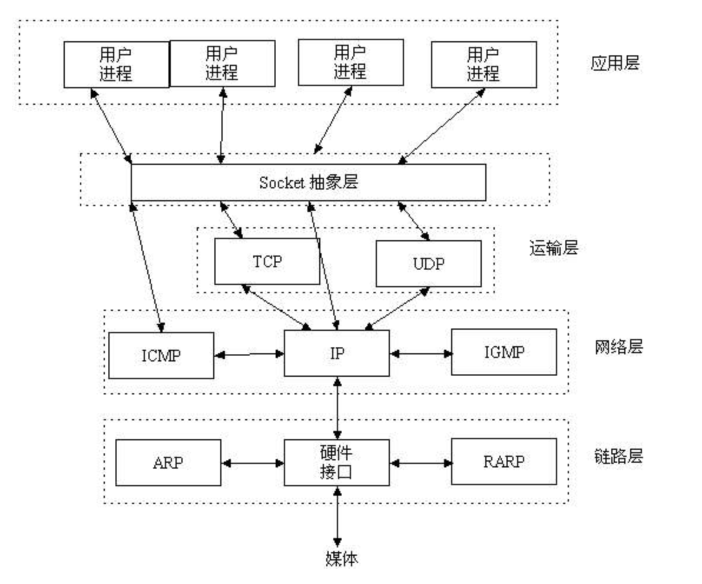

从上面的图中，我们来看下socket的作用：
* 所有的请求，在底层都是通过ip:port这一条硬件通路，被操作系统内核来分配对于的对象，进行相应的操作和存储。
* 沿着tcp/ip stack往上走，到了tcp层，操作系统会有个对象来保存这个tcp链接实例（当然了，最终这个对象会和上层抽象的socket建立关系）
* 如果没有listen，直接bind后，调用accept，也是可以的。这样就只有connection socket。
  * 实现上：bind ip：port后，数据经过硬件，直接创建socket三次握手，和客户端通信。
  * 为什么要listen，并创建一个listen socket呢？
  * 这个跟os的实现有关系。在应用层准备好之前（即调用accept），通过一个指令可以先告诉os，先帮我缓存一些connection。这个指令就是listen
  * 后续应用层准备好了后，调用accept直接从已经缓存好的拿出一个socket来，进行读/写。


# 进程内存分布和函数调用
## 内存大小
系统启动后，会通过虚拟内存映射到物理内存的方式，将内存分为4G大小（32位）；其中操作系统内核占据1G;
然后每个进程占据剩下的3G(映射到不同的物理内存)

## 内存管理
通过分页方式进行映射，其中内核区连续，而进程占据的用户态不连续（通过分页尽量减少不连续）

## 内存分配
这样，每个用户进程，就都有4G大小，其中1G是共享的内核态，3G是用户态；

我们说的内存分配，一般就是指这个3G用户态的分配。

通常分为：
* stack offset区
* stack区（向下增长）
* 未分配区（其中包括内存映射区，为一些zero copy等i/o技术预留）
* heap区（向上增长）
* bss区
* data区
* text区（代码区，即存放编译后的机器码，有时候文章为了解决简单，也说汇编代码）

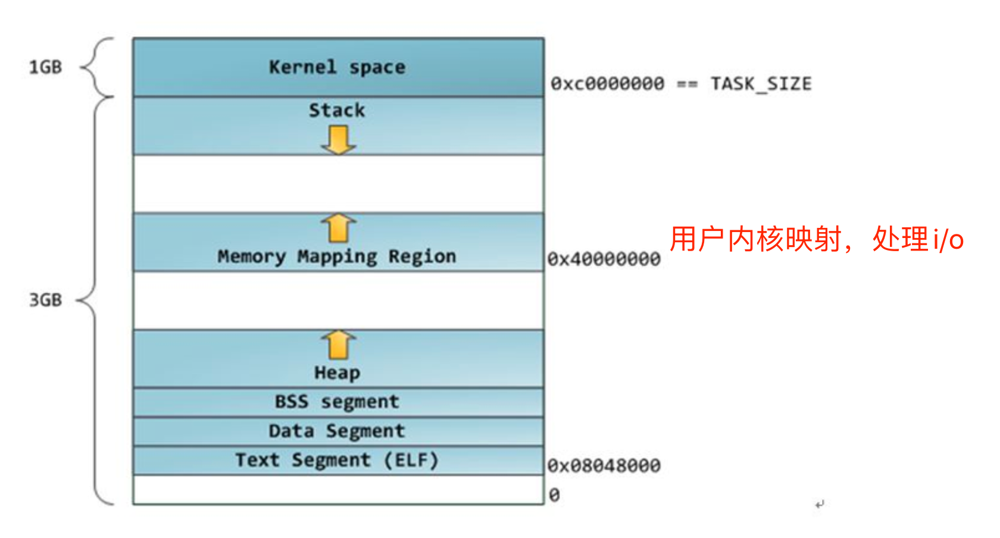
## 函数调用
函数调用，函数嵌套调用等，都需要保存父环境信息，以及自身的参数和变量，这些信息，统一放到stack区。

每个函数的信息，在stack区独立一块，成为stack frame，即栈帧；

栈帧的内部结构如图：
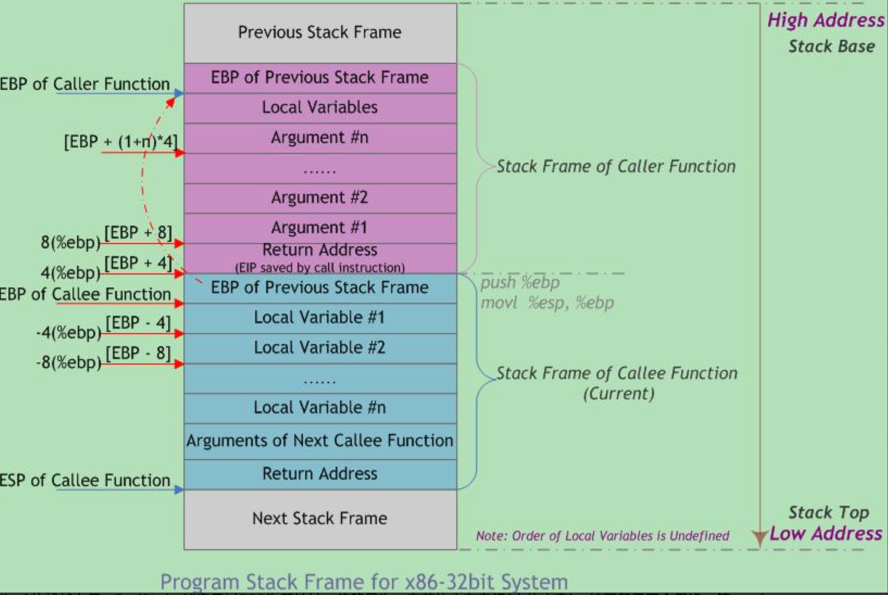
栈的增长是向下增长的,一个栈帧的最顶部，是上一个栈帧的帧基地地址。栈帧的最底部，是当前栈帧的end端，同时也是栈的end端（即esp）;

最下面的栈帧的基地地址，保存到全局寄存器ebp中。这样通过两个全局变量（ebp和esp），就可以知道当前栈位于哪个帧。

同时还有一个eip，用来保存下一个指令的地址（即内存中text区中的指令地址）；

这样，通过eip的不断变化，配合ebp和esp，来有条不紊地执行函数调用。

> js是逐行解释执行的，但是解释器是可以知道js函数开始和结束的。所以解释器在执行一个js函数时，它也会自动分配一个栈帧

# v8编译
参考 v8编译器演变 https://juejin.cn/post/6971586506011967519

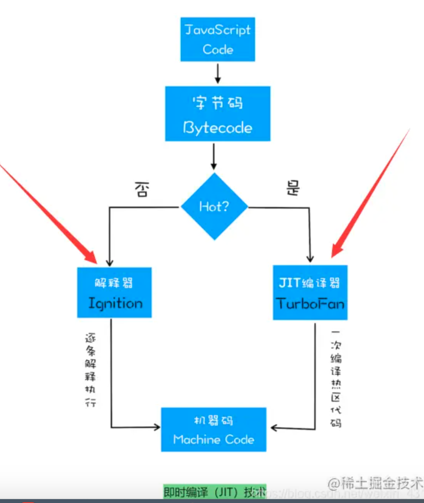

## 演变过程
* 首先不变的是，将源码转为ast
* 一开始，大多数js引擎会将ast转为字节码，然后再转为机器码执行。但是早期的v8很独特，只有一个编译器，直接将ast便以为机器码，效率很高。
  * V8 引擎执行 JS 来说，是没有转字节码这一步骤的，直接从 AST 转成机器码，这个过程称为编译过程；
  * 每次拿到 JS 文件的时候，首先都会编译，而这个过程还是比较浪费时间的，这是一件比较头疼的事情，需要一个解决办法
* 最开始的解决思路是，把机器码缓存下来，但是带来的问题是进程内存暴涨；
* 为了解决这个问题，引入了惰性编译
  * 只缓存全局性的代码片段，用户的函数不缓存；
  * 问题来了：各种插件或者开发者自己封装的方法，为了不污染其他使用者的变量，一般都封装成一个函数，这样问题就来了，惰性编译不会保存函数编译后的机器码和理解编译函数。
* 为了解决问题，再次引入字节码
  * 字节码是机器码的抽象，跨平台cpu，体积小
  * 只缓存字节码
  * 执行时，通过jit方式，由ignition一行一行临时解释执行,同时收集信息
  * 碰到热函数，则交给turbofan，将字节码直接编译为机器码缓存
  * 热函数碰到另类情况，会重新退回，交给ignition来解释执行

# 再看nextTick和microTask
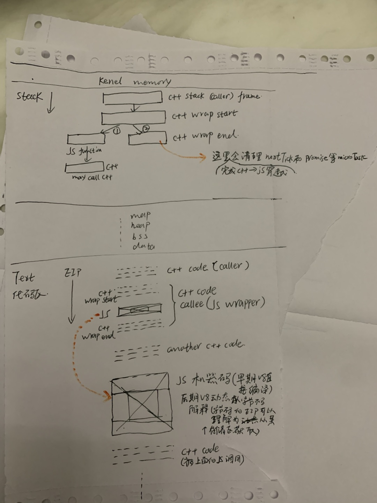
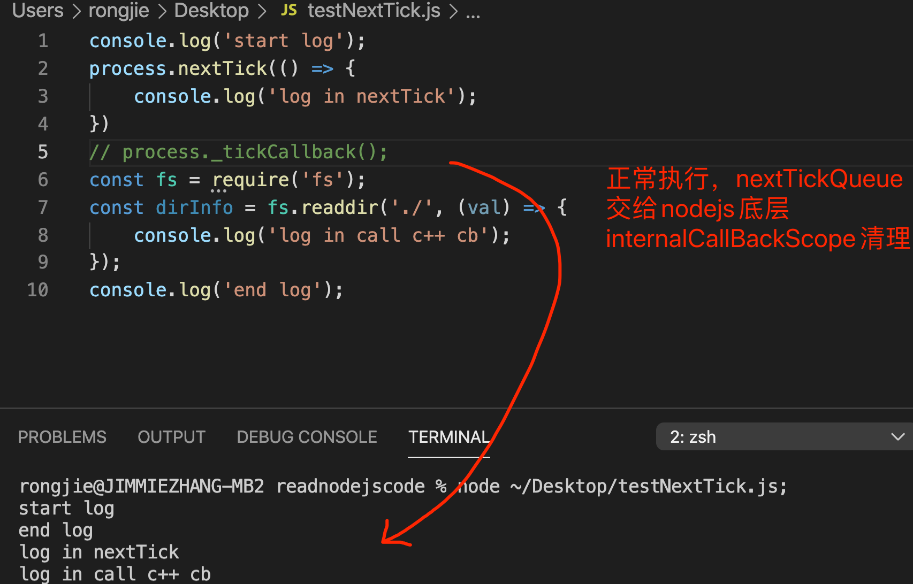
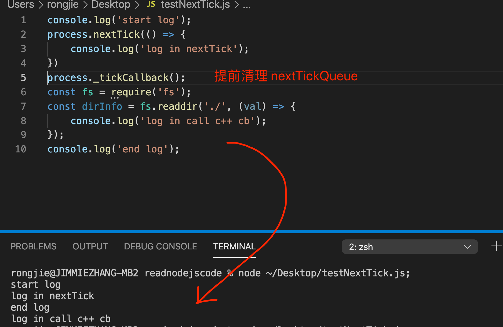

# _http_client和_http_agent
目前业务开发比较习惯使用node-fetch/axios发起请求，入参已经固化了。

此时如果需要引入proxy，那么合理的方式将会是：通过制定agent来转化请求，原理为：
_http_agent会维持一个this.sockets对象，key为host:port，值为socket数组。
用户制定的host:port此时只是成为了标识，真正触发请求的是socket。
举例
```js
const proxySocket1 = new Socket({host: someProxyHost, port: someProxyPort});// 该socket指向代理服务
...
this.sockets = {
  `qq.com`: [proxySocket1, proxySocket2, ...],
  `baidu.com`: [proxySocket5, proxySocket6, ...]
}
```

我们看下http.request('http://qq.com')的流程：
```js
http.request('http://qq.com');

// 实际上是创建一个http.ClientRequest实例
// _http_client.js
function ClientRequest(input, options, cb) {
  OutgoingMessage.call(this);

  let agent = options.agent;
  ...// 设置agent
  this.agent = agent;

  ...// 设置host, port, path, method等

  ...// 设置headers


  const oncreate = (err, socket) => {
    if (called)
      return;
    called = true;
    if (err) {
      process.nextTick(() => this.emit('error', err));
      return;
    }
    this.onSocket(socket);
    this._deferToConnect(null, null, () => this._flush());
  };

  // initiate connection
  if (this.agent) {
    this.agent.addRequest(this, options);
  } else {
    ...// 其他场景
  }

  this._deferToConnect(null, null, () => this._flush());
}

// 接着看addRequest
// _http_agent.js
Agent.prototype.addRequest = function addRequest(req, options, port){/* legacy */
  ...// 准备options
  const name = this.getName(options);

  let socket;

  if (socket) {
    ...
  } else if (sockLen < this.maxSockets) {
    ...
    // 创建新的socket，创建完成后，执行回调（回调即handleSocketCreation(this, req, true)的返回函数）
    this.createSocket(req, options, handleSocketCreation(this, req, true));
  } else {
    ...
  }
};

Agent.prototype.createSocket = function createSocket(req, options, cb) {
  ...
  // this.createConnection就是调用net.createConnection
  const newSocket = this.createConnection(options, oncreate);
  if (newSocket)
    oncreate(null, newSocket);
};

Agent.prototype.createConnection = net.createConnection;

// net.js
// net.createConnection就是connect
function connect(...args) {
  const normalized = normalizeArgs(args);
  const options = normalized[0];
  debug('createConnection', normalized);
  // 1. 创建socket
  const socket = new Socket(options);

  if (options.timeout) {
    socket.setTimeout(options.timeout);
  }
  // 2. 发起连接
  return socket.connect(normalized);
}
// 创建完成后，返回，触发回调onCreate
// 往this.sockets中添加 this.sockets[name].push(s);
// 并调用cb，此时的cb是就是只之前的handleSocketCreation返回的函数
const oncreate = once((err, s) => {
    if (err)
      return cb(err);
    if (!this.sockets[name]) {
      this.sockets[name] = [];
    }
    this.sockets[name].push(s);
    debug('sockets', name, this.sockets[name].length);
    installListeners(this, s, options);
    cb(null, s);
  });

function handleSocketCreation(agent, request, informRequest) {
  return function handleSocketCreation_Inner(err, socket) {
    if (err) {
      process.nextTick(emitErrorNT, request, err);
      return;
    }
    if (informRequest)
      setRequestSocket(agent, request, socket);
    else
      socket.emit('free');
  };
}

// 看下setRequestSocket
// 它的含义，就是给创建的_http_client实例req设置socket
function setRequestSocket(agent, req, socket) {
  req.onSocket(socket);
  const agentTimeout = agent.options.timeout || 0;
  if (req.timeout === undefined || req.timeout === agentTimeout) {
    return;
  }
  socket.setTimeout(req.timeout);
}

// 我们看下req.onSocket(socket);
// 从这个方法也可以看出，req的关注的事件 onSocket
ClientRequest.prototype.onSocket = function onSocket(socket) {
  // TODO(ronag): Between here and onSocketNT the socket
  // has no 'error' handler.
  process.nextTick(onSocketNT, this, socket);
};

function onSocketNT(req, socket) {
  if (req.destroyed) {
    _destroy(req, socket, req[kError]);
  } else {
    tickOnSocket(req, socket);
  }
}

// 最后调用了tickOnSocket，其实就是分配parser,进行解析
function tickOnSocket(req, socket) {
  const parser = parsers.alloc();
  req.socket = socket;
  parser.initialize(HTTPParser.RESPONSE,
                    new HTTPClientAsyncResource('HTTPINCOMINGMESSAGE', req),
                    req.maxHeaderSize || 0,
                    req.insecureHTTPParser === undefined ?
                      isLenient() : req.insecureHTTPParser,
                    0);
  parser.socket = socket;
  parser.outgoing = req;
  req.parser = parser;

  socket.parser = parser;
  socket._httpMessage = req;

  // Propagate headers limit from request object to parser
  if (typeof req.maxHeadersCount === 'number') {
    parser.maxHeaderPairs = req.maxHeadersCount << 1;
  }

  parser.onIncoming = parserOnIncomingClient;
  socket.on('error', socketErrorListener);
  socket.on('data', socketOnData);
  socket.on('end', socketOnEnd);
  socket.on('close', socketCloseListener);
  socket.on('drain', ondrain);

  if (
    req.timeout !== undefined ||
    (req.agent && req.agent.options && req.agent.options.timeout)
  ) {
    listenSocketTimeout(req);
  }
  req.emit('socket', socket);
}
```

简要描述一下步骤：
1. 通过http.request创建http.ClientRequest实例；
2. 默认有 defaultGlobalAgent （进程启动时创建），所以直接调用this.agent.addRequest(req)
  2.1 defaultGlobalAgent创建时，会监听free（this.on('free'), 用户agent的socket有空闲时执行对应的回调）
3. agent维持一个req队列（this.requests）、当前使用的sockets(this.sockets)、以及空闲的sockets(this.freeSockets)
4. 尝试从this.freeSockets中取一个空闲的；如果没有，则创建一个新的socket
  4.1 创建新的socket时，会执行installListeners，监听s.on('free', onFree); 
  4.2 onFree会触发agent的free: agent.emit('free', s, options);
5. 创建新的socket后，调用回调this.onSocket，将新创建的socket分配给req，同时给req分配parser。
6. 创建完成后，同时调用_deferToConnect（这个函数的意思应该是：defer to flush data）
7. 用户此时可能会执行req.write（data)，往socket写数据。
8. 发送完成后，当收到服务请求时，会执行parserOnIncomingClient
  8.1 parserOnIncomingClient会监听end事件：res.on('end', responseOnEnd);
  8.2 end触发时，调用responseOnEnd：调用responseKeepAlive
  8.3 再调用emitFreeNT，进而触发req.socket.emit('free');
  8.4 socket的free最终触发agent的free。
  8.5 agent的free会做两件事：
      8.5.1 看队列中有没有pending的req
            const req = requests.shift();
            setRequestSocket(this, req, socket);
      8.5.2 如果没有pending的req，则把socket放到free队列中：freeSockets.push(socket);

# nodejs总的internalbinding和require
首先参见 https://github.com/coderweek/coderweek.github.io/blob/master/markdown/tech/nodestartup.md
然后参考nodejs源码中的 /lib/internal/bootstrap/loaders.js

```js
// C++ binding loaders:
// - process.binding(): the legacy C++ binding loader, accessible from user land
//   because it is an object attached to the global process object.
//   These C++ bindings are created using NODE_BUILTIN_MODULE_CONTEXT_AWARE()
//   and have their nm_flags set to NM_F_BUILTIN. We do not make any guarantees
//   about the stability of these bindings, but still have to take care of
//   compatibility issues caused by them from time to time.
// - process._linkedBinding(): intended to be used by embedders to add
//   additional C++ bindings in their applications. These C++ bindings
//   can be created using NODE_MODULE_CONTEXT_AWARE_CPP() with the flag
//   NM_F_LINKED.
// - internalBinding(): the private internal C++ binding loader, inaccessible
//   from user land unless through `require('internal/test/binding')`.
//   These C++ bindings are created using NODE_MODULE_CONTEXT_AWARE_INTERNAL()
//   and have their nm_flags set to NM_F_INTERNAL.
//
// Internal JavaScript module loader:
// - NativeModule: a minimal module system used to load the JavaScript core
//   modules found in lib/**/*.js and deps/**/*.js. All core modules are
//   compiled into the node binary via node_javascript.cc generated by js2c.py,
//   so they can be loaded faster without the cost of I/O. This class makes the
//   lib/internal/*, deps/internal/* modules and internalBinding() available by
//   default to core modules, and lets the core modules require itself via
//   require('internal/bootstrap/loaders') even when this file is not written in
//   CommonJS style.

// 我们看下这个loader返回的东西：
const loaderExports = {
  internalBinding,
  NativeModule,
  require: nativeModuleRequire
};
```

其中：
* NativeModule和require都是 native module（原生js模块）的加载工具。
* internalBinding 则是c++模块的加载工具

但是这个 internalBinding,其实是给NativeModule服务的，不是给用户的js模块服务的。

那么给到用户js模块服务的binding有哪些呢？是这两个：
* process.binding()：其实内部也是调用了internalBinding。
* process._linkedBinding()： 加载c++ addon模块

其中process.binding也是调用了internalBinding。这个是历史因素，最开始的版本暴露给用户的。

那你可能有疑问了，既然process.binding内部调用了internalBinding，岂不是违反了这个规定：“internalBinding,其实是给NativeModule服务的，不是给用户的js模块服务的”。

答案：
* 确实internalBinding就是给native模块使用的，如果它改个名字叫：bindC++ModForNativeModule就好理解了。
* 但是由于历史因素，已经process.binding暴露给用户了，所以这里的process.binding做了个限制，在白名单内的才允许调用internalBinding

我们看process.binding的限制：
```js 
process.binding = function binding(module) {
    module = String(module);
    // Deprecated specific process.binding() modules, but not all, allow
    // selective fallback to internalBinding for the deprecated ones.
    // 白名单内的，才允许调用internalBinding
    if (internalBindingWhitelist.has(module)) { 
      return internalBinding(module);
    }
    // eslint-disable-next-line no-restricted-syntax
    throw new Error(`No such module: ${module}`);
  };

// 白名单：
// internalBindingWhitelist contains the name of internalBinding modules
// that are whitelisted for access via process.binding()... This is used
// to provide a transition path for modules that are being moved over to
// internalBinding.
const internalBindingWhitelist = new SafeSet([
  'async_wrap',
  'buffer',
  'cares_wrap',
  'config',
  'constants',
  'contextify',
  'crypto',
  'fs',
  'fs_event_wrap',
  'http_parser',
  'icu',
  'inspector',
  'js_stream',
  'natives',
  'os',
  'pipe_wrap',
  'process_wrap',
  'signal_wrap',
  'spawn_sync',
  'stream_wrap',
  'tcp_wrap',
  'tls_wrap',
  'tty_wrap',
  'udp_wrap',
  'url',
  'util',
  'uv',
  'v8',
  'zlib'
]);
```

internalBinding就是getInternalBinding，它就是node_binding.cc中的方法，其实很简单，就是：
* node启动是，所有的c++模块会调用node_module_register注册到list中
* 然后getInternalBinding，就是通过FindModule，去list中找到这个模块
# loop
一个进程对应一个uv_loop_s：
这里面其实最关键的就是两类：
一个handle队列，一个request队列。前者是长期的，比如tcp，uninx域；后者是短期的，比如tcp下的请求；
watcher_queue：是需要再epoll中监听的handle
wq:是线程池的任务队列

handle：
* 用于管理request，当有request进来或者销毁是，执行handle上对应的回调。
* 每一个handle 有个属性handle_queue，用于指示它所在链的前后handle
* 文件描述符属性：u,里面有fd
* 几个重要的子类：uv_stream_s,uv_async_s,uv_timer_s,uv_process_s,uv_fs_event_s
  * uv_stream_s几个重要的子类：uv_pipe_s,

基类uv_handle_t是没有io_watcher的。只有它的子类，比如uv_stream_t才会有业务含义，才会有io_watcher（uv__io_t）属性。

最后看io观察者：
* 回调 cb
* 感兴趣的事件：events （还有个感兴趣的事件pevents，表示插入观察者队列时感兴趣的事件）
* fd
# handle
* 如unix域，tcp等，就是初始化一个handle，即uv_stream_s。
  * 然后创建一个socket：绑定到一个ip/port或者路径。然后设置handle.io_watcher.fd = socketFd。

  * listen：调用底层listen;然后就是设置handle.connection_cb = cb;handle.io_watcer.cb = uv__server_io;

  *  最后启动uv_io_start即可进入libuv监听体系。


# 进程间传递
* server = new CreateServer后，然后server.listen。
* 根据listen的参数，知道是创建unix域服务，还是创建tcp服务。
* 如果是unix域服务，则在 setupListenHandle 中调用的createServerHandle中确定创建一个new Pipe
* new Pipe会调用uv_pipe_int，创建一个典型的unix域 handle（参见上面流程）
# 文件描述符
同一进程内，拷贝文件描述符使用dup；不同进程间共享，需要用到ipc机制共享文件。
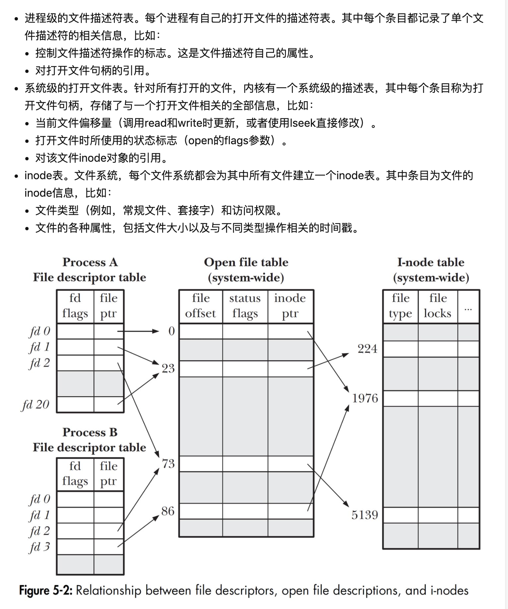

可以看到：进程A中，文件描述符1和20都指向同一个打开的文件句柄（标号为23），这可能是通过调用dup、dup2或fcntl形成的。进程A的文件描述符2和进程B的文件描述符2都指向同一个打开的文件句柄（标号为73），这可能是调用fork后出现的，即进程A与进程B是父子关系。进程A的文件描述符0和进程B的文件描述符3分别指向不同的打开文件句柄，但是这些句柄均指向inode表中的相同条目（1976），即指向同一文件。这可能因为每个进程各自对同一个文件发起了open调用，同一个进程两次打开同一文件，也会发生类似情况。

作者：Napoleon
链接：https://www.zhihu.com/question/403493643/answer/1695186981
来源：知乎
著作权归作者所有。商业转载请联系作者获得授权，非商业转载请注明出处。

# 子进程模式
* rr
* shared
```js
function listenInCluster(server, address, port, addressType,
                         backlog, fd, exclusive, flags) {
  exclusive = !!exclusive;

  if (cluster === undefined) cluster = require('cluster');
  // 如果是master，直接监听，这个已经分析过。  
  if (cluster.isMaster || exclusive) {
    // Will create a new handle
    // _listen2 sets up the listened handle, it is still named like this
    // to avoid breaking code that wraps this method
    server._listen2(address, port, addressType, backlog, fd, flags);
    return;
  }
  // 否则，为子进程，向主进程查询是否有server
  // 如果是linux等，则是rr模式，即在查询的时候（向主进程发送消息），主进程临时创建server并监听
  // 如果是windows，则是shared模式，即在查询的时候，主进程临时创建handle，并返回给子进程。子进程自己监听

  // 构建查询条件
  const serverQuery = {
    address: address,
    port: port,
    addressType: addressType,
    fd: fd,
    flags,
  };

  // 查询server，这里的cluster是 /lib/internal/cluster/child.js
  // Get the master's server handle, and listen on it
  cluster._getServer(server, serverQuery, listenOnMasterHandle);

  // 接下来是回调。注意：如果是rr模式，返回的handle的listen是空函数。(server._listen2其实是调用server.handle.listen)
  function listenOnMasterHandle(err, handle) {
    err = checkBindError(err, port, handle);

    if (err) {
      const ex = exceptionWithHostPort(err, 'bind', address, port);
      return server.emit('error', ex);
    }

    // Reuse master's server handle
    server._handle = handle;
    // _listen2 sets up the listened handle, it is still named like this
    // to avoid breaking code that wraps this method
    server._listen2(address, port, addressType, backlog, fd, flags);
  }
}
```

先看cluster._getServer
```js
// 文件位置：/lib/internal/cluster/child.js
cluster._getServer = function(obj, options, cb) {
  ...
  const message = {
    act: 'queryServer',
    index,
    data: null,
    ...options
  };

  message.address = address;
  ...
  send(message, (reply, handle) => {
    if (typeof obj._setServerData === 'function')
      obj._setServerData(reply.data);

    if (handle)
      shared(reply, handle, indexesKey, cb);  // Shared listen socket.
    else
      rr(reply, indexesKey, cb);              // Round-robin.
  });
  ...
};
```

可以看到，其实是send一个消息给主进程。

我们看看主进程拿到消息后，做了啥：
```js
// 文件位置：/lib/internal/cluster/child.js

// 先注册监听
...
worker.process.on('internalMessage', internal(worker, onmessage));
...


function onmessage(message, handle) {
  const worker = this;

  if (message.act === 'online')
    online(worker);
  else if (message.act === 'queryServer') // 这里有个queryServer的处理函数
    queryServer(worker, message);
  else if (message.act === 'listening')
    listening(worker, message);
  else if (message.act === 'exitedAfterDisconnect')
    exitedAfterDisconnect(worker, message);
  else if (message.act === 'close')
    close(worker, message);
}

// 看下主进程如何处理子进程查询服务的指令。
function queryServer(worker, message) {
  // Stop processing if worker already disconnecting
  if (worker.exitedAfterDisconnect)
    return;
  // 构建一个查询参数
  const key = `${message.address}:${message.port}:${message.addressType}:` +
              `${message.fd}:${message.index}`;
  let handle = handles.get(key);

  // 如果没有，则新建
  if (handle === undefined) {
    let address = message.address;

    // Find shortest path for unix sockets because of the ~100 byte limit
    if (message.port < 0 && typeof address === 'string' &&
        process.platform !== 'win32') {

      address = path.relative(process.cwd(), address);

      if (message.address.length < address.length)
        address = message.address;
    }
    // 最核心的就是构建方式，即constructor。
    // 首先默认是rr模式
    let constructor = RoundRobinHandle;
    // UDP is exempt from round-robin connection balancing for what should
    // be obvious reasons: it's connectionless. There is nothing to send to
    // the workers except raw datagrams and that's pointless.
    if (schedulingPolicy !== SCHED_RR ||
        message.addressType === 'udp4' ||
        message.addressType === 'udp6') {// 在某些条件下，设置为shared模式
      constructor = SharedHandle;
    }

    // 创建handle，这个就是要返回的东西
    handle = new constructor(key, address, message);
    handles.set(key, handle);
  }

  if (!handle.data)
    handle.data = message.data;

  // 创建完后，向子进程发送handle。
  // Set custom server data
  handle.add(worker, (errno, reply, handle) => {
    const { data } = handles.get(key);

    if (errno)
      handles.delete(key);  // Gives other workers a chance to retry.

    send(worker, {
      errno,
      key,
      ack: message.seq,
      data,
      ...reply
    }, handle);
  });
}
```

接下来我们看看两种构建handle的方法有啥区别，即RoundRobinHandle，SharedHandle

先看rr模式
```js
// 文件位置：/lib/internal/cluster/round_robin_handle.js
// 其实很简单，就是1.创建server;2.同时监听
// 这里有个非常重要的点：rr模式下会注册onconnection = (err, handle) => this.distribute(err, handle);
// 主进程分发链接就在this.distribute。
function RoundRobinHandle(key, address, { port, fd, flags }) {
  this.key = key;
  this.all = new Map();
  this.free = new Map();
  this.handles = [];
  this.handle = null;
  // 1.创建server
  this.server = net.createServer(assert.fail);

  if (fd >= 0)
    this.server.listen({ fd });
  else if (port >= 0) {
    // 2.监听
    this.server.listen({
      port,
      host: address,
      // Currently, net module only supports `ipv6Only` option in `flags`.
      ipv6Only: Boolean(flags & constants.UV_TCP_IPV6ONLY),
    });
  } else
    this.server.listen(address);  // UNIX socket path.

  this.server.once('listening', () => {
    this.handle = this.server._handle;
    this.handle.onconnection = (err, handle) => this.distribute(err, handle);// 这里向子进程分发新链接
    this.server._handle = null;
    this.server = null;
  });
}

// 同时我们看下handle.add方法（即向子进程发送handle的方法）
// 从下面代码中我们看到，send最后一个参数handle都是null。
// 子进程就通过handle为null，判断是rr模式
RoundRobinHandle.prototype.add = function(worker, send) {
  assert(this.all.has(worker.id) === false);
  this.all.set(worker.id, worker);

  const done = () => {
    if (this.handle.getsockname) {
      const out = {};
      this.handle.getsockname(out);
      // TODO(bnoordhuis) Check err.
      send(null, { sockname: out }, null);
    } else {
      send(null, null, null);  // UNIX socket.
    }

    this.handoff(worker);  // In case there are connections pending.
  };

  if (this.server === null)
    return done();

  // Still busy binding.
  this.server.once('listening', done);
  this.server.once('error', (err) => {
    send(err.errno, null);
  });
};

// 分发新到来的链接
RoundRobinHandle.prototype.distribute = function(err, handle) {
  this.handles.push(handle);
  const [ workerEntry ] = this.free;

  if (ArrayIsArray(workerEntry)) {
    const [ workerId, worker ] = workerEntry;
    this.free.delete(workerId);
    this.handoff(worker);
  }
};

RoundRobinHandle.prototype.handoff = function(worker) {
  if (!this.all.has(worker.id)) {
    return;  // Worker is closing (or has closed) the server.
  }

  const handle = this.handles.shift();

  if (handle === undefined) {
    this.free.set(worker.id, worker);  // Add to ready queue again.
    return;
  }

  const message = { act: 'newconn', key: this.key };
  // 调用sendHelper发送handle。
  sendHelper(worker.process, message, handle, (reply) => {
    if (reply.accepted)
      handle.close();
    else
      this.distribute(0, handle);  // Worker is shutting down. Send to another.

    this.handoff(worker);
  });
};
```


再看shared模式
```js
// 文件位置：/lib/internal/cluster/shared_handle.js
// 可以看到，这里只是创建了handle：net._createServerHandle
// 并没有监听

// 然后在SharedHandle.prototype.add中，将这个handle真正地send给子进程（send最后一个参数）。
// 子进程通过判断handle不为空，识别出是shared模式
function SharedHandle(key, address, { port, addressType, fd, flags }) {
  this.key = key;
  this.workers = new Map();
  this.handle = null;
  this.errno = 0;

  let rval;
  if (addressType === 'udp4' || addressType === 'udp6')
    rval = dgram._createSocketHandle(address, port, addressType, fd, flags);
  else
    rval = net._createServerHandle(address, port, addressType, fd, flags);

  if (typeof rval === 'number')
    this.errno = rval;
  else
    this.handle = rval;
}

SharedHandle.prototype.add = function(worker, send) {
  assert(!this.workers.has(worker.id));
  this.workers.set(worker.id, worker);
  send(this.errno, null, this.handle);
};
```

接下来，我们再看看主进程启动的流程：
```js
// 文件位置：/lib/internal/cluster/master.js
cluster.fork = function(env) {
  cluster.setupMaster();
  const id = ++ids;
  const workerProcess = createWorkerProcess(id, env);
  const worker = new Worker({
    id: id,
    process: workerProcess
  });
  ...
  
  return worker;
};

// createWorkerProcess主要是通过fork，调用底层child_process的spawn出子进程

function createWorkerProcess(id, env) {
  const workerEnv = { ...process.env, ...env, NODE_UNIQUE_ID: `${id}` };
  const execArgv = [...cluster.settings.execArgv];
  const debugArgRegex = /--inspect(?:-brk|-port)?|--debug-port/;
  const nodeOptions = process.env.NODE_OPTIONS ?
    process.env.NODE_OPTIONS : '';

  ...

  return fork(cluster.settings.exec, cluster.settings.args, {
    cwd: cluster.settings.cwd,
    env: workerEnv,
    serialization: cluster.settings.serialization,
    silent: cluster.settings.silent,
    windowsHide: cluster.settings.windowsHide,
    execArgv: execArgv,
    stdio: cluster.settings.stdio,
    gid: cluster.settings.gid,
    uid: cluster.settings.uid
  });
}
```

```js
// 文件位置: /lib/child_process.js
function fork(modulePath /* , args, options */) {
  validateString(modulePath, 'modulePath');
  ...

  return spawn(options.execPath, args, options);
}

function spawn(file, args, options) {
  const child = new ChildProcess();

  options = normalizeSpawnArguments(file, args, options);
  debug('spawn', options);
  child.spawn(options);

  return child;
}
```

再来看ChildProcess
```js
// 文件位置：/lib/internal/child_process.js
function ChildProcess() {
  EventEmitter.call(this);

  ...

  this._handle = new Process();
  this._handle[owner_symbol] = this;

  ...
  };
}
// spawn出新进程时，确定序列化的方式
ChildProcess.prototype.spawn = function(options) {
  let i = 0;

  if (options === null || typeof options !== 'object') {
    throw new ERR_INVALID_ARG_TYPE('options', 'Object', options);
  }

  // If no `stdio` option was given - use default
  let stdio = options.stdio || 'pipe';
  // 这里的getValidStdio中，如果是ipc，是初始化了一个Pipe（/src/pipe_wrap.cc）
  // pipe_wrap其实调用uv的方法，初始化一个基类stream，设定起ipc=true
    // 以下为uv_pipe_init的方法
      // int uv_pipe_init(uv_loop_t* loop, uv_pipe_t* handle, int ipc) {
      //   uv__stream_init(loop, (uv_stream_t*)handle, UV_NAMED_PIPE);
      //   handle->shutdown_req = NULL;
      //   handle->connect_req = NULL;
      //   handle->pipe_fname = NULL;
      //   handle->ipc = ipc;
      //   return 0;
      // }
  stdio = getValidStdio(stdio, false);
  // 注意，这里的ipc，就是后面指的channel，传递消息writeChannelMessage(channel, req, message, handle) {}中的channel。
  // 比如：发送json类型的信息：channel.writeUtf8String(req, string, handle);
  const ipc = stdio.ipc;
  const ipcFd = stdio.ipcFd;
  stdio = options.stdio = stdio.stdio;

  if (options.serialization !== undefined &&
      options.serialization !== 'json' &&
      options.serialization !== 'advanced') {
    throw new ERR_INVALID_OPT_VALUE('options.serialization',
                                    options.serialization);
  }
  // 这里确定序列化的模式，是json，还是advanced。不同的方式，对应的
  const serialization = options.serialization || 'json';

  if (ipc !== undefined) {
    // Let child process know about opened IPC channel
    if (options.envPairs === undefined)
      options.envPairs = [];
    else if (!ArrayIsArray(options.envPairs)) {
      throw new ERR_INVALID_ARG_TYPE('options.envPairs',
                                     'Array',
                                     options.envPairs);
    }

    options.envPairs.push(`NODE_CHANNEL_FD=${ipcFd}`);
    options.envPairs.push(`NODE_CHANNEL_SERIALIZATION_MODE=${serialization}`);
  }

  ...

  const err = this._handle.spawn(options);

  ...

  this.pid = this._handle.pid;

  ...

  for (i = 0; i < stdio.length; i++)
    this.stdio.push(stdio[i].socket === undefined ? null : stdio[i].socket);

  // Add .send() method and start listening for IPC data
  if (ipc !== undefined) setupChannel(this, ipc, serialization);

  return err;
};


// 再来看setupChannel

function setupChannel(target, channel, serializationMode) {
  const control = new Control(channel);
  target.channel = control;
  target[kChannelHandle] = channel;

  ...

  target._handleQueue = null;
  target._pendingMessage = null;

  if (serialization === undefined)
    serialization = require('internal/child_process/serialization');

  // 这里确定序列化的方式：serializationMode一般是json
  const {
    initMessageChannel,
    parseChannelMessages,
    writeChannelMessage
  } = serialization[serializationMode];

  let pendingHandle = null;
  initMessageChannel(channel);
  channel.pendingHandle = null;
  channel.onread = function(arrayBuffer) {
    const recvHandle = channel.pendingHandle;
    channel.pendingHandle = null;
    if (arrayBuffer) {
      const nread = streamBaseState[kReadBytesOrError];
      const offset = streamBaseState[kArrayBufferOffset];
      const pool = new Uint8Array(arrayBuffer, offset, nread);
      if (recvHandle)
        pendingHandle = recvHandle;

      for (const message of parseChannelMessages(channel, pool)) {
        // There will be at most one NODE_HANDLE message in every chunk we
        // read because SCM_RIGHTS messages don't get coalesced. Make sure
        // that we deliver the handle with the right message however.
        if (isInternal(message)) {
          if (message.cmd === 'NODE_HANDLE') {
            handleMessage(message, pendingHandle, true);
            pendingHandle = null;
          } else {
            handleMessage(message, undefined, true);
          }
        } else {
          handleMessage(message, undefined, false);
        }
      }
    } else {
      this.buffering = false;
      target.disconnect();
      channel.onread = nop;
      channel.close();
      target.channel = null;
      maybeClose(target);
    }
  };

  // Object where socket lists will live
  channel.sockets = { got: {}, send: {} };

  // Handlers will go through this
  target.on('internalMessage', function(message, handle) {
    // Once acknowledged - continue sending handles.
    if (message.cmd === 'NODE_HANDLE_ACK' ||
        message.cmd === 'NODE_HANDLE_NACK') {

      if (target._pendingMessage) {
        if (message.cmd === 'NODE_HANDLE_ACK') {
          closePendingHandle(target);
        } else if (target._pendingMessage.retransmissions++ ===
                   MAX_HANDLE_RETRANSMISSIONS) {
          closePendingHandle(target);
          process.emitWarning('Handle did not reach the receiving process ' +
                              'correctly', 'SentHandleNotReceivedWarning');
        }
      }

      assert(ArrayIsArray(target._handleQueue));
      const queue = target._handleQueue;
      target._handleQueue = null;

      if (target._pendingMessage) {
        target._send(target._pendingMessage.message,
                     target._pendingMessage.handle,
                     target._pendingMessage.options,
                     target._pendingMessage.callback);
      }

      for (let i = 0; i < queue.length; i++) {
        const args = queue[i];
        target._send(args.message, args.handle, args.options, args.callback);
      }

      // Process a pending disconnect (if any).
      if (!target.connected && target.channel && !target._handleQueue)
        target._disconnect();

      return;
    }

    if (message.cmd !== 'NODE_HANDLE') return;

    // It is possible that the handle is not received because of some error on
    // ancillary data reception such as MSG_CTRUNC. In this case, report the
    // sender about it by sending a NODE_HANDLE_NACK message.
    if (!handle)
      return target._send({ cmd: 'NODE_HANDLE_NACK' }, null, true);

    // Acknowledge handle receival. Don't emit error events (for example if
    // the other side has disconnected) because this call to send() is not
    // initiated by the user and it shouldn't be fatal to be unable to ACK
    // a message.
    target._send({ cmd: 'NODE_HANDLE_ACK' }, null, true);

    const obj = handleConversion[message.type];

    // Update simultaneous accepts on Windows
    if (process.platform === 'win32') {
      handle.setSimultaneousAccepts(false);
    }

    // Convert handle object
    obj.got.call(this, message, handle, (handle) => {
      handleMessage(message.msg, handle, isInternal(message.msg));
    });
  });

  target.send = function(message, handle, options, callback) {
    if (typeof handle === 'function') {
      callback = handle;
      handle = undefined;
      options = undefined;
    } else if (typeof options === 'function') {
      callback = options;
      options = undefined;
    } else if (options !== undefined &&
               (options === null || typeof options !== 'object')) {
      throw new ERR_INVALID_ARG_TYPE('options', 'Object', options);
    }

    options = { swallowErrors: false, ...options };

    if (this.connected) {
      return this._send(message, handle, options, callback);
    }
    const ex = new ERR_IPC_CHANNEL_CLOSED();
    if (typeof callback === 'function') {
      process.nextTick(callback, ex);
    } else {
      process.nextTick(() => this.emit('error', ex));
    }
    return false;
  };

  target._send = function(message, handle, options, callback) {
    assert(this.connected || this.channel);

    if (message === undefined)
      throw new ERR_MISSING_ARGS('message');

    // Non-serializable messages should not reach the remote
    // end point; as any failure in the stringification there
    // will result in error message that is weakly consumable.
    // So perform a sanity check on message prior to sending.
    if (typeof message !== 'string' &&
        typeof message !== 'object' &&
        typeof message !== 'number' &&
        typeof message !== 'boolean') {
      throw new ERR_INVALID_ARG_TYPE(
        'message', ['string', 'object', 'number', 'boolean'], message);
    }

    // Support legacy function signature
    if (typeof options === 'boolean') {
      options = { swallowErrors: options };
    }

    let obj;

    // Package messages with a handle object
    if (handle) {
      // This message will be handled by an internalMessage event handler
      message = {
        cmd: 'NODE_HANDLE',
        type: null,
        msg: message
      };

      if (handle instanceof net.Socket) {
        message.type = 'net.Socket';
      } else if (handle instanceof net.Server) {
        message.type = 'net.Server';
      } else if (handle instanceof TCP || handle instanceof Pipe) {
        message.type = 'net.Native';
      } else if (handle instanceof dgram.Socket) {
        message.type = 'dgram.Socket';
      } else if (handle instanceof UDP) {
        message.type = 'dgram.Native';
      } else {
        throw new ERR_INVALID_HANDLE_TYPE();
      }

      // Queue-up message and handle if we haven't received ACK yet.
      if (this._handleQueue) {
        this._handleQueue.push({
          callback: callback,
          handle: handle,
          options: options,
          message: message.msg,
        });
        return this._handleQueue.length === 1;
      }

      obj = handleConversion[message.type];

      // convert TCP object to native handle object
      handle = handleConversion[message.type].send.call(target,
                                                        message,
                                                        handle,
                                                        options);

      // If handle was sent twice, or it is impossible to get native handle
      // out of it - just send a text without the handle.
      if (!handle)
        message = message.msg;

      // Update simultaneous accepts on Windows
      if (obj.simultaneousAccepts && process.platform === 'win32') {
        handle.setSimultaneousAccepts(true);
      }
    } else if (this._handleQueue &&
               !(message && (message.cmd === 'NODE_HANDLE_ACK' ||
                             message.cmd === 'NODE_HANDLE_NACK'))) {
      // Queue request anyway to avoid out-of-order messages.
      this._handleQueue.push({
        callback: callback,
        handle: null,
        options: options,
        message: message,
      });
      return this._handleQueue.length === 1;
    }

    const req = new WriteWrap();

    const err = writeChannelMessage(channel, req, message, handle);
    const wasAsyncWrite = streamBaseState[kLastWriteWasAsync];

    if (err === 0) {
      if (handle) {
        if (!this._handleQueue)
          this._handleQueue = [];
        if (obj && obj.postSend)
          obj.postSend(message, handle, options, callback, target);
      }

      if (wasAsyncWrite) {
        req.oncomplete = () => {
          control.unrefCounted();
          if (typeof callback === 'function')
            callback(null);
        };
        control.refCounted();
      } else if (typeof callback === 'function') {
        process.nextTick(callback, null);
      }
    } else {
      // Cleanup handle on error
      if (obj && obj.postSend)
        obj.postSend(message, handle, options, callback);

      if (!options.swallowErrors) {
        const ex = errnoException(err, 'write');
        if (typeof callback === 'function') {
          process.nextTick(callback, ex);
        } else {
          process.nextTick(() => this.emit('error', ex));
        }
      }
    }

    /* If the master is > 2 read() calls behind, please stop sending. */
    return channel.writeQueueSize < (65536 * 2);
  };

  // Connected will be set to false immediately when a disconnect() is
  // requested, even though the channel might still be alive internally to
  // process queued messages. The three states are distinguished as follows:
  // - disconnect() never requested: channel is not null and connected
  //   is true
  // - disconnect() requested, messages in the queue: channel is not null
  //   and connected is false
  // - disconnect() requested, channel actually disconnected: channel is
  //   null and connected is false
  target.connected = true;

  target.disconnect = function() {
    if (!this.connected) {
      this.emit('error', new ERR_IPC_DISCONNECTED());
      return;
    }

    // Do not allow any new messages to be written.
    this.connected = false;

    // If there are no queued messages, disconnect immediately. Otherwise,
    // postpone the disconnect so that it happens internally after the
    // queue is flushed.
    if (!this._handleQueue)
      this._disconnect();
  };

  target._disconnect = function() {
    assert(this.channel);

    // This marks the fact that the channel is actually disconnected.
    this.channel = null;
    this[kChannelHandle] = null;

    if (this._pendingMessage)
      closePendingHandle(this);

    let fired = false;
    function finish() {
      if (fired) return;
      fired = true;

      channel.close();
      target.emit('disconnect');
    }

    // If a message is being read, then wait for it to complete.
    if (channel.buffering) {
      this.once('message', finish);
      this.once('internalMessage', finish);

      return;
    }

    process.nextTick(finish);
  };

  function emit(event, message, handle) {
    target.emit(event, message, handle);
  }

  function handleMessage(message, handle, internal) {
    if (!target.channel)
      return;

    const eventName = (internal ? 'internalMessage' : 'message');

    process.nextTick(emit, eventName, message, handle);
  }

  channel.readStart();
  return control;
}


```
// target._send是调用了writeChannelMessage，我们看下它的实现
```js
// 文件位置：/lib/internal/child_process/serialization.js
const advanced = {
  initMessageChannel(channel) {
    channel[kMessageBuffer] = Buffer.alloc(0);
    channel.buffering = false;
  },

  *parseChannelMessages(channel, readData) {
    if (readData.length === 0) return;

    let messageBuffer = Buffer.concat([channel[kMessageBuffer], readData]);
    while (messageBuffer.length > 4) {
      const size = messageBuffer.readUInt32BE();
      if (messageBuffer.length < 4 + size) {
        break;
      }

      const deserializer = new ChildProcessDeserializer(
        messageBuffer.subarray(4, 4 + size));
      messageBuffer = messageBuffer.subarray(4 + size);

      deserializer.readHeader();
      yield deserializer.readValue();
    }
    channel[kMessageBuffer] = messageBuffer;
    channel.buffering = messageBuffer.length > 0;
  },

  writeChannelMessage(channel, req, message, handle) {
    const ser = new ChildProcessSerializer();
    ser.writeHeader();
    ser.writeValue(message);
    const serializedMessage = ser.releaseBuffer();
    const sizeBuffer = Buffer.allocUnsafe(4);
    sizeBuffer.writeUInt32BE(serializedMessage.length);
    return channel.writeBuffer(req, Buffer.concat([
      sizeBuffer,
      serializedMessage
    ]), handle);
  },
};

const json = {
  initMessageChannel(channel) {
    channel[kJSONBuffer] = '';
    channel[kStringDecoder] = undefined;
  },

  *parseChannelMessages(channel, readData) {
    if (readData.length === 0) return;

    if (channel[kStringDecoder] === undefined)
      channel[kStringDecoder] = new StringDecoder('utf8');
    const chunks = channel[kStringDecoder].write(readData).split('\n');
    const numCompleteChunks = chunks.length - 1;
    // Last line does not have trailing linebreak
    const incompleteChunk = chunks[numCompleteChunks];
    if (numCompleteChunks === 0) {
      channel[kJSONBuffer] += incompleteChunk;
    } else {
      chunks[0] = channel[kJSONBuffer] + chunks[0];
      for (let i = 0; i < numCompleteChunks; i++)
        yield JSONParse(chunks[i]);
      channel[kJSONBuffer] = incompleteChunk;
    }
    channel.buffering = channel[kJSONBuffer].length !== 0;
  },

  writeChannelMessage(channel, req, message, handle) {
    const string = JSONStringify(message) + '\n';
    return channel.writeUtf8String(req, string, handle);
  },
};

module.exports = { advanced, json };
```
# fs之三种方式：同步，异步，promise
1.readFile会调用read,read:
```js
const req = new FSReqCallback();
  req.oncomplete = wrapper;

  binding.read(fd, buffer, offset, length, position, req);
```
这里封装了一个FSReqCallback对象req，传到binding.read

2.如果是readFileSync会调用readSync，readSync:
```js
const result = binding.read(fd, buffer, offset, length, position,
                              undefined, ctx);
```
这里传递了一个undefined。

3.如果是promise形式
```js
lib/internal/fs/promises.js
const bytesRead = (await binding.read(handle.fd, buffer, offset, length,
                                        position, kUsePromises)) || 0;
```
这里传递了一个kUsePromises

针对1和3，c++中统一封装为：req_wrap_async

```c++
FSReqBase* req_wrap_async = GetReqWrap(args, 5);
  if (req_wrap_async != nullptr) {  // read(fd, buffer, offset, len, pos, req)
    AsyncCall(env, req_wrap_async, args, "read", UTF8, AfterInteger,
              uv_fs_read, fd, &uvbuf, 1, pos);
  }


FSReqBase* GetReqWrap(const v8::FunctionCallbackInfo<v8::Value>& args,
                      int index,
                      bool use_bigint) {
  v8::Local<v8::Value> value = args[index];
  // 如果是普通对象，则直接返回FSReqBase
  if (value->IsObject()) {
    return Unwrap<FSReqBase>(value.As<v8::Object>());
  }

  BindingData* binding_data = Unwrap<BindingData>(args.Data());
  Environment* env = binding_data->env();
  // 如果是promise,则返回一个FSReqPromise
  if (value->StrictEquals(env->fs_use_promises_symbol())) {
    if (use_bigint) {
      return FSReqPromise<AliasedBigUint64Array>::New(binding_data, use_bigint);
    } else {
      return FSReqPromise<AliasedFloat64Array>::New(binding_data, use_bigint);
    }
  }
  return nullptr;
}
```
# fs needReadable的判断
取自官方源码注释
```js
// The stream needs another readable event if:
// 1. It is not flowing, as the flow mechanism will take
//    care of it.
// 2. It is not ended.
// 3. It is below the highWaterMark, so we can schedule
//    another readable later.
state.needReadable =
  !state.flowing &&
  !state.ended &&
  state.length <= state.highWaterMark;
```

# stream on data和readable并存


可以看出，readable和data是可以共存的。

另外也可以看到，data事件触发的点可以总结为，当数据即将丢失的那一刻：
* 如果只有data事件注册，那么当push后，数据不会存在buffer中，此时即可emit data
* 如果同时注册了data和readable事件，当push后，数据将会临时保存在state的buffer中，此时数据是安全的，也不会触发data，只会触发一个readable。当readable的回调执行read()时，此时将会从state buffer中截取已经读取的数据。此时数据将丢失，所以此时也会触发一个data事件。

所以，data事件可以抽象为：当数据离开源和state的buffer，即将丢弃时。

# fs stream总结
> read源码的功能点(388-518)
> * 判断n (388-401)
> * n非0时，emittedReadable设置为false(403-404)
> * 如果n为0，且buffer中数据已满，且有needReadable，则直接emit readable,结束(406-421)
>   * 如果buffer已满，但是n不为0，则再继续读一次
> * 再次计算n，如果为0且ended，触发endReadable(425-430)
> * 判断是否需要doRead  （没有在读取中，且还没有达到highWaterMark）（455-470）
> * 需要执行读取操作。如果state当前为0（一点也没有，则需要设置needReadable;如果有一点，则不用）（475-476）
> * 执行读取操作（478）
> * 获取当前buffer中有的数据，给到ret（486-490）
> * emit data事件

> read(0)的功能：
> 如果state中没有数据，则触发一次_read，从底层读取数据
> 如果state中有数据：
> 1.如果数据已满，则直接触发readable事件，并返回
> 2.如果数据没满，则触发一次_read，已有的数据并不会拿出来（因为n为0）
> 总结为：如果数据满了，则触发readable，否则只是触发_read，从底层读取数据而已。

> read()的功能：
> 如果state中没有数据，则触发一次_read
> 如果state中有数据：
> 1. 如果数据已满，则触发一次_read，并把state中的数据取出来（同时触发data事件）
> 2. 如果数据没满，则还是触发一次_read，并把state中的数据取出来（同时触发data事件）
> 总结为：总会触发一次_read；如果有数据，则取出来。

> read(n)的功能：
> 如果state中没有数据，howMuchToRead返回0，则只会触发一次_read
> 如果state中有数据：
> 1. n小于等于state.length,则触发一次_read，并把state中的数据取出来（同时触发data事件）
> 2. n大于state.length,则还是触发一次_read，但是howMuchToRead返回0，标识数据不足，不再做任何处理
> 总结为：总会触发一次_read；如果有足够（大于等于n）数据，则取出来。

>大总结：
>read一般总会触发底层的_read事件（除非明确指明read(0)，且数据已满）
>非read(0)时的调用，如果state中的数据足够多，则取出来

# fs同步方式可能会导致buffer中的数据超过highWaterMark。
```js
Readable.prototype.read = function(n) {
  ... // 判断n

  ... // 如果read(0)且已满，则直接返回触发readable 

  n = howMuchToRead(n, state);

  // If we've ended, and we're now clear, then finish it up.
  if (n === 0 && state.ended) {
    if (state.length === 0)
      endReadable(this);
    return null;
  }

  

  // 如果此时state中buffer刚刚满，则 state.length - n < state.highWaterMark,所以会继续读
  if (state.length === 0 || state.length - n < state.highWaterMark) {
    doRead = true;
    debug('length less than watermark', doRead);
  }

  if (state.ended || state.reading || state.destroyed || state.errored) {
    doRead = false;
    debug('reading or ended', doRead);
  } else if (doRead) {
    debug('do read');
    state.reading = true;
    state.sync = true;
    // 如果_read是同步模式，那么会继续往state.buffer中push数据，导致state.length超过highWaterMark。
    // 不过没关系，这里只会出现一次，下面将会把state.buffer中的数据取出。
    // 如果n=0，也没关系，因为下一次read，会出现state.length - n < state.highWaterMark 不满足，导致doRead为false，不再读取。
    this._read(state.highWaterMark);
    state.sync = false;
  }

  ...
};
```

# timer使用的双向链表

# net.js和http.js的对比
首先看下样例代码:
1. 通过net.js启动的服务
```js
const net = require('net');
const server = net.createServer((c) => {
  console.log('new connection');// 某个新tcp链接（用户）到来
  c.on('data', () => {
      console.log('data event');
  })
});
```
2. 通过http.js启动的服务
```js
const http = require('http');
const server = http.createServer((req, res) => {
  console.log('new request');// 某个新请求到来
  req.on('data', (data) => {
    console.log('data received');// 请求的数据到来。
  })
});
```
* net.js启动的服务，是以tcp三次握手和真实数据传输为分界点：
  * 三次握手后触发业务回调；
  * 真实数据传输触发c.on('data')回调
* http.js启动的服务，是以头部和body为分界点：
  * 三次握手，设置解析器，解析完头部后，触发业务回调
  * body数据传输后，触发req.on('data')回调

画一张草图，简要表示数据流的区别：


# process.nextTick 队列和microtak队列
以下为官方解释（https://nodejs.org/api/）
* process.nextTick() adds callback to the "next tick queue". This queue is fully drained after the current operation on the JavaScript stack runs to completion and before the event loop is allowed to continue. It's possible to create an infinite loop if one were to recursively call process.nextTick(). See the Event Loop guide for more background.
（https://nodejs.org/api/process.html）

* The microtask queue is managed by V8 and may be used in a similar manner to the process.nextTick() queue, which is managed by Node.js. The process.nextTick() queue is always processed before the microtask queue within each turn of the Node.js event loop.

* Removed `process.maxTickDepth`, allowing `process.nextTick` to be used recursively without limit

小结：
* v8维持着一个microtask queue（/deps/src/execution/microtask-queue.cc）
* nodejs维持着一个task_queue（其实是microtask_queue）(/src/node_task_queue.cc + /lib/internal/process/task_queue.js)
* 这里的nextTick的含义，侧重在next tick queue上，即在event loop继续往下走之前（下一个c++/js穿越）之前要清理的队列任务。大多数时候困扰在于，以为是在下一个c++/js穿越后执行。
 
# 多个服务实例
一个nodejs进程，可以运行多个服务实例
const server1 = net.createServer()
const server2 = new.createServer();

server1.listen(8080)
server2.listen(8081)


# node loader


# 文件读写操作和网络请求的区别。
文件读写操作，本质上是对文件创建一个fd进行操作。这个远程请求本质上是一样的，只不过系统把网卡当做fd来处理。
# 一次读取大小
首先，需要解读一下读取前的配置逻辑。
在上一章的2.6小节中，我们知道stream.alloc_cb其实是
```c++
// 文件地址：/src/stream_wrap.cc
[](uv_handle_t* handle, size_t suggested_size, uv_buf_t* buf) {
    static_cast<LibuvStreamWrap*>(handle->data)->OnUvAlloc(suggested_size, buf);
  }

// 文件地址：/deps/uv/src/uv-common.c 
// todo uv_buf_init端点确认细节
uv_buf_t uv_buf_init(char* base, unsigned int len) {
  uv_buf_t buf;
  buf.base = base;
  buf.len = len;
  return buf;
}
```

而在uv__read中，是这样调用它的：
```js
static void uv__read(uv_stream_t* stream) {
    ...
  while (stream->read_cb && (stream->flags & UV_HANDLE_READING) && (count-- > 0)) {
      ...
    stream->alloc_cb((uv_handle_t*)stream, 64 * 1024, &buf);
    ...
    stream->read_cb()
  }
  ...
}
```

可见，这里分配了一个 64 * 1024 = 65536bytes大小的读取量，然后调用读取方法stream->read_cb()进行读取。


# 如何解析req请求
#### 2.2.3 现代框架中如何区分？
现在的框架中，一般使用bodyparser之类的库来解析。我们来看戏koa-bodyparser是怎么做到。

koa-bodyparser
```js
// 文件：npm库koa-bodyparser index.js
var parse = require('co-body');
...
module.exports = function (opts) {
  ...

  return async function bodyParser(ctx, next) {
    ...
        const res = await parseBody(ctx);
    ...
  };

  async function parseBody(ctx) {
    if (enableJson && ((detectJSON && detectJSON(ctx)) || ctx.request.is(jsonTypes))) {
      return await parse.json(ctx, jsonOpts);
    }
    ...
    return {};
  }
};
```
可以看出它依赖了require('co-body')来解析。

```js
// 文件：npm库 co-body
const raw = require('raw-body');
...
// 这里的req就是ctx
module.exports = async function(req, opts) {
  ...
  // 读取headers中的content-length
  let len = req.headers['content-length'];
  const encoding = req.headers['content-encoding'] || 'identity';
  if (len && encoding === 'identity') opts.length = len = ~~len;

  const str = await raw(inflate(req), opts); // inflate 解压缩http数据流
  ...
};
```
这里，co-body通过require('raw-body')，来读取原生的字符串。

玄机就在raw-body这里。
```js
// 文件：npm库 raw-body
// 这里的stream其实还是ctx
function getRawBody (stream, options, callback) {
  
  var length = opts.length != null && !isNaN(opts.length)
    ? parseInt(opts.length, 10)
    : null
  
  if (done) {
    // classic callback style
    return readStream(stream, encoding, length, limit, done)
  }

  return new Promise(function executor (resolve, reject) {
    readStream(stream, encoding, length, limit, function onRead (err, buf) {
      if (err) return reject(err)
      resolve(buf)
    })
  })
}
...
function readStream (stream, encoding, length, limit, callback) {
  ...
  // attach listeners
  stream.on('aborted', onAborted)
  stream.on('close', cleanup)
  stream.on('data', onData)
  stream.on('end', onEnd)
  stream.on('error', onEnd)

  // mark sync section complete
  sync = false

  function done () {
    ...
  }

  function onAborted () {
    ...
  }

  function onData (chunk) {
    ...
  }

  function onEnd (err) {
    ...
  }

  function cleanup () {
    ...
  }
}
```
可以看出，这里通过readStream来读取。读取的大小就在于length。
这个length就是在co-body中，通过let len = req.headers['content-length'];来读取的。
通过Content-Length来判断一个请求的大小。


由此来看，对于post类型的请求，我们要寻找的“请求结束标识”，就是请求头中的‘content-lenght’, 即headers['content-length']


一般我们用koa-bodyparser时，都会设置一个大小限制
```js
// 业务代码
app.use(bodyParser({
    formLimit: limitVal,
    jsonLimit: limitVal,
}));

// 文件地址：npm koa-bodyparser

function formatOptions(opts, type) {
  var res = {};
  copy(opts).to(res);
  res.limit = opts[type + 'Limit'];
  return res;
}

// 文件地址：npm co-body
opts.limit = opts.limit || '1mb';

// 文件地址：npm raw-body
 var limit = bytes.parse(opts.limit)
...
function onData (chunk) {
  if (complete) return

  received += chunk.length

  if (limit !== null && received > limit) { // 超过大小限制
    done(createError(413, 'request entity too large', {
      limit: limit,
      received: received,
      type: 'entity.too.large'
    }))
  } else if (decoder) {
    buffer += decoder.write(chunk)
  } else {
    buffer.push(chunk)
  }
}
```