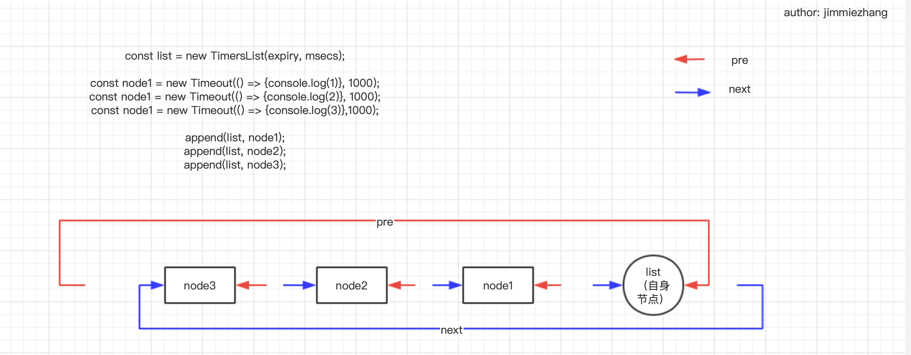
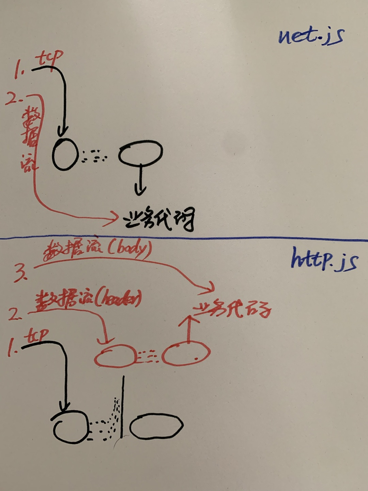
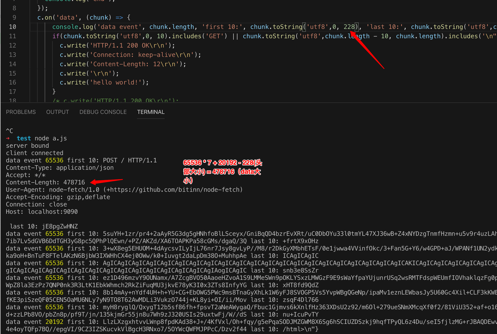

# timer使用的双向链表

# net.js和http.js的对比
首先看下样例代码:
1. 通过net.js启动的服务
```js
const net = require('net');
const server = net.createServer((c) => {
  console.log('new connection');// 某个新tcp链接（用户）到来
  c.on('data', () => {
      console.log('data event');
  })
});
```
2. 通过http.js启动的服务
```js
const http = require('http');
const server = http.createServer((req, res) => {
  console.log('new request');// 某个新请求到来
  req.on('data', (data) => {
    console.log('data received');// 请求的数据到来。
  })
});
```
* net.js启动的服务，是以tcp三次握手和真实数据传输为分界点：
  * 三次握手后触发业务回调；
  * 真实数据传输触发c.on('data')回调
* http.js启动的服务，是以头部和body为分界点：
  * 三次握手，设置解析器，解析完头部后，触发业务回调
  * body数据传输后，触发req.on('data')回调

画一张草图，简要表示数据流的区别：


# process.nextTick 队列和microtak队列
以下为官方解释（https://nodejs.org/api/）
* process.nextTick() adds callback to the "next tick queue". This queue is fully drained after the current operation on the JavaScript stack runs to completion and before the event loop is allowed to continue. It's possible to create an infinite loop if one were to recursively call process.nextTick(). See the Event Loop guide for more background.
（https://nodejs.org/api/process.html）

* The microtask queue is managed by V8 and may be used in a similar manner to the process.nextTick() queue, which is managed by Node.js. The process.nextTick() queue is always processed before the microtask queue within each turn of the Node.js event loop.

* Removed `process.maxTickDepth`, allowing `process.nextTick` to be used recursively without limit

小结：
* v8维持着一个microtask queue（/deps/src/execution/microtask-queue.cc）
* nodejs维持着一个task_queue（其实是microtask_queue）(/src/node_task_queue.cc + /lib/internal/process/task_queue.js)
 
# 多个服务实例
一个nodejs进程，可以运行多个服务实例
const server1 = net.createServer()
const server2 = new.createServer();

server1.listen(8080)
server2.listen(8081)


# node loader


# 一次读取大小
首先，需要解读一下读取前的配置逻辑。
在上一章的2.6小节中，我们知道stream.alloc_cb其实是
```c++
// 文件地址：/src/stream_wrap.cc
[](uv_handle_t* handle, size_t suggested_size, uv_buf_t* buf) {
    static_cast<LibuvStreamWrap*>(handle->data)->OnUvAlloc(suggested_size, buf);
  }

// 文件地址：/deps/uv/src/uv-common.c 
// todo uv_buf_init端点确认细节
uv_buf_t uv_buf_init(char* base, unsigned int len) {
  uv_buf_t buf;
  buf.base = base;
  buf.len = len;
  return buf;
}
```

而在uv__read中，是这样调用它的：
```js
static void uv__read(uv_stream_t* stream) {
    ...
  while (stream->read_cb && (stream->flags & UV_HANDLE_READING) && (count-- > 0)) {
      ...
    stream->alloc_cb((uv_handle_t*)stream, 64 * 1024, &buf);
    ...
    stream->read_cb()
  }
  ...
}
```

可见，这里分配了一个 64 * 1024 = 65536bytes大小的读取量，然后调用读取方法stream->read_cb()进行读取。


# 如何解析req请求
#### 2.2.3 现代框架中如何区分？
现在的框架中，一般使用bodyparser之类的库来解析。我们来看戏koa-bodyparser是怎么做到。

koa-bodyparser
```js
// 文件：npm库koa-bodyparser index.js
var parse = require('co-body');
...
module.exports = function (opts) {
  ...

  return async function bodyParser(ctx, next) {
    ...
        const res = await parseBody(ctx);
    ...
  };

  async function parseBody(ctx) {
    if (enableJson && ((detectJSON && detectJSON(ctx)) || ctx.request.is(jsonTypes))) {
      return await parse.json(ctx, jsonOpts);
    }
    ...
    return {};
  }
};
```
可以看出它依赖了require('co-body')来解析。

```js
// 文件：npm库 co-body
const raw = require('raw-body');
...
// 这里的req就是ctx
module.exports = async function(req, opts) {
  ...
  // 读取headers中的content-length
  let len = req.headers['content-length'];
  const encoding = req.headers['content-encoding'] || 'identity';
  if (len && encoding === 'identity') opts.length = len = ~~len;

  const str = await raw(inflate(req), opts); // inflate 解压缩http数据流
  ...
};
```
这里，co-body通过require('raw-body')，来读取原生的字符串。

玄机就在raw-body这里。
```js
// 文件：npm库 raw-body
// 这里的stream其实还是ctx
function getRawBody (stream, options, callback) {
  
  var length = opts.length != null && !isNaN(opts.length)
    ? parseInt(opts.length, 10)
    : null
  
  if (done) {
    // classic callback style
    return readStream(stream, encoding, length, limit, done)
  }

  return new Promise(function executor (resolve, reject) {
    readStream(stream, encoding, length, limit, function onRead (err, buf) {
      if (err) return reject(err)
      resolve(buf)
    })
  })
}
...
function readStream (stream, encoding, length, limit, callback) {
  ...
  // attach listeners
  stream.on('aborted', onAborted)
  stream.on('close', cleanup)
  stream.on('data', onData)
  stream.on('end', onEnd)
  stream.on('error', onEnd)

  // mark sync section complete
  sync = false

  function done () {
    ...
  }

  function onAborted () {
    ...
  }

  function onData (chunk) {
    ...
  }

  function onEnd (err) {
    ...
  }

  function cleanup () {
    ...
  }
}
```
可以看出，这里通过readStream来读取。读取的大小就在于length。
这个length就是在co-body中，通过let len = req.headers['content-length'];来读取的。
通过Content-Length来判断一个请求的大小。


由此来看，对于post类型的请求，我们要寻找的“请求结束标识”，就是请求头中的‘content-lenght’, 即headers['content-length']


一般我们用koa-bodyparser时，都会设置一个大小限制
```js
// 业务代码
app.use(bodyParser({
    formLimit: limitVal,
    jsonLimit: limitVal,
}));

// 文件地址：npm koa-bodyparser

function formatOptions(opts, type) {
  var res = {};
  copy(opts).to(res);
  res.limit = opts[type + 'Limit'];
  return res;
}

// 文件地址：npm co-body
opts.limit = opts.limit || '1mb';

// 文件地址：npm raw-body
 var limit = bytes.parse(opts.limit)
...
function onData (chunk) {
  if (complete) return

  received += chunk.length

  if (limit !== null && received > limit) { // 超过大小限制
    done(createError(413, 'request entity too large', {
      limit: limit,
      received: received,
      type: 'entity.too.large'
    }))
  } else if (decoder) {
    buffer += decoder.write(chunk)
  } else {
    buffer.push(chunk)
  }
}
```