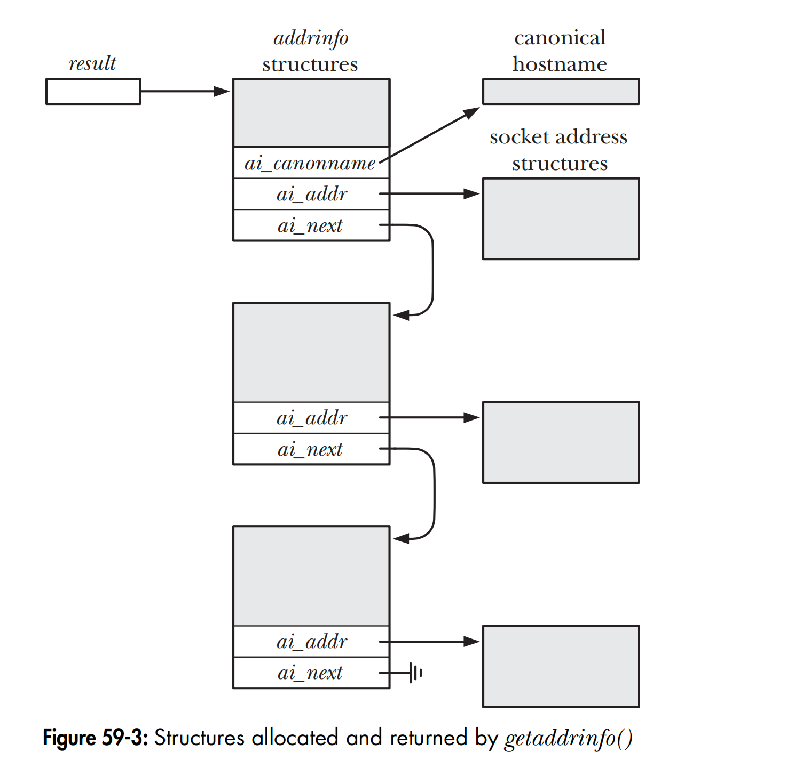
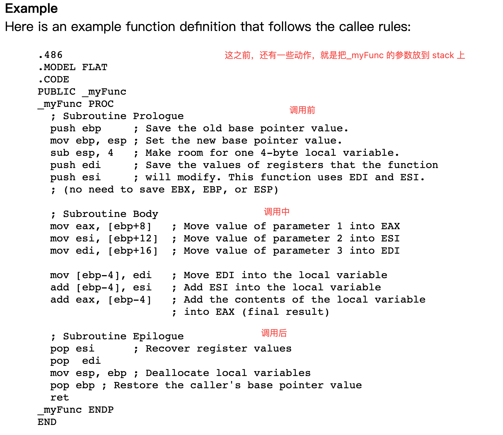

# ipv6only、ipv4/ipv6、ipv4only
  * ipv6only ipv4only网络下，只能请求对等的目标服务
    * 
  * 未来的大趋势是ipv6。可以用dual-stack（ipv4/6）来兼容
    * 这要求新部署的服务器要同时支持ipv4/6,不仅逻辑复杂，还浪费资源
    * 因此一些公司开始搭建ipv6 only 机房环境（确实有些新增应用不会访问ipv4）
  * 然而，世界上还有很多网络节点是在ipv4only下的，那么做到完全兼容呢？
    * 其实就是加个gateway，进行一层转换
    * 
# linux programming interface 一书：
* 历史：
  * unix是at&t实验室的thompson发明的
  * 由于当时at&t当时政府控诉垄断，因此unix无法被销售，所以at&t 把unix贡献给了大学
  * 开始分化：
    * bsd版本：thompson 回到伯克利大学，然后和学生对unix做了很多改进，形成了bsd版本
    * systemv版本：后来政府控诉 at&t 垄断结束，at&t 开始销售unix，并持续演化，形成了system v版本
  * stallman 不满足于商业化，开始gnu。不过万事俱备，只欠东风，缺少一个核心
  * linus 在minix的基础上开发了linux核心
  * 社区开始把gnu+linux核结合起来，开发了各种各样的发行版本
  

* 计算机cpu有两种运行模式
  * 用户模式和内核模式
  * 对应地，虚拟内存划分为两种，用户态内存和内核态内存
* 没有内核，一样可以在计算机上跑程序
  * 但是内核提供了各个层次的抽象和实现，使得程序获取资源和与其他程序沟通变得非常简单
* 程序（进程）视角，只能看到局限的一些信息
* 内核视角：
  * 决定那个进程获得cpu使用权，时间和跨度
  * 内核还维持一组进程数据结构，包括所有进程的所有信息
  * 内核维护所有的文件（open file）, 运行进程使用fd访问，并做好和物理设备的转换
  * 维护好各个进程虚拟内存到物理设备的映射
  * 承担起各个进程间通信的桥梁
  * 管理进程的创建，回收。
* shell 是用户进程
* 文件系统
  * 不同于windows，linux维持一个“单一的目录层次”，即从"/"作为root开始进行往下细分
  * /xx/xx/yy /xx/xx 为目录部分，yy为base部分
  * 每个进程也有自己的“单一目录层次”，这个“单一目录层次”就是进程的工作目录
    * 我们常说的相对路径，就是以“进程的单一目录层次，即进程的工作目录”开始的路径
  * c程序可以直接调用系统api（open/write）进行读写
    * 但是有一个封装库，即stdio，提供了对系统api的封装，比如fopen/fclose等，简化很多
* 进程
  * fork:
    * 内核先把父进程的 “text/data/heap/stack”复制一份，然后分配对于的进程信息，创建子进程
      * 其中text是共享的，因为是只读
      * 后续子进程对data/head/stack的操作，不影响父进程
    * 接着，子进程在stack中装载父进程 fork()后的代码，继续执行
      * 如果是execve创建的子进程，那么子进程的 heap/stack是空的。通过execve()的参数来指定要执行的代码文本，压入stack进行执行。
  * 终止：
    * 主动：自己调用_exit(终止态数值)来终止，父进程（如果有）通过wait获取终止态数值。
    * 被动：被kill终止，kill x的x就是终止态数值
    * 习惯上，终止态0表示正常成功退出。 shell 都可以通过$?变量来获得最后执行程序的终止状态。
  * init进程：
    * 系统启动时，内核会创建一个特殊的 init 进程，它是所有进程的父进程，通常是/sbin/init 程序文件。系统中的所有进程都是 init 或其后代创建的（通过 fork()）
  * 环境列表：
    * 每个进程启动后，都会在进程的“用户态内存”中存放一个环境列表，即一个数组；
    * 数组的每个元素是一个key:value, 比如：node_env: dev
    * fork的子进程，会继承父进程的环境列表
    * 通过shell启动的进程，可以在shell文件(比如：start.sh)中个性化制定环境元素
      * 方式：export xx='yy'
  * 内存映射：
    * 使用mmap(),可以在调用它的进程中的虚拟地址空间中，创建新的内存映射
    * 一个进程映射的内存可以和另一个进程共享。可能是两个进程同时映射一个文件的相同区域，或者子进程继承父进程的映射。
* 库
  * 静态库：
    * 静态库（有时候称为 archive）是早期 UNIX 系统唯一支持的库类型。
    * 本质是已经编译的对象模块
    * 通过链接器，把该模块复制到应用它的代码位置处。
  * 共享库(即动态库)
    * 如果程序链接到共享库，那么就不会复制对象模块到可执行文件中，相反链接器会在可执行文件中插入一条记录
    * 装载程序时，动态链接器确保所有需要的共享库都能够找到并装载到内存中，然后执行动态链接或 resolve 到相应的函数定义。
    * 运行时，只有一份共享库需要保存在内存中，所有运行程序都可以使用它（可能是在text区域的一个共享位置）。

* 线程：
  * 可以把“多个线程” 理解为：共享所处进程的很多信息的“虚拟进程”
    * 共享的：heap data text
    * 不共享的：stack，每个线程有自己的stack.
  * 线程通过共享的数据（heap/data）进行通信，非常方便 

* 进程间通信
  * UNIX 系统的 IPC 机制数量繁多，有些功能存在重叠，部分原因是各种 UNIX系统变种不同发展，以及各种标准的要求导致
  * 进程组和job
    * 所有主流 shell，除了 Bourne shell，都提供 job 控制的交互特性
      * 即一个shell命令，相当于是一个job
      * 一个shell命令可能启动多个进程，相当于job是一个组，这个job组下有多个进程
      * shell 命令行只包含一条命令时，新的进程组只包含一个进程
      * 该进程组中的每个进程都拥有相同的整数值进程组标识符，这个值和进程组中的进程组领导者的进程 ID 相同。
    * 会话是进程组（job）的一个集合
      * 一个会话，包含多个job进程组
      * 会话通常会有一个关联的控制终端，用来连接用户，控制后面的进程组
      * 会话通常有一个前端job组和多个后端job组。前端job组用来连接用户，提供输入机制。
* 系统调用：  
  * 从编程角度看，调用“系统调用”和调用普通的c函数，非常相似。
  * 但是幕后，调用“系统调用”却有很多的额外步骤，包括：
    * 调用“系统调用”，不是直接调用对应的api（比如execve）
    * 而是首先调用glibc 封装的“包装函数” （glic wrapper function）
    * 包装函数把调用“系统调用”需要的参数，传递给陷阱处理例程
      * 首先参数通过堆栈传递给 包装函数。
      * 包装函数把这些参数拷贝到特定的寄存器
      * 接着包装函数把要调用的“系统调用”识别符（一个数值，比如execve对应 11，即__NR_execve）也拷贝到特定的寄存器（%eax）
      * 包装函数，执行一个陷阱指令，即 int 0x80，把cpu模式从用户模式切换为内核模式
    * 系统从trap向量的 0x80 位置开始执行代码，调用sys_call()
      * 把上一步用户模式下包装函数拷贝到寄存器的值，保存到内核模式下的堆栈中
      * 检测值的有效性
      * 使用 “系统调用”识别符（一个数值）作为index, 从系统调用服务例程表中得到（内核变量 sys_call_table）要执行的服务例程。
      * 执行这个服务例程的代码。
      * 内核模式运行结束，还原cpu 堆栈的值到原来的状态，并把系统调用返回值存放在堆栈（用户进程的堆栈，内核代码可以访问）中
      * 返回包装函数，同时返回到用户模式。
  * 系统调用开销：
    * 以getppid为例，每次需要0.3微秒，比普通函数调用（大概0.015微秒）慢了20倍。
* 标准库
  * 为了可移植性，库需要标准化，符合posix
  * 在不同 UNIX 实现中，标准 C 库也有不同的实现。
    * 在unix下的linux分支中，标准库采用GNU c库，即glibc

* 系统调用和库函数的错误处理
  * 少数几个系统调用确实永远不会失败。例如 getpid()总是会成功地返回进程 ID，_exit()总是会终止一个进程。这种系统调用的返回值就不需要检查啦。
  * 系统调用或者库函数会返回一个数值，表示是否调用成功
    * 同时也会在全局变量errno 也保存一个值，这个值来表示具体发生的错误枚举值
      * 当系统调用失败时，它设置全局整型变量 errno 为一个正数值，标识具体发生的错误。包含<errno.h>头文件来提供 errno 的定义，以及许多错误数值的常量定义。所有错误的符号名都以 E 开头。
      ```c
        cnt = read(fd, buf, numbytes);
        if (cnt == -1) {
        if (errno == EINTR)
        fprintf(stderr, "read was interrupted by a signal\n");
        else {
        /* Some other error occurred */
        } }
      ```
    * 系统调用和库函数成功时不会重置 errno 为 0，这个值会被保持到下次出错
  * 调用返回值可能是0，也可能是-1等表示错误（具体是多少，需要查看手册）
    * 但是errno是唯一全局的，只有0表示成功
    * 所以，可以通过调用前把errno设置为0，然后调用后检测errno是否为0来判断是否发生了错误。
  * errno是否一定会设置
    * 不过也有些个别库函数出错，不会设置errno 
    * 系统调用出错一定会设置
* io
  * 所有的进程都有一个文件描述符表格，且都有三个共同的fd: 0/1/2
    * 准确地说，是程序继承了 shell 的文件描述符，而 shell 保持这三个文件描述符总是打开（在交互式 shell 中，这三个文件描述符通常指向 shell 正在运行的终端）
  * 四个重要的io操作：
    * open/read/write/close
  * lseek: 用来改变文件读写的偏移量
    * offset 用来指定偏移量，whence用来设定基准点，分为三种（SEEK_SET/SEEK_CUR/SEEK_END）
    * 如果lseek 到超出文末，然后再执行write，会出现文件空洞（用0填充，但是不会占据实际的物理空间，即read时返回0）
  * 原子性：
    * 单一操作完整地结束，不会被其它进程或线程中断，原子性使得我们避免了竞争条件（有时候称为竞争危险）。
    * 检查文件是否存在，和创建该文件的过程是原子的
    * 原子性应用样例：
      * 如下图，进程A可能误以为文件是自己创建的。
        * 
        * 解决方案：使用一个 open()调用，指定 O_CREAT 和 O_EXCL 标志可以阻止这种情况的发生，确保检查和创建的步骤以原子操作进行（不可中断）。
      * 写文件冲突
        ```c
          if (lseek(fd, 0, SEEK_END) == -1)
          errExit("lseek");
          if (write(fd, buf, len) != len)
          fatal("Partial/failed write")
        ```
        * 如果第一个进程在 lseek()和 write()之间被中断，而第二个进程也正好在执行这段代码，然后当第一个进程重新被调度运行时，它就会覆盖第二个进程已经写入的数据。
        * 解决方案：使 seek 到文件末尾下一个字节，和写入操作以原子方式进行。这就是以 O_APPEND 标志打开文件要实现的功能
  * fcntl:
    * int fcntl(int fd, int cmd, ...): 对已打开的文件描述符执行许多控制操作
    * cmd 参数可以指定大量的操作
  * 复制文件描述符
    * dup dup2:
      * 简单地打开 results.log 文件两次不能满足，因为两个描述符不能共享一个文件偏移量
      * int dup(int oldfd); oldfd 是我们要复制的fd;
        * 返回值新描述符，确保是系统中未使用文件描述符最小的那个
        * newfd = dup(1); newfd 会是3，因为默认会打开0/1/2
        * 如果想要newfd为2：
          * 可以先close(2)
          * 或者使用 int dup2(int oldfd, int newfd);
          * fcntl()的 F_DUPFD 操作提供了复制文件描述符更加灵活的接口：newfd = fcntl(oldfd, F_DUPFD, startfd);
            * 这个调用使用大于或者等于 startfd，而且是尚未使用的最小文件描述符来复制 oldfd。如果我们想要确保新描述符的值在特定范围内，这个接口就非常有用。
    * dup3:
      * dup dup2还有个问题，新的描述符会有自己的标志，且默认有些是已经设置的。如果要更改默认值，就成为一个问题。
      * 解决方案：dup3, 新增一个flags: int dup3(int oldfd, int newfd, int flags);
* cpu 调度切换
  * 每个进程有个time slice，时间片，用完后，就会切换到另外一个进程。
* 指定偏移位置的读写：pread/pwrite
  * ssize_t pwrite(int fd, const void *buf, size_t count, off_t offset);
  * 相当于自动执行了以下步骤：
  ```c
    off_t orig;
    orig = lseek(fd, 0, SEEK_CUR); /* 保存当前偏移 */
    lseek(fd, offset, SEEK_SET);
    s = read(fd, buf, len);
    lseek(fd, orig, SEEK_SET); /* 还原原始文件偏移 */
  ```
  > 。如果我们试图使用 lseek()加 read()或 write()，那就会引入一个竞争条件，情况类似于我们在 5.1 节讨论的O_APPEND 标志（多个进程的文件描述符引用相同打开文件时，pread()和 pwrite()系统调用同样可以避免竞争条件，一样非常有用）。
  > 如果需要频繁地执行 lseek()然后执行文件 I/O，则 pread()和 pwrite()系统调用还能
  > 提供一定的性能优势。这是因为单个的 pread()（或 pwrite()）系统调用的开销比
  > 两个系统调用（lseek()和 read()或 write()）的开销要小。不过系统调用的开销通常
  > 相对实际执行 I/O 需要的时间几乎可以忽略
* readv/writev: Scatter-Gather I/O
  * read/write 是操作单个缓冲区。为了提升，可以指定多个缓冲区
  * 主要优点是方便和速度，且具有原子性
    * 如果是分多个write/read，不具有原子性。
  * ssize_t writev(int fd, const struct iovec *iov, int iovcnt);
    * iov 数组来定义要传输数据的缓冲区组合，整数 iovcnt 则指定了 iov 中的元素个数
    * 
  * Scatter read： 分散开来
    * readv()系统调用执行 scatter 输入：从文件描述符 fd 引用的文件中读取连续的一段字节，并将这些字节放置（scatter）到 iov 指定的缓冲区中。readv()首先从 iov[0]开始填充，填满一个缓冲区再继续下一个。
* 指定偏移位置的 scatter-gather io
  * preadv/pwritev
*  /dev/fd 目录
  * 每个进程，都会有一个虚拟的目录， /dev/fd/n，其中n为文件描述符值。
  * 打开 /dev/fd/n，意味着进行了复制
    * fd = open("/dev/fd/1", O_WRONLY); == fd = dup(1); /* 复制标准输出 */
* 虚拟内存
  * 每个进程采用虚拟内存来划分内存，基本单元是page. 同时会有一个page table 来映射到真是的物理内存
    * 进程间隔离
    * 进程间可以共享物理内存
  * 堆栈
    * 用户堆栈
    * 内核堆栈：内核为每个进程分配的一个区域，用来当进程调用内核命令时，执行内部函数的堆栈。
    * 堆栈主要保留两个信息：
      * 当前执行函数的参数和本地变量
      * 调用链信息：即上一个调用该函数的函数的寄存器的信息，都会拷贝到当前函数栈帧中，方便本函数返回时，恢复。
* 参数
  * argc/argv 机制的一个局限是这些变量只在 main()函数中作为参数可用。要可移植地使命令行参数在其它函数中也可用，我们要么将 argv 作为参数传递给这些函数，要么设置一个全局变量指向 argv。
    * 解决方案：任何进程的命令行参数都可以通过Linux特定的/proc/PID/cmdline文件读取到
  
* 环境列表
  * 每个进程都有一个关联的字符串数组，称为环境列表
  * 当新进程创建时，会继承父进程环境的一份拷贝。这是最原始但也是常用的进程间通信方式
  * 在子进程创建完成之后，父子进程都可以修改自己的环境，而且这些修改不会互相影响
  * 环境变量的常见用途是 shell，通过把值放在 shell 的环境中，shell 可以确保这些值会被传递到自己执行用户命令而创建的进程中
  * 程序中访问环境变量：
    * 在 C 程序中，可以通过全局变量 char **environ 来访问环境列表
    
  * 程序中修改环境变量： 
    * 修改环境后使其对随后创建的所有子进程都可见
    * int putenv(char *string);
    * int setenv(const char *name, const char *value, int overwrite);
* 程序跳转
  * 函数内跳转，使用goto
  * 函数间跳转，使用setjmp和longjmp
    * setjmp(env) 保存跳转开始点的信息
    * 需要跳转时，调用longjmp进行时空穿越
      * 跳转后的效果，等同于再次调用setjmp函数
      * 如何区分是第一次出事设置setjmp，还是时空穿越的第二次调用呢？
      * 通过setjmp的返回值来区分，0表示初始化，其他值表示第二次调用
    * 原理：c程序是严格按照指令执行的，调用longjmp(env)时，通过env的信息，便知道代码指令的地址。

* 内存分配
  * 堆内存分配：
    * 堆的边界是program break, 因此调整堆大小的本质就是移动program break
    
    * 对应的原始接口为 brk 和sbrk
      * 需要注意的是，program break 调整后，但是此时还没有分配物理内存。程序在访问新的虚拟地址时，才分配。
    * 目前封装了较为友好的malloc和free来操作
      * malloc调用时，会从已有free双向链表中找，如果不满足，则分配新的。
      * malloc分配内存时，会额外在分配后的地址前，增加一个字节空间，来表示分配的大小。这样方便free时判断。
        * 
      * free后，自由链表上的块
        * 
  * 栈内存分配：
    * alloca 在栈顶（其实是栈底，向下扩展）分配，会自动回收，不需要手动free.
* 时间
  * 进程时间：是进程自创建起使用的 CPU 时间总量
    * 用户cpu时间：运行在用户态时的时间消耗量
    * 内核cpu时间：进程调用内核函数的消耗量
    * 调用times(struct tms *buf), 存储到tms上
      ```c
      struct tms {
        clock_t tms_utime; /* 调用方使用的用户 CPU 时间 */
        clock_t tms_stime; /* 调用方使用的系统 CPU 时间 */
        clock_t tms_cutime; /* 所有子进程（已经等待）的用户 CPU 时间 */
        clock_t tms_cstime; /* 所有子进程（已经等待）的系统 CPU 时间 */
      };
      ```
      * 成功时 times()返回从过去的某个任意时间点开始。SUSv3 故意不规定这个任意的时间点，只是声明在调用进程的生命周期内都保持不变即可
      * 可以通过两次times调用来diff，得到执行时间。
    * clock_t clock(void); 
      * 简化，等同于times中 tms_utime + tms_stime。
      * 注意，这里的clock_t，是tick数量，不是真的秒数。需要用sysconf(_SC_CLK_TCK)来获取每秒的时钟 tick 数量,然后除以便得到秒数。
* 限制
  * 各个unix实现，都预先设定了一些限制（最大值最小值）
  * shell中获取，采用getconf.
    * getconf var: 获取和路径无关的限制
    * getconf var path: 获取和路径相关的限制
  * 运行时获取：
    * 采用sysconf，获取和路径无关的限制
      * SUSv3 要求 sysconf()对某个限制返回的值在调用进程的生命周期内都保持常量
    * 采用pathconf fpathconf，获取和路径相关的限制
      * SUSv3 不要求 pathconf()和 fpathconf()返回的值在进程生命周期内保持不变。因为文件系统在进程运行过程中可能被卸载并以不同的属性重新挂载
* 标准：
  * posix：可移植，不限制是哪个系统，可能是unix,windows等
  * xopen: Open Group for Unix Systems，是一个组织，主要服务unix systems
  * susv3 susv4: xopen组织参与进来，基于posix制定了single unix specification

* 系统和进程信息
  * 访问进程下的文件信息
    * 可以采用普通的 io 方法，注意要获取权限
  * 获取系统信息：
    * int uname(struct utsname *utsbuf);
    ```c
    struct utsname {
      char sysname[_UTSNAME_LENGTH]; /* 系统名 */
      char nodename[_UTSNAME_LENGTH]; /* 网络结点名 */
      char release[_UTSNAME_LENGTH]; /* 系统发布级别 */
      char version[_UTSNAME_LENGTH]; /* 发布版本级别 */
      char machine[_UTSNAME_LENGTH]; /* 系统运行的硬件环境 */
      #ifdef _GNU_SOURCE /* 下面 Linux 特定 */
        char domainname[_UTSNAME_LENGTH]; /* 主机的 NIS 域名 */
      #endif
    };
    ```
    * nodename: 对应于sethostname的值，即主机名
    * domainname: 对应于setdomainname的值，即nis的域名
* io 缓冲
  * 要理解现在的unix设置了哪些环境，需要首先弄明白现在有哪些环节影响到了性能
    * 内存到物理设备：这个是最明显的，所以内核设置了缓冲
    * 用户态到内核态的系统调用：这个在频繁调用时，也很明显，这就需要进程自己设置缓冲
  * 因此，现在的unix系统，一般都会有两个缓冲区：
    * 内核缓冲区，用来“执行write/read”时，存放数据
    * 用户态缓冲区，用来在“调用write/read前”，存放数据。
    * 同时，两个缓冲机制，都提供了强刷接口
      * 内核：fsync fdatasync sync
        * fsync: 文件完整性，是fdatasync的超集
        * fdatasync: 文件数据完整性
      * 用户：fflush
    * 同时，两个缓冲机制，都提供了绕过缓冲接口
      * 内核：O_SYNC
      * 用户：setbuf(stream, null)
* 文件系统
  * 系统的设备：
    * 在/dev下可见，每个设备都有一个驱动程序，即使是虚拟设备，也有驱动程序
    * 设备有主备两个id，主id用来区分驱动程序。
    * 硬盘算是其中一个设备而已。
  * 硬盘：
    * 我们先看这个最常见的设备，谈它不可避免的要谈文件系统和目录。
    * 硬盘太大，一般都会分成好几个区。每个区一个文件系统
      * 下图展示了硬盘的分区，其实分区的本质，就是文件系统来管理磁盘的一块区域，
        * 因此，硬盘多个分区 === 硬盘多个文件系统
      * 
      * 这个在早前安装ubuntu指定分区大小和文件系统时，有过体验。
      * 一个文件系统，其实就是如何有效组织利用这个分区介质。
    * 要想让用户层面利用硬盘，就得设置标识（即路径，来映射到硬盘的某个区域）
      * 可以每个分区一个目录体系，即一个系统可能有多个目录体系
      * 也可以只设置单一一个目录体系，每个分区都在这个单一目录体系下进行再划分
        * unix 类系统中，是用的单一目录体系，即所有的硬盘分区，都是在/下进行的。
        * 因此，这就涉及到挂载，即某个分区挂载到/的哪个地方。
        * 随着技术和需求的变化，现在的linux，可以允许一个分区，可以挂载到多个目录，甚至更多变种。
        
        * linux系统下的特殊目录，比如/bin, /dev 用的是默认的磁盘的分区（安装操作系统时指定的）。
          * 所以，/dev 下的每个设备，也有自己的inode-entry项。
    * 文件系统
      * 一个分区，对应一个文件系统，文件系统把这个分区划分为以下几个block
      * boot block: 操作系统用。很多分区的boot block是无用的，因为基本上一个pc只运行一个操作系统
      * super block: 包含：inode大小，逻辑块大小，逻辑块数量
      * inode block: 存放inode表格，初始时可能是空的。
        * 随着硬盘分区上的文件创建，这个表格会存储一个inode entry，表示对应的文件
        * 我们看下inode table的样子
        * 
        * 所以，大家可以想到，这个inode entry可能会包含以下信息：
          * 文件名，大小，拥有者，权限等等，这些都是静态信息
        * 这里的inode，叫disk inode，和进程中的inode(也叫incore inode, process inode)是有区别的。
          * 首先，进程如果需要读取一个文件，那么会把硬盘分区上的disk inode数据 拷贝一份，赋给进程的 process inode
          * 然后再给process inode增加一些其他信息，比如：打开状态，偏移位置等等。
        * 我们看下disk inode entry的结构（参考上面的图）
          * 首先是静态信息区
          * 接着是0~11 这12个直接pointer, 每个pointer，直接指向data block中的某个位置。
          * 如果文件比较小，0~11 基本上就够用了。如果文件很大，那么就需要用更多的pointer。
          * 更大的文件，有多大，要多少个pointer呢？ 这里采用了“三级非直接pointer”来解决，具体如下：
            * inode entry的第13个（index =12），"指向指针块的指针",指向一个ipb，这个ipb可以存储更多的 pointer
            * 如果还不够，那么还有第14个、15个，分别是2ipb、3ipb. 最大可以存储4T的单文件。
      * data block: 这个就是真正的存储地方
        * 通过上面的inode中的指针来refer。
      * ext2 和ext3/4
        * 最常用的是ext2, 但是ext2有个致命缺点是系统崩溃时，无法恢复整个文件系统在硬盘分区上的数据。
        * 因此诞生了 “增加日志” 来辅助完成整个能力。也就是ext3/4 系统。这些系统也叫日志文件系统
          * 并不是说它的用途是写日志的，而是“具备日志能力的文件系统”
        * 除了依赖硬盘，还有依赖内存的虚拟文件系统，即tmpfs
      * 分区挂载的接口为：
        * mount unmound。
        * 高级挂载：
          * 一个文件系统，挂载到多个挂载点
          * 堆叠挂载
          * 绑定挂载
          * 递归绑定挂载
  * vfs
    * linux 支持多个文件系统，每个文件系统的操作都不同。因此linux 提供了一个抽象层，即虚拟文件系统。
    * 应用层只需要对接vfs即可，即write/read等。
  * 程序能力：
    * 通过statvfs()和 fstatvfs()库函数获取已挂载文件系统的相关信息。
* ea
  * 除了通过fstat/stat/lstat等获取文件基础属性信息（从inode获取）外，系统还可以设置额外属性信息。
  * ea有四类：user/trusted/system/security
  * ea采用key-value形式，类似的操作有:
    * getxattr/setxattr等
* 目录
  * 硬盘上的某个分区（提到分区，那么证明这一部分存储介质已经被某个文件系统给初始化了）上的inode表中，不会存放文件名，它只记录文件的内容信息
    * 比如文件大小，data block pointer等
    * 文件名放在哪里呢？
      * inode 表格是不适合人类阅读的，因此unix系统维护一个 目录树 ，这个目录树其实是一个表格，每个entry（即dentry）保存两个信息：
        * inode 地址（inode表格的index）
          * 所以可以看出，目录树表，只能在一个文件系统下，不能跨文件系统。
        * 文件或者目录 名称
    * 可以每个分区有自己的目录树，但是unix一般是单一目录树，即整个系统维持一个庞大的“目录树”。
      * 即：从目录树上，可以有多个箭头出来，先指向同一个分区，然后到分区下的某个inode
      * 
    * 为什么不把文件名放在inode呢？
      * 是想多个文件名 连接到 同一个文件
  * 硬链接
    * 如上所属，n个dentry 指向同一个inode，n 便是 inode的硬链接数
    * 
    * 限制：
      * dentry 所在的目录，是同一个分区的挂载点，即不能跨文件系统，否则inode会冲突
    * 操作：
      * link unlink 用来新增硬链接
      * 注意：系统回收inode的判断，不是检测硬链接数量，而是检测背后的文件描述符数量
      * 所以，如果仅删除连接（目录名）但是进程中的文件描述符还在，那么依然inode不会被回收。
  * 软连接
    * 突破硬链接只能归属同一个文件系统的限制
    * 
    * 可以看出，本质就在于，inode 的 dbp 指向的datablock中，存储的是“路径名”
    * 解引用：
      * 路径名可能是软连，这又分为好几种情况：
        * dir是软连，base是硬链接
        * dir是硬链接，base是软连
      * 对于的系统调用api，有些提供了解引用，有些没有
        * 一般一个系统调用，会有三种形式：比如stat/fstat/lstat
        * 其中加l的，表示仅对软连本身做操作，即改变软连 inode dbp 指向的值（比如修改软连指向的目录路径名）
    * 操作
      * symlink()和 readlink()
      *  
  * 目录文件流
    * opendir: 打开目录,并返回一个 handle 用在后续函数中引用这个目
      * opendir()函数打开 dirpath 指定的目录，并返回一个指向 DIR 结构体的指针。DIR 结构体被称为目录流（directory stream）.目录流定位在目录列表的第一个项
    * readdir: readdir()函数依次从目录流中读取后续的项
      * 是不可重入的，类似于iterator的next调用。
      * 每次调用 readdir()会从 dirp 目录流中读取下一个目录项，并返回一个静态分配的结构体指针，类型为 dirent，包含以下信息：
        ```c
        struct dirent {
        ino_t d_ino; /* 文件 i-node 号 */
        char d_name[]; /* 文件名，null 结尾 */
        };
        ```
    * 目录流有一个关联的文件描述符，dirfd()函数可以返回 dirp 指定的目录流所关联的文件描述符。
      * openat/fstatat/linkat: 基于改目录文件描述符的一些操作
        * 比如：int openat(int dirfd, const char *pathname, int flags, ... /* mode_t mode */);

    * 系统提供了一些系统调用，比如：
      * nftw来遍历目录树。
      * getcwd: 获取当前进程的工作目录
      * chdir: 改变当前进程的工作目录
* 文件事件：
  * fd = inotify_init(void)： 创建一个inotify实例
    * 
  * wd = inotify_add_watch(fd, pathname, flags): 在某个inotify实例下，将某个文件感兴趣的事件监听起来
  * read(fd): 读取第一步返回的fd
  * 第二步返回的wd有什么用：
    * 当应用通过同一个 inotify 文件描述符监控多个文件或目录时，read 返回的事件可能有多个
    * 每个事件项的结构中，都有个wd 域，就非常有用，用来表示监控的是哪个文件/目录
      * 应用根据 wd 的值可以确定发生事件的特定文件或目录（应用必须自己维护监控描述符映射到路径的数据结构）。
      * 事件项的结构中的name，虽然也可以，但是某些事件下是没有的，即null。
      * 
  * read是阻塞的，可以交给epoll来处理。
* 信号
  * 被称为软终端，由内核或者进程，发送给其他进程
  * 信号传递是异步的，意味着被传递进程可以在任何时候被信号中断。（硬件信号时同步的）
  * 信号的默认动作：
    * 忽略
    * 终止进程
    * 停止进程执行
    * 继续执行进程
  * 可以调用signal或者sigaction 指定信号的个性化动作，也就是信号部署，为某个信号指定信号处理器
  * 信号的传递：
    * 信号产生后，到被投递给进程(即中断进程)之间的时间，称为pending时间或者pending状态
    * 通常情况下，如果一个程序正在运行（即当前进程获取到cpu的时间切片内），那么信号会立即被投递，即中断进程
    * 如果一个进程被挂起（即别的进程正在获取cpu），就会在下一次被调度执行时递送信号
    * 如果有时候，我们不希望进程的代码被中断，可以设置信号掩码，来临时阻塞信号投递。
  * 信号的产生方式
    * 异步方式：内核或者其他进程产生，通过内核传递给进程
      * 特点就是，不知道什么时候中断主进程（需要在主进程获得cpu时才能中断）
    * 同步方式：进程代码自己产生，如执行指令引起硬件异常或调用 raise()。
      * 特点是：可以精确预测，并立即发生，因为是程序自己控制的。
  * 实时信号：
    * 除了系统标准信号，还有实时信号，是对标准信号的扩展。
    * 可以进行排队，携带数据
    * int sigqueue(pid_t pid, int sig, const union sigval value); 
  * 信号的执行：
    * 进程被信号中断后，就开始执行信号处理器。
    * 注意：信号处理器，是有内核代替进程进行触发的（当然，它是运行在用户态下）
    * 
  * 内核为每个进程维持一个信号掩码，也就是阻塞该进程哪些信号被延迟（阻塞）递送
    * 为什么要设置信号掩码呢？因为进程可能已经被某个信号中断了，此时可能不适合再接受一个信号。因此需要等待
    * 可以使用sigprocmask 来显示地为某个进程添加或者删除信号掩码
    * 信号阻塞是不排队的，因为只有一个掩码。
  * 进程程序可以调用pause,来主动暂停，等待某个信号到来时，自动解除pause。
  * 信号集
    * 有些系统调用，是可以操作一组信号的，因此有了信号集的概念
    * 信号集，使用 系统数据类型 sigset_t 来表示
    * 信号集操作的相关函数：
      * sigemptyset()函数：初始化并清空一个信号集。
      * sigfillset()函数：则初始化信号集并使其包含所有信号（包括所有实时信号）。
      * 初始化信号集之后，可以使用sigaddset()和sigdelset()来添加和删除单个信号
      * sigismember()函数用来检测某个信号是否属于指定的信号集。
* 信号处理器
  * 信号处理器主要有以下两种使用场景：
    * 信号处理器设置一个全局标识，并退出。主程序定期检测这个标志，并采取对应的动作
      * 比如：主程序检测是否发生了某个事件（以某个信号为准）
    * 信号处理器清理一下操作，然后终止进程，或者非局部调整到主程序的某个代码指令，继续运行。
  * 不可冲入
    * 因为：
      * 涉及到“信号处理器”和“主程序”的交替运行，且没有任何时间固定；
      * 再加上信号处理器第一个应用场景，
    * 所以可能会造成：不可冲入问题，即全局错乱问题。
    * 解决方案：
      * 可重入，实现之一就是：linux提供的各个异步信号安全的函数。
      * SUSv3 指出所有未列在表 21-1 的函数都认为是对信号不安全的
      * 但也同时指出只有信号处理器中断一个不安全函数的执行，并且处理器本身也调用该不安全函数，这些函数才是不安全的。
        * 即：主程序正在运行一个不安全函数，此时信号来了，执行信号处理器，并且在信号处理器中也调用了该不安全函数
      * 编写信号处理器最佳方案：
        * 确保信号处理器本身是可重入的，只调用异步信号安全的函数；
        * 在主程序调用不安全函数时，或者主程序使用信号处理器也会更新的全局数据结构时，阻塞信号的递送。
        * 如果你有精力和信息，那么在信号处理器中精确恢复也行（比如errno的恢复）
  * 如何获取更多信号信息
    * 在信号处理器函数参数中，增加形参
    * void handler(int sig, siginfo_t *siginfo, void *ucontext);
    * siginfo_t 结构体
      ````c
      typedef struct {
        int si_signo; /* 信号数值 */
        int si_code; /* 信号代码 */
        int si_trapno; /* 硬件生成信号的陷阱数值
        （多数体系架构未使用） */
        union sigval si_value; /* sigqueue()的相关数据 */
        pid_t si_pid; /* 发送进程的 ID */
        uid_t si_uid; /* 发送进程的实际用户 ID */
        int si_errno; /* 错误数值（通常未使用）*/
        void *si_addr; /* 产生信号的地址（仅硬件生成的信号）*/
        int si_overrun; /* 超限次数
        （Linux 2.6, POSIX 定时器）*/
        int si_timerid; /* （内核内部）定时器 ID
        （Linux 2.6, POSIX 定时器） */
        long si_band; /* Band event (SIGPOLL/SIGIO) */
        int si_fd; /* 文件描述符 (SIGPOLL/SIGIO) */
        int si_status; /* 退出状态或信号 (SIGCHLD) */
        clock_t si_utime; /* 用户 CPU 时间 (SIGCHLD) */
        clock_t si_stime; /* 系统 CPU 时间 (SIGCHLD) */
      } siginfo_t;
      ```
  * 系统中断和重启
    * 主程序被中断后，等信号处理器运行完成后，原来主程序被中断的函数（比如read等），默认会返回一个EINTR的错误
    * 怎么让主程序被中断的函数（read）继续执行呢?
      * 方案1：可以读取read的返回值，如果是EINTR,主程序继续调用
      * 方案2：在sigaction执行信号部署时，传入一个SA_RESTART，内核会自动重启原来被中断的函数（read）
        * 需要注意的是，不同的系统，支持程度不一样，需要看手册。
        * 加入sigaction已经部署，后续想要修改增加SA_RESTART怎么办呢？
          * 可以调用int siginterrupt(int sig, int flag);
          * 也可以手工调用sigaction，返回当前的信号部署结构体，并手工调整结构体中的SA_RESTART标志。
    * 未处理停止信号对某些 Linux 系统调用会生成 EINTR：
      * 在 Linux 中，某些阻塞型系统调用在没有信号处理器时也可能会返回 EINTR。例如系统调用阻塞期间，进程被信号停止（SIGSTOP, SIGTSTP, SIGTTIN, SIGTTOU），随后进程又被 SIGCONT 信号继续执行。
  * SIGKILL 和 SIGSTOP 总是立即杀死或停止进程
    * 但是有些情况下，并非如此。
    * 在许多时候，内核可能会把进程设置为睡眠（比如等待终端输入完成、网络i/o完成等等）。在某些睡眠状态下，SIGKILL 和 SIGSTOP可能不起作用
      * TASK_INTERRUPTIBLE： 看字面意思就是，当进程在睡眠时，如果收到了信号（包括SIGKILL）, 信号可以唤醒进程（即进行默认操作或者运行信号处理器）
      * TASK_UNINTERRUPTIBLE：看字面意思，即进程在睡眠时，如果收到了信号（包括SIGKILL），信号没法被传递，直到脱离这个睡眠状态。
  * sigsuspend和siswaitinfo
    * 进程使用pause来挂起，并等待信号的这种场景：
      * 如果1.一开始设置了信号掩码，2.后来解除了信号掩码，3.同时调用pause等待信号时
      * 如果信号在2和3之间产生，那么会带来问题：
        * 还没有pause，那么进程会立即被中断，中断完成后，再调用pause，那么进程就被挂起了，和我们预想的不一样。
    * 解决方案就是，采用sigsuspend来交给内核处理。
    * 一个更优雅的方式是用sigwaitinfo
      * 因为此时的应用场景仅仅是：暂停进程执行，等待一个信号，然后再执行。
      * 而如果用sigsuspend，需要额外定义信号处理器。
      * 调用sigwaitinfo时，如果有pending信号，则会立即生效（即返回，并让进程代码继续执行）
* 定时器
  * 最常见的采用settimer（或者alarm）来设定定时器，到期后，进程会接受一个信号
    * 用途是：是为系统调用的阻塞设定时间上限，即到期后，接受信号，停止阻塞调用。
      * 很多阻塞调用（read）时，如果有信号中断，会返回一个EINT
  * 如果仅仅是想让进程休息一段时间，可以有更加专用的sleep和nanosleep
    * 规定指出，nanosleep必须不能用信号来实现。sleep的底层实现没有限制
  * posix.1b 推出了三个api，以更加个性化的方式来制定定时器（不一定以信号来通知到期时间）
    * 具备定时器溢出检测能力。
      * 定时器溢出数：信号生成与接收之间发生的定时器到期额外次数。如果上次收到信号后定时器发生了 3 次到期，那么溢出计数是 2
  * timerfd 是linux特有的通过文件描述符来创建定时器的三个api
    * 可以结合epoll来通知
* fork: 
  * 通过完全复制父进程的“txt data stack heap”给子进程
  * 敲门：父子进程各自从fork调用的地方开始执行代码指令
    * 因为stack也是被复用的。只是内核确保fork的返回值有别而已。
  * 父子进程谁先获得cpu使用权，看情况，因此存在竞争。但是目前一般是父进程大多数会抢先
  * 为了避免复制浪费，现在采用了共享+写时复制技术
    * txt共享
    * 需要用到时再复制
* exit
  * 进程退出分为正常和异常两种形式
    * 正常：即进程主动调用_exit 或者运行到main函数的结尾，显示或者非显示地调用return 
      * 一般不会直接使用_exit，而是使用封装的库exit
        * exit封装能力：
          * 调用由用户注册的清理代码（atexit、on_exit 注册的函数）
          * 刷新stdio缓冲流
          * 调用_exit能力
            * 关闭描述符、清理各类信号量等等。
      
    * 异常退出：被信号中断
      * 异常退出的，仅仅可能会调用信号处理器或者直接退出。
        * 当然了，也会关闭描述符、清理各类信号量等
  * fork、 stdio 缓冲、_exit 之间的交互
    * fork 进程时，是复制了用户态内存
      * 内核态内存并不会复制。
    * stdio 缓冲区是有用户态内存管理的，因此fork时会被复制。
    * write 调用是有内核管理的缓冲区，因此fork时，不会复制这一部分。
* wait
  * 子进程退出后，父进程需要能够感知子进程的状态，以便进行相应的处理。
    * 这句话其实有两层含义：如何感知和如何处理
  * 感知：即如何通知父进程调用wait
    * 主动式：主进程“通过某种形式调用wait”来感知
      * 注意：wait 本身是用来处理子进程的，“通过某种形式调用wait” 才是感知的方式。
    * 被动式：通过设置 SIGCHLD 信号处理器来感知，并进行后续的wait处理。
      * 忽略：
        * 如果不显示地声明为忽略，那么将采用默认忽略策略，此时没法感知
        * 如果显示地声明为忽略：
          * 本质是写了一个特殊的 SIGCHLD 编写信号处理器，函数体为空，捎带加上一个wait(nowait nohang)?
      * 不忽略：
        * 为 SIGCHLD 编写信号处理器，进行感知，并对此进行处理
  * 处理：即 wait
    * 通过wait 来进行处理。为什么要要处理呢？
      * 以为如果不处理，内核将始终在内核态维持一份“僵尸记录”。
        * 即使子进程提前终止，这个记录依然存在。只有父进程处理后，才会销毁
        * 父进程可以调用wait，或者直接“显示声明忽略”
* execve
  * 当前进程是通过从txt读取代码指令，进行运行的。
    * 如果需要调整进程的代码指令，可以通过调用execve来装载新的代码段。老的代码段和数据将会丢失
      * 所以一般进程不会单独调用execve，因为没有任何意义。
      * 一般配合fork，在新的进程中执行execve来执行新的代码指令
        * fork 的用户是用来继承一些环境变量等信息。
    * int execve(const char *pathname, char *const argv[], char *const envp[])
      * 如果pathname 所指定的程序文件设置了 set-user-ID（set-group-ID）权限位，那么系统调用会在执行此文件时将进程的有效（effective）用户（组）ID 置为程序文件的属主（组）ID。利用这一机制，可令用户在运行特定程序时临时获取特权。
  * execve 有诸多限制，因此库函数进行了封装，有以下几种
    * execle、execlp、execvp、execv、execl
    * 在加上 execve，这么多命令其实很好区分：
      * 后缀为e的，表示支持传入特定的envp; 不加e的，则表示继承当前进程的env
        * 不加e，后续可以通过putenv 手动添加。
      * 后缀为p的，表示参数是文件名，然后通过环境变量的path，自动进行寻找要执行的代码文件。
      * 传递参数区别：v和l
        * 带有l的，表示参数以列表形式（list，比如func(a,b,c,null,xxx)）传递，以null结束
        * 带有v的，表示以数组形式(vector, 比如func([a,b,c])) 传递，无需 null辅助
      * 
    * 还有一个变种，以文件描述符获取要执行的代码命令
      * fexecve
  * 执行脚本
    * execve，是用一个新的二进制命令代码内容，来替换当前进行的二进制命令（即虚拟内存的txt 片段）
    * 同时，也支持用脚本内容来替换，但是需要对这里的脚本内容做一下限制
      * 首行必须用 #! interpreter_path 开头，用来指明脚本内容的运行着（即vm）
      * 其实本质：
        * 获取原始参数
        * 读取第一个参数，找到脚本，把脚本的第一行的“解释器（一个正常的二进制文件）和参数” 作为execve的前两个参数
        * 把 原始参数的第一个参数，作为execve的第三个参数
        * 把原始参数的剩下的参数传递给 execve（注意会省略原始参数的第一个argv[0]）
      * 对比以下：
        * 正常的：execve('/bin/node', someAgrv, someEnvp)
        * 脚本： execve('./bin/somescript.js', someAgrv, someEnvp)
          * 假设 ./bin/somescript.js的首行内容为 #! ./bin/node
          * 差不多同于：execve('./bin/node', someAgrv, someEnvp)
      * 转换方式如下：
        * 
  * 执行execve后，当前进程的哪些被保留和舍弃：
    * 文件描述符是否保留
      * 调用evecve之前，进程打开的文件描述符会被保留，且保留打开状态。
      * 执行时关闭：即执行新的程序片段时，关闭某些特定的文件描述符。
    * 信号：
      * 由于当前进程的信号的信号处理器（是函数代码）在虚拟内存的 txt 片段，因此执行execve，txt被替换，所以信号处理器就被丢弃了。
      * 此时，那些丢失了信号处理器的信号，其信号处理器，将被重置为 SIG_DFL
        * 有个特例：SIGCHILD。因为：
          * 该信号需要显示设置 忽略，才会处理僵尸进程。
          * 所以在execve后，是继续保留“显示忽略”，还是恢复为“默认忽略”，不同的系统有不同的实现。
    * sigalstack: 被清理
    * 信号掩码：被保留。
  * system命令：
    * 用于在代码里面运行shell命令
    * int system(const char *command)
      * 创建一个shell进程，用来执行command.
    * 优缺点：
      * 进行一些前置操作 
        * 比如正常在shell运行命令 commandA，shell会首先fork一个新进程，然后再新进程中调用execve(commandA)，加载A背后的代码指令
        * system 会自动做好这些动作。
      * 效率低，先创建一个shell进程，然后再在shell进程中新建一个进程，用来执行command的代码片段。
    * shell:
      * how does shell run command:
      The shell parses the command line and finds the program to execute. It passes any options and arguments to the program as part of a new process for the command such as ps above. While the process is running ps above the shell waits for the process to complete.
      * 代码实现：
        ```c
          #include <unistd.h>
          #include <sys/wait.h>
          #include <sys/types.h>

          int system(char *cmd){
            int status;
            pid_t childPid;
            switch(childPid = fork()){
              case -1:
                return -1;
              case 0: /*child*/
                execl('/bin/sh', 'sh', '-c', cmd, (char *) null);
              default:
                if(waitpid(childPid, $status,,0) == -1){
                  return -1
                }
                else{
                  return status;
                }
            }
          }
        ```
      * 
    * system 处理信号
      * 
* 进程创建和clone
  * 进程记账功能：早起多人登录时，为了计费，在每个进程退出时，进行记账
    * 实现：内核为每个进程退出时，写入一条记录到系统级的记账文件
  * 概念普及： 在讲clone之前，我们先理清线程和进程的概念
    * 线程和进程是文字游戏，让人分不清楚
    * 引入了新概念，“内核调度实体”， kernal scheduling entity, 进程和线程都是kse.
    * 对于线程的实现，linux 下达到posix线程的有两个：
      * 老牌的 LinuxThreads
      * 新兴的 NPTL
  * clone: 和fork类似，但是提供了更加精确的控制，包括：
    * 进程创建后，不是从调用处开始执行代码，而是从clone的参数指明的代码指令开始执行
    * clone 时，设置 CLONE_THREAD flag，那么新进程，可以作为调用进程的一个线程存在。
      * 首线程tid === 线程组id === 进程id 
      * 首线程：即进程创建后，默认存在的那个线程。
* 线程
  * 创建线程：pthread_create
  * 终止线程：
    * 线程start函数运行到return
    * 自己调用pthread_exit
      * pthread_exit(void * retval)
    * 任意线程调用exit
    * 调用pthread_cancel
  * 连接线程：
    * pthread_join(threadA, retval));
      * 进程的线程组中，谁对threadA感兴趣，谁执行以上调用
    * 目的是感知到被连接线程的状态（比如终止态）
    * 如果一个新建线程，它的状态没人感兴趣，可以不用被连接，直接设置detached即可。
      * 主要是避免僵尸线程（类似于进程中显示设置忽略）
    * 一个线程，要么通过
  * 线程分离：pthread_detach
    * 一旦设置，线程终止时，表面没人感兴趣，内核将直接清理该线程的一些记录。
  * 
* 线程锁
  * 首先看下wait的机制原理
    * 内核给每个进程（线程）分配一个内存区域，里面有一个结构S，这个结构标标识该进程（线程）的当前状态信息
      * 以下为猜测：
      * 其中S.block 表示该进程（线程）由于调用了阻塞指令，现在处于阻塞状态。
      * 如果cpu调度期间，轮到了它，内核会先检测 它的 S.block，如果是阻塞，则跳过。
      * 什么时候 S.block 会解除呢？这需要根据不同的机制来解除，举例：
        * 互斥锁：当其他线程 pthread_mutex_unlock 时，内核会检测其他线程（先轮到谁看机会）是否因为 pthread_mutex_lock 将S.block设置了为true
          * 如果是，则将S.block 设置为false。
          * 后续cpu调度轮到这个线程时，该线程将可以继续执行
        * 条件变量的 pthread_cond_wait:
          * 当其他线程 通过 pthread_cond_signal（condA）或者pthread_cond_broadcast(condA) 发送消息时，内核会检测其他线程是否以为 pthread_cond_wait（condA）将S.block设置为了true
            * 如果是，则将S.block 设置为false.
            * 后续cpu调度轮到这个线程时，该线程将可以继续执行
    * 互斥锁 和 条件变量
      * 互斥锁：
        * 用来锁定某个资源，一般配对使用，lock 和 unlock
        * 静态互斥锁
        * 动态互斥锁
        * 对程序的性能影响：
          * 直接说结论：微乎其微
        * 死锁：
          * 多个线程操作多个锁，造成相互等待
          * 
          * 如何避免？ 终极大招：多个线程，按照相同的顺序和层级来使用多个锁。
      * 条件变量：
        * 当某个条件变量满足时，进行等待，然后另外一个线程进行更改这个条件变量，并通知等待的线程。
        * 条件变量一般结合互斥锁进行使用，因为等待的线程需要消费（即写）这个条件变量。
        * 语法：
          * pthread_cond_signal(pthread_cond_t *cond)
          * pthread_cond_broadcast(pthread_cond_t *cond)
          * pthread_cond_wait(pthread_cond_t *cond, pthread_mutex_t *mutex)
            * 步骤：
              * 主线程判断某个 变量A 是否满足某个条件，如果满足，则调用pthread_cond_wait(cond1, mutex1)，此后发生的步骤为：
                * 首先释放 mutex1(为什么？下面再解释)
                * （即将内核中该线程的s.block设置为true）,主线程将不再被cpu调度。
                * 直到等待的信号带来，将该线程的s.block设置为false。
                * 线程获得cpu调度，首先加锁。
                * 执行主线程的逻辑，主线程进行完成正常逻辑后，进行解锁
            * 经典的用法是：
            ```c
              for(;;){
                s = pthread_mutex_lock(mutex1);
                while(变量A expresssion){
                  // 注意这里也有一对隐含的 unlock和lock, unlock 在前
                  pthread_cond_wait(cond1, mutex1); 
                }
                {
                  funcDo(变量A);
                  pthread_mutex_unlock(mutex1);
                }
              }
            ```
            * 为什么要这么设计？
              1. 线程在准备检查共享变量状态时锁定互斥量。
              2. 检查共享变量的状态。
              3. 如果共享变量未处于预期状态，线程应在等待条件变量并进入休眠前解锁互斥量（以便其
              他线程能访问该共享变量）。
              4. 当线程因为条件变量的通知而被再度唤醒时，必须对互斥量再次加锁，因为在典型情况下，
              线程会立即访问共享变量。
* 线程取消
  * 通过pthread_cancel(thr)， 可以主动取消线程thr.
  * 如果线程正在运行，要怎么取消呢？
    * 标准规定了运行到哪些函数执行取消，也就是取消点函数
      * 比如 open/accept/sleep等
  * 如果一个线程的代码中，没有包含这些取消点中的任何一个，那么将无法接受取消请求。
    * 此时这个取消请求将被内核挂起（类似信号挂起）
    * 可以用周期调用一个 pthread_testcancel，用来额外增加一个取消点。
  * 清理函数：
    * 执行取消请求的函数主体，
    * 每个线程，都有一个清理栈，通过pthread_cleanup_push/pop 来增加删除。
  * 异步取消：尽量少用。
* 线程更多细节：
  * 新建的线程，独享一个线程栈，默认大小为2M
  * 线程实现模型（线程：内核）
    * M:1，此时对内核来说，看到的只是一个线程的进程
    * 1:1，此时内核会对每一个线程维护一个记录，进行管理
    * M:N, 
  * linux 采用1:1模型
    * 每个线程都可以有自己的信号掩码
    * 可以定向向某个线程发送信号
  * 多线程设计和信号有冲突，尽量避免在多线程程序中使用信号
    * 如果一定要，那么最好在主线程创建线程前，阻塞信号，子线程将继承信号掩码
    * 然后单独创建一个特殊线程，专门用来处理信号。
* 会话、终端
  * 传统终端是一个物理设备，通过串行线连接到系统；
    * 现在终端基本收敛，比较常见的有键盘和话筒
    * 系统创建了很多虚拟终端，以便应对多个会话场景
  * 每个虚拟终端，外面连接物理终端（键盘），另外一段连接对应的程序
  * 每个虚拟终端，都是打开/dev/tty 这个特殊的文件
    * 每个虚拟终端一个fd和open_file，对应的inode都是一个。
  * 虚拟终端通过连接 /dev/tty 这个fd，进行通信
    * 物理键盘的输入，会写到 /dev/tty 上，触发，并被虚拟终端 通过fd来读取。
  * 虚拟终端背后是一个会话
    * 会话中只有前台进程才可以接受到虚拟终端的输入输出
    * 会话中的控制进程，即会话首进程，是最开始的前台进程。
    * 如果控制进程创建了新的前台进程，那么控制进程会自动转为后台进程
      * 总之，任何一个时刻，仅仅只能有一个进程可以和虚拟终端对接
      * Within a session, only one process can be in the foreground at a particular moment;
    * shell 是一个进程
      * 本质是接受用户的输入，作为它运行的代码指令（一般是进行fork 然后exec 用户输入的指令）
      * shell 进程 启动方式分为以下两种
        * 通过手工点击触发：
          * 此时启动shell进程后，还会创建一个terminal 终端，伪代码和下面的差不多
        * 通过程序指令触发：
          * 
          ```c
            childPid = fork();
            if(childPid === 0){
              exec('shell 代码片段') // 需要注意，shell的本质是一个进程，它有自己的代码片段。
              fd = open('dev/tty');
              ioctl(fd); // 将shell和dev/tty 联系起来
            }
          ```
    * 基于shell的作业控制
      * 会有很多指令，将控制进程、前台进程、后台进程进行转换
      * 
  * 
* 进程调度
  * 内核有一个默认的调度策略，即循环时间共享(SCHED_OTHER）
    * 默认是平均，但是可以微调（-19~20之间）
    * 这个值叫nice值，值越高，表示越谦让，级别越低。
    * 通过 getpriority()和 setpriority() 来获取或者修改。
      * 特权进程可以修改任意其他的。非特权进程只能修改自己或者和自己真是有效用户id匹配的进程。
  * 实时调度策略
    * 在默认的调度策略上，基本可以满足多个应用和平共处
    * 但是有些实时应用，对时间要求非常严格，
      * 比如对用户承诺最长响应时间为1s, 默认的调度策略没法满足，因为你不知道有多少进程跟你优先级相同，且排在你前面。
      * 还有一些高优先级进程，一旦开始，必须独享互斥地占用cpu，直到运行结束。
    * 因此系统推出了“实时调度”策略，共两种
      * SCHED_RR
        * 优先级相同的进程以循环时间分享的方式执行。
        * 内核从 SCHED_RR 99 队列开始执行，执行完后，接着98，直到1.
        * 退出cpu控制条件：
          * 时间片到了
          * 自己调用了阻塞api或者yield
          * 终止了
          * 被一个优先级更高的强占了。
            * 如何定义强占的时刻呢？答案是：
              * 之前高优先级的进程调用阻塞api后，解除阻塞了
              * 只要有进程的优先级值被调整，且新的值大于当前进程的值。
              * 当前进程自己的优先级值被调整小了。
      * SCHED_FIFO
        * 一旦一个 SCHED_FIFO 进程获得了CPU 的控制权之后，它就会一直执行，直到碰到以下退出条件
        * 退出条件：
          * 自己调用了阻塞api或者yield
          * 终止了
          * 被一个优先级更高的强占了，同rr。
      * 共性：
        * linux下，无论是哪一种，都有个级别值，二者都是1-99
          * 每个策略下的每个级别，都是一个队列，策略+级别相等的进程，排在一个队列中。
          * SCHED_RR 1: [] 
          * SCHED_RR 20: [] 
          * SCHED_FIFO 20: [] 
        * 无论值是多少，只要是这两种之一，其优先级都要高于 SCHED_OTHER
        * 两个策略之间没有高低之别，即如果两个进程，A为SCHED_RR 12，B为SCHED_FIFO 12, 那么谁先抢到cpu，看几率
        * api:
          * 获取级别范围：sched_get_priority_min()和 sched_get_priority_max()系统调用返回一个调度策略的优先级取值范围。
          * 修改调度策略和优先级：
            * sched_setscheduler(pid_t pid, int policy, const struct sched_param *param)
              * sched_param:
              * 
              ```c
               struct sched_param{
                 int sched_priority
               }
              ```
          * 获取调度策略和优先级： 是两个函数，组合使用
            * sched_getscheduler()： 策略
            * sched_getparam()：级别
      * 获取时间片：sched_rr_get_interval()
        * 找出 SCHED_RR 进程在每次被授权使用 CPU 时分配到的时间片的长度
  * cpu 亲和力
    * 多cpu架构下，一个进程退出cpu控制权后，如果重新获得cpu控制权，那么用哪个cpu呢？
    * 每个进程可以指定要被哪些 cpu 调度
      * sched_setaffinity(pid_t pid, size_t len, cpu_set_t *set)：
        * 系统调用设置了 pid 指定的进程的 CPU 亲和力。
        * cpu_set_t 可以看做是一个数组，里面是cpu的标识
        * 一般用宏来操作，不直接操作这个数组。
          * CPU_ZERO(*set)将 set 初始化为空。
          * CPU_SET(*set)将 CPU cpu 添加到 set 中。
          * CPU_CLR(*set)从 set 中删除 CPU cpu。 y
          * CPU_ISSET(*set)在 CPU cpu 是 set 的一个成员时返回 true。
* 进程资源
  * getrusage 获取调用进程或其子进程用掉的各类系统资源的统计信息
  * 每个进程，都有一组资源的使用值，可以通过getrlimit()和 setrlimit()来获取和修改。
    * RLIMIT_AS： 进程虚拟内存限制大小（字节数）
    * RLIMIT_CORE： 核心文件大小（字节数）
    * RLIMIT_DATA： 进程数据段（字节数）
* daemon 进程
  * 进程没有控制终端，不受控制终端信号的影响。
  * 往往以特权进程进行运行。
  * 创建流程：
    * 启动一个 shell，在 shell 启动一个程序 A（这个不是必须的，但是确实很多情况下都这样做）
    * 在程序A代码中，fork() 一个子进程 A1;
    * 父进程退出。
    * 在子进程 A1 中调用 setsid() ,开启一个新会话。这样新进程和老的控制终端失去关联。
      * 如果 A1 程序代码不再打开新的控制终端，那么就没关系了，daemon 进程就算启动完成了。
      * 如果 A1 程序代码可能需要打开新的控制终端，那么就比较危险，因为控制终端有可能被关闭，连累daemon进程。
        * 解决方案是：再fork一次，生成孙子进程A11
        * 由于孙进程不是会话首进程，因此它再也无法请求控制终端
    * 
  * daemon 可能收到的两个信号
    * sigterm: 标准的daemon进程，会执行特定的脚本来终止的。如果不是，那么内核将会发送一个sigterm信号给daemon进程。
      * 因此 daemon进程可以对sigterm 建立一个处理器。（但是要确保5s内）。因为init 进程5s后，会发送一个kill信号
    * 正常运行期间，daemon可能需要进行一些调整。由于没有了控制终端，怎么发送通知呢？
      * 由别的进程发送一个sighup信号给他，daemon 同时也要有sigHup的信号处理器。
      * 因为没有控制终端，因此daemon永远可以相信这个sighup 信号时可信任的。
  * 显示错误信息
    * 由于daemon 没有了控制终端，怎么将错误信息展示给用户呢？
    * 通过调用syslog 来实现。
      * 系统启动后，会永远运行一个服务或者进程（logSvr），这个进程是一个监听 /dev/log 的unix域。
        * 内核或者用户进程，便可以连接到这个服务，来发送日志信息。
      * logSvr 服务收到log信息后，调用syslogd 进程
        * syslogd 是系统启动后，便运行的一个daemon 进程
      * syslogd 接收到log信息后，进行解析，并根据log的内容，分别发送到不同的目的地（控制终端、/var/log等）
    * log信息结构：
      * syslogd 要想知道把log信息发送到哪里，就依赖"log 信息本身" + "sysconf"
        * log 信息本身，有两个属性：
          * facility: 产生log的程序类型
          * level: 信息的严重程度
        * sysconf: /etc/syslog.conf 文件
          * syslogd 根据这里的配置，来决定把log信息发送到哪里
          * 一个列表，key 为 facility+level ，值为要发送的目的地
            * 格式：facility.level action(target)
    * 发送消息：
      * openlog： 建立和 /dev/log 服务的连接，并设置一些设置，类似于createConnect(svr)
      * syslog: 发送消息
      * closelog: 关闭。由于daemon需要长期使用，因此这个命令很少用。
      * 
    * 过滤：
      * 自动过滤某些日志： setlogmask()函数设置了一个能过滤由 syslog()写入的消息的掩码。
* 能力
  * 老的unix对于操作权限的策略是 all-or-nothing： all-or-nothing UNIX privilege scheme
    * coarse granularity
  * 新的系统进行了细粒度升级，改为：能力单元。individual capabilities。
    * 这样的收益是：一个进程可以执行某个操作，不可以执行另外一个操作。
  * 能力 体系
    * process 能力集
      * permitted: 一个进程 “可能会用到的能力集合”，超出这个集合外的，无论如何都不可能被调用。
      * effective: 当前拥有的，被内核用来检测某个进程是否能进行某个操作的集合。
      * inheritable: 当前进程执行一个新的程序时，新程序的 permitted集合 就是由这个集合得来的。
    * file 能力集
      * 如果一个进程执行某个文件，这个文件的能力集（对应的也有三个）将会通过一定的机制，叠加到当前进程的能力集上。
      * permitted: 当改文件被某个进程exec执行时，这个文件的permitted集合，将会被加到 当前进程的permitted上。
      * effective: 这个不是一个集合，是一个位，类似boolean，用来控制是否开启和关闭能力集。
      * inheritable: 文件的这个属性集，和当前进程的inheritable集合进行and后，作为新程序的permitter集合。
        * 注意，文件的inheritable是用来作为新的exec程序的，不是作为exec程序的子孙程序的。
    * 计算公式：
      P'(permitted) = (P(inheritable) & F(inheritable)) | (F(permitted) & cap_bset)
      P'(effective) = F(effective) ? P'(permitted) : 0
      P'(inheritable) = P(inheritable)

      In the above rules, P denotes the value of a capability set prior to the exec(), P’ denotes the value of a capability set after the exec(), and F denotes a file capability set. The identifier cap_bset denotes the value of the capability bounding set. Note that exec() leaves the process inheritable capability set unchanged.
    * 一个问题：
      * 进程A的inheritable中，没有某个能力m。
      * 进程A 通过exec执行了一个程序文件B,B的permitted中有这个能力。
      * 按道理说，during exec期间，代码能否拥有m能力呢？
        * 如果说有，那么程序是在进程A中运行的，进程A的inheritable集合，似乎失去了权威和信任。
        * 如果说没有，那么程序文件的permitted 集合似乎也失去了权威和信任
      * 为了解决这个问题，系统为每一个进程，分配了一个cap_set集合。
        * during exec的能力集合等于 （进程A当前inheritable集合 & 文件的inheritable集合）+ （文件的permitted集合 & 进程的cap_set集合）
        * 如果说进程cap_set 中也声明可以拥有能力m，那么从上面的计算可以看出，during exec期间，便可以拥有能力m。
      * 进程通过 prctl() PR_CAPBSET_DROP 来操作 cap_set集合。
        * 操作这个集合，不会影响当前进程的已有能力集，它只是会影响exec新程序的能力集。
    * 要解读能力，其实最好的方式是提供一个场景，下面我们用一个黑客场景来解读能力为什么要这么设计。
      * 场景：进程启动后，需要通过exec(./A.exe)运行一个代码片段。但是./A.exe 可能会被恶意篡改，并且该文件拥有了非常高的权限。
      * 如果没有 进程的cap_set，那么后果将非常严重，./A.exe 可能拥有非常高的权限，并且执行恶意操作。
* 共享库
  * 源码文件可以编译成为目标文件
  * 多个目标文件放在一起，便成为了目标库。
  * 目标库有两种使用方式，即对应两种库
    * 静态库：
      * 简单直接，将目标库的代码完全复制插入到可执行文件中。
      * 命名：以.a结尾
    * 共享库：
      * 高效：运行时引入，多个进程共享。
      * 命名：以.so结尾
      * 实现方式：
        * 插入一个固定的共享库，动态链接器，/lib/ld-linux.so.2
        * 这个特殊的共享库，来查找真正程序用到的共享库。
          * 查找方式
      * 通知动态链接器（/lib/ld-linux.so.2）共享库的位置有三种方式，
        * LD_LIBRARY_PATH 环境变量
        * rpath列表
          * 在静态编辑阶段（即main.o生成main可执行程序文件），指定rpath，设置可执行文件的rpath目录。
            * 后续将会在rpath列表中查找共享库
          * DT_RPATH 和 DT_RUNPATH 列表：
            * 二者都是实现rpath，唯一的区别是后者的优先级比LD_LIBRARY_PATH低，前者比LD_LIBRARY_PATH高。
      * 使用共享库：
        * 一般不直接使用共享库的真实名字，而是使用soname。
          * soname 是一个间接层，本质是一个软连。主要解决以下问题：
            * 共享库有两个版本 1.0.0 和1.0.1，用户可能自己下载了两个版本。
            * 某个时间段想用1.0.0，另外一个事件段想用1.0.1，怎么办呢？
            * 如果用共享库的真实名字，那么需要下载不同的可执行文件。
            * 这里提供了一个soname，来解决：
              * 可执行文件的提供者，使用soname来编译生成可执行文件。
              * 用户自己设置soname软连，指向不同的版本
              * 程序运行时，动态连接库会有一套机制，来通过soname，找到真是的库文件。
              * 
              * 
        * soname之外，还提供了更高的一层抽象，即“链接器名称”。
          * 链接器名称，即指：共享库被链接时使用的名称。
          * 
        * 自动使用新版本
          * 当用户下载新版本的共享库时，可以通过ldconfig来自动更新
          * ldconfig的运行机制，见书籍。
      * 符号解析
        * 
        * 默认是和静态库一个解析机制，即第一个覆盖后面的。
        * 要想调整，可以加 -Bsymbolic 
* 动态加载共享库
  * 即在程序运行时，才临时决定加载某个共享库
    * 这就可以用来实现插件体系
  * 动态加载共享库api:
    * dlopen()函数打开一个共享库，返回一个供后续调用使用的句柄。
      * dlopen(const char *libfilename, int flags)
        * 将名为 libfilename 的共享库加载进调用进程的虚拟地址空间并增加该库的打开引用计数。
        * 成功时会返回一个句柄，在后续对 dlopen API 中的函数的调用可以使用该句柄来引用这个库
    * dlsym()函数在库中搜索一个符号（一个包含函数或变量的字符串）并返回其地址。
      * void *dlsym(void *handle, char *symbol)
      * symbol 可以是一个变量，后者函数名。打开后获取其地址。然后通过反用地址即可调用该变量或者函数。
        * int (*funcp)(int) // pointer to a function taking a inter argument and return int
        * (void *) funcp = dlsym(handle, symbol) 或者 *(void **)(&funcp) = dlsym(handle, symbol)
        * res = (*funcp)(somearg)
    * dlclose()函数关闭之前由 dlopen()打开的库。
    * dlerror()函数返回一个错误消息字符串，在调用上述函数中的某个函数发生错误时可以使用这个函数来获取错误消息
* 编译器
  * gcc/g++ vs clang/clang++
    * source code --> frontend tool --> 中间态 --> backend tool --> machine code
    * so gcc/g++, 
      * GNU Compiler Collection (GCC)
      * represend a bag of tools which provide:
        * frontend tools, such as gcc c/c++/go/java frontends
        * 中间态, such as gcc rtl(internal translater language)
        * backend tools, such as gcc x86/arm backends
    * and clang/clang,
      * just a frontend tool using llvm as ir, for c family languages
      * 中间态, llvm ir, a middle-layer machine-agnostic computation representation
        * which is richer, more expressive, and much flexible than gcc's rtl.
      * clang/clang++ not connect to backend
        * 这部分能力有llvm来提供，比如llvm jit, or llvm x86
      * 目前 clang 是llvm的一个子项目。
      * 
    * llvm
      * llvm core:
        * 即 llvm ir 以及基于它诞生的库
        * 围绕 code representation（即llvm ir）提供的一些库，包括optimizer/code generation for cpus
        * ir 有三种等价的表现形式
          * assembly format for human beings
          * in-memory format suitable for frontends
          * a dense bitcode format for serializing
      * clang: frontend tool for c family
      * lldb: debugger tool
      * libc libc++: c/c++ standard libs
      * lld: build-in, platform-independent linker
* ipc
  * 
* 接下来是system v 和posix 下的三个通信机制
  * message
  * semaphore
  * shared memory
* systemv message
  * 首先明确一点，现在的程序应该尽量避免使用system v message
  * The handle used to refer to a message queue is the identifier returned by a call
to msgget(). These identifiers are not the same as the file descriptors used for
most other forms of I/O on UNIX systems
  * Communication via message queues is message-oriented, not byte-oriented
  * 一个message 不仅包含数据本身，还可以包含type.
    * 这个type的作用： Messages can be retrieved from a queue in first-in, first-out order or retrieved by type
  * api:
    * int msgget(key_t key, int msgflg);
      * Returns message queue identifier on success, or –1 on error
      * key的生成需要注意，要确保唯一性
        * usually the value IPC_PRIVATE or a key returned by ftok()
    * The msgsnd() and msgrcv() 
      * these two system calls perform I/O on message queues
      * first arg is message queue indentifier
      * second arg is a pointer to struct msgp
        ```c++
        struct mymsg {
          long mtype; /* Message type */
          char mtext[]; /* Message body */
        }
        ```
    * int msgctl(int msqid, int cmd, struct msqid_ds *buf);
      * 
    * message queue struct
      * Each message queue has an associated msqid_ds data structure of the following form:
      ```c++
        struct msqid_ds {
          struct ipc_perm msg_perm; /* Ownership and permissions */
          time_t msg_stime; /* Time of last msgsnd() */
          time_t msg_rtime; /* Time of last msgrcv() */
          time_t msg_ctime; /* Time of last change */
          unsigned long __msg_cbytes; /* Number of bytes in queue */
          msgqnum_t msg_qnum; /* Number of messages in queue */
          msglen_t msg_qbytes; /* Maximum bytes in queue */
          pid_t msg_lspid; /* PID of last msgsnd() */
          pid_t msg_lrpid; /* PID of last msgrcv() */
        };
      ```
    * 样例
      * 
* systemv semaphore
  * A semaphore is a kernel-maintained integer whose value is restricted to being greater than or equal to 0
    * 可能的四个操作：
      * setting the semaphore to an absolute value;
      * adding a number to the current value of the semaphore;
      * subtracting a number from the current value of the semaphore; and
      * waiting for the semaphore value to be equal to 0.
        * 如果当前不是0，则阻塞
          * 如果其他进程进行-1,变成了0，则被唤醒
        * 如果当前为0，则不阻塞。
    * The last two of these operations may cause the calling process to block
      * 这就是信号量用来实现 sysc 的本质
  * 参考10个学生 通过一个记录器，来使用10间教室的例子。
  * 
  * 信号量的本质，就是对一个资源设置一个变量，变量的值为0~n的整数，当值小于0的时候，表示资源不可用，需要等待
    * 这里和锁有点区别，锁意味着任何时候，只有一个进程可以使用。信号量则表示多个进程可以使用，只要信号量的值大于等于0
  * 信号量可以设计为很多变种，比如二元信号量，即只有0和1两个值
  * 信号量的创建：
    * 先创建一个信号量集合，对于semid_ds，里面有一个array属性，来表示多个信号量
    * 对信号量集合中的某个信号进行操作，是通过下标来指示的。
  * undo
    * 如果一个正常的进程，把信号量减去1时，信号量的值编程了0，等逻辑运算完成后，正常应该增加1，以便让其他进程能够不再阻塞。
    * 但是如果因为意外情况，进程终止了，那么信号量可能会始终为0， 导致另外的进程一致等待。
    * 这个可以通过实现设置的SEM_UNDO 标记，来让内核对某个进程的修改进行自动恢复。 
* 共享内存
  * 先来复习一下进程的分布 
  * 流程：
    * 调用shmget 来创建或者获取一个共享内存，返回值是一个identifier,
    * 调用shmat()来把内存附加在进程的虚拟内存上, 返回一个addr。
    * 后续便基于此addr进行操作。
    * 多个进程通过同一个标识符来获取，也就是映射到同一个物理内存上。
  * 需要注意，多个进程共享同一个物理内存，肯定会碰到竞争问题
    * 此时便需要配合 信号量或者锁来完成同步机制
  * 
* 内存映射
  * 内存映射的本质是，把其他的信息，映射到当前进程的虚拟空间的“共享区”
    * 共享区包含：共享内存，内存映射，共享库
    * 本质都是 多个进程 将 抽象的虚拟地址，映射到同一片物理地址。
  * 分为两种，分别为：
    * 文件映射
    * 匿名映射
  * 又根据是否回写，分为：
    * 私有映射
      * 将源信息映射进进程的虚拟空间后，进程对这片区域的更改不再同步到源信息上
      * 用途：用来初始化
      * 原理：
        * 写时复制：当需要更改时，新增一个分页（物理内存），把要修改的分页内容拷贝到新分页中，同时调整触发进程的页表（其他进程的不变）。
          * （其实是调整到了物理内存的一个新地址，而这个地址其他进程的映射是不知道的）。
        * 
    * 共享映射
      * 将源信息映射进进程的虚拟空间后，进程对这片区域的更改，就是对物理内存直接更改，不会启用写时复制。
      * 所以多个进程的页表依然维持不变，所以其他进程都可以看到修改后的内容
      * 特殊需要注意的地方：
        * 如果映射是文件映射，内核会在物理内存和文件之间自动开启同步，将内容同步到文件上。
          * 这就是 内存映射 i/o 
            * 它有一些特殊的优势。正常的 read()或 write()需要两次传输：一次是在文件和内核高速缓冲区之间，另一次是在高速缓冲区和用户空间缓冲区之间。使用 mmap()就无需第二次传输了。对于输入来讲，一旦内核将相应的文件块映射进内存之后用户进程就能够使用这些数据了。对于输出来讲，用户进程仅仅需要修改内存中的内容，然后可以依靠内核内存管理器来自动更新底层的文件。
          * 它还可以用来作为ipc，类似于 system v的共享内存
            * 但是比 system v的共享内存（物理），多了一个物理内存和文件的同步机制。
              * 这个额外的特性，对那些需要共享内存内容在应用程序或系统重启时能够持久化的应用程序来讲是非常有用的。
      * 可以实现类似共享内存、文件i/o等
  * 文件映射
    * 概览：
    * 共享方式：
      * 
      * 内核检测到时共享方式时，会在物理内存和文件之间自动开启同步
      * 对同一个物理区域的操作，不会采取写时复制技术。也就是多个进程可以看到相同的结果。
    * 私有方式：
      * 
  * 几种结合场景：
    * 共享匿名映射：用在fork这类相关的进程之间的内存共享
      * 类似于 system v 的共享内存。
    * 共享文件映射：用在不相关的进程之间的内存共享
    * 私有文件映射：用来初始化进程的数据区或者文本段
    * 私有匿名映射：分配进程的私有内存
    * 
* 内存映射操作
  * mprotect: 更改内存映射某些分页是否可读可写等
  * mlock/munlock: 保护内存映射永远驻留在物理内存中。
    * 有些大内存程序，有时候有些分页暂时用不到，因此内核会把这部分内存交互出去，给别的内存腾出物理内存区域
    * 但有时候，应用需要告诉内核，不要给我交换出去，老老实实驻留在物理内存中（敏感信息或者快速响应等等）
    * 所以用户可以使用mlock 来锁定一些分页。
    * 
  * mincore: 来获取哪些分页是常驻内存的
  * madvice: 来提前告诉内核分页的后续操作建议。
* posix msg 
  * mq_open: 打开一个队列
  * mq_close: 关闭一个队列，即不再使用。
    * 会连带将之前的注册notify一起取消，这样别的进程就可以register notify
    * 如果所有的进程都close，队列并不会被删除
      * 和信号量的类似：The sem_unlink() function removes a semaphore name and marks the semaphore for deletion when all processes have closed it.
  * mq_unlink: 在所有进程都不使用（比如都close，或者全部从头到尾没启用）时，内核便会delete 队列。
  * linux 实现，是把消息队列标识符实现为描述符，和文件描述符差不多。
  * 消息通知：posix 消息队列的一个新特性
    * 当队列由空变成非空时，内核会向注册了notify的进程发送通知
    * 进程注册方式：调用notify，并说明接受通知的方式
      * int notify(mqd_t mqdes, const struct sigevent *notification)
      * 通知的方式有两个,都在 sigevent 结构中指明，分为
        * 信号处理器
        * 线程函数
  * 挂载到文件系统
    * 通过把消息队列挂载到文件系统，后续便可以通过命令行来监控消息队列
    * mount -t mqueue source target
      * 样例：mount -t mqueue showName /dev/mqueue
      * 后续如果有进程通过mq_open 创建了新消息队列时，便可以在 通过命令行 在 /dev/mqueue 下查看到
        * ls /dev/mqueue
        * cat /dev/mqueue/mqA
* posix 信号量
  * 命名信号量：基于一个共同的名字，不同的进程可以相互使用
    * 采用sem_open 来创建
  * 未命名信号量：基于共享内存，能够访问到这个变量的，都可以使用。
    * 通过sem_init 来创建
  * posix 信号量要比 system v简单，性能差不多等同
  * posix 信号量可以实现 pthreads 互斥体一样的功能
    * 但是posix 太过灵活，所以一般首推互斥体
    * 因为互斥体的所有权属性能够确保代码具有良好的结构性（只有锁住互斥体的线程才能够对其进行解锁）。与之形成对比的是，一个线程能够递增一个被另一个线程递减的信号量。这种灵活性会导致产生结构糟糕的同步设计。（正是因为这个原因，信号量有时候会被称为并发式编程中的“goto”。）
* posix 共享内存
  * based on memory-based file system, not disk-based file system
  * A POSIX shared memory object is used to share a region of memory between unrelated processes without creating an underlying disk file
    * To do this, we replace the call to open() with a call to shm_open().
  * 流程：
    * shm_open(): 创建或者获取一个标识（文件）,返回一个文件描述符。
    * ftruncate: 通过上一步返回的文件描述符，调整大小
    * 调用mmap，挂载到进程的虚拟空间中。
  * 本质上来讲，其实就是在物理内存上划分出一个区域，并包装上文件属性（基于内存的文件系统），然后交给mmap来映射到进程的虚拟内存上。
* 文件锁
  * 劝告式和强制式
  * 劝告式：
    * 进程A可以忽略别的进程B加的劝告式锁，即进程B对文件f1加了劝告式锁，进程A比较无赖，它自己没有加锁，直接读取f1,此时是可以读取成功的。
    * 所谓劝告，是从内核的角度触发，劝告所有的进程，公平性地在读写之前，都尝试加一下锁，以获取权限。
  * 强制式：
    * 进程B加上锁后，进程A就不能耍无赖了，无论如何，进程A都要尊重进程B的锁。
    * 其实这个是通过内核修改文件的用户权限来实现的。
  * 分为整体锁和记录锁
    * 整体锁：
      * 对整个文件加锁，是比较粗放性的。
      * 分为：共享锁和互斥锁，lock_sh, lock_ex, lock_un
        * 对应记录锁里的：读取锁和写入锁, F_RDLCK, F_WRLCK,F_UNLCK
      * int flock(int fd, int operation);
        * operation: LOCK_SH, LOCK_EX, LOCK_UN,LOCK_NB
    * 记录锁：
      * 对文件的部分区域加锁。其实叫记录是不对的。应该叫字节锁。
      * this term is a misnomer, because files on the UNIX system are byte sequences, with no concept of record boundaries。
        * 记录的概念，是从应用程序出发的，因为很多应用程序大多数都是把一个记录写在一行，用换行符来区分
      * fcntl(fd, cmd, struct flock &flockstr);
        * 
        ```c
          struct flock {
            short l_type; /* Lock type: F_RDLCK, F_WRLCK, F_UNLCK */
            short l_whence; /* How to interpret 'l_start': SEEK_SET,SEEK_CUR, SEEK_END */
            off_t l_start; /* Offset where the lock begins */
            off_t l_len; /* Number of bytes to lock; 0 means "until EOF" */
            pid_t l_pid; /* Process preventing our lock (F_GETLK only) */
          }
        ```
        * cmd有三种，用来表示要进行的操作属性
          * F_SETLK: 加锁或者解锁，具体是哪种，通过flock 的l_type 来决定
          * F_SETLKW： 同F_SETLK,区别是如果别的进程，对要操作的区域有一个互斥锁，那么进程将等待。（F_SETLK下回报错）
          * F_GETLK： 获取是否能加锁。此时flock 会变成一个 value-result arguments。
    * 锁的继承和释放
      * 
    * 锁的原理：
      * 每个打开着的文件都有一个关联链表，链表中保存着该文件上的锁。列表中的锁会先按照进程 ID 再按照起始偏移量来排序。
      * 
      * 每次需要在这个数据结构中添加一把新锁时，内核都必须要检查是否与文件上的既有锁有冲突。这个搜索过程是从列表头开始顺序开展的。
      
* socket
  * udp 不需要连接，知道对方的地址就可以发送数据，具体数据是否收到，不关心
    * 因此，unix domain socket 非常适合使用udp 数据报，也就是说，
      * unix domain socket udp是可靠的，且序列也是有顺序的。
      * internet domain socket udp是不可靠的。
  * 裸socket 和 tcp/udp socket
    * 所谓裸socket，是指绕过传输层tcp/udp，直接通过ip层进行通信的一类socket。
  * internet domain socket
    * 通过网络，在不同的机器之间传递
    * 需要解决的问题：
      * 网络字节序（即大小端问题）
      * ip和port问题
        * 有三种表示形式
          * binary format: 二进制格式 
          * presentation format: 点分十进制或者16进制(比如：161.1.0.1 f000::1)
          * symbolic format: 符号（比如：www.qq.com）
        * 历史上有各种各样的转换函数，不过目前都收敛为：
          * getaddrinfo: 将非二进制转为二进制
            * int getaddrinfo(const char *host, const char *service, const struct addrinfo *hints, struct addrinfo **result);
              * host、service对应主机名和端口名，是输入参数
                * host/service 可以是symbolic 也可以是numeric
              * result是转换后的二进制结果，其中包含 sockaddr
                * 是一个指向链表的指针。因为一个host可能有多个 ip
              * hints 是指导如何把host/service 转为result的
                * 仅仅启用addrinfo中的ai_flags, ai_family, ai_socktype, ai_protocol
                * 其他设置为0 or null
              * addrinfo结构：
              ```c
                struct addrinfo {
                    int ai_flags; /* Input flags (AI_* constants) */
                    int ai_family; /* Address family */
                    int ai_socktype; /* Type: SOCK_STREAM, SOCK_DGRAM */
                    int ai_protocol; /* Socket protocol */
                    size_t ai_addrlen; /* Size of structure pointed to by ai_addr */
                    char *ai_canonname; /* Canonical name of host */
                    struct sockaddr *ai_addr; /* Pointer to socket address structure */
                    struct addrinfo *ai_next; /* Next structure in linked list */
                };
              ```
              * 
          * getnameinfo: 将二进制转为非二进制
            * int getnameinfo(const struct sockaddr *addr, socklen_t addrlen, char *host, size_t hostlen, char *service, size_t servlen, int flags);
              * 通过输入参数 addr 来转换对应的主机名和服务名，结果对应存放到host 和service 指针中
              * 如果没有找到主机名（dns查询识别或者未注册），host和service上保存的是numeric
  * dns
    * 没有一个统一的服务来维护主机名和ip的映射
    * 各个区域都有一个dns服务器，查看某个主机名(www.qq.com.cn)对应的ip流程为：
      * 首先向当地dns服务器查询，如果有，直接返回
      * 如果没有，dns服务器向 一组 根节点 dns服务器(即.cn dns服务器)发送请求，返回根节点下的一级子节点 dns 服务器（即.com.cn）
        * 一致递归，知道找到某个dns服务器，它能够查到 www.qq.com.cn 的ip地址
  * 网络掩码
    * ip地址分为“网络id”+"主机id",掩码用来区分网络id和主机id
      * 161.1.0.1/16 后面的16来表示前16位是网络id，后面16为主机id
    * 
    * 有时候，主机id部分可能会再次划分，这就是子网。子网id也有对应的掩码。
      * 161.1.0.1/28 可以看出，前24位是网络id,25-28是子网id，29-32是主机id部分。
      * 
  * unix domain socket
* inetd
  * 可以监视很多套接字（即整个超级进程维护很多socket，并通过select 机制来监听是否有请求到来，比如echo请求）
  * 一旦有请求到来，inetd 进程便可以fork新进程，根据socket来确定要启动的服务逻辑。
  * 哪些服务需要交给inetd来维护呢？
    * 这是通过编辑 /etc/inetd.conf 文件来实现的。
    * 该文件一行一个记录，每个记录包含服务名信息，以及需要执行的逻辑代码文件位置。
* socket advanced topics
  * socket 的读写可能一次无法完成，需要多次。类似的readn和writen 提供一个循环来进行完成。
  * socket 文件描述符是一个特殊的，除了通用的read write外，还有 recv/send 提供类似的能力。
  * sendfile 来执行零拷贝技术
  * tcp 知识：
    * tcp 连接是指客户端和服务端之间一个可信任的连接，
    * 这个是概念，物理上并没有这样一条链路。
      * 这个连接通路是通过 c/s 端各自创建的 socket 对象来维持的。
    * socket 状态：
      * 
      * socket 诞生时的原始状态：
        * closed 状态，这个状态是后来引入的。
        * 此时socket 有两种命运：
          * 通过 listen(),进入 listen 状态，即被动打开，作为服务端
          * 发送syn报文，进入 syn_send 状态，即主动打开，作为客户端
        * 一旦一个socket 通过listen进入listen 状态，那么它就无法在执行connect 动作
          * 即内核会根据上面的状态机，进行判断流转。
      * 三次握手的状态流转
        * 服务端
          * 收到一个 syn 报文后，进入 syn_recv 状态，这个很直观，此时服务端会发送syn+ack 给客户端。
            * 此时服务端依然处于 syn_recv 状态
          * 服务端如果再次收到客户端的ack，那么就会转到 established 状态。
        * 客户端
          * 发送一个syn报文后，进入 syn_send 状态，这个很直观
          * 如果接收到了服务端的 syn+ack，那么就标明服务端已经准备好，此时客户端的socket立马进入 established 状态
            * 此时客户端会发送ack 到服务端，服务端此时由 syn_recv 状态 进入 established 状态
          * 
        * 
      * 4次握手的状态流转
        * 此时没有服务端和客户端之分，两者身份平等，只有主动者和被动者之分
        * 主动者
          * 发送一个fin，此时进入 fin_wait 状态
            * 解读为：作为主动者，我发送了fin,现在需要等待对方返回
            * 此时会分以下三种场景：
              * 1.如果此时对方返回了 ack 确认，此时进去 fin_wait2 
                * 其实主动者想要等待的是 对方对fin做出的反应，即对方也返回一个fin。所以还是fin_wait，只不过是fin_wait2.
                * 过了一会，就会收到对方的 fin ，此时进入预想的 time_wait 阶段。
              * 2.如果对方返回了 ack + fin，那就是得到了想要的结果，直接跳过fin_wait2，进入预想的 time_wait
                * 为了简化，如果不理解time_wait，其实可以把time_wait 当做close也行。
                * 至于为什么要引入一个过度状态 time_wait，下面我们再展开
              * 3.如果对方主动发送了一个fin（不是回应，是碰巧被动端发送了一个fin），那么主动者这一端立刻进入 closing 阶段。
                * 等待对方对主动者发送的fin做出反应，即返回了ack，那么才进入time_wait阶段。
          * time_wait 阶段
            * 我们以上面的场景1为例，当收到对方的fin后，进入time_wait状态，同时发送一个ack给对方。
            * 为什么不直接进入 closed 状态呢？这里的原因有以下两个
              * 1.因为我们最后发送的 ack 要到达对方，需要经过一个msl时间。
                * 如果这个 ack 丢失了，那么被动的一方迟迟接收不到，以为自己发送的fin丢失了，所以会重新发送一个fin。
                * 所以 ack 和 fin 加起来一来一回，就是2 * msl 时间 
                  * 这决定了time_wait 的持续时间为 2* msl
                * 我们假设以下：此时如果被动端又发送了一个fin，而：
                  * 主动端此时已经不存在了，那么内核接收到这个fin 后，检查到目标socket 已经不存在，将会由内核直接返回一个rst错误。
                  * 主动端此时还在，此时它就可以再次发送一个ack 给对端。
              * 2.确保老的重复的报文在网络中过期失效。
                * 假如不设置time_wait，直接进入closed 状态；此时另外一个应用程序也用相同的ip:port 启动socket。并且快速建立了连接进入established 进行通信（比如两个电脑只有一跳，很快）
                * 由于互联网中间的节点数是不固定的，因此被动端发送的某个报文可能非常延迟，最后才到达。
                * 这时候，新的应用程序的socket 可能会接收到一个不属于它的报文，这可能会导致非常严重的数据问题。
                * 而time_wait 则很好地解决了这个问题。因为在time_wait期间，可以确保所有的上一个被动端的所有报文都能到来。
                * 这也就解释了另外一个问题，老是碰到 EADDRINUSE 的错误
                  * 因为现在的rfc对于msl最长能达2分钟，也就是说，有的数据可能会在2分钟后才达到。
                  * 因此为了确保准确，可能会碰到需要等待4分钟，才能重复使用老ip:port 的情况
        * 被动者
        * 
  * 两个队列
    * 了解清楚了 tcp 的所有状态，我们接下来分析socket 的api就非常容易了。
    * 我们主要分析 服务端的socket。我们以顺序来分析：
    * listen(socketfd, backlog):
      * 将socketfd 对应的socket，转为被动socket,同时把状态转为listen
        * 同时内核会为这个 socketfd 准备两个队列： 
          * syn_queue: 收到 syn 的连接对象队列
          * accept_queue: 收到客户端 ack 的连接对象队列
      * 此时如果客户端发送了一个syn 包，那么内核会准备一个对象，放到 syn_queue
      * 服务端会发送syn+ack
      * 客户端返送一个ack，此时服务端会从 syn_queue上把对应的对象取下来，加上一些信息后，转到 accept_queue，这个请求对象就算完整了，等待后续accept使用
        * 如果服务端一直不调用accept，那么这些对象将会一直待在 accept_queue 队列上。
    * accept(socketfd, ...)
      * 从上面的accept_queue 队列上摘下一个对象，构建一个新的scoket
      * 调用 __sys_accept4
        * 通过 fdget(fd), 获取socketfd 对应的file
          * fdget 最终会调用 __fget_light,可以看到，它就是从files中循环查找到对应的fd。
            * files 就是在进程和内核files中的映射表
              ```c
                /*
                * Open file table structure
                */
                struct files_struct {}
              ```
          * 取到file后，返回file，调用 __sys_accept4_file
          ```c
            static unsigned long __fget_light(unsigned int fd, fmode_t mask)
            {
              struct files_struct *files = current->files;
              struct file *file;

              if (atomic_read(&files->count) == 1) {
                file = files_lookup_fd_raw(files, fd);
                if (!file || unlikely(file->f_mode & mask))
                  return 0;
                return (unsigned long)file;
              } else {
                file = __fget(fd, mask);
                if (!file)
                  return 0;
                return FDPUT_FPUT | (unsigned long)file;
              }
            }
          ```
        ```c
            SYSCALL_DEFINE4(accept4, int, fd, struct sockaddr __user *, upeer_sockaddr,
                int __user *, upeer_addrlen, int, flags)
            {
              return __sys_accept4(fd, upeer_sockaddr, upeer_addrlen, flags);
            }

            SYSCALL_DEFINE3(accept, int, fd, struct sockaddr __user *, upeer_sockaddr,
                int __user *, upeer_addrlen)
            {
              return __sys_accept4(fd, upeer_sockaddr, upeer_addrlen, 0);
            }
          // 注意下面的注释：
          /*
            *	For accept, we attempt to create a new socket, set up the link
            *	with the client, wake up the client, then return the new
            *	connected fd. We collect the address of the connector in kernel
            *	space and move it to user at the very end. This is unclean because
            *	we open the socket then return an error.
            *
            *	1003.1g adds the ability to recvmsg() to query connection pending
            *	status to recvmsg. We need to add that support in a way thats
            *	clean when we restructure accept also.
            */
          int __sys_accept4(int fd, struct sockaddr __user *upeer_sockaddr,
                  int __user *upeer_addrlen, int flags)
            {
              int ret = -EBADF;
              struct fd f;

              f = fdget(fd);
              if (f.file) {
                ret = __sys_accept4_file(f.file, 0, upeer_sockaddr,
                        upeer_addrlen, flags,
                        rlimit(RLIMIT_NOFILE));
                fdput(f);
              }

              return ret;
            }
        ```
        * __sys_accept4_file: 这里的file，就是监听socket 对应的 file。
          * 在当前进程中，分配一个新的 newfd 待用。
          * 调用do_accept，返回新的 newfile
          * 调用fd_install 将newfile和newfd联系起来
          ```c
            int __sys_accept4_file(struct file *file, unsigned file_flags,
		       struct sockaddr __user *upeer_sockaddr,
		       int __user *upeer_addrlen, int flags,
		       unsigned long nofile)
            {
              struct file *newfile;
              int newfd;

              if (flags & ~(SOCK_CLOEXEC | SOCK_NONBLOCK))
                return -EINVAL;

              if (SOCK_NONBLOCK != O_NONBLOCK && (flags & SOCK_NONBLOCK))
                flags = (flags & ~SOCK_NONBLOCK) | O_NONBLOCK;

              newfd = __get_unused_fd_flags(flags, nofile);
              if (unlikely(newfd < 0))
                return newfd;

              newfile = do_accept(file, file_flags, upeer_sockaddr, upeer_addrlen,
                      flags);
              if (IS_ERR(newfile)) {
                put_unused_fd(newfd);
                return PTR_ERR(newfile);
              }
              fd_install(newfd, newfile);
              return newfd;
            }
          ```
        * do_accept
          * file 是 lisen socket 对应的file
          * 调用 sock_from_file(file) 找到对应的socket
          * 调用 newsock = sock_alloc(); 生成新的 socket
            * 集成老的 socket 上的信息
              newsock->type = sock->type;
              newsock->ops = sock->ops;
          * 调用 newfile = sock_alloc_file(newsock, flags, sock->sk->sk_prot_creator->name);分配新的 newfile
            * 下面的sock(struct socket) 是新的socket
            * 声明file变量，调用alloc_file_pseudo进行初始化
            * 将sock（struct socket）的属性file 指向新生成的file
              * 把 file 中的 private_data 指向socket。（这就是pseudo file 指明具体操作的地方）
              * 重要，由此可以看出，分配 file 时，需要提前准备好file 对应的操作的对象，此处为socket。有的地方为ext file
            * 调用stream_open
          * 调用 sock->ops->accept(sock, newsock, sock->file->f_flags | file_flags,
                      false);
              ```c
                struct file *sock_alloc_file(struct socket *sock, int flags, const char *dname)
                {
                  struct file *file;

                  if (!dname)
                    dname = sock->sk ? sock->sk->sk_prot_creator->name : "";

                  file = alloc_file_pseudo(SOCK_INODE(sock), sock_mnt, dname,
                        O_RDWR | (flags & O_NONBLOCK),
                        &socket_file_ops);
                  if (IS_ERR(file)) {
                    sock_release(sock);
                    return file;
                  }

                  sock->file = file;
                  file->private_data = sock;
                  stream_open(SOCK_INODE(sock), file);
                  return file;
                }
              ```
          * 
          ```c
            struct file *do_accept(struct file *file, unsigned file_flags,
		       struct sockaddr __user *upeer_sockaddr,
		       int __user *upeer_addrlen, int flags)
            {
              struct socket *sock, *newsock;
              struct file *newfile;
              int err, len;
              struct sockaddr_storage address;

              sock = sock_from_file(file);
              if (!sock)
                return ERR_PTR(-ENOTSOCK);

              newsock = sock_alloc();
              if (!newsock)
                return ERR_PTR(-ENFILE);

              newsock->type = sock->type;
              newsock->ops = sock->ops;

              /*
              * We don't need try_module_get here, as the listening socket (sock)
              * has the protocol module (sock->ops->owner) held.
              */
              __module_get(newsock->ops->owner);

              newfile = sock_alloc_file(newsock, flags, sock->sk->sk_prot_creator->name);
              if (IS_ERR(newfile))
                return newfile;

              err = security_socket_accept(sock, newsock);
              if (err)
                goto out_fd;

              err = sock->ops->accept(sock, newsock, sock->file->f_flags | file_flags,
                      false);
              if (err < 0)
                goto out_fd;

              if (upeer_sockaddr) {
                len = newsock->ops->getname(newsock,
                      (struct sockaddr *)&address, 2);
                if (len < 0) {
                  err = -ECONNABORTED;
                  goto out_fd;
                }
                err = move_addr_to_user(&address,
                      len, upeer_sockaddr, upeer_addrlen);
                if (err < 0)
                  goto out_fd;
              }

              /* File flags are not inherited via accept() unlike another OSes. */
              return newfile;
            out_fd:
              fput(newfile);
              return ERR_PTR(err);
            }

          ```
        * 我们分析下 sock->ops->accept:
          * accept 是 ops 上定义的一个方法，具体在tcp上为：inet_accept
            * 可以看到，它的参数就是之前已经分配好的listen socket 和新创建的socket
            * 调用sk1->sk_prot->accept(sk1, flags, &err, kern);创建新的sk2
              * 参考下面的代码
                ```c
                  struct sock *inet_csk_accept(struct sock *sk, int flags, int *err, bool kern)
                  {
                    // 通过sk，找到accept_queue &icsk->icsk_accept_queue;
                    struct inet_connection_sock *icsk = inet_csk(sk);
                    struct request_sock_queue *queue = &icsk->icsk_accept_queue;
                    struct request_sock *req;
                    struct sock *newsk;
                    int error;

                    lock_sock(sk);

                    /* We need to make sure that this socket is listening,
                    * and that it has something pending.
                    */
                    error = -EINVAL;
                    if (sk->sk_state != TCP_LISTEN)
                      goto out_err;

                    /* Find already established connection */
                    if (reqsk_queue_empty(queue)) {
                      long timeo = sock_rcvtimeo(sk, flags & O_NONBLOCK);

                      /* If this is a non blocking socket don't sleep */
                      error = -EAGAIN;
                      if (!timeo)
                        goto out_err;

                      error = inet_csk_wait_for_connect(sk, timeo);
                      if (error)
                        goto out_err;
                    }
                    // 从队列中取下一个新请求，并拿到新的sk
                    req = reqsk_queue_remove(queue, sk);
                    newsk = req->sk;

                    if (sk->sk_protocol == IPPROTO_TCP &&
                        tcp_rsk(req)->tfo_listener) {
                      spin_lock_bh(&queue->fastopenq.lock);
                      if (tcp_rsk(req)->tfo_listener) {
                        /* We are still waiting for the final ACK from 3WHS
                        * so can't free req now. Instead, we set req->sk to
                        * NULL to signify that the child socket is taken
                        * so reqsk_fastopen_remove() will free the req
                        * when 3WHS finishes (or is aborted).
                        */
                        req->sk = NULL;
                        req = NULL;
                      }
                      spin_unlock_bh(&queue->fastopenq.lock);
                    }

                  out:
                    release_sock(sk);
                    if (newsk && mem_cgroup_sockets_enabled) {
                      int amt;

                      /* atomically get the memory usage, set and charge the
                      * newsk->sk_memcg.
                      */
                      lock_sock(newsk);

                      /* The socket has not been accepted yet, no need to look at
                      * newsk->sk_wmem_queued.
                      */
                      amt = sk_mem_pages(newsk->sk_forward_alloc +
                            atomic_read(&newsk->sk_rmem_alloc));
                      mem_cgroup_sk_alloc(newsk);
                      if (newsk->sk_memcg && amt)
                        mem_cgroup_charge_skmem(newsk->sk_memcg, amt,
                              GFP_KERNEL | __GFP_NOFAIL);

                      release_sock(newsk);
                    }
                    if (req)
                      reqsk_put(req);
                    return newsk;
                  out_err:
                    newsk = NULL;
                    req = NULL;
                    *err = error;
                    goto out;
                  }
                  EXPORT_SYMBOL(inet_csk_accept);
                ```
            * 然后把sk2 嫁接到 新创建的socket 上
              * 即：sock_graft(sk2, newsock);
          ```c
              int inet_accept(struct socket *sock, struct socket *newsock, int flags,
                bool kern)
            {
              struct sock *sk1 = sock->sk;
              int err = -EINVAL;
              struct sock *sk2 = sk1->sk_prot->accept(sk1, flags, &err, kern);

              if (!sk2)
                goto do_err;

              lock_sock(sk2);

              sock_rps_record_flow(sk2);
              WARN_ON(!((1 << sk2->sk_state) &
                  (TCPF_ESTABLISHED | TCPF_SYN_RECV |
                  TCPF_CLOSE_WAIT | TCPF_CLOSE)));

              sock_graft(sk2, newsock);

              newsock->state = SS_CONNECTED;
              err = 0;
              release_sock(sk2);
            do_err:
              return err;
            }
          ```
          ```c
          
            static inline void sock_graft(struct sock *sk, struct socket *parent)
            {
              WARN_ON(parent->sk);
              write_lock_bh(&sk->sk_callback_lock);
              rcu_assign_pointer(sk->sk_wq, &parent->wq);
              parent->sk = sk;
              sk_set_socket(sk, parent);
              sk->sk_uid = SOCK_INODE(parent)->i_uid;
              security_sock_graft(sk, parent);
              write_unlock_bh(&sk->sk_callback_lock);
            }
          ```
      * kernel_accept，这里注意参数，是从socketfd 对应的socket 对象上提取信息，找到队列上的一个客户端对象；然后返回一个构建好的 新socket对象，这个对象就是后续用来和client 通信的socket
        * kernel_accept： 先构建newsocket
        * 调用 sock->ops->accept

          ```c
            int kernel_accept(struct socket *sock, struct socket **newsock, int flags)
            {
              struct sock *sk = sock->sk;
              int err;

              err = sock_create_lite(sk->sk_family, sk->sk_type, sk->sk_protocol,
                        newsock);
              if (err < 0)
                goto done;

              err = sock->ops->accept(sock, *newsock, flags, true);
              if (err < 0) {
                sock_release(*newsock);
                *newsock = NULL;
                goto done;
              }

              (*newsock)->ops = sock->ops;
              __module_get((*newsock)->ops->owner);

            done:
              return err;
            }
          ```
    * 回顾一个知识：tcp 仅仅是一个概念，真正起到连接的是两段的 socket
      * socket 内部有 sock 属性用来记录两端的ipport 地址。
      * 内核会根据 是否是syn ack 报文，来确定用 listen socket，还是 新建的 socket 来跟客户端进行通信。

# gc
  * 传统的语言c/c++需要自己手工去管理内存的释放，非常麻烦。
  * 新型语言比如 go/java/js等，都内置了 gc
  * gc：就是要管理 heap上的东西
    * stack 上的不用，因为程序可以预测到什么时候会被回收。
  * https://xargin.com/impl-of-go-gc/
  * 号外：heap dump
    * heap dump后，便可以进行事后debug。因为stack可以通过代码来复现，heap有了之后，便可以方便复现现场。
  * 那么一个问题就来了，什么时候一个变量会在stack上，什么时候会在 heap 上？
    * 我们一般可以用 var escape 来表示一个变量被分配到 heap上，
    * 既然escape了，那就需要用 gc 来管理了，否则就面临 leak 的可能。
  * 如何回收？
    * 机制：三色标记法
      * 强不变性、弱不变性
    * 流程：stw/并发
# cpu
  * 架构演进（x86系列）
    * 8086->80286->80386->80486(i486)
    * Pentium -> Pentium(pro) -> Pentium(II) -> Pentium(mobile)
    * inter core(i5/i7)
      * These processors displaced the existing mid- to high-end Pentium processors at the time of their introduction
      * Instruction set	x86-64
    * 此时amd推出了 64位架构，intel为了赶上，推出了x86的升级版，即x86_64
      * amd64 == x86_64 == x64
        * Differences between AMD64 and Intel 64
        * Although nearly identical, there are some differences between the two instruction sets (wiki)
    * register
      * 资料：
        * https://www.cnblogs.com/xuanyuan/p/13850548.html
        * https://cloud.tencent.com/developer/article/1758806
        * https://zhuanlan.zhihu.com/p/324210723
      * cpu 位数和地址
        * 最开始 cpu 是16位，对应的寄存器是16位，但是地址总线是20位（相当于内存空间很大了）。如何做到cpu 和 内存的映射呢？
          * 为了访问到所有的内存空间，就引入了 段寄存器。分别为CS（代码段寄存器）DS（数据段寄存器） SS（堆栈段寄存器）ES(扩展段寄存器)。所以段寄存器就是为了解决CPU位数和地址总线不同的问题而诞生的。
          * 
        * 后来cpu 变成了32位，地址总线也变成了32根。为了兼容，寄存器还是16位，所以还是没法和地址总线匹配。
          * 引入了两个 GDTR 和 GLTR 寄存器
        * 后来cpu 变成了64位，CPU可以访问所有可寻址的内存空间。今天大多数的64位CPU只需要访问40位到48位的物理内存，因此不再需要段寄存器去扩展。
      * general register
        * eax, ebx, ecx, edx, esi, edi, esp, ebp
        * The register names are mostly historical
        * Whereas most of the registers have lost their special purposes in the modern instruction set, by convention, two are reserved for special purposes — the stack pointer (ESP) and the base pointer (EBP).
        * 在x64 中，上面的寄存器名称进行了升级，改为了rxx, 即 rax rbx rcx rdx rsp rbp rsi rdi
          * 另外，还引入了额外的 8个通用寄存器 r8-r15
      * flag register
        * 标志寄存器，里面有众多标记位，记录了CPU执行指令过程中的一系列状态
        * 
      * 指令寄存器,eip
        * eip: 指令寄存器可以说是CPU中最最重要的寄存器了，它指向了下一条要执行的指令所存放的地址，CPU的工作其实就是不断取出它指向的指令，然后执行这条指令，同时指令寄存器继续指向下面一条指令，如此不断重复，这就是CPU工作的基本日常。
      * segment register
        * 首先要指出，操作系统中 segment 和 page 的区别。
          * segment 是
      * descriptor register
      * control register
      * debug register
  * 汇编 guide
    * https://www.cs.virginia.edu/~evans/cs216/guides/x86.html 
    * memory and addr model
      * Declaring Static Data Regions
        * Data declarations should be preceded by the .DATA directive. Following this directive, the directives DB, DW, and DD can be used to declare one, two, and four byte data locations, respectively
        * 
      * address
        * Modern x86-compatible processors are capable of addressing up to 232 bytes of memory: memory addresses are 32-bits wide
    * 指令
      * Machine instructions generally fall into three categories: data movement, arithmetic/logic, and control-flow
        * mov 类指令
        * 运算类指令
        * 流程跳转类指令
      * 名称说明 
      * mov类
        * move
        * push
        * pop
        * lea
      * 运算类
        * add
        * sub 
        * inc dec
        * imul
        * idiv
        * and or xor
        * not 
        * neg
        * shl shr
      * 流程类
        * 首先流程类的，大多涉及到label，即在某一个指令前增加一个前缀，用于后续获取，比如跳转等
        * jmp jcondition
          * 直接跳转，不会再跳回
        * cmp
        * call
          * 相对于jmp，跳转后，要再跳回
        * ret
    * call convention
      * 
      * 调用顺序：
        * 首先把要被调用的函数 callee 的参数按照从右到左的顺序 进行push 入栈
        * 然后把当前 eip 寄存器中的值压入栈，为后续 callee 返回后，可以恢复接着调用
          * 即下面的例子，执行完foo后，通过ebp+4得到 eip的值，然后通过eip 获取到下一条要执行的指令是 console.log(b);
          ```ts
            let a = 1;
            let b = foo(a);
            console.log(b);
          ```
        * 接着把 当前 ebp 寄存器的值压入栈，保留 caller 函数的ebp 值
        * 把当前esp 的值给到 ebp，开始新函数 foo 的栈帧
        * 接着把foo 的局部变量压入foo 的栈帧
      * 
  * 协程
    * 本质是：用户态调度的线程。
      * 线程是有内核态进行调度的。
      * 协程是由用户态进行调度的，因此不涉及两态的切换，很轻量。
    * 本质就是通过 各个寄存器的备份和恢复，来完成上下文的切换
      * 这里主要是指比如 cs ss 等段寄存器，保存到一个context 中。
      * 参见glibc 的几个函数。
    * 调度策略：
      * https://www.infoq.cn/article/CplusStyleCorourtine-At-Wechat/
      * https://developer.aliyun.com/article/614749
      * libco libtask 这两个常见的协程库，都有各自的调度策略。
        * libco: libco 的协程调度策略很简洁，单个协程限定在固定的线程内部，仅在网络 IO 阻塞等待时候切出，在网络 IO 事件触发时候切回，也就是说在这个层面上面可以认为协程就是有限状态机，在事件驱动的线程里面工作，相信后台开发的同学会一下子就明白了。
        * libtask:
# pkg
* 为什么要打包？
  * 提供c++一样的部署体验，仅一个exe文件即可运行
  * 减少运维环境依赖（nodejs/nvm等等）
* 打包方式：
  * 其实就是把业务代码和nodejs打包在一起，参考nodejs中的lib下的js文件打包方式
  * pkg的打包原理简单来说，就是将js代码以及相关的资源文件打包到可执行文件中，然后劫持fs里面的一些函数，使它能够读到可执行文件中的代码和资源文件。例如，原来的require('./a.js')会被劫持到一个虚拟目录require('/snapshot/a.js')。
# ipc fd
https://en.wikipedia.org/wiki/Inter-process_communication
本质是，进程所在的用户空间无法相互访问，只能依赖底层的内核空间来划分出一个“共享”的介质（文件或者内核内存）来进行通信。


* 消息队列：有内核维持的数据结构
  * 不经过文件系统，因此不受进程关闭影响
* 管道：通过file descriptor -> file -> inode 来完成
  * 匿名：共享file
  * 命名：共享inode
* shm：most efficient way
* signal：simplest way
* socket

* process -> task_struct -> file_struct -> fd_array -> fd -> file -> file_op
  * file_op 结构体中有多个属性成员是指针，指针指向函数体，比如open函数，read函数
* fork后，如果父进程新增的fd要和子进程共享，只能通过 unix domain socket来完成。
  * 即同时创建 “普通的socket” + “unix domain socket”来完成通信
  * Linux provides a series of system calls that allow us to pass file descriptors between processes. Instead of simply passing the file descriptor, which is a 32-bit integer, we actually pass the file handle to the target process so that it can read and write to the file. Now suppose process B wants to send a file descriptor to process A. Let’s see how to do that.
  * Linux provides a pair of system calls: sendmsg and recvmsg . Unlike our usual send and recv, they can be used to send or receive "control messages" in addition to regular data, which is the key to passing file descriptors; they can also be used to send or receive a discrete piece of data.
  * https://www.sobyte.net/post/2022-01/pass-fd-over-domain-socket/

* 通过 unix domain socket 发送 fd
  * 应用场景：通过转移file，实现进程关停，不影响请求处理
    * A进程关停前，启动B 进程，然后把当前server socket 转移给B进程（本质是file转移给B进程）
  * https://stackoverflow.com/questions/28003921/sending-file-descriptor-by-linux-socket
  * https://copyconstruct.medium.com/file-descriptor-transfer-over-unix-domain-sockets-dcbbf5b3b6ec
  * https://www.diglog.com/story/1032732.html
  * 其实本质不是发送fd，而是发送端根据fd找到file，然后把信息保存到msghdr中，通过 unix domain socket 发送给对端。
    * 对端接受到msg消息后，通过current.files 找到file, 然后新建一个fd。这个fd和发送端的fd值也不一样，没有任何关系
* sendmsg
  * https://blog.csdn.net/shanghx_123/article/details/83151064
    * 先把要调用的系统内核api 放入寄存器
    * 然后产生0x80异常，陷入中断，切换到内核态
    * 从寄存器读取数据，拿到系统调用编号（0—NR_syscall），调用对应的内核api
      除了需要传递系统调用号以外，许多系统调用还需要传递一些参数到内核，比如sys_write(unsigned int fd, const char * buf, size_t count)调用就需要传递文件描述符fd、要写入的内容buf、以及写入字节数count等几个内容到内核
  * 
* fd file inode
  * https://man7.org/training/download/lusp_fileio_slides.pdf
  * fdtable 可以理解为一个数组，用index来表示fd。每个元素有两个属性：flag和ptr（ptr指向file）
  * 
  ```c++
  struct fdtable {
    unsigned int max_fds;
    struct file __rcu **fd;      /* current fd array */
    unsigned long *close_on_exec;
    unsigned long *open_fds;
    unsigned long *full_fds_bits;
    struct rcu_head rcu;
  };
  ```
* pipe fifo socketpair uds
  * pipe 和fifo的本质是pipe，基于fs的
  * socketpair和uds的本质是socket，基于net
  * pipe和socketpair是为了简便，会通过一个函数调用便可以创建“一对”通道，方便简单
  * fifo 和 uds 是有名的，捆绑到一定的文件名。但是这就需要额外的操作（比如bind listen等）
# io_uring
https://arthurchiao.art/blog/intro-to-io-uring-zh/
ring buffer 
# cli opts

nodejs 目前的命令行主要分为以下几种：

* 通用启动方式：
  * node [options] [V8 options] [<program-entry-point> | -e "script" | -] [--] [arguments]

* inspect 专属：
  * node inspect [<program-entry-point> | -e "script" | <host>:<port>] …

* v8 选项专属：
  * node --v8-options

* repl 启动方式：
  * Execute without arguments to start the REPL.

我们主要分析通用启动方式。

* options: 
  * 这里是node启动的一些参数，比如在v18下，使用 node --no-experimental-fetch 后，便不能直接使用fetch。
* V8 options:
  * v8 专属的一些options, 具体有哪些，可以通过 node --v8-options 查看
* [<program-entry-point> | -e "script" | -]:
  * 入口文件，主要有三种方式
    * 指明文件地址, 比如 node index.js
    * 通过-e 直接运行一段代码，比如 node -e "console.log(11)"
    * -, 类似于 repl启动方式
* -- 
  * 用来表示 node 的options 结束，后续都是参数
  * 这个可有可无。因为[<program-entry-point> | -e "script" | -] 后面的目前一律都是参数
  * 除非后续nodejs 又在 [<program-entry-point> | -e "script" | -] 和 参数之间加了新的设置
* arguments
  * 这部分是传递给进程脚本的参数，用process.args来获取
# js container
https://tinyclouds.org/javascript_containers

* linux container, 即lxc，是os-level-virtualization, 即操作系统层面的虚拟。
  * https://en.wikipedia.org/wiki/LXC
  * 虚拟出几个实例，跑在一个宿主linux kernal上
  * 实现原理：
    * linux kernal提供了cgroups， limitation and prioritization of resources (CPU, memory, block I/O, network, etc.) without the need for starting any virtual machines
    * linux kernal提供了namespace isolation，allows complete isolation of an application's view of the operating environment
* 早起的docker是基于lxc的
  * Early versions of Docker used LXC as the container execution driver, though LXC was made optional in v0.9 and support was dropped in Docker v1.10
* container 是基于同一个kernal，所以比起virtual machine(多个kernal实例)要节省的多
  * 即 "a single Linux instance" vs "multiple Linux instances"

# stream
nodejs中定义的stream.js，都会提供了一个state用来存放buffer。
* readable会提供一个buffer用来从底层读取数据到buffer
* writeable会提供一个buffer，用来存放写的东西


这样用户侧使用socket.write时，会根据实际情况，决定是否直接调用handle写，还是先存放在writeable.state.buffer中
# socket fd inode

* server创建后，会创建一个listen sockfd
* 新的连接到来后，epoll接收到事件，调用accept
  * 从进程中获取一个未用的fd，然后新建一个file结构体
  * 新建一个socket实例，作为一个inode。并和file发生关系
    * 这个socket实例，是位于file后面的，是一个模拟文件
* 调用connection回调（tcp_wrap的父类connection_wrap的函数OnConnection）
  * 新建一个libuv的client handle，即stream
  * 把上一步的fd,通过uv__stream_open给到stream的io_watcher.fd
* 后续对于stream的写操作，都是通过uv___stream_fd，读取stream.io_watcher.fd来对fd进行写操作

https://mp.weixin.qq.com/s/Akm535giLvjR5h5oDqJsxQ


那么我们来看下，socket这个特殊的对象，它背后fd对应的inode是什么呢？

通过查看源码，我们看下 struct socket:
```c
struct socket {
	socket_state		state;

	short			type;

	unsigned long		flags;

	struct file		*file;
	struct sock		*sk;
	const struct proto_ops	*ops;

	struct socket_wq	wq;
};

struct file {
	union {
		struct llist_node	fu_llist;
		struct rcu_head 	fu_rcuhead;
	} f_u;
	struct path		f_path;
	struct inode		*f_inode;	/* cached value */
	const struct file_operations	*f_op;
  ...
}
```
从上面的代码看出，socket 背后有个 file，这个就是fd对应的file对象。file里面有inode和f_op。

所以，这里的流程是这样的：
* 创建一个socket对象实例，同时实例化其中的file属性
  * file中的 inode 中的f_op也被填充
* 创建完后，task_struct中取出一个fd，绑定到socket结构体中的file
# koa-router
koa自身的app实例，通过app.use将middle注册到this.middleware数组中。

koa-router其实是把多个route handle放到一个数组中，做成了一个middleware。
这个middleware是一个特殊的middleware,它是一个Router实例。这个实例的constructor有个属性叫stack,是一个数组。

该数组的每一个元素就是一个layer，就是用注册的路由handle，即router.get('/xx', func1);

然后这个实例通过一个方法routes或者middleware，对外暴露一个方法，这个方法对于koa app来说，就是一个标准的middleware。

当然了，layer内部也有一个stack，主要是用来保持用户注册一个方法是，防止了多个func，比如：router.get('/xx', func1, func2)

# Reflect-metadata
参见 https://mp.weixin.qq.com/s/NXeGh2cP5LbW-6YXN4HeGQ#at
代码来自github源码
定义元数据有两种方式，一种是通过@Relect.metadata的方式，作为装饰器使用，如下代码，返回一个装饰器
```js
function metadata(metadataKey, metadataValue) {
            function decorator(target, propertyKey) {
                if (!IsObject(target))
                    throw new TypeError();
                if (!IsUndefined(propertyKey) && !IsPropertyKey(propertyKey))
                    throw new TypeError();
                OrdinaryDefineOwnMetadata(metadataKey, metadataValue, target, propertyKey);
            }
            return decorator;
        }
```

另外一种是动态调用，即调用Reflect.defineMetadata:
```js
function defineMetadata(metadataKey: any, metadataValue: any, target: any, propertyKey?: string | symbol): void {
    if (!IsObject(target)) throw new TypeError();
    if (!IsUndefined(propertyKey)) propertyKey = ToPropertyKey(propertyKey);
    return OrdinaryDefineOwnMetadata(metadataKey, metadataValue, target, propertyKey);
}
```

本质都是调用OrdinaryDefineOwnMetadata：
```js
function OrdinaryDefineOwnMetadata(MetadataKey: any, MetadataValue: any, O: any, P: string | symbol | undefined):void {
            const metadataMap = GetOrCreateMetadataMap(O, P, /*Create*/ true);
            metadataMap.set(MetadataKey, MetadataValue);
        }
```

非常简单，就是王map中设置对于的值。

其中map的结构设计为：
WeakMap<any, Map<any, Map<any, any>>>
这里再展开说明一下具体存储的位置：

当在类 C 本身上使用 metadata 的时候，元数据会存储在 C.[[Metadata]] 属性中，其对应的 property 值是 undefined

定义在类 C 静态成员上的元数据，那么元数据会存储在C.[[Metadata]] 属性中，以该属性（property）名作为 key 

定义在类 C 实例成员上的元数据，那么元数据会存储在C.prototype.[[Metadata]] 属性中，以该属性（property）名作为 key

>应用该库之后，每个对象都有 [[Metadata]]属性，该属性是一个 Map 对象，该对象内 key 值内容对应目标元素上的 property 名（或为 undefined），那对应的值也是一个 Map 对象（该对象的 key/value 内容就是元数据的 key/value）
# libuv
handle/request is called event watcher.

很多网络教程都比较分散，建议查看官方的这个教程
http://docs.libuv.org/en/v1.x/guide/threads.html。

其中对于thread一节中，对于async的讲解比较清晰：
* 目的：Inter-thread communication
* 实现：
主线程初始化一个uv_async_t async; 然后调用uv_async_init(loop, &async, print_progress);
最后调用uv_queue_work(loop, &req, fake_download, after);派发任务。
然后在fake_download中调用uv_async_send来完成通知

```
uv_loop_t *loop;
uv_async_t async;

int main() {
    loop = uv_default_loop();

    uv_work_t req;
    int size = 10240;
    req.data = (void*) &size;

    uv_async_init(loop, &async, print_progress);
    uv_queue_work(loop, &req, fake_download, after);

    return uv_run(loop, UV_RUN_DEFAULT);
}

double percentage;

void fake_download(uv_work_t *req) {
    int size = *((int*) req->data);
    int downloaded = 0;
    while (downloaded < size) {
        percentage = downloaded*100.0/size;
        async.data = (void*) &percentage;
        uv_async_send(&async);

        sleep(1);
        downloaded += (200+random())%1000; // can only download max 1000bytes/sec,
                                           // but at least a 200;
    }
}
```

https://luohaha.github.io/Chinese-uvbook/source/processes.html
1. 进程和子进程通信
一个正常的新产生的进程都有自己的一套文件描述符映射表，例如0，1，2分别对应stdin，stdout和stderr。有时候父进程想要将自己的文件描述符映射表分享给子进程。例如，你的程序启动了一个子命令，并且把所有的错误信息输出到log文件中，但是不能使用stdout。因此，你想要使得你的子进程和父进程一样，拥有stderr。在这种情形下，libuv提供了继承文件描述符的功能。在下面的例子中，我们会调用这么一个测试程序
实际的执行程序proc-streams在运行的时候，只向子进程分享stderr。使用uv_process_options_t的stdio域设置子进程的文件描述符。首先设置stdio_count，定义文件描述符的个数。uv_process_options_t.stdio是一个uv_stdio_container_t数组。定义如下：

typedef struct uv_stdio_container_s {
  uv_stdio_flags flags;

  union {
    uv_stream_t* stream;
    int fd;
  } data;
} uv_stdio_container_t;
上边的flag值可取多种。比如，如果你不打算使用，可以设置为UV_IGNORE。如果与stdio中对应的前三个文件描述符被标记为UV_IGNORE，那么它们会被重定向到/dev/null。

因为我们想要传递一个已经存在的文件描述符，所以使用UV_INHERIT_FD。因此，fd被设为stderr。


同样可以把上述方法用于流的重定向。比如，把flag设为UV_INHERIT_STREAM，然后再设置父进程中的data.stream，这时子进程只会把这个stream当成是标准的I/O。这可以用来实现，例如CGI。


2. 线程 async
progress/main.c:

uv_loop_t *loop;
uv_async_t async;

int main() {
    loop = uv_default_loop();

    uv_work_t req;
    int size = 10240;
    req.data = (void*) &size;

    uv_async_init(loop, &async, print_progress);
    uv_queue_work(loop, &req, fake_download, after);

    return uv_run(loop, UV_RUN_DEFAULT);
}

void fake_download(uv_work_t *req) {
    int size = *((int*) req->data);
    int downloaded = 0;
    double percentage;
    while (downloaded < size) {
        percentage = downloaded*100.0/size;
        async.data = (void*) &percentage;
        uv_async_send(&async);

        sleep(1);
        downloaded += (200+random())%1000; // can only download max 1000bytes/sec,
                                           // but at least a 200;
    }
}

首先设置uv_async_t async。然后通过async.data = (void*) &percentage;uv_async_send(&async);发送，通过uv_async_init(loop, &async, print_progress);来捕获。

3. 信号
* 发送信号：kill -{signalId} {processid}
* 接受信号：进程内监听：signal({signalId}, callbackFun)
  * 信号接受时机：当前进程由于系统调用、中断或异常而进入系统空间以后，从系统空间返回到用户空间的前夕，或者 当前进程在内核中进入睡眠以后刚被唤醒的时候（必定是在系统调用中），或者由于不可忽略信号的存在而提前返回到用户空间。
信号是异步的，一个进程不可能等待信号的到来，也不知道信号是否会到来，何时到来。因此，信号的接收不可能是进程本身完成，而是由内核代理。当进程收到一个信号，内核就在进程的未决信号集上添加该信号。这就是信号的接收时机。相对简单。但是信号的处理时机并不是在信号被接收的时候。

4. 空转
https://luohaha.github.io/Chinese-uvbook/source/utilities.html

空转的回调函数会在每一次的event-loop循环激发一次。空转的回调函数可以用来执行一些优先级较低的活动。比如，你可以向开发者发送应用程序的每日性能表现情况，以便于分析，或者是使用用户应用cpu时间来做SETI运算:)。

5. libuv的理念
libuv是为了解决异步而诞生的。所以你看到的所有操作（函数调用），都是不能立即拿到结果的。必须采用以下形式：
uv_{method}(loop, req, cb)

6. flags:
c++中，经常碰到flag的设置，目前一般采用bitwise or。各个值可以采用enum和”1 << n“来确保唯一
```c++
enum uv_process_flags {
  /*
   * Set the child process' user id. The user id is supplied in the `uid` field
   * of the options struct. This does not work on windows; setting this flag
   * will cause uv_spawn() to fail.
   */
  UV_PROCESS_SETUID = (1 << 0),
  /*
   * Set the child process' group id. The user id is supplied in the `gid`
   * field of the options struct. This does not work on windows; setting this
   * flag will cause uv_spawn() to fail.
   */
  UV_PROCESS_SETGID = (1 << 1),
  /*
   * Do not wrap any arguments in quotes, or perform any other escaping, when
   * converting the argument list into a command line string. This option is
   * only meaningful on Windows systems. On Unix it is silently ignored.
   */
  UV_PROCESS_WINDOWS_VERBATIM_ARGUMENTS = (1 << 2),
  /*
   * Spawn the child process in a detached state - this will make it a process
   * group leader, and will effectively enable the child to keep running after
   * the parent exits.  Note that the child process will still keep the
   * parent's event loop alive unless the parent process calls uv_unref() on
   * the child's process handle.
   */
  UV_PROCESS_DETACHED = (1 << 3),
  /*
   * Hide the subprocess window that would normally be created. This option is
   * only meaningful on Windows systems. On Unix it is silently ignored.
   */
  UV_PROCESS_WINDOWS_HIDE = (1 << 4),
  /*
   * Hide the subprocess console window that would normally be created. This
   * option is only meaningful on Windows systems. On Unix it is silently
   * ignored.
   */
  UV_PROCESS_WINDOWS_HIDE_CONSOLE = (1 << 5),
  /*
   * Hide the subprocess GUI window that would normally be created. This
   * option is only meaningful on Windows systems. On Unix it is silently
   * ignored.
   */
  UV_PROCESS_WINDOWS_HIDE_GUI = (1 << 6)
};

// 使用：

options.flags = UV_PROCESS_DETACHED;
```


6. process进程通信
http://docs.libuv.org/en/v1.x/guide/processes.html

clone libuv git仓库后，/docs/下的代码，即为官方文档中的代码样例。

下面看下进程间通信的一个例子：/docs/pipe-echo-server/main.c

```c
#define PIPENAME "/tmp/echo.sock"

int main() {
    loop = uv_default_loop();

    uv_pipe_t server;
    uv_pipe_init(loop, &server, 0);

    signal(SIGINT, remove_sock);

    int r;
    if ((r = uv_pipe_bind(&server, PIPENAME))) {
        fprintf(stderr, "Bind error %s\n", uv_err_name(r));
        return 1;
    }
    if ((r = uv_listen((uv_stream_t*) &server, 128, on_new_connection))) {
        fprintf(stderr, "Listen error %s\n", uv_err_name(r));
        return 2;
    }
    return uv_run(loop, UV_RUN_DEFAULT);
}
```
上面代码中，通过uv_pipe_bind，把uv_pipe_t这个特殊server绑定到PIPENAME（临时创建一个/tmp/echo.sock文件）
> 想一下，tcp server是绑定到ip:port， uv_pipe_t是绑定到 一个文件

绑定后，就可以通过socat这个cmd来访问：socat - /path/to/socket

> After the initial setup, messaging is no different from TCP

7. pipe and process communication

https://www.gnu.org/software/libc/manual/html_node/Creating-a-Pipe.html

创建一个pipe实例 myPipe，系统会创建一对 fd,保存在myPipe这个数组中。

> The pipe function creates a pipe and puts the file descriptors for the reading and writing ends of the pipe (respectively) into filedes[0] and filedes[1].
>
>An easy way to remember that the input end comes first is that file descriptor 0 is standard input, and file descriptor 1 is standard output.
>If successful, pipe returns a value of 0. On failure, -1 is returned.  

```c
#include <sys/types.h>
#include <unistd.h>
#include <stdio.h>
#include <stdlib.h>

/* Read characters from the pipe and echo them to stdout. */

void
read_from_pipe (int file)
{
  FILE *stream;
  int c;
  stream = fdopen (file, "r");
  while ((c = fgetc (stream)) != EOF)
    putchar (c);
  fclose (stream);
}

/* Write some random text to the pipe. */

void
write_to_pipe (int file)
{
  FILE *stream;
  stream = fdopen (file, "w");
  fprintf (stream, "hello, world!\n");
  fprintf (stream, "goodbye, world!\n");
  fclose (stream);
}

int
main (void)
{
  pid_t pid;
  int mypipe[2];

  /* Create the pipe. */
  if (pipe (mypipe))
    {
      fprintf (stderr, "Pipe failed.\n");
      return EXIT_FAILURE;
    }

  /* Create the child process. */
  pid = fork ();
  if (pid == (pid_t) 0)
    {
      /* This is the child process.
         Close other end first. */
      close (mypipe[1]);
      read_from_pipe (mypipe[0]);
      return EXIT_SUCCESS;
    }
  else if (pid < (pid_t) 0)
    {
      /* The fork failed. */
      fprintf (stderr, "Fork failed.\n");
      return EXIT_FAILURE;
    }
  else
    {
      /* This is the parent process.
         Close other end first. */
      close (mypipe[0]);
      write_to_pipe (mypipe[1]);
      return EXIT_SUCCESS;
    }
}
```

7. socket pair

socket pair和pipe的区别：
A socket pair consists of a pair of connected (but unnamed) sockets. It is very similar to a pipe and is used in much the same way. Socket pairs are created with the socketpair function, declared in sys/socket.h. A socket pair is much like a pipe; the main difference is that the socket pair is bidirectional, whereas the pipe has one input-only end and one output-only end (see Pipes and FIFOs).

This function creates a socket pair, returning the file descriptors in filedes[0] and filedes[1]. The socket pair is a full-duplex communications channel, so that both reading and writing may be performed at either end.

In the kernel, pipes are implemented in the filesystem code and socketpairs in the networking code.

8. socket stream pipe等

其实本质还是在fd，unix系统把一切都抽象为文件。通过file descriptor, 系统便可以监控变化，从而达到异步编程的效果。

在libuv中，无论是socket，还是pipe，本质都是基于stream，通过uv__io_start,将handle添加到loop中监听起来。

libuv的uv_pipe_t是高度抽象，可以是socket，stream，pipe。 
uv_pipe_t的实例，可以用于ipc通信，也可以用于远程通信，区别就是int uv_pipe_init(uv_loop_t* loop, uv_pipe_t* handle, int ipc) 中的最后一个参数ipc是0还是1： 如果是0，表示是类tcp的远程通信。如果是1，表示是本地进程间通信。

* 如果是0，即表示绑定到一个指定本地文件（比如/tmp/test.sock），然后其他的根tcp的listen和后续处理一样，没有区别。
* 如果是1，则表示进程间通信。通过uv_spawn将描述符传递给子进程。

2. 如果是1，表示进程间通信。参见libuv docs/multi-echo-server中，通过指定child_stdio来spawn子进程。

uv_spawn(loop, &worker->req, &worker->options); 本质会调用uv__spawn_and_init_child，然后调用uv__make_pipe，调用uv_pipe。

我们看下uv_pipe的代码：
```c
int uv_pipe(uv_os_fd_t fds[2], int read_flags, int write_flags) {
  uv_os_fd_t temp[2];
  int err;
#if defined(__FreeBSD__) || defined(__linux__)
  int flags = O_CLOEXEC;

  if ((read_flags & UV_NONBLOCK_PIPE) && (write_flags & UV_NONBLOCK_PIPE))
    flags |= UV_FS_O_NONBLOCK;

  if (pipe2(temp, flags))
    return UV__ERR(errno);

  if (flags & UV_FS_O_NONBLOCK) {
    fds[0] = temp[0];
    fds[1] = temp[1];
    return 0;
  }
#else
  if (pipe(temp))
    return UV__ERR(errno);

  if ((err = uv__cloexec(temp[0], 1)))
    goto fail;

  if ((err = uv__cloexec(temp[1], 1)))
    goto fail;
#endif

  if (read_flags & UV_NONBLOCK_PIPE)
    if ((err = uv__nonblock(temp[0], 1)))
      goto fail;

  if (write_flags & UV_NONBLOCK_PIPE)
    if ((err = uv__nonblock(temp[1], 1)))
      goto fail;

  fds[0] = temp[0];
  fds[1] = temp[1];
  return 0;

fail:
  uv__close(temp[0]);
  uv__close(temp[1]);
  return err;
}


```

可以看到，背后就是调用了uninx底层的pipe，创建一个pipe数组，用来存放一对fd来进行通信。

# client socket vs listening socket vs connected socket
https://blog.stephencleary.com/2009/05/using-socket-as-server-listening-socket.html

Normally, server sockets may accept multiple client connections. Conceptually, a server socket listens on a known port. When an incoming connection arrives, the listening socket creates a new socket (the “child” socket), and establishes the connection on the child socket. The listening socket is then free to resume listening on the same port, while the child socket has an established connection with the client that is independent from its parent.

One result of this architecture is that the listening socket never actually performs a read or write operation. It is only used to create connected sockets.

* ****(repeat) Accept****. When a socket connection is accepted by the listening socket, a new socket connection is created. The listening socket should continue listening on the same port by re-starting the Accept operation as soon as it completes. The result of a completed Accept operation is a new, connected socket. This new socket may be used for reading and writing. For more information on using connected sockets, see Using Socket as a Connected Socket. The new socket is completely independent from the listening socket; closing either socket does not affect the other socket.
* ****Close****. Since the listening socket is never actually connected (it only accepts connected sockets), there is no Disconnect operation. Rather, closing a listening socket simply informs the OS that the socket is no longer listening and frees those resources immediately.

首先socket是为了方便编程人员，os在tcp/ip的上层封装的一个对象。os会自动做好tcp层的处理动作，并通过socket暴露给应用层。
通过socket，我们可以完成“绑定，监听，连接，读，写”等复杂的操作。

我们从服务端来看，socket位于tcp/ip之上。当服务端初始化socket，bind并且listen后，即处于监听状态，假设服务端是9.135.2.110:80。
此时如果有一个客户端请求到来（加入10.11.11.12:53987）, 数据经过“链路层-->ip层-->tcp层”。
然后根据 【9.135.2.110:80 + 10.11.11.12:53987】，再加上请求是否不包含syn ack，来判断。
* 首先根据【9.135.2.110:80 + 10.11.11.12:53987】找到可能的socket（要么是listen,要么是established）
* 如果是syn或者ack
  * 如果是syn，则创建一个新的socket，放到incomplete connection queue中，同时返回syn + ack
  * 如果是ack,则去incomplete connection queue中根据【9.135.2.110:80 + 10.11.11.12:53987】找到对于的socket，把它挪到complete connection socket, 标记该socket完成。
* 否则，则是普通的数据请求。此时根据【9.135.2.110:80 + 10.11.11.12:53987】去complete connection queue队列去找到对应的socket，然后


从上面的图中，我们来看下socket的作用：
* 所有的请求，在底层都是通过ip:port这一条硬件通路，被操作系统内核来分配对于的对象，进行相应的操作和存储。
* 沿着tcp/ip stack往上走，到了tcp层，操作系统会有个对象来保存这个tcp链接实例（当然了，最终这个对象会和上层抽象的socket建立关系）
* 如果没有listen，直接bind后，调用accept，也是可以的。这样就只有connection socket。
  * 实现上：bind ip：port后，数据经过硬件，直接创建socket三次握手，和客户端通信。
  * 为什么要listen，并创建一个listen socket呢？
  * 这个跟os的实现有关系。在应用层准备好之前（即调用accept），通过一个指令可以先告诉os，先帮我缓存一些connection。这个指令就是listen
  * 后续应用层准备好了后，调用accept直接从已经缓存好的拿出一个socket来，进行读/写。


# 进程内存分布和函数调用
## 内存大小
系统启动后，会通过虚拟内存映射到物理内存的方式，将内存分为4G大小（32位）；其中操作系统内核占据1G;
然后每个进程占据剩下的3G(映射到不同的物理内存)

## 内存管理
通过分页方式进行映射，其中内核区连续，而进程占据的用户态不连续（通过分页尽量减少不连续）

现在的操作系统，代码是泡在虚拟内存上的，每个进程有4G的虚拟内存空间：
* 3G 是独享的，即用户态内存，各个进程通信，通过ipc（pipe/fifo/uds）等调用系统api，陷入内核态，共享内核内存进行通信
* 1G 是共享的，即内核态内存，所有进程公用
* 虚拟内存以页为单位进行存储。页背后的真实物理内存（内存或者硬盘），通过页表来映射
  * 内核对每一个进程，分配一个内存页表；
  * 在Linux中，内核空间是持续存在的，并且在所有进程中[都映射到同样的物理内存]，内核代码和数据总是可寻址的，随时准备处理中断和系统调用


## 内存分配
这样，每个用户进程，就都有4G大小，其中1G是共享的内核态，3G是用户态；

我们说的内存分配，一般就是指这个3G用户态的分配。

通常分为：
* stack offset区
* stack区（向下增长）
* 未分配区（其中包括内存映射区，为一些zero copy等i/o技术预留）
* heap区（向上增长）
* bss区
* data区
* text区（代码区，即存放编译后的机器码，有时候文章为了解决简单，也说汇编代码）


## 函数调用
函数调用，函数嵌套调用等，都需要保存父环境信息，以及自身的参数和变量，这些信息，统一放到stack区。

每个函数的信息，在stack区独立一块，成为stack frame，即栈帧；

栈帧的内部结构如图：

栈的增长是向下增长的,一个栈帧的最顶部，是上一个栈帧的帧基地地址。栈帧的最底部，是当前栈帧的end端，同时也是栈的end端（即esp）;

最下面的栈帧的基地地址，保存到全局寄存器ebp中。这样通过两个全局变量（ebp和esp），就可以知道当前栈位于哪个帧。

同时还有一个eip，用来保存下一个指令的地址（即内存中text区中的指令地址）；

这样，通过eip的不断变化，配合ebp和esp，来有条不紊地执行函数调用。

> js是逐行解释执行的，但是解释器是可以知道js函数开始和结束的。所以解释器在执行一个js函数时，它也会自动分配一个栈帧

# v8编译
参考 v8编译器演变 https://juejin.cn/post/6971586506011967519


## 演变过程
* 首先不变的是，将源码转为ast
* 一开始，大多数js引擎会将ast转为字节码，然后再转为机器码执行。但是早期的v8很独特，只有一个编译器，直接将ast便以为机器码，效率很高。
  * V8 引擎执行 JS 来说，是没有转字节码这一步骤的，直接从 AST 转成机器码，这个过程称为编译过程；
  * 每次拿到 JS 文件的时候，首先都会编译，而这个过程还是比较浪费时间的，这是一件比较头疼的事情，需要一个解决办法
* 最开始的解决思路是，把机器码缓存下来，但是带来的问题是进程内存暴涨；
* 为了解决这个问题，引入了惰性编译
  * 只缓存全局性的代码片段，用户的函数不缓存；
  * 问题来了：各种插件或者开发者自己封装的方法，为了不污染其他使用者的变量，一般都封装成一个函数，这样问题就来了，惰性编译不会保存函数编译后的机器码和理解编译函数。
* 为了解决问题，再次引入字节码
  * 字节码是机器码的抽象，跨平台cpu，体积小
  * 只缓存字节码
  * 执行时，通过jit方式，由ignition一行一行临时解释执行,同时收集信息
  * 碰到热函数，则交给turbofan，将字节码直接编译为机器码缓存
  * 热函数碰到另类情况，会重新退回，交给ignition来解释执行

# 再看nextTick和microTask


# _http_client和_http_agent
目前业务开发比较习惯使用node-fetch/axios发起请求，入参已经固化了。

此时如果需要引入proxy，那么合理的方式将会是：通过制定agent来转化请求，原理为：
_http_agent会维持一个this.sockets对象，key为host:port，值为socket数组。
用户制定的host:port此时只是成为了标识，真正触发请求的是socket。
举例
```js
const proxySocket1 = new Socket({host: someProxyHost, port: someProxyPort});// 该socket指向代理服务
...
this.sockets = {
  `qq.com`: [proxySocket1, proxySocket2, ...],
  `baidu.com`: [proxySocket5, proxySocket6, ...]
}
```

我们看下http.request('http://qq.com')的流程：
```js
http.request('http://qq.com');

// 实际上是创建一个http.ClientRequest实例
// _http_client.js
function ClientRequest(input, options, cb) {
  OutgoingMessage.call(this);

  let agent = options.agent;
  ...// 设置agent
  this.agent = agent;

  ...// 设置host, port, path, method等

  ...// 设置headers


  const oncreate = (err, socket) => {
    if (called)
      return;
    called = true;
    if (err) {
      process.nextTick(() => this.emit('error', err));
      return;
    }
    this.onSocket(socket);
    this._deferToConnect(null, null, () => this._flush());
  };

  // initiate connection
  if (this.agent) {
    this.agent.addRequest(this, options);
  } else {
    ...// 其他场景
  }

  this._deferToConnect(null, null, () => this._flush());
}

// 接着看addRequest
// _http_agent.js
Agent.prototype.addRequest = function addRequest(req, options, port){/* legacy */
  ...// 准备options
  const name = this.getName(options);

  let socket;

  if (socket) {
    ...
  } else if (sockLen < this.maxSockets) {
    ...
    // 创建新的socket，创建完成后，执行回调（回调即handleSocketCreation(this, req, true)的返回函数）
    this.createSocket(req, options, handleSocketCreation(this, req, true));
  } else {
    ...
  }
};

Agent.prototype.createSocket = function createSocket(req, options, cb) {
  ...
  // this.createConnection就是调用net.createConnection
  const newSocket = this.createConnection(options, oncreate);
  if (newSocket)
    oncreate(null, newSocket);
};

Agent.prototype.createConnection = net.createConnection;

// net.js
// net.createConnection就是connect
function connect(...args) {
  const normalized = normalizeArgs(args);
  const options = normalized[0];
  debug('createConnection', normalized);
  // 1. 创建socket
  const socket = new Socket(options);

  if (options.timeout) {
    socket.setTimeout(options.timeout);
  }
  // 2. 发起连接
  return socket.connect(normalized);
}
// 创建完成后，返回，触发回调onCreate
// 往this.sockets中添加 this.sockets[name].push(s);
// 并调用cb，此时的cb是就是只之前的handleSocketCreation返回的函数
const oncreate = once((err, s) => {
    if (err)
      return cb(err);
    if (!this.sockets[name]) {
      this.sockets[name] = [];
    }
    this.sockets[name].push(s);
    debug('sockets', name, this.sockets[name].length);
    installListeners(this, s, options);
    cb(null, s);
  });

function handleSocketCreation(agent, request, informRequest) {
  return function handleSocketCreation_Inner(err, socket) {
    if (err) {
      process.nextTick(emitErrorNT, request, err);
      return;
    }
    if (informRequest)
      setRequestSocket(agent, request, socket);
    else
      socket.emit('free');
  };
}

// 看下setRequestSocket
// 它的含义，就是给创建的_http_client实例req设置socket
function setRequestSocket(agent, req, socket) {
  req.onSocket(socket);
  const agentTimeout = agent.options.timeout || 0;
  if (req.timeout === undefined || req.timeout === agentTimeout) {
    return;
  }
  socket.setTimeout(req.timeout);
}

// 我们看下req.onSocket(socket);
// 从这个方法也可以看出，req的关注的事件 onSocket
ClientRequest.prototype.onSocket = function onSocket(socket) {
  // TODO(ronag): Between here and onSocketNT the socket
  // has no 'error' handler.
  process.nextTick(onSocketNT, this, socket);
};

function onSocketNT(req, socket) {
  if (req.destroyed) {
    _destroy(req, socket, req[kError]);
  } else {
    tickOnSocket(req, socket);
  }
}

// 最后调用了tickOnSocket，其实就是分配parser,进行解析
function tickOnSocket(req, socket) {
  const parser = parsers.alloc();
  req.socket = socket;
  parser.initialize(HTTPParser.RESPONSE,
                    new HTTPClientAsyncResource('HTTPINCOMINGMESSAGE', req),
                    req.maxHeaderSize || 0,
                    req.insecureHTTPParser === undefined ?
                      isLenient() : req.insecureHTTPParser,
                    0);
  parser.socket = socket;
  parser.outgoing = req;
  req.parser = parser;

  socket.parser = parser;
  socket._httpMessage = req;

  // Propagate headers limit from request object to parser
  if (typeof req.maxHeadersCount === 'number') {
    parser.maxHeaderPairs = req.maxHeadersCount << 1;
  }

  parser.onIncoming = parserOnIncomingClient;
  socket.on('error', socketErrorListener);
  socket.on('data', socketOnData);
  socket.on('end', socketOnEnd);
  socket.on('close', socketCloseListener);
  socket.on('drain', ondrain);

  if (
    req.timeout !== undefined ||
    (req.agent && req.agent.options && req.agent.options.timeout)
  ) {
    listenSocketTimeout(req);
  }
  req.emit('socket', socket);
}
```

简要描述一下步骤：
1. 通过http.request创建http.ClientRequest实例；
2. 默认有 defaultGlobalAgent （进程启动时创建），所以直接调用this.agent.addRequest(req)
  2.1 defaultGlobalAgent创建时，会监听free（this.on('free'), 用户agent的socket有空闲时执行对应的回调）
3. agent维持一个req队列（this.requests）、当前使用的sockets(this.sockets)、以及空闲的sockets(this.freeSockets)
4. 尝试从this.freeSockets中取一个空闲的；如果没有，则创建一个新的socket
  4.1 创建新的socket时，会执行installListeners，监听s.on('free', onFree); 
  4.2 onFree会触发agent的free: agent.emit('free', s, options);
5. 创建新的socket后，调用回调this.onSocket，将新创建的socket分配给req，同时给req分配parser。
6. 创建完成后，同时调用_deferToConnect（这个函数的意思应该是：defer to flush data）
7. 用户此时可能会执行req.write（data)，往socket写数据。
8. 发送完成后，当收到服务请求时，会执行parserOnIncomingClient
  8.1 parserOnIncomingClient会监听end事件：res.on('end', responseOnEnd);
  8.2 end触发时，调用responseOnEnd：调用responseKeepAlive
  8.3 再调用emitFreeNT，进而触发req.socket.emit('free');
  8.4 socket的free最终触发agent的free。
  8.5 agent的free会做两件事：
      8.5.1 看队列中有没有pending的req
            const req = requests.shift();
            setRequestSocket(this, req, socket);
      8.5.2 如果没有pending的req，则把socket放到free队列中：freeSockets.push(socket);

# nodejs总的internalbinding和require
首先参见 https://github.com/coderweek/coderweek.github.io/blob/master/markdown/tech/nodestartup.md
然后参考nodejs源码中的 /lib/internal/bootstrap/loaders.js

```js
// C++ binding loaders:
// - process.binding(): the legacy C++ binding loader, accessible from user land
//   because it is an object attached to the global process object.
//   These C++ bindings are created using NODE_BUILTIN_MODULE_CONTEXT_AWARE()
//   and have their nm_flags set to NM_F_BUILTIN. We do not make any guarantees
//   about the stability of these bindings, but still have to take care of
//   compatibility issues caused by them from time to time.
// - process._linkedBinding(): intended to be used by embedders to add
//   additional C++ bindings in their applications. These C++ bindings
//   can be created using NODE_MODULE_CONTEXT_AWARE_CPP() with the flag
//   NM_F_LINKED.
// - internalBinding(): the private internal C++ binding loader, inaccessible
//   from user land unless through `require('internal/test/binding')`.
//   These C++ bindings are created using NODE_MODULE_CONTEXT_AWARE_INTERNAL()
//   and have their nm_flags set to NM_F_INTERNAL.
//
// Internal JavaScript module loader:
// - NativeModule: a minimal module system used to load the JavaScript core
//   modules found in lib/**/*.js and deps/**/*.js. All core modules are
//   compiled into the node binary via node_javascript.cc generated by js2c.py,
//   so they can be loaded faster without the cost of I/O. This class makes the
//   lib/internal/*, deps/internal/* modules and internalBinding() available by
//   default to core modules, and lets the core modules require itself via
//   require('internal/bootstrap/loaders') even when this file is not written in
//   CommonJS style.

// 我们看下这个loader返回的东西：
const loaderExports = {
  internalBinding,
  NativeModule,
  require: nativeModuleRequire
};
```

其中：
* NativeModule和require都是 native module（原生js模块）的加载工具。
* internalBinding 则是c++模块的加载工具

但是这个 internalBinding,其实是给NativeModule服务的，不是给用户的js模块服务的。

那么给到用户js模块服务的binding有哪些呢？是这两个：
* process.binding()：其实内部也是调用了internalBinding。
* process._linkedBinding()： 加载c++ addon模块

其中process.binding也是调用了internalBinding。这个是历史因素，最开始的版本暴露给用户的。

那你可能有疑问了，既然process.binding内部调用了internalBinding，岂不是违反了这个规定：“internalBinding,其实是给NativeModule服务的，不是给用户的js模块服务的”。

答案：
* 确实internalBinding就是给native模块使用的，如果它改个名字叫：bindC++ModForNativeModule就好理解了。
* 但是由于历史因素，已经process.binding暴露给用户了，所以这里的process.binding做了个限制，在白名单内的才允许调用internalBinding

我们看process.binding的限制：
```js 
process.binding = function binding(module) {
    module = String(module);
    // Deprecated specific process.binding() modules, but not all, allow
    // selective fallback to internalBinding for the deprecated ones.
    // 白名单内的，才允许调用internalBinding
    if (internalBindingWhitelist.has(module)) { 
      return internalBinding(module);
    }
    // eslint-disable-next-line no-restricted-syntax
    throw new Error(`No such module: ${module}`);
  };

// 白名单：
// internalBindingWhitelist contains the name of internalBinding modules
// that are whitelisted for access via process.binding()... This is used
// to provide a transition path for modules that are being moved over to
// internalBinding.
const internalBindingWhitelist = new SafeSet([
  'async_wrap',
  'buffer',
  'cares_wrap',
  'config',
  'constants',
  'contextify',
  'crypto',
  'fs',
  'fs_event_wrap',
  'http_parser',
  'icu',
  'inspector',
  'js_stream',
  'natives',
  'os',
  'pipe_wrap',
  'process_wrap',
  'signal_wrap',
  'spawn_sync',
  'stream_wrap',
  'tcp_wrap',
  'tls_wrap',
  'tty_wrap',
  'udp_wrap',
  'url',
  'util',
  'uv',
  'v8',
  'zlib'
]);
```

internalBinding就是getInternalBinding，它就是node_binding.cc中的方法，其实很简单，就是：
* node启动是，所有的c++模块会调用node_module_register注册到list中
* 然后getInternalBinding，就是通过FindModule，去list中找到这个模块
# loop
一个进程对应一个uv_loop_s：
这里面其实最关键的就是两类：
一个handle队列，一个request队列。前者是长期的，比如tcp，uninx域；后者是短期的，比如tcp下的请求；
watcher_queue：是需要再epoll中监听的handle
wq:是线程池的任务队列

handle：
* 用于管理request，当有request进来或者销毁是，执行handle上对应的回调。
* 每一个handle 有个属性handle_queue，用于指示它所在链的前后handle
* 文件描述符属性：u,里面有fd
* 几个重要的子类：uv_stream_s,uv_async_s,uv_timer_s,uv_process_s,uv_fs_event_s
  * uv_stream_s几个重要的子类：uv_pipe_s,

基类uv_handle_t是没有io_watcher的。只有它的子类，比如uv_stream_t才会有业务含义，才会有io_watcher（uv__io_t）属性。

最后看io观察者：
* 回调 cb
* 感兴趣的事件：events （还有个感兴趣的事件pevents，表示插入观察者队列时感兴趣的事件）
* fd
# handle
* 如unix域，tcp等，就是初始化一个handle，即uv_stream_s。
  * 然后创建一个socket：绑定到一个ip/port或者路径。然后设置handle.io_watcher.fd = socketFd。

  * listen：调用底层listen;然后就是设置handle.connection_cb = cb;handle.io_watcer.cb = uv__server_io;

  *  最后启动uv_io_start即可进入libuv监听体系。


# 进程间传递
* server = new CreateServer后，然后server.listen。
* 根据listen的参数，知道是创建unix域服务，还是创建tcp服务。
* 如果是unix域服务，则在 setupListenHandle 中调用的createServerHandle中确定创建一个new Pipe
* new Pipe会调用uv_pipe_int，创建一个典型的unix域 handle（参见上面流程）
# 文件描述符
同一进程内，拷贝文件描述符使用dup；不同进程间共享，需要用到ipc机制共享文件。


可以看到：进程A中，文件描述符1和20都指向同一个打开的文件句柄（标号为23），这可能是通过调用dup、dup2或fcntl形成的。进程A的文件描述符2和进程B的文件描述符2都指向同一个打开的文件句柄（标号为73），这可能是调用fork后出现的，即进程A与进程B是父子关系。进程A的文件描述符0和进程B的文件描述符3分别指向不同的打开文件句柄，但是这些句柄均指向inode表中的相同条目（1976），即指向同一文件。这可能因为每个进程各自对同一个文件发起了open调用，同一个进程两次打开同一文件，也会发生类似情况。

作者：Napoleon
链接：https://www.zhihu.com/question/403493643/answer/1695186981
来源：知乎
著作权归作者所有。商业转载请联系作者获得授权，非商业转载请注明出处。

# 子进程模式
* rr
* shared
```js
function listenInCluster(server, address, port, addressType,
                         backlog, fd, exclusive, flags) {
  exclusive = !!exclusive;

  if (cluster === undefined) cluster = require('cluster');
  // 如果是master，直接监听，这个已经分析过。  
  if (cluster.isMaster || exclusive) {
    // Will create a new handle
    // _listen2 sets up the listened handle, it is still named like this
    // to avoid breaking code that wraps this method
    server._listen2(address, port, addressType, backlog, fd, flags);
    return;
  }
  // 否则，为子进程，向主进程查询是否有server
  // 如果是linux等，则是rr模式，即在查询的时候（向主进程发送消息），主进程临时创建server并监听
  // 如果是windows，则是shared模式，即在查询的时候，主进程临时创建handle，并返回给子进程。子进程自己监听

  // 构建查询条件
  const serverQuery = {
    address: address,
    port: port,
    addressType: addressType,
    fd: fd,
    flags,
  };

  // 查询server，这里的cluster是 /lib/internal/cluster/child.js
  // Get the master's server handle, and listen on it
  cluster._getServer(server, serverQuery, listenOnMasterHandle);

  // 接下来是回调。注意：如果是rr模式，返回的handle的listen是空函数。(server._listen2其实是调用server.handle.listen)
  function listenOnMasterHandle(err, handle) {
    err = checkBindError(err, port, handle);

    if (err) {
      const ex = exceptionWithHostPort(err, 'bind', address, port);
      return server.emit('error', ex);
    }

    // Reuse master's server handle
    server._handle = handle;
    // _listen2 sets up the listened handle, it is still named like this
    // to avoid breaking code that wraps this method
    server._listen2(address, port, addressType, backlog, fd, flags);
  }
}
```

先看cluster._getServer
```js
// 文件位置：/lib/internal/cluster/child.js
cluster._getServer = function(obj, options, cb) {
  ...
  const message = {
    act: 'queryServer',
    index,
    data: null,
    ...options
  };

  message.address = address;
  ...
  send(message, (reply, handle) => {
    if (typeof obj._setServerData === 'function')
      obj._setServerData(reply.data);

    if (handle)
      shared(reply, handle, indexesKey, cb);  // Shared listen socket.
    else
      rr(reply, indexesKey, cb);              // Round-robin.
  });
  ...
};
```

可以看到，其实是send一个消息给主进程。

我们看看主进程拿到消息后，做了啥：
```js
// 文件位置：/lib/internal/cluster/child.js

// 先注册监听
...
worker.process.on('internalMessage', internal(worker, onmessage));
...


function onmessage(message, handle) {
  const worker = this;

  if (message.act === 'online')
    online(worker);
  else if (message.act === 'queryServer') // 这里有个queryServer的处理函数
    queryServer(worker, message);
  else if (message.act === 'listening')
    listening(worker, message);
  else if (message.act === 'exitedAfterDisconnect')
    exitedAfterDisconnect(worker, message);
  else if (message.act === 'close')
    close(worker, message);
}

// 看下主进程如何处理子进程查询服务的指令。
function queryServer(worker, message) {
  // Stop processing if worker already disconnecting
  if (worker.exitedAfterDisconnect)
    return;
  // 构建一个查询参数
  const key = `${message.address}:${message.port}:${message.addressType}:` +
              `${message.fd}:${message.index}`;
  let handle = handles.get(key);

  // 如果没有，则新建
  if (handle === undefined) {
    let address = message.address;

    // Find shortest path for unix sockets because of the ~100 byte limit
    if (message.port < 0 && typeof address === 'string' &&
        process.platform !== 'win32') {

      address = path.relative(process.cwd(), address);

      if (message.address.length < address.length)
        address = message.address;
    }
    // 最核心的就是构建方式，即constructor。
    // 首先默认是rr模式
    let constructor = RoundRobinHandle;
    // UDP is exempt from round-robin connection balancing for what should
    // be obvious reasons: it's connectionless. There is nothing to send to
    // the workers except raw datagrams and that's pointless.
    if (schedulingPolicy !== SCHED_RR ||
        message.addressType === 'udp4' ||
        message.addressType === 'udp6') {// 在某些条件下，设置为shared模式
      constructor = SharedHandle;
    }

    // 创建handle，这个就是要返回的东西
    handle = new constructor(key, address, message);
    handles.set(key, handle);
  }

  if (!handle.data)
    handle.data = message.data;

  // 创建完后，向子进程发送handle。
  // Set custom server data
  handle.add(worker, (errno, reply, handle) => {
    const { data } = handles.get(key);

    if (errno)
      handles.delete(key);  // Gives other workers a chance to retry.

    send(worker, {
      errno,
      key,
      ack: message.seq,
      data,
      ...reply
    }, handle);
  });
}
```

接下来我们看看两种构建handle的方法有啥区别，即RoundRobinHandle，SharedHandle

先看rr模式
```js
// 文件位置：/lib/internal/cluster/round_robin_handle.js
// 其实很简单，就是1.创建server;2.同时监听
// 这里有个非常重要的点：rr模式下会注册onconnection = (err, handle) => this.distribute(err, handle);
// 主进程分发链接就在this.distribute。
function RoundRobinHandle(key, address, { port, fd, flags }) {
  this.key = key;
  this.all = new Map();
  this.free = new Map();
  this.handles = [];
  this.handle = null;
  // 1.创建server
  this.server = net.createServer(assert.fail);

  if (fd >= 0)
    this.server.listen({ fd });
  else if (port >= 0) {
    // 2.监听
    this.server.listen({
      port,
      host: address,
      // Currently, net module only supports `ipv6Only` option in `flags`.
      ipv6Only: Boolean(flags & constants.UV_TCP_IPV6ONLY),
    });
  } else
    this.server.listen(address);  // UNIX socket path.

  this.server.once('listening', () => {
    this.handle = this.server._handle;
    this.handle.onconnection = (err, handle) => this.distribute(err, handle);// 这里向子进程分发新链接
    this.server._handle = null;
    this.server = null;
  });
}

// 同时我们看下handle.add方法（即向子进程发送handle的方法）
// 从下面代码中我们看到，send最后一个参数handle都是null。
// 子进程就通过handle为null，判断是rr模式
RoundRobinHandle.prototype.add = function(worker, send) {
  assert(this.all.has(worker.id) === false);
  this.all.set(worker.id, worker);

  const done = () => {
    if (this.handle.getsockname) {
      const out = {};
      this.handle.getsockname(out);
      // TODO(bnoordhuis) Check err.
      send(null, { sockname: out }, null);
    } else {
      send(null, null, null);  // UNIX socket.
    }

    this.handoff(worker);  // In case there are connections pending.
  };

  if (this.server === null)
    return done();

  // Still busy binding.
  this.server.once('listening', done);
  this.server.once('error', (err) => {
    send(err.errno, null);
  });
};

// 分发新到来的链接
RoundRobinHandle.prototype.distribute = function(err, handle) {
  this.handles.push(handle);
  const [ workerEntry ] = this.free;

  if (ArrayIsArray(workerEntry)) {
    const [ workerId, worker ] = workerEntry;
    this.free.delete(workerId);
    this.handoff(worker);
  }
};

RoundRobinHandle.prototype.handoff = function(worker) {
  if (!this.all.has(worker.id)) {
    return;  // Worker is closing (or has closed) the server.
  }

  const handle = this.handles.shift();

  if (handle === undefined) {
    this.free.set(worker.id, worker);  // Add to ready queue again.
    return;
  }

  const message = { act: 'newconn', key: this.key };
  // 调用sendHelper发送handle。
  sendHelper(worker.process, message, handle, (reply) => {
    if (reply.accepted)
      handle.close();
    else
      this.distribute(0, handle);  // Worker is shutting down. Send to another.

    this.handoff(worker);
  });
};
```


再看shared模式
```js
// 文件位置：/lib/internal/cluster/shared_handle.js
// 可以看到，这里只是创建了handle：net._createServerHandle
// 并没有监听

// 然后在SharedHandle.prototype.add中，将这个handle真正地send给子进程（send最后一个参数）。
// 子进程通过判断handle不为空，识别出是shared模式
function SharedHandle(key, address, { port, addressType, fd, flags }) {
  this.key = key;
  this.workers = new Map();
  this.handle = null;
  this.errno = 0;

  let rval;
  if (addressType === 'udp4' || addressType === 'udp6')
    rval = dgram._createSocketHandle(address, port, addressType, fd, flags);
  else
    rval = net._createServerHandle(address, port, addressType, fd, flags);

  if (typeof rval === 'number')
    this.errno = rval;
  else
    this.handle = rval;
}

SharedHandle.prototype.add = function(worker, send) {
  assert(!this.workers.has(worker.id));
  this.workers.set(worker.id, worker);
  send(this.errno, null, this.handle);
};
```

接下来，我们再看看主进程启动的流程：
```js
// 文件位置：/lib/internal/cluster/master.js
cluster.fork = function(env) {
  cluster.setupMaster();
  const id = ++ids;
  const workerProcess = createWorkerProcess(id, env);
  const worker = new Worker({
    id: id,
    process: workerProcess
  });
  ...
  
  return worker;
};

// createWorkerProcess主要是通过fork，调用底层child_process的spawn出子进程

function createWorkerProcess(id, env) {
  const workerEnv = { ...process.env, ...env, NODE_UNIQUE_ID: `${id}` };
  const execArgv = [...cluster.settings.execArgv];
  const debugArgRegex = /--inspect(?:-brk|-port)?|--debug-port/;
  const nodeOptions = process.env.NODE_OPTIONS ?
    process.env.NODE_OPTIONS : '';

  ...

  return fork(cluster.settings.exec, cluster.settings.args, {
    cwd: cluster.settings.cwd,
    env: workerEnv,
    serialization: cluster.settings.serialization,
    silent: cluster.settings.silent,
    windowsHide: cluster.settings.windowsHide,
    execArgv: execArgv,
    stdio: cluster.settings.stdio,
    gid: cluster.settings.gid,
    uid: cluster.settings.uid
  });
}
```

```js
// 文件位置: /lib/child_process.js
function fork(modulePath /* , args, options */) {
  validateString(modulePath, 'modulePath');
  ...

  return spawn(options.execPath, args, options);
}

function spawn(file, args, options) {
  const child = new ChildProcess();

  options = normalizeSpawnArguments(file, args, options);
  debug('spawn', options);
  child.spawn(options);

  return child;
}
```

再来看ChildProcess
```js
// 文件位置：/lib/internal/child_process.js
function ChildProcess() {
  EventEmitter.call(this);

  ...

  this._handle = new Process();
  this._handle[owner_symbol] = this;

  ...
  };
}
// spawn出新进程时，确定序列化的方式
ChildProcess.prototype.spawn = function(options) {
  let i = 0;

  if (options === null || typeof options !== 'object') {
    throw new ERR_INVALID_ARG_TYPE('options', 'Object', options);
  }

  // If no `stdio` option was given - use default
  let stdio = options.stdio || 'pipe';
  // 这里的getValidStdio中，如果是ipc，是初始化了一个Pipe（/src/pipe_wrap.cc）
  // pipe_wrap其实调用uv的方法，初始化一个基类stream，设定起ipc=true
    // 以下为uv_pipe_init的方法
      // int uv_pipe_init(uv_loop_t* loop, uv_pipe_t* handle, int ipc) {
      //   uv__stream_init(loop, (uv_stream_t*)handle, UV_NAMED_PIPE);
      //   handle->shutdown_req = NULL;
      //   handle->connect_req = NULL;
      //   handle->pipe_fname = NULL;
      //   handle->ipc = ipc;
      //   return 0;
      // }
  stdio = getValidStdio(stdio, false);
  // 注意，这里的ipc，就是后面指的channel，传递消息writeChannelMessage(channel, req, message, handle) {}中的channel。
  // 比如：发送json类型的信息：channel.writeUtf8String(req, string, handle);
  const ipc = stdio.ipc;
  const ipcFd = stdio.ipcFd;
  stdio = options.stdio = stdio.stdio;

  if (options.serialization !== undefined &&
      options.serialization !== 'json' &&
      options.serialization !== 'advanced') {
    throw new ERR_INVALID_OPT_VALUE('options.serialization',
                                    options.serialization);
  }
  // 这里确定序列化的模式，是json，还是advanced。不同的方式，对应的
  const serialization = options.serialization || 'json';

  if (ipc !== undefined) {
    // Let child process know about opened IPC channel
    if (options.envPairs === undefined)
      options.envPairs = [];
    else if (!ArrayIsArray(options.envPairs)) {
      throw new ERR_INVALID_ARG_TYPE('options.envPairs',
                                     'Array',
                                     options.envPairs);
    }

    options.envPairs.push(`NODE_CHANNEL_FD=${ipcFd}`);
    options.envPairs.push(`NODE_CHANNEL_SERIALIZATION_MODE=${serialization}`);
  }

  ...

  const err = this._handle.spawn(options);

  ...

  this.pid = this._handle.pid;

  ...

  for (i = 0; i < stdio.length; i++)
    this.stdio.push(stdio[i].socket === undefined ? null : stdio[i].socket);

  // Add .send() method and start listening for IPC data
  if (ipc !== undefined) setupChannel(this, ipc, serialization);

  return err;
};


// 再来看setupChannel

function setupChannel(target, channel, serializationMode) {
  const control = new Control(channel);
  target.channel = control;
  target[kChannelHandle] = channel;

  ...

  target._handleQueue = null;
  target._pendingMessage = null;

  if (serialization === undefined)
    serialization = require('internal/child_process/serialization');

  // 这里确定序列化的方式：serializationMode一般是json
  const {
    initMessageChannel,
    parseChannelMessages,
    writeChannelMessage
  } = serialization[serializationMode];

  let pendingHandle = null;
  initMessageChannel(channel);
  channel.pendingHandle = null;
  channel.onread = function(arrayBuffer) {
    const recvHandle = channel.pendingHandle;
    channel.pendingHandle = null;
    if (arrayBuffer) {
      const nread = streamBaseState[kReadBytesOrError];
      const offset = streamBaseState[kArrayBufferOffset];
      const pool = new Uint8Array(arrayBuffer, offset, nread);
      if (recvHandle)
        pendingHandle = recvHandle;

      for (const message of parseChannelMessages(channel, pool)) {
        // There will be at most one NODE_HANDLE message in every chunk we
        // read because SCM_RIGHTS messages don't get coalesced. Make sure
        // that we deliver the handle with the right message however.
        if (isInternal(message)) {
          if (message.cmd === 'NODE_HANDLE') {
            handleMessage(message, pendingHandle, true);
            pendingHandle = null;
          } else {
            handleMessage(message, undefined, true);
          }
        } else {
          handleMessage(message, undefined, false);
        }
      }
    } else {
      this.buffering = false;
      target.disconnect();
      channel.onread = nop;
      channel.close();
      target.channel = null;
      maybeClose(target);
    }
  };

  // Object where socket lists will live
  channel.sockets = { got: {}, send: {} };

  // Handlers will go through this
  target.on('internalMessage', function(message, handle) {
    // Once acknowledged - continue sending handles.
    if (message.cmd === 'NODE_HANDLE_ACK' ||
        message.cmd === 'NODE_HANDLE_NACK') {

      if (target._pendingMessage) {
        if (message.cmd === 'NODE_HANDLE_ACK') {
          closePendingHandle(target);
        } else if (target._pendingMessage.retransmissions++ ===
                   MAX_HANDLE_RETRANSMISSIONS) {
          closePendingHandle(target);
          process.emitWarning('Handle did not reach the receiving process ' +
                              'correctly', 'SentHandleNotReceivedWarning');
        }
      }

      assert(ArrayIsArray(target._handleQueue));
      const queue = target._handleQueue;
      target._handleQueue = null;

      if (target._pendingMessage) {
        target._send(target._pendingMessage.message,
                     target._pendingMessage.handle,
                     target._pendingMessage.options,
                     target._pendingMessage.callback);
      }

      for (let i = 0; i < queue.length; i++) {
        const args = queue[i];
        target._send(args.message, args.handle, args.options, args.callback);
      }

      // Process a pending disconnect (if any).
      if (!target.connected && target.channel && !target._handleQueue)
        target._disconnect();

      return;
    }

    if (message.cmd !== 'NODE_HANDLE') return;

    // It is possible that the handle is not received because of some error on
    // ancillary data reception such as MSG_CTRUNC. In this case, report the
    // sender about it by sending a NODE_HANDLE_NACK message.
    if (!handle)
      return target._send({ cmd: 'NODE_HANDLE_NACK' }, null, true);

    // Acknowledge handle receival. Don't emit error events (for example if
    // the other side has disconnected) because this call to send() is not
    // initiated by the user and it shouldn't be fatal to be unable to ACK
    // a message.
    target._send({ cmd: 'NODE_HANDLE_ACK' }, null, true);

    const obj = handleConversion[message.type];

    // Update simultaneous accepts on Windows
    if (process.platform === 'win32') {
      handle.setSimultaneousAccepts(false);
    }

    // Convert handle object
    obj.got.call(this, message, handle, (handle) => {
      handleMessage(message.msg, handle, isInternal(message.msg));
    });
  });

  target.send = function(message, handle, options, callback) {
    if (typeof handle === 'function') {
      callback = handle;
      handle = undefined;
      options = undefined;
    } else if (typeof options === 'function') {
      callback = options;
      options = undefined;
    } else if (options !== undefined &&
               (options === null || typeof options !== 'object')) {
      throw new ERR_INVALID_ARG_TYPE('options', 'Object', options);
    }

    options = { swallowErrors: false, ...options };

    if (this.connected) {
      return this._send(message, handle, options, callback);
    }
    const ex = new ERR_IPC_CHANNEL_CLOSED();
    if (typeof callback === 'function') {
      process.nextTick(callback, ex);
    } else {
      process.nextTick(() => this.emit('error', ex));
    }
    return false;
  };

  target._send = function(message, handle, options, callback) {
    assert(this.connected || this.channel);

    if (message === undefined)
      throw new ERR_MISSING_ARGS('message');

    // Non-serializable messages should not reach the remote
    // end point; as any failure in the stringification there
    // will result in error message that is weakly consumable.
    // So perform a sanity check on message prior to sending.
    if (typeof message !== 'string' &&
        typeof message !== 'object' &&
        typeof message !== 'number' &&
        typeof message !== 'boolean') {
      throw new ERR_INVALID_ARG_TYPE(
        'message', ['string', 'object', 'number', 'boolean'], message);
    }

    // Support legacy function signature
    if (typeof options === 'boolean') {
      options = { swallowErrors: options };
    }

    let obj;

    // Package messages with a handle object
    if (handle) {
      // This message will be handled by an internalMessage event handler
      message = {
        cmd: 'NODE_HANDLE',
        type: null,
        msg: message
      };

      if (handle instanceof net.Socket) {
        message.type = 'net.Socket';
      } else if (handle instanceof net.Server) {
        message.type = 'net.Server';
      } else if (handle instanceof TCP || handle instanceof Pipe) {
        message.type = 'net.Native';
      } else if (handle instanceof dgram.Socket) {
        message.type = 'dgram.Socket';
      } else if (handle instanceof UDP) {
        message.type = 'dgram.Native';
      } else {
        throw new ERR_INVALID_HANDLE_TYPE();
      }

      // Queue-up message and handle if we haven't received ACK yet.
      if (this._handleQueue) {
        this._handleQueue.push({
          callback: callback,
          handle: handle,
          options: options,
          message: message.msg,
        });
        return this._handleQueue.length === 1;
      }

      obj = handleConversion[message.type];

      // convert TCP object to native handle object
      handle = handleConversion[message.type].send.call(target,
                                                        message,
                                                        handle,
                                                        options);

      // If handle was sent twice, or it is impossible to get native handle
      // out of it - just send a text without the handle.
      if (!handle)
        message = message.msg;

      // Update simultaneous accepts on Windows
      if (obj.simultaneousAccepts && process.platform === 'win32') {
        handle.setSimultaneousAccepts(true);
      }
    } else if (this._handleQueue &&
               !(message && (message.cmd === 'NODE_HANDLE_ACK' ||
                             message.cmd === 'NODE_HANDLE_NACK'))) {
      // Queue request anyway to avoid out-of-order messages.
      this._handleQueue.push({
        callback: callback,
        handle: null,
        options: options,
        message: message,
      });
      return this._handleQueue.length === 1;
    }

    const req = new WriteWrap();

    const err = writeChannelMessage(channel, req, message, handle);
    const wasAsyncWrite = streamBaseState[kLastWriteWasAsync];

    if (err === 0) {
      if (handle) {
        if (!this._handleQueue)
          this._handleQueue = [];
        if (obj && obj.postSend)
          obj.postSend(message, handle, options, callback, target);
      }

      if (wasAsyncWrite) {
        req.oncomplete = () => {
          control.unrefCounted();
          if (typeof callback === 'function')
            callback(null);
        };
        control.refCounted();
      } else if (typeof callback === 'function') {
        process.nextTick(callback, null);
      }
    } else {
      // Cleanup handle on error
      if (obj && obj.postSend)
        obj.postSend(message, handle, options, callback);

      if (!options.swallowErrors) {
        const ex = errnoException(err, 'write');
        if (typeof callback === 'function') {
          process.nextTick(callback, ex);
        } else {
          process.nextTick(() => this.emit('error', ex));
        }
      }
    }

    /* If the master is > 2 read() calls behind, please stop sending. */
    return channel.writeQueueSize < (65536 * 2);
  };

  // Connected will be set to false immediately when a disconnect() is
  // requested, even though the channel might still be alive internally to
  // process queued messages. The three states are distinguished as follows:
  // - disconnect() never requested: channel is not null and connected
  //   is true
  // - disconnect() requested, messages in the queue: channel is not null
  //   and connected is false
  // - disconnect() requested, channel actually disconnected: channel is
  //   null and connected is false
  target.connected = true;

  target.disconnect = function() {
    if (!this.connected) {
      this.emit('error', new ERR_IPC_DISCONNECTED());
      return;
    }

    // Do not allow any new messages to be written.
    this.connected = false;

    // If there are no queued messages, disconnect immediately. Otherwise,
    // postpone the disconnect so that it happens internally after the
    // queue is flushed.
    if (!this._handleQueue)
      this._disconnect();
  };

  target._disconnect = function() {
    assert(this.channel);

    // This marks the fact that the channel is actually disconnected.
    this.channel = null;
    this[kChannelHandle] = null;

    if (this._pendingMessage)
      closePendingHandle(this);

    let fired = false;
    function finish() {
      if (fired) return;
      fired = true;

      channel.close();
      target.emit('disconnect');
    }

    // If a message is being read, then wait for it to complete.
    if (channel.buffering) {
      this.once('message', finish);
      this.once('internalMessage', finish);

      return;
    }

    process.nextTick(finish);
  };

  function emit(event, message, handle) {
    target.emit(event, message, handle);
  }

  function handleMessage(message, handle, internal) {
    if (!target.channel)
      return;

    const eventName = (internal ? 'internalMessage' : 'message');

    process.nextTick(emit, eventName, message, handle);
  }

  channel.readStart();
  return control;
}


```
// target._send是调用了writeChannelMessage，我们看下它的实现
```js
// 文件位置：/lib/internal/child_process/serialization.js
const advanced = {
  initMessageChannel(channel) {
    channel[kMessageBuffer] = Buffer.alloc(0);
    channel.buffering = false;
  },

  *parseChannelMessages(channel, readData) {
    if (readData.length === 0) return;

    let messageBuffer = Buffer.concat([channel[kMessageBuffer], readData]);
    while (messageBuffer.length > 4) {
      const size = messageBuffer.readUInt32BE();
      if (messageBuffer.length < 4 + size) {
        break;
      }

      const deserializer = new ChildProcessDeserializer(
        messageBuffer.subarray(4, 4 + size));
      messageBuffer = messageBuffer.subarray(4 + size);

      deserializer.readHeader();
      yield deserializer.readValue();
    }
    channel[kMessageBuffer] = messageBuffer;
    channel.buffering = messageBuffer.length > 0;
  },

  writeChannelMessage(channel, req, message, handle) {
    const ser = new ChildProcessSerializer();
    ser.writeHeader();
    ser.writeValue(message);
    const serializedMessage = ser.releaseBuffer();
    const sizeBuffer = Buffer.allocUnsafe(4);
    sizeBuffer.writeUInt32BE(serializedMessage.length);
    return channel.writeBuffer(req, Buffer.concat([
      sizeBuffer,
      serializedMessage
    ]), handle);
  },
};

const json = {
  initMessageChannel(channel) {
    channel[kJSONBuffer] = '';
    channel[kStringDecoder] = undefined;
  },

  *parseChannelMessages(channel, readData) {
    if (readData.length === 0) return;

    if (channel[kStringDecoder] === undefined)
      channel[kStringDecoder] = new StringDecoder('utf8');
    const chunks = channel[kStringDecoder].write(readData).split('\n');
    const numCompleteChunks = chunks.length - 1;
    // Last line does not have trailing linebreak
    const incompleteChunk = chunks[numCompleteChunks];
    if (numCompleteChunks === 0) {
      channel[kJSONBuffer] += incompleteChunk;
    } else {
      chunks[0] = channel[kJSONBuffer] + chunks[0];
      for (let i = 0; i < numCompleteChunks; i++)
        yield JSONParse(chunks[i]);
      channel[kJSONBuffer] = incompleteChunk;
    }
    channel.buffering = channel[kJSONBuffer].length !== 0;
  },

  writeChannelMessage(channel, req, message, handle) {
    const string = JSONStringify(message) + '\n';
    return channel.writeUtf8String(req, string, handle);
  },
};

module.exports = { advanced, json };
```
# fs之三种方式：同步，异步，promise
1.readFile会调用read,read:
```js
const req = new FSReqCallback();
  req.oncomplete = wrapper;

  binding.read(fd, buffer, offset, length, position, req);
```
这里封装了一个FSReqCallback对象req，传到binding.read

2.如果是readFileSync会调用readSync，readSync:
```js
const result = binding.read(fd, buffer, offset, length, position,
                              undefined, ctx);
```
这里传递了一个undefined。

3.如果是promise形式
```js
lib/internal/fs/promises.js
const bytesRead = (await binding.read(handle.fd, buffer, offset, length,
                                        position, kUsePromises)) || 0;
```
这里传递了一个kUsePromises

针对1和3，c++中统一封装为：req_wrap_async

```c++
FSReqBase* req_wrap_async = GetReqWrap(args, 5);
  if (req_wrap_async != nullptr) {  // read(fd, buffer, offset, len, pos, req)
    AsyncCall(env, req_wrap_async, args, "read", UTF8, AfterInteger,
              uv_fs_read, fd, &uvbuf, 1, pos);
  }


FSReqBase* GetReqWrap(const v8::FunctionCallbackInfo<v8::Value>& args,
                      int index,
                      bool use_bigint) {
  v8::Local<v8::Value> value = args[index];
  // 如果是普通对象，则直接返回FSReqBase
  if (value->IsObject()) {
    return Unwrap<FSReqBase>(value.As<v8::Object>());
  }

  BindingData* binding_data = Unwrap<BindingData>(args.Data());
  Environment* env = binding_data->env();
  // 如果是promise,则返回一个FSReqPromise
  if (value->StrictEquals(env->fs_use_promises_symbol())) {
    if (use_bigint) {
      return FSReqPromise<AliasedBigUint64Array>::New(binding_data, use_bigint);
    } else {
      return FSReqPromise<AliasedFloat64Array>::New(binding_data, use_bigint);
    }
  }
  return nullptr;
}
```
# fs needReadable的判断
取自官方源码注释
```js
// The stream needs another readable event if:
// 1. It is not flowing, as the flow mechanism will take
//    care of it.
// 2. It is not ended.
// 3. It is below the highWaterMark, so we can schedule
//    another readable later.
state.needReadable =
  !state.flowing &&
  !state.ended &&
  state.length <= state.highWaterMark;
```

# stream on data和readable并存


可以看出，readable和data是可以共存的。

另外也可以看到，data事件触发的点可以总结为，当数据即将丢失的那一刻：
* 如果只有data事件注册，那么当push后，数据不会存在buffer中，此时即可emit data
* 如果同时注册了data和readable事件，当push后，数据将会临时保存在state的buffer中，此时数据是安全的，也不会触发data，只会触发一个readable。当readable的回调执行read()时，此时将会从state buffer中截取已经读取的数据。此时数据将丢失，所以此时也会触发一个data事件。

所以，data事件可以抽象为：当数据离开源和state的buffer，即将丢弃时。

# fs stream总结
> read源码的功能点(388-518)
> * 判断n (388-401)
> * n非0时，emittedReadable设置为false(403-404)
> * 如果n为0，且buffer中数据已满，且有needReadable，则直接emit readable,结束(406-421)
>   * 如果buffer已满，但是n不为0，则再继续读一次
> * 再次计算n，如果为0且ended，触发endReadable(425-430)
> * 判断是否需要doRead  （没有在读取中，且还没有达到highWaterMark）（455-470）
> * 需要执行读取操作。如果state当前为0（一点也没有，则需要设置needReadable;如果有一点，则不用）（475-476）
> * 执行读取操作（478）
> * 获取当前buffer中有的数据，给到ret（486-490）
> * emit data事件

> read(0)的功能：
> 如果state中没有数据，则触发一次_read，从底层读取数据
> 如果state中有数据：
> 1.如果数据已满，则直接触发readable事件，并返回
> 2.如果数据没满，则触发一次_read，已有的数据并不会拿出来（因为n为0）
> 总结为：如果数据满了，则触发readable，否则只是触发_read，从底层读取数据而已。

> read()的功能：
> 如果state中没有数据，则触发一次_read
> 如果state中有数据：
> 1. 如果数据已满，则触发一次_read，并把state中的数据取出来（同时触发data事件）
> 2. 如果数据没满，则还是触发一次_read，并把state中的数据取出来（同时触发data事件）
> 总结为：总会触发一次_read；如果有数据，则取出来。

> read(n)的功能：
> 如果state中没有数据，howMuchToRead返回0，则只会触发一次_read
> 如果state中有数据：
> 1. n小于等于state.length,则触发一次_read，并把state中的数据取出来（同时触发data事件）
> 2. n大于state.length,则还是触发一次_read，但是howMuchToRead返回0，标识数据不足，不再做任何处理
> 总结为：总会触发一次_read；如果有足够（大于等于n）数据，则取出来。

>大总结：
>read一般总会触发底层的_read事件（除非明确指明read(0)，且数据已满）
>非read(0)时的调用，如果state中的数据足够多，则取出来

# fs同步方式可能会导致buffer中的数据超过highWaterMark。
```js
Readable.prototype.read = function(n) {
  ... // 判断n

  ... // 如果read(0)且已满，则直接返回触发readable 

  n = howMuchToRead(n, state);

  // If we've ended, and we're now clear, then finish it up.
  if (n === 0 && state.ended) {
    if (state.length === 0)
      endReadable(this);
    return null;
  }

  

  // 如果此时state中buffer刚刚满，则 state.length - n < state.highWaterMark,所以会继续读
  if (state.length === 0 || state.length - n < state.highWaterMark) {
    doRead = true;
    debug('length less than watermark', doRead);
  }

  if (state.ended || state.reading || state.destroyed || state.errored) {
    doRead = false;
    debug('reading or ended', doRead);
  } else if (doRead) {
    debug('do read');
    state.reading = true;
    state.sync = true;
    // 如果_read是同步模式，那么会继续往state.buffer中push数据，导致state.length超过highWaterMark。
    // 不过没关系，这里只会出现一次，下面将会把state.buffer中的数据取出。
    // 如果n=0，也没关系，因为下一次read，会出现state.length - n < state.highWaterMark 不满足，导致doRead为false，不再读取。
    this._read(state.highWaterMark);
    state.sync = false;
  }

  ...
};
```

# timer使用的双向链表

# net.js和http.js的对比
首先看下样例代码:
1. 通过net.js启动的服务
```js
const net = require('net');
const server = net.createServer((c) => {
  console.log('new connection');// 某个新tcp链接（用户）到来
  c.on('data', () => {
      console.log('data event');
  })
});
```
2. 通过http.js启动的服务
```js
const http = require('http');
const server = http.createServer((req, res) => {
  console.log('new request');// 某个新请求到来
  req.on('data', (data) => {
    console.log('data received');// 请求的数据到来。
  })
});
```
* net.js启动的服务，是以tcp三次握手和真实数据传输为分界点：
  * 三次握手后触发业务回调；
  * 真实数据传输触发c.on('data')回调
* http.js启动的服务，是以头部和body为分界点：
  * 三次握手，设置解析器，解析完头部后，触发业务回调
  * body数据传输后，触发req.on('data')回调

画一张草图，简要表示数据流的区别：


# process.nextTick 队列和microtak队列
以下为官方解释（https://nodejs.org/api/）
* process.nextTick() adds callback to the "next tick queue". This queue is fully drained after the current operation on the JavaScript stack runs to completion and before the event loop is allowed to continue. It's possible to create an infinite loop if one were to recursively call process.nextTick(). See the Event Loop guide for more background.
（https://nodejs.org/api/process.html）

* The microtask queue is managed by V8 and may be used in a similar manner to the process.nextTick() queue, which is managed by Node.js. The process.nextTick() queue is always processed before the microtask queue within each turn of the Node.js event loop.

* Removed `process.maxTickDepth`, allowing `process.nextTick` to be used recursively without limit

小结：
* v8维持着一个microtask queue（/deps/src/execution/microtask-queue.cc）
* nodejs维持着一个task_queue（其实是microtask_queue）(/src/node_task_queue.cc + /lib/internal/process/task_queue.js)
* 这里的nextTick的含义，侧重在next tick queue上，即在event loop继续往下走之前（下一个c++/js穿越）之前要清理的队列任务。大多数时候困扰在于，以为是在下一个c++/js穿越后执行。
 
# 多个服务实例
一个nodejs进程，可以运行多个服务实例
const server1 = net.createServer()
const server2 = new.createServer();

server1.listen(8080)
server2.listen(8081)


# node loader


# 文件读写操作和网络请求的区别。
文件读写操作，本质上是对文件创建一个fd进行操作。这个远程请求本质上是一样的，只不过系统把网卡当做fd来处理。
# 一次读取大小
首先，需要解读一下读取前的配置逻辑。
在上一章的2.6小节中，我们知道stream.alloc_cb其实是
```c++
// 文件地址：/src/stream_wrap.cc
[](uv_handle_t* handle, size_t suggested_size, uv_buf_t* buf) {
    static_cast<LibuvStreamWrap*>(handle->data)->OnUvAlloc(suggested_size, buf);
  }

// 文件地址：/deps/uv/src/uv-common.c 
// todo uv_buf_init端点确认细节
uv_buf_t uv_buf_init(char* base, unsigned int len) {
  uv_buf_t buf;
  buf.base = base;
  buf.len = len;
  return buf;
}
```

而在uv__read中，是这样调用它的：
```js
static void uv__read(uv_stream_t* stream) {
    ...
  while (stream->read_cb && (stream->flags & UV_HANDLE_READING) && (count-- > 0)) {
      ...
    stream->alloc_cb((uv_handle_t*)stream, 64 * 1024, &buf);
    ...
    stream->read_cb()
  }
  ...
}
```

可见，这里分配了一个 64 * 1024 = 65536bytes大小的读取量，然后调用读取方法stream->read_cb()进行读取。


# 如何解析req请求
#### 2.2.3 现代框架中如何区分？
现在的框架中，一般使用bodyparser之类的库来解析。我们来看戏koa-bodyparser是怎么做到。

koa-bodyparser
```js
// 文件：npm库koa-bodyparser index.js
var parse = require('co-body');
...
module.exports = function (opts) {
  ...

  return async function bodyParser(ctx, next) {
    ...
        const res = await parseBody(ctx);
    ...
  };

  async function parseBody(ctx) {
    if (enableJson && ((detectJSON && detectJSON(ctx)) || ctx.request.is(jsonTypes))) {
      return await parse.json(ctx, jsonOpts);
    }
    ...
    return {};
  }
};
```
可以看出它依赖了require('co-body')来解析。

```js
// 文件：npm库 co-body
const raw = require('raw-body');
...
// 这里的req就是ctx
module.exports = async function(req, opts) {
  ...
  // 读取headers中的content-length
  let len = req.headers['content-length'];
  const encoding = req.headers['content-encoding'] || 'identity';
  if (len && encoding === 'identity') opts.length = len = ~~len;

  const str = await raw(inflate(req), opts); // inflate 解压缩http数据流
  ...
};
```
这里，co-body通过require('raw-body')，来读取原生的字符串。

玄机就在raw-body这里。
```js
// 文件：npm库 raw-body
// 这里的stream其实还是ctx
function getRawBody (stream, options, callback) {
  
  var length = opts.length != null && !isNaN(opts.length)
    ? parseInt(opts.length, 10)
    : null
  
  if (done) {
    // classic callback style
    return readStream(stream, encoding, length, limit, done)
  }

  return new Promise(function executor (resolve, reject) {
    readStream(stream, encoding, length, limit, function onRead (err, buf) {
      if (err) return reject(err)
      resolve(buf)
    })
  })
}
...
function readStream (stream, encoding, length, limit, callback) {
  ...
  // attach listeners
  stream.on('aborted', onAborted)
  stream.on('close', cleanup)
  stream.on('data', onData)
  stream.on('end', onEnd)
  stream.on('error', onEnd)

  // mark sync section complete
  sync = false

  function done () {
    ...
  }

  function onAborted () {
    ...
  }

  function onData (chunk) {
    ...
  }

  function onEnd (err) {
    ...
  }

  function cleanup () {
    ...
  }
}
```
可以看出，这里通过readStream来读取。读取的大小就在于length。
这个length就是在co-body中，通过let len = req.headers['content-length'];来读取的。
通过Content-Length来判断一个请求的大小。


由此来看，对于post类型的请求，我们要寻找的“请求结束标识”，就是请求头中的‘content-lenght’, 即headers['content-length']


一般我们用koa-bodyparser时，都会设置一个大小限制
```js
// 业务代码
app.use(bodyParser({
    formLimit: limitVal,
    jsonLimit: limitVal,
}));

// 文件地址：npm koa-bodyparser

function formatOptions(opts, type) {
  var res = {};
  copy(opts).to(res);
  res.limit = opts[type + 'Limit'];
  return res;
}

// 文件地址：npm co-body
opts.limit = opts.limit || '1mb';

// 文件地址：npm raw-body
 var limit = bytes.parse(opts.limit)
...
function onData (chunk) {
  if (complete) return

  received += chunk.length

  if (limit !== null && received > limit) { // 超过大小限制
    done(createError(413, 'request entity too large', {
      limit: limit,
      received: received,
      type: 'entity.too.large'
    }))
  } else if (decoder) {
    buffer += decoder.write(chunk)
  } else {
    buffer.push(chunk)
  }
}
```